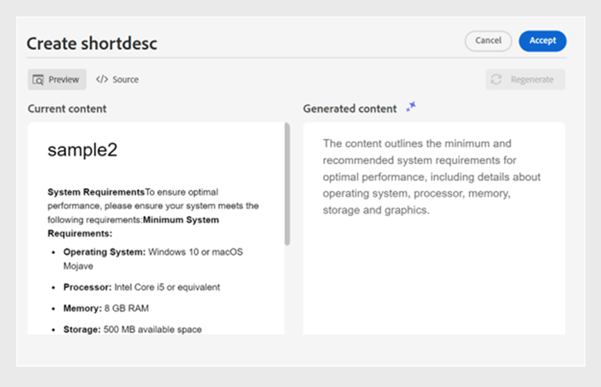

# Assistente de IA para criar documentos com eficiência inteligente

O Experience Manager Guides fornece uma ferramenta de Assistente de IA que ajuda a tornar a criação mais inteligente e rápida. Você experimenta um manuseio de documentos simplificado por meio de sugestões e otimização inteligentes. Com essa ferramenta, visualize as sugestões inteligentes para reutilizar o conteúdo do repositório de conteúdo existente. Use o recurso de prompt de texto para fornecer um prompt e alterar o conteúdo ou gerar uma saída de acordo com seus requisitos. Use o Assistente de IA para converter um parágrafo em uma lista de maneira inteligente. Você pode criar uma breve descrição para o tópico atual. Esse recurso também ajuda a melhorar e traduzir facilmente o conteúdo selecionado.

>[!NOTE]
>
> Para adicionar o recurso Assistente de IA no painel direito, o administrador do sistema deve selecionar a opção **Assistente de IA** na guia **Painéis** em **Configurações do editor** .
> Além disso, você deve fazer check-out do documento para exibir o ícone do Assistente do AI.

Esse recurso está disponível somente para tópicos DITA. Depois de selecionar o texto em um tópico, você pode optar por executar qualquer uma das ações do Assistente do AI:

## Sugerir conteúdo reutilizável

Use o recurso **Sugerir conteúdo reutilizável**  para criar conteúdo de forma consistente e precisa. Você pode selecionar o conteúdo, e o Experience Manager Guides fornece sugestões sobre como reutilizar o conteúdo existente no repositório.
Saiba mais sobre como usar as [sugestões inteligentes habilitadas por IA para criar conteúdo](authoring-ai-based-smart-suggestions.md).

## Usar prompt de texto

Um prompt de texto é uma instrução, pergunta ou instrução que orienta o Assistente de IA a gerar uma resposta ou saída específica.

Você pode usar um prompt de texto para alterar o conteúdo e gerar uma saída.  Por exemplo, você pode gerar um resumo dos recursos de um produto e usá-lo no relatório para mostrar o produto. Você também pode usar esse recurso para comparar dois produtos. Por exemplo, você também pode criar uma tabela de comparação para os recursos de dois produtos.

1. Selecione o texto para o qual deseja usar o prompt de texto.
1. Selecione **Usar prompt de texto** no painel **Assistente de IA**.
1. Forneça um prompt de uma das seguintes maneiras:

   - Escolha um prompt entre os prompts sugeridos.
   - Revise ou edite um prompt sugerido para criar um prompt personalizado de acordo com seus requisitos.

     >[!NOTE]
     >
     > Os prompts sugeridos são configurados no `ui_config.json` pelo seu administrador.

   - Digite seu prompt na caixa de texto.

1. Selecione **Gerar novamente**  para outra resposta ou saída com base em seu prompt, como as ferramentas de IA.

1. (Opcional) Selecione **Expandir**  para abrir o editor **Usar prompt de texto**. Ele exibe o conteúdo atual e o gerado. É possível editar o conteúdo do layout de origem e verificar a visualização.

   >[!NOTE]
   >
   > As respostas são geradas com base no conteúdo selecionado.

1. Você também pode editar o prompt no editor e gerar novamente a resposta. Por exemplo, você pode alterar o prompt para tornar o texto mais conciso para aproximadamente 40 palavras.

   

1. Você pode verificar a origem do conteúdo gerado e editá-lo, se necessário.

1. Selecione **Aceitar** para substituir o conteúdo selecionado no tópico pelo conteúdo gerado.
1. **Cancelar**: cancela a ação de prompt de texto. Retorna ao estado inicial do painel.

   >[!NOTE]
   >
   > Selecionar o ícone **Cancelar** no painel de recursos também o retorna ao estado inicial.

## Melhorar o conteúdo

Melhora o conteúdo selecionado. Verifique a ortografia, o idioma e a estrutura gramatical e sugira uma versão melhor do conteúdo. Também melhora a qualidade das frases.

1. Selecione o conteúdo.
1. Selecione **Melhorar conteúdo**  para encontrar as sugestões para o conteúdo aprimorado.
1. Selecione **Regenerar** para outra sugestão de conteúdo aprimorado.

1. (Opcional) Selecione **Expandir** para abrir o editor de conteúdo aprimorado. Ele exibe o conteúdo atual e gerado. É possível editar o conteúdo no layout de origem e também verificar a pré-visualização.

Aceite a sugestão, gere novamente para obter uma resposta diferente ou cancele a ação para retornar ao estado anterior.

## Criar resumos

Crie uma breve descrição para o tópico com base no conteúdo selecionado em cerca de 30 a 50 palavras. A breve descrição ajuda os usuários a pesquisar e encontrar conteúdo relevante.
Por exemplo, você pode listar os requisitos do sistema e gerar uma breve descrição de acordo.

1. Selecione o conteúdo.
1. Selecione **Criar atalhos ** para criar uma descrição curta para o tópico atual.
1. Selecione **Aceitar** para criar uma nova descrição curta se ela ainda não estiver presente. Se existir uma descrição curta, é necessário confirmá-la antes de substituí-la pela nova descrição curta.

Você também pode executar as seguintes ações:
- Selecione **Gerar novamente** para gerar outra descrição curta para o seu tópico, como as ferramentas de IA.

- Selecione **Expandir** para abrir o editor **Criar atalhos**.

## Discriminar conteúdo

Esse recurso converte de forma inteligente um parágrafo selecionado em uma lista.  Ele analisa o conteúdo e cria uma lista lógica de itens. Não é necessário criar os itens manualmente. Por exemplo, se você tiver um parágrafo detalhando as etapas para criar uma conta de usuário, a ferramenta poderá transformá-lo em uma lista passo a passo, eliminando a necessidade de criar itens manualmente um por um.

1. Selecione o conteúdo.
1. Selecione **Itemizar conteúdo**  para converter o conteúdo selecionado em uma lista.
A ferramenta Assistente de IA converte o conteúdo inteligentemente em uma lista de itens.
1. (Opcional) Selecione **Expandir** para abrir o editor **Discriminar conteúdo**.
1. Quando a lista estiver pronta, aceite as alterações no conteúdo gerado. O conteúdo gerado substitui o conteúdo selecionado.

## Traduzir conteúdo

Use esse recurso inteligente para traduzir o conteúdo selecionado para o idioma de destino. Por exemplo, você pode adicionar conteúdo em inglês e traduzi-lo rapidamente para alemão.
Execute as seguintes etapas para traduzir o conteúdo:

1. Selecione o conteúdo que deseja traduzir.
1. Selecione **Traduzir conteúdo**  no painel Assistente de IA.
1. Selecione o idioma de destino na lista suspensa. O conteúdo traduzido é exibido no painel Assistente de IA.

1. (Opcional) Selecione **Expandir** para abrir o editor **Traduzir conteúdo**.
1. Você também pode selecionar outro idioma no menu suspenso e gerar novamente o conteúdo no idioma escolhido. Por exemplo, se você selecionar Francês e **Regenerar**, o conteúdo será traduzido para Francês.

