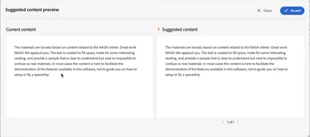

# Sugestões inteligentes alimentadas por IA para criar conteúdo

A Experience Manager Guides fornece o recurso **Sugestões inteligentes** que ajuda a criar conteúdo consistente e preciso.

Enquanto você cria conteúdo, o recurso **Sugestões inteligentes** pode pesquisar usando IA e mostrar o conteúdo existente semanticamente semelhante ao seu conteúdo. Você pode então escolher o melhor conteúdo correspondente que deseja incluir em seu tópico atual como referência.

Isso ajuda a reutilizar o conteúdo existente do repositório de documentação e criar conteúdo consistente. Por exemplo, você está criando um documento contendo informações sobre **Adobe Firefly**, incluindo um parágrafo sobre **Adobe**. Nesse caso, você pode visualizar e adicionar rapidamente a referência de conteúdo de outro tópico, como **Adobe Photoshop**, que inclui o mesmo parágrafo.

Quando você abre um tópico no Editor da Web, o painel **Sugestões inteligentes** é exibido à direita.

>[!NOTE]
>
> O administrador deve configurar o recurso **Sugestões inteligentes**. Para obter mais detalhes, consulte a seção [Configurar as sugestões inteligentes habilitadas por IA para criação](/help/product-guide/cs-install-guide/conf-smart-suggestions.md) no Guia de Instalação e Configuração para o Cloud Service.

{width="300" align="left"}

*Exiba o painel **Sugestões Inteligentes**.*

Execute as seguintes etapas para exibir as sugestões inteligentes para adicionar referências de conteúdo apropriadas ao seu tópico:

1. Selecione **Sugestões inteligentes**  para abrir o painel.

   >[!NOTE]
   >
   > Nos [perfis globais ou de nível de pasta](/help/product-guide/cs-install-guide/conf-folder-level.md#conf-ai-smart-suggestions), o administrador precisa definir os arquivos ou pastas a serem indexados para sugestões inteligentes, o número mínimo de caracteres que você precisa inserir para exibir as sugestões e o número máximo de sugestões que você pode exibir na lista.

1. Digite o conteúdo do tópico para exibir as sugestões relacionadas. Verifique se o comprimento de caracteres do conteúdo excede o que o administrador definiu no perfil da pasta para que as sugestões de conteúdo sejam exibidas.

1. Selecione **Sugestões para a marca atual**  para exibir as sugestões de criação para a marca atual onde você coloca o ponteiro do mouse.  As sugestões para exibir e adicionar referências de conteúdo dos arquivos indexados são exibidas com base no conteúdo da tag atual.

   Atalho de teclado: **Windows** (*Ctrl* + *K*), **macOS** (*Command* + *K*)
1. Selecione **Sugestões para o documento completo**  para exibir as sugestões com base no conteúdo presente no documento completo.  O ícone de sugestões inteligentes é exibido ao lado do conteúdo, onde uma correspondência adequada é encontrada.

   Atalho de teclado: **Windows** ( *Ctrl* + *Shift* + *K* ), **macOS** (*Command* + *Shift* + *K* )

   >[!NOTE]
   >
   > Você só pode exibir as sugestões para o visor atual (o conteúdo visível na tela). Para exibir sugestões para qualquer outro conteúdo do documento, role para cima ou para baixo para exibi-lo no visor e selecione o ícone .

1. Selecione o ícone **Sugestões inteligentes**  próximo às marcas adicionadas ao documento para exibir as sugestões inteligentes.
1. Você pode exibir as sugestões inteligentes na caixa de sugestões **Reutilização de Conteúdo**.  O Experience Manager Guides fornece sugestões para corresponder exatamente conteúdo e conteúdo com o mesmo significado. Por exemplo, você pode pesquisar pelo tópico que contém o número exato da versão, como &quot;versão 2023.03.12&quot;. Você também pode pesquisar por &quot;Adobe tem sede em San Jose, Califórnia&quot; e encontrar conteúdo semelhante como &quot;San Jose tem o quartel de muitas empresas de software como Adobe&quot;.
1. Selecione **Informações de Conteúdo**  para exibir os detalhes.
   {width="300" align="left"}

   *Exibir as informações detalhadas sobre a referência de conteúdo.*

   1. O título do tópico que contém a referência de conteúdo é exibido como um hiperlink.
   1. O caminho do arquivo que contém a referência de conteúdo.
   1. O tipo de referência para o qual o conteúdo é referenciado.
   1. Os nomes dos arquivos DITA para os quais o tópico é referido são exibidos como hiperlinks.
1. Selecione **Visualização do conteúdo sugerido**  para comparar o conteúdo atual com o conteúdo sugerido. Isso o ajuda a comparar as diferenças e determinar se deseja adicionar a referência de conteúdo para o conteúdo sugerido e torná-lo consistente ou manter o conteúdo atual.

   {width="800" align="left"}

   *Visualize a comparação entre o conteúdo atual e o conteúdo sugerido.*

1. Clique em **Aceitar** para adicionar a referência de conteúdo sugerida na caixa de diálogo **Visualização de conteúdo sugerida**.
1. Você também pode selecionar **Aceitar** ou **Recusar** na caixa de sugestões **Reutilização de Conteúdo** para as recomendações apropriadas.

Esse recurso inteligente é útil e minimiza o esforço de pesquisa manual de conteúdo, permitindo que você se concentre mais na geração de novo conteúdo. Também facilita uma melhor colaboração em equipe e ajuda a manter a consistência no conteúdo criado por vários autores.

>[!NOTE]
>
>As sugestões inteligentes não retêm os dados além da sessão atual. Para respostas do, as sugestões inteligentes dependem apenas do índice criado no conteúdo que reside no banco de dados interno. As ferramentas de IA externa não são usadas, garantindo que os dados permaneçam no sistema.
