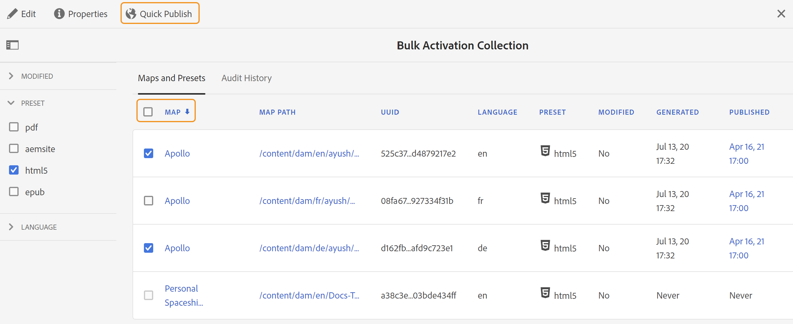

# Ativar saída {#id214GGF00V5U}

Depois de criar uma coleção de mapas para ativação em massa, a próxima etapa é ativar o conteúdo na instância de publicação. Para ativar o conteúdo, execute as seguintes etapas:

1. Selecione **Guias** na lista de ferramentas.

1. Clique no link do Adobe Experience Manager na parte superior e escolha **Ferramentas**.

1. Clique no bloco **Painel de publicação em massa**.

   Uma lista de coleções de mapas de ativação em massa é exibida.

1. Selecione a coleção que você deseja publicar e clique em **Abrir**.

   {width="800"}

1. \(*Opcional*\) Aplique os filtros necessários a partir do painel esquerdo para filtrar o mapa com base em sua \(status\), predefinição de saída ou linguagem modificada.

   >[!NOTE]
   >
   >Gere a saída do mapa usando a predefinição de saída antes de ativá-la na coleção de mapas.

Veja as diferentes maneiras de ativar sua coleção com base em sua configuração.

 Cloud Services 

{width="650"}

Você pode ativar a saída para as instâncias de **Visualização** ou **Publicação**.

**Visualização**

* Para ativar a saída de mapas selecionados, selecione a saída de mapa pré-gerada e selecione **Publicar em** > **Visualizar**.
* Para ativar a saída de todos os mapas DITA com suas predefinições configuradas, marque a caixa de seleção ao lado da coluna **Mapa** e selecione **Publicar em** > **Publicar**.

**Publicar**

* Para ativar a saída de mapas selecionados, selecione a saída de mapa pré-gerada e selecione **Publicar em** > **Publicar**.

* Para ativar a saída de todos os mapas DITA com suas predefinições configuradas, marque a caixa de seleção ao lado do Mapa (coluna) e selecione **Publicar em** > **Publicar**.

>[!NOTE]
> 
> A caixa de seleção de uma saída de mapa é ativada somente se você tiver gerado a saída de um mapa.

Uma mensagem de sucesso é exibida quando a saída do mapa é colocada em fila para publicação.

Depois que a saída é ativada para os arquivos de mapa selecionados, a guia histórico de auditoria é atualizada e a saída ativada mais recente é exibida na parte superior. A coluna **Publicado** é atualizada com a data e hora da publicação.

    

  Software local 

Siga uma das seguintes opções:

* Para ativar a saída de mapas selecionados, selecione a saída de mapa pré-gerada e selecione **Publicação Rápida**.
* Para ativar a saída de todos os mapas DITA com suas predefinições configuradas, marque a caixa de seleção ao lado do Mapa (coluna) e selecione **Publicação rápida.**
  {width="650"}

  >[!NOTE]
  > 
  >A caixa de seleção de uma saída de mapa é ativada somente se você tiver gerado a saída de um mapa.

Uma mensagem de sucesso é exibida quando a saída do mapa é colocada em fila para publicação.

Depois que a saída é ativada para os arquivos de mapa selecionados, a guia histórico de auditoria é atualizada e a saída ativada mais recente é exibida na parte superior. A coluna **Publicado** é atualizada com a data e hora da publicação.

**Tópico pai: &#x200B;** [Ativação em massa de conteúdo publicado](conf-bulk-activation.md)
