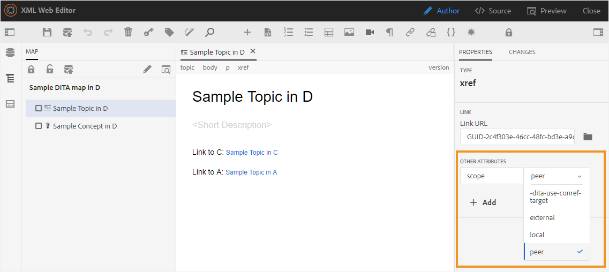
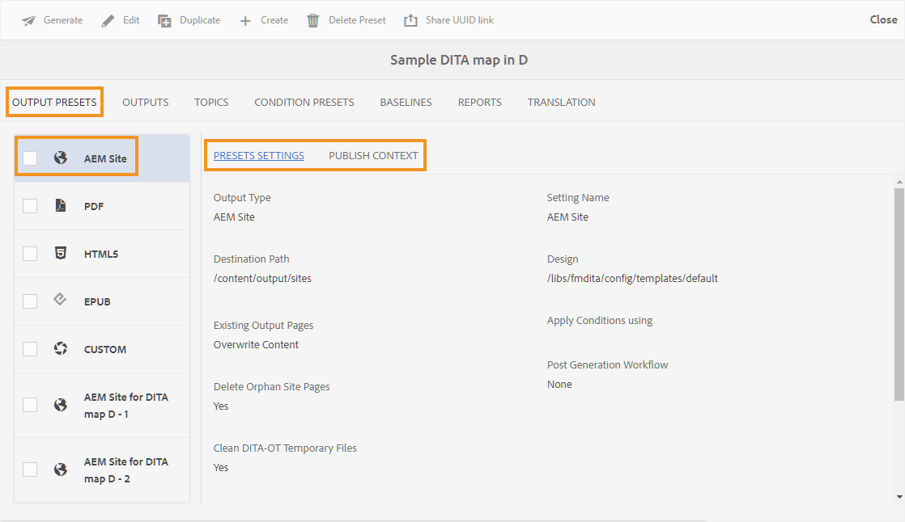

# Predefinições do AEM Sites no painel de mapa {#id205BE3008SW}

É possível criar predefinições do AEM Sites no painel de mapa e configurá-las para gerar a saída do AEM Sites.

As seguintes opções estão disponíveis para a saída do AEM Sites:

| Opções do AEM Sites | Descrição |
| --- | --- |
| Tipo de saída | O tipo de saída que você deseja gerar. Para gerar saída responsiva do AEM Sites, escolha a opção AEM Sites. |
| Nome de configuração | Dê um nome descritivo para as configurações do AEM Sites que você está criando. Por exemplo, você pode especificar *saída de clientes internos* ou *saída de usuários finais*. |
| Nome do site | Um nome de site em que a saída é armazenada no repositório do AEM.  Um nó no repositório do AEM é criado com o nome especificado aqui. Se você não especificar o Nome do site, o nó do site será criado com o nome do arquivo de mapa DITA.  O Nome do Site especificado aqui também é usado como o título na guia do navegador.  Você também pode usar variáveis ao definir o Nome do Site. Para obter mais detalhes sobre o uso de variáveis, consulte [Usar variáveis para definir as opções Caminho de Destino, Nome do Site ou Nome do Arquivo](generate-output-use-variables.md#id18BUG70K05Z). |
| Design | Selecione o modelo de design que deseja usar para gerar a saída.  Para obter detalhes sobre como usar modelos de design personalizados para gerar saída, contate o administrador de publicação. |
| Caminho de destino | O caminho no repositório do AEM onde a saída é armazenada. Ao gerar a saída final, o Nome do site e o Caminho de destino são combinados. Por exemplo, se você especificar o Nome do Site como `user-guide` e o Caminho de Destino como `/content/output/aem-guides`, a saída final será gerada no nó `/content/output/aem-guides/user-guide`.  Você também pode usar variáveis ao definir o Caminho de Destino. Para obter mais detalhes sobre o uso de variáveis, consulte [Usar variáveis para definir as opções Caminho de Destino, Nome do Site ou Nome do Arquivo](generate-output-use-variables.md#id18BUG70K05Z). |
| Aplicar condições usando | Selecione uma das seguintes opções:  **Nenhuma Aplicada**: selecione esta opção se não quiser aplicar nenhuma condição na saída publicada. **Arquivo DITAVal**: selecione o(s) arquivo(s) DITAVal para gerar conteúdo condicional. Você pode selecionar vários arquivos DITAVal usando a caixa de diálogo Procurar ou digitando o caminho do arquivo. Use o ícone de cruz próximo ao nome do arquivo para removê-lo. Os arquivos DITAVal são avaliados na ordem especificada, de modo que as condições especificadas no primeiro arquivo têm precedência sobre as condições correspondentes especificadas em arquivos posteriores. É possível manter a ordem dos arquivos adicionando ou excluindo arquivos. Se o arquivo DITAVal for movido para algum outro local ou excluído, ele não será excluído automaticamente do painel de mapa. Você precisa atualizar o local caso os arquivos sejam movidos ou excluídos. Você pode passar o mouse sobre o nome do arquivo para ver o caminho no repositório do AEM onde o arquivo está armazenado. Você só pode selecionar arquivos DITAVal e um erro será exibido se você selecionar qualquer outro tipo de arquivo. **Predefinição de condição**: selecione uma predefinição de condição no menu suspenso para aplicar uma condição ao publicar a saída. Essa opção estará visível se você tiver adicionado uma condição para o arquivo de mapa DITA. As configurações condicionais estão disponíveis na guia Predefinições de condição do console do mapa DITA. Para saber mais sobre a predefinição de condição, consulte [Usar predefinições de condição](generate-output-use-condition-presets.md#id1825FL004PN). |
| Páginas de saída existentes | Selecione a opção **Substituir conteúdo** para substituir o conteúdo nas páginas existentes. Essa opção substitui somente o conteúdo presente nos nós de conteúdo e cabeçalho da página. Essa opção permite a publicação combinada de conteúdo. Selecionar essa opção fornece uma opção para selecionar a exclusão de páginas órfãs da saída publicada. Esta também é a opção *padrão* para criar a saída do AEM Sites.  Selecione a opção **Excluir e Criar** para forçar a exclusão de páginas existentes durante a publicação. Essa opção exclui o nó da página, juntamente com seu conteúdo e todas as páginas secundárias sob ele. Use essa opção se tiver alterado o modelo de design da predefinição de saída ou se desejar que qualquer página extra já presente no destino seja removida. |
| Excluir páginas de sites órfãos | Selecionar **Substituir Conteúdo** na configuração **Páginas de Saída Existentes** apresenta essa opção. Se você selecionar essa opção, todas as páginas órfãs serão excluídas do site publicado do AEM. Para que esse recurso seja executado com sucesso, você deve publicar o mapa DITA inteiro e não usar a publicação incremental.  Digamos que você tenha publicado um mapa DITA, que contém os tópicos a.dita, b.dita e c.dita. Antes de publicar o mapa novamente, você removeu o tópico b.dita do mapa. Agora, se você selecionou essa opção, todo o conteúdo relacionado a b.dita é removido da saída do AEM Sites e somente a.dita e c.dita são publicados.  Este recurso não remove nenhum mapa filho publicado. Por exemplo, se o mapa principal contiver um mapa secundário e você remover todo o mapa secundário, o conteúdo do mapa secundário não será excluído da saída publicada. No entanto, se você remover qualquer tópico de um mapa secundário e republicar, o conteúdo do tópico removido será excluído da saída do site.  Além disso, se houver algum conteúdo referenciado e esse conteúdo for removido antes da republicação, os dados do conteúdo referenciado não serão removidos.  **Observação**: informações sobre páginas órfãs excluídas também são capturadas nos logs de geração de saída. Para obter mais informações sobre como acessar os arquivos de log, consulte [Exibir e verificar o arquivo de log](generate-output-basic-troubleshooting.md#id1821I0Y0G0A__id1822G0P0CHS). |
| Reter arquivos temporários | Selecione essa opção para manter os arquivos temporários gerados pelo DITA-OT. Se ocorrerem erros durante a geração de saída pelo DITA-OT, selecione essa opção para manter os arquivos temporários. Você pode usar esses arquivos para solucionar erros de geração de saída.    Depois de gerar a saída, selecione o ícone **Baixar arquivos temporários**  para baixar a pasta ZIP que contém os arquivos temporários.    **Observação**: se as propriedades do arquivo forem adicionadas durante a geração, os arquivos temporários de saída também incluirão um arquivo *metadata.xml* contendo essas propriedades. |
| Gerar PDF separados para cada tópico | Se selecionada, uma PDF também será criada para cada tópico no mapa DITA. Ao escolher essa opção, uma nova opção Dividir caminho do PDF é exibida.  No campo Dividir Caminho do PDF, especifique o caminho para armazenar os PDFs gerados para cada tópico.  **Observação**: o AEM Guides usa o plug-in DITA-OT chamado pdfx para gerar o PDF para cada tópico. Esse plug-in é fornecido com o pacote DITA-OT pronto para uso. Você pode personalizar esse plug-in para gerar o PDF de acordo com suas necessidades. Se você usar um plug-in DITA-OT personalizado, certifique-se de integrar o plug-in pdfx para ter o recurso de geração de PDF no nível do tópico. |
| Executar fluxo de trabalho de pós-geração | Ao escolher essa opção, uma nova lista suspensa Fluxo de trabalho de pós-geração é exibida contendo todos os fluxos de trabalho configurados no AEM. Você deve selecionar um workflow que deseja executar após a conclusão do workflow de geração de saída. |
| Usar Linha de Base | Se tiver criado uma Linha de Base para o mapa DITA selecionado, selecione essa opção para especificar a versão que deseja publicar.  **Importante**: quando você está gerando saída incremental para o Site do AEM, a saída é criada usando a versão atual dos arquivos e não a Linha de Base anexada.  Consulte [Trabalhar com Linha de Base](generate-output-use-baseline-for-publishing.md#id1825FI0J0PF) para obter mais detalhes. |
| Propriedades | Selecione as propriedades que deseja processar como metadados. Essas propriedades são definidas na página Propriedades do mapa DITA ou do arquivo de mapa. As propriedades selecionadas na lista suspensa aparecem no campo **Propriedades do arquivo**. Selecione o ícone cruzado ao lado da propriedade para removê-la.   **Observação**: as propriedades de metadados diferenciam maiúsculas de minúsculas.  *Se você tiver selecionado uma Linha de Base, os valores das propriedades serão baseados na versão da Linha de Base selecionada. * Se você não tiver selecionado uma Linha de Base, os valores das propriedades serão baseados na versão mais recente.  Você também pode passar os metadados para a saída usando a publicação DITA-OT. Para obter mais detalhes, [Passe os metadados para a saída usando DITA-OT](pass-metadata-dita-ot.md#id21BJ00QD0XA).  **Observação**: se você não tiver definido a `cq:tags` na opção Propriedades, os valores de `cq:tags` serão escolhidos na cópia de trabalho atual, mesmo que você tenha selecionado uma Linha de Base para publicação. |
| Usar propriedades do mapa como padrão | Se essa opção for selecionada, as propriedades definidas para o arquivo de mapa também serão copiadas para os tópicos em que essas propriedades não estão definidas. Considere os seguintes pontos ao usar esta opção:  *Somente as propriedades String, Date ou Long (único e de vários valores) podem ser passadas para as páginas do AEM Sites. * Os valores de metadados de uma propriedade do tipo Cadeia de Caracteres não dão suporte a caracteres especiais (como `@, #, " "`). * Esta opção deve ser usada com a opção `Properties`. |

## Nota adicional sobre o AEM Sites

### Gerar saída baseada em artigo no Editor da Web

Você pode gerar a saída do AEM Sites para um ou mais tópicos, ou todo o mapa DITA do Editor da Web. É necessário criar predefinições de saída para o mapa DITA e gerar facilmente a saída do AEM Sites para o mapa. Se você tiver atualizado alguns tópicos no mapa, também poderá gerar a saída do AEM Sites somente para esses tópicos do Editor da Web. Para obter mais detalhes, consulte [Publicação baseada em artigo do Editor da Web](web-editor-article-publishing.md#id218CK0U019I).

### Gerar saída de tópicos de vinculação de outros mapas

É um cenário muito comum ter um grande conjunto de documentações espalhadas em várias pastas e mapas DITA. A publicação de conteúdo vinculado de vários lugares torna-se extremamente complexo. Por padrão, todos os links `<xref>` são criados com o `local` `@scope`. A publicação desses tópicos não envolve nenhum desafio, pois usa um link direto para o tópico. Caso o tópico esteja fora do mapa DITA atual, o link não mostra o conteúdo vinculado.

Outra maneira de vincular conteúdo é criar um link usando o `peer` `@scope`. Para esse conteúdo, o link é resolvido no tempo de execução ao escolher o título do arquivo e o contexto configurado para o tópico vinculado no contexto de publicação do mapa DITA. A captura de tela a seguir mostra o painel Propriedades para um link que tem o `peer` `@scope`:

{width="800" align="left"}

Para simplificar a publicação de mapas complexos e tópicos vinculados a outros tópicos em outros mapas, o AEM Guides permite definir o contexto de publicação de cada predefinição de saída.

O contexto de publicação permite especificar qual tópico deve ser usado, de qual mapa para publicar uma saída específica. Vamos entender isso com a ajuda de um exemplo — digamos que você tenha quatro pastas: amostra a, amostra b, amostra c e amostra d. Cada pasta contém um mapa DITA — mapa DITA A, mapa DITA B, mapa DITA C e mapa DITA D. A vinculação entre mapas ocorrerá quando um tópico no mapa DITA A for vinculado a um tópico no mapa DITA B, C ou D. Na captura de tela a seguir, um tópico de conceito de amostra contém links \(ou referências\) para arquivos que fazem parte de outros mapas DITA.

{width="350" align="left"}

Agora, ao definir as configurações de publicação do AEM Sites para o arquivo de mapa que contém esse tópico, você pode selecionar qual contexto de publicação do conteúdo vinculado será usado durante a publicação. Um contexto de publicação é uma combinação do mapa DITA e sua predefinição de saída. A predefinição de saída, por sua vez, contém uma versão específica do conteúdo e predefinições condicionais. Essa combinação completa do mapa DITA, da predefinição de saída, da versão \(files\) e das condições define o contexto de publicação de um mapa vinculado.

Execute as seguintes etapas para especificar o contexto de publicação para arquivos com links cruzados:

1. Abra a guia **Predefinições de saída** do mapa DITA que deseja publicar.

1. Selecione a predefinição de saída **Site do AEM**.

   Você obtém as guias Configurações de predefinições do AEM e Contexto de publicação.

   {width="800" align="left"}

1. Abra a guia **Contexto de Publicação**.

   Você verá uma lista de tópicos dependentes. Estes são os tópicos que são vinculados a partir de algum tópico no mapa atual, mas estão disponíveis em outros mapas DITA.

   >[!NOTE]
   >
   > A guia Contexto de Publicação mostra tópicos que estão vinculados usando somente o `peer` `@scope`. Para links com `local` `@scope`, não é necessário especificar o contexto de publicação.

   Por padrão, todos os tópicos vinculados têm sua predefinição de saída e mapa mais recentes selecionados.

   {width="800" align="left"}

1. Para alterar a seleção padrão do mapa e da predefinição DITA, clique em **Editar** \(na barra de ferramentas principal\).

1. Se quiser usar a saída publicada mais recentemente de cada arquivo dependente no mapa, selecione **Usar contexto de publicação gerado mais recentemente para todos os tópicos dependentes**.

1. Na lista suspensa **Mapa Pai**, selecione o arquivo de mapa com cuja saída você deseja vincular a saída do mapa atual.

   Ao selecionar um arquivo de mapa, a UUID do mapa é mostrada na coluna UUID do mapa principal. As Predefinições de saída associadas ao mapa selecionado são listadas na lista Predefinição do Mapa pai.

1. Na lista suspensa Predefinição do mapa principal ****, selecione a predefinição de saída à qual deseja vincular a saída do mapa atual.

1. Selecione o mapa necessário e sua predefinição de saída para todos os tópicos dependentes e clique em **Concluído**.

   O contexto para os tópicos dependentes agora está definido. Você pode gerar a saída para o mapa atual. Para obter mais informações sobre como gerar saída, consulte [Gerar saída para um mapa DITA do console de mapa](generate-output-for-a-dita-map.md#).

### Publicação combinada

O AEM Guides é compatível com a publicação de conteúdo DITA no site existente do AEM. Por exemplo, se você tiver um site existente, poderá usar a saída do AEM Sites para publicar somente o conteúdo DITA nesse site. Nesse processo, o conteúdo não DITA existente não é modificado pelo processo de publicação. Para obter mais informações sobre como configurar seu site para publicar somente conteúdo DITA, entre em contato com o administrador de publicação.

### Publicação `conref`

Se você estiver usando `conref` no seu conteúdo, ele será publicado como conteúdo normal ou inserido junto com o conteúdo no tópico de origem \(ou de referência\). O conteúdo `conref` é renderizado junto com o conteúdo principal e nenhuma página de site separada é criada para o mesmo. Quando você pesquisa o conteúdo referenciado no `conref`, somente o tópico principal ou a página que contém o conteúdo do `conref` é exibido nos resultados da pesquisa.

>[!NOTE]
>
>Se você tiver gerado páginas separadas para o conteúdo `conref` usando o AEM Guides versão 3.5 ou anterior, é recomendável limpar/excluir essas páginas usando a opção [Excluir páginas de sites órfãos](#delete-orphan-page-aem-site).

### Pesquisar uma cadeia de caracteres no conteúdo

Você pode procurar por uma string na saída do AEM Sites. Por padrão, é possível pesquisar a cadeia de caracteres somente nos títulos. Para pesquisar a string no conteúdo ou no corpo da saída do AEM Sites, entre em contato com o administrador do sistema para ativar a propriedade flattening.enabled.

{width="650" align="left"}

Para obter mais detalhes, consulte a seção *Configurar nivelamento da estrutura do nó do site do AEM* no guia Instalar e configurar o Adobe Experience Manager Guides.

**Tópico pai:**[ Noções básicas sobre as predefinições de saída](generate-output-understand-presets.md)
