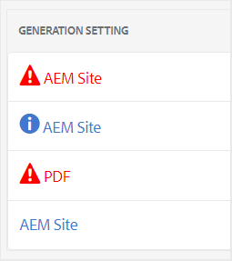

# Solução básica de problemas {#id1821I0Y0G0A}

Ao trabalhar com o AEM Guides, você pode encontrar erros ao publicar ou abrir seu documento. Esses erros podem estar no mapa DITA, no tópico ou no próprio processo do AEM Guides. Esta seção fornece informações sobre como acessar e analisar informações no arquivo de log de geração de saída. Além disso, se o tópico DITA for muito grande, você poderá ver o erro de compilação de JSP. Esta seção também fornece informações sobre como resolver o erro de compilação de JSP.

## Exibir e verificar o arquivo de log {#id1822G0P0CHS}

Execute as seguintes etapas para exibir e verificar o arquivo de log de geração de saída:

1. Depois de iniciar o processo de geração de saída, clique em **Saídas** no console do mapa DITA.

   A coluna **Geral** de **Saídas Geradas** mostra os ícones para dar uma dica visual sobre o sucesso ou falha da geração de saída.

   {width="300"}

   Na captura de tela acima, o primeiro e o terceiro ícones mostram a geração de saída com falha. O segundo ícone mostra uma geração de saída bem-sucedida, mas com mensagens. A última é uma geração de saída bem-sucedida sem nenhuma mensagem.

1. Clique no link na coluna **Gerado às** depois que o trabalho for concluído.

   O arquivo de log é aberto em uma nova guia.

   {width="800"}

1. Aplique os seguintes filtros para realçar o texto no arquivo de log:
   - Fatal: realça os erros fatais no arquivo de log com a cor rosa.
   - Erro: realça os erros no arquivo de log com a cor laranja.
   - Aviso: realça os avisos no arquivo de log com cor roxa.
   - Informações: destaca as mensagens de informações no arquivo de log com a cor azul.
   - Exceção: Realça as exceções no arquivo de log com a cor amarela.
1. Use os botões de navegação para cima e para baixo para ir até o texto destacado no arquivo de log.

   Como alternativa, role pelo arquivo de log e verifique as mensagens.

## Copiar e verificar o arquivo de log em um editor de texto

Execute as seguintes etapas para copiar e verificar o arquivo de log de geração de saída em um editor de texto:

1. Depois de iniciar o processo de geração de saída, clique em **Saídas** no console do mapa DITA.

1. Clique no link na coluna **Gerado às** depois que o trabalho for concluído.

   O arquivo de log é aberto em uma nova guia.

1. Clique no botão **Copiar Log**. O arquivo de log é copiado para a área de transferência.
1. Abra um editor de texto e cole o arquivo de log no editor.

1. Percorra o arquivo de log e verifique se há mensagens.

   As seguintes informações ajudarão você a determinar se há um erro no arquivo DITA ou no processo do AEM Guides:

   - *Erro relacionado ao arquivo de mapa DITA*: caso haja um erro encontrado no arquivo de mapa DITA ou em qualquer outro arquivo contido no mapa DITA, o arquivo de log conterá uma cadeia de caracteres, &quot;FALHA NA COMPILAÇÃO&quot;. Você pode verificar as informações fornecidas no arquivo de log para localizar o arquivo incorreto e corrigir o problema.

   No trecho de arquivo de log de exemplo a seguir, você pode ver a mensagem `BUILD FAILED` junto com o motivo do erro.

   {width="650"}

   - *erro relacionado ao AEM Guides*: o outro tipo de erro que você pode identificar no arquivo de log está relacionado ao próprio processo do AEM Guides. Nesse caso, o arquivo de mapa DITA é analisado com sucesso, mas o processo de geração de saída falha devido a algum erro interno no AEM Guides. Para esse tipo de erro, você deve procurar ajuda da equipe de suporte técnico.

   No trecho de arquivo de log de exemplo a seguir, você pode ver a mensagem `BUILD SUCCESSFUL`, seguida de outro erro técnico.

   {width="650"}

## Resolver erro de compilação de JSP

Se o tópico DITA for muito grande, talvez você veja o erro de compilação JSP \(`org.apache.sling.api.request.TooManyCallsException`\) no navegador. Esse erro pode aparecer ao abrir um tópico para edição, revisão ou publicação.

Execute as seguintes etapas para resolver esse problema:

1. Na Navegação global, selecione Ferramentas e escolha Operações \> Console da Web.

   A página Adobe Experience Manager Web Console Configuration (Configuração do console da Web do) é exibida.

1. Procure e clique no componente *Apache Sling Main Servlet*.

   As opções configuráveis para o Apache Sling Main Servlet são exibidas.

1. Aumente o valor do parâmetro *Número de Chamadas por Solicitação* de acordo com suas necessidades.

**Tópico pai:**[ Geração de saída](generate-output.md)
