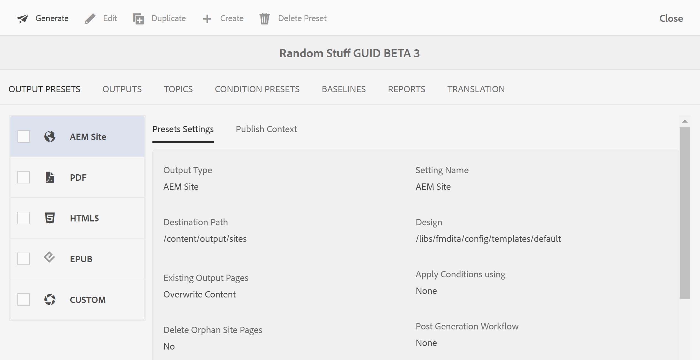
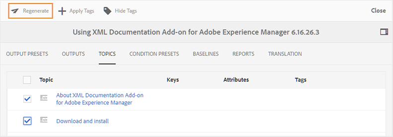

# Gerar saída para um mapa DITA a partir do console de mapas {#id1825FG00UHT}

Execute as seguintes etapas para gerar saída para um mapa DITA:

1. Na interface do usuário do Assets, navegue e clique no arquivo de mapa DITA que deseja publicar.

   O console do mapa DITA é exibido com a lista de Predefinições de saída disponíveis para gerar a saída.

1. Selecione uma ou várias Predefinições de saída que deseja usar para gerar a saída.

   {width="800" align="left"}

   >[!NOTE]
   >
   > Se você estiver gerando a saída do site do AEM, o processo de publicação usará a estrutura definida no arquivo `.ditamap` para criar a estrutura do site do AEM.

1. Clique no ícone Generate para iniciar o processo de geração de saída.

Você pode visualizar o status atual da solicitação de geração de saída clicando em Saídas. Para obter mais informações, consulte [Exibir o status da tarefa de geração de saída](#viewing_output_history)

>[!IMPORTANT]
>
> Se um processo de geração de saída para uma predefinição estiver na fila ou em andamento, não será possível iniciar outra tarefa de geração de saída para a mesma predefinição.

Você pode gerar a saída do PDF para uma ou mais predefinições de saída criadas para um mapa DITA do Editor da Web. Para obter mais detalhes, consulte [Usar o painel Geração rápida para gerar e exibir a saída das predefinições](web-editor-quick-generate-panel.md#).

Você também pode gerar a saída do site do AEM para um ou mais tópicos, ou o mapa DITA inteiro do Editor da Web. Para obter mais detalhes, consulte [Publicação baseada em artigo do Editor da Web](web-editor-article-publishing.md#id218CK0U019I).

## Geração de saída incremental {#generating_standalone_topic}

>[!NOTE]
>
> A geração de saída incremental é aplicável somente para saída do site do AEM. Além disso, você só pode regenerar tópicos DITA \(.dita/.xml\) a partir de um mapa DITA ou submapas. Se você selecionar um mapa DITA, submapa, grupo de tópicos ou um tópico com `@processing-role="resource-only"`, a opção de regeneração não estará disponível.

Pode haver várias instâncias em que você atualizaria apenas alguns tópicos no mapa DITA e enviaria apenas esses tópicos atualizados em tempo real. Para lidar com esses cenários, o AEM Guides permite criar saídas incrementais. Se você atualizou alguns tópicos, não é necessário gerar novamente o mapa DITA inteiro. Você pode selecionar apenas os tópicos atualizados e gerá-los novamente.

Se o mapa estiver fragmentado e você tiver atualizado um único tópico nesse mapa, será necessário gerar novamente todo o mapa para o tópico ou conteúdo atualizado para refletir na saída. A opção de regeneração de saída não é obtida em um nível de tópico. Ela só está disponível no nível de mapa \(fragmentado\). Isso é aplicável ao mapa principal e a todos os submapas.

Execute as seguintes etapas para gerar novamente a saída de um tópico específico ou de um grupo de tópicos:

>[!IMPORTANT]
>
> Ao regenerar a saída do Site do AEM, a saída é criada usando a versão atual dos arquivos e não a Linha de base anexada.

1. Na interface do usuário do Assets, navegue e clique no arquivo de mapa DITA.

   O console do mapa DITA é exibido com a lista de Predefinições de saída disponíveis para gerar a saída.

1. Selecione a guia **Tópicos**.

   Uma lista de tópicos disponíveis no mapa DITA é exibida.

1. Selecione os tópicos que deseja gerar novamente.

   >[!NOTE]
   >
   > Se você tiver adicionado novos tópicos ao mapa DITA, não será possível gerar esses novos tópicos a partir daqui. Primeiro, publique os tópicos adicionados recentemente usando a função de publicação de mapa DITA.

   {width="800" align="left"}

1. Clique em **Regenerar**.

   A página Regenerar Tópicos Selecionados é exibida.

1. Selecione a predefinição de saída que deseja usar para gerar novamente os tópicos selecionados.

1. Clique em **Regenerar** para iniciar o processo de geração de saída.

>[!IMPORTANT]
>
> Se você renomear um título de tópico e gerar novamente o tópico, o título atualizado do tópico não será refletido no índice do mapa DITA. Para atualizar o título do tópico no índice, você deve gerar o mapa DITA inteiro.

Você pode visualizar o status atual da solicitação de geração de saída clicando em Saídas. Para obter mais informações, consulte [Exibir o status da tarefa de geração de saída](#viewing_output_history).

## Exibir o status da tarefa de geração de saída {#viewing_output_history}

Depois de iniciar a tarefa de geração de saída para um mapa ou gerar novamente os tópicos selecionados, o AEM Guides envia essa tarefa para a fila de geração de saída. Essa fila é atualizada em tempo real, mostrando o status de cada tarefa de geração de saída na fila.

Execute as seguintes etapas para exibir a fila de geração de saída:

1. Na interface do usuário do Assets, navegue e clique no arquivo de mapa para o qual deseja verificar o status de geração de saída.

1. Clique em **Saídas**.

   {width="800" align="left"}

   A página Saídas é dividida em duas partes:

   - **Saídas na Fila:**

     Lista as saídas que estão aguardando para serem geradas ou que estão em processo de geração. As tarefas em fila ou em andamento são mostradas com um ícone de cor azul antes do nome predefinido. Você também pode encontrar a configuração de geração de saída ou a predefinição usada para a tarefa na fila, o tipo, o usuário que iniciou a tarefa, o tempo desde quando a tarefa está na fila e o status atual.

     Clique no link para acessar o **Painel de Publicação** e exibir o status atual de execução. Uma lista de todas as tarefas de publicação ativas está disponível no Painel de publicação. As **Saídas Enfileiradas** e o link **Painel de Publicação** são exibidos somente quando há saídas que estão aguardando geração ou que estão em processo de geração. Eles não aparecem quando as tarefas de saída são concluídas.Para obter mais detalhes sobre o Painel de Publicação, consulte [Gerenciar tarefas de publicação usando o Painel de Publicação](generate-output-publish-dashboard.md#).

   - **Saídas Geradas**

     Lista as tarefas de saída concluídas. Novamente, as informações mostradas aqui são semelhantes à seção Saídas em fila, com algumas diferenças. Você tem um novo conjunto de informações na forma de ícone de resultado de saída e o tempo de geração da saída.

     Nesta lista, você pode ter tarefas executadas com sucesso, tarefas executadas com mensagem ou tarefas com falha. As tarefas bem-sucedidas são mostradas com ícone de cor verde, as tarefas com uma mensagem têm um ícone de cor laranja e as tarefas com falha são mostradas com ícone de cor vermelha.

     Para todas as tarefas, o processo de publicação cria um arquivo de log \(logs.txt\) que pode ser acessado clicando no link na coluna Gerado em. Para tarefas que falharam ou têm mensagens, você pode verificar o arquivo de log, o que é explicado na seção [Exibir e verificar o arquivo de log](generate-output-basic-troubleshooting.md#id1822G0P0CHS).

     >[!NOTE]
     >
     > Ao clicar em um link da saída gerada do PDF, é solicitado que você baixe a PDF. Esse é o comportamento padrão no AEM 6.5 e 6.4.

## Cancelar uma tarefa de geração de saída {#id2061H100T5Z}

O AEM Guides oferece aos editores uma maneira simples e fácil de cancelar qualquer tarefa de publicação em andamento. Como editor, você pode cancelar uma tarefa de publicação em andamento no console de mapas DITA ou no [Painel de Publicação](generate-output-publish-dashboard.md#).

Execute as seguintes etapas para cancelar uma tarefa de geração de saída no console do mapa DITA:

1. Na interface do usuário do Assets, navegue e clique no arquivo de mapa para o qual deseja cancelar uma tarefa de geração de saída em andamento.

1. Clique em **Saídas**.

1. Na lista Saídas em fila, passe o ponteiro sobre uma tarefa que você deseja cancelar.

1. Clique no ícone *Cancelar este trabalho*.

   {width="800" align="left"}

1. Clique em **Sim** no prompt da mensagem Confirmar cancelamento.

   {width="800" align="left"}

   Se a tarefa ainda não tiver sido iniciada, o comando cancel será executado na tarefa. Para uma tarefa que está sendo cancelada, o Status é definido como Canceling.

   Quando a tarefa for cancelada com êxito, ela será movida para a lista **Saídas Geradas** com o status **Cancelada**. Quando você passa o mouse sobre a tarefa cancelada, ele mostra o nome do usuário que cancelou a tarefa. Na captura de tela a seguir, a tarefa *HTML5* foi cancelada.

   {width="800" align="left"}

## Excluir uma tarefa de saída do console de mapas DITA

Quando você gera várias saídas para um mapa DITA, durante um período de tempo, a lista Saídas geradas para esse mapa se torna muito longa. Como editor, você pode limpar o histórico de saída de qualquer arquivo de mapa removendo as tarefas desatualizadas da lista *Saídas Geradas*. Observe que a saída não é removida do sistema, apenas a entrada da saída gerada é removida da lista *Saídas Geradas*.

Execute as seguintes etapas para remover uma tarefa de saída da lista Saída Gerada:

1. Na interface do usuário do Assets, navegue até o arquivo de mapa do qual deseja excluir as tarefas e clique nele.

1. Clique em **Saídas**.

1. Na lista Saídas geradas, passe o ponteiro sobre uma tarefa que você deseja excluir.

1. Clique no ícone de exclusão.

   {width="800" align="left"}

1. Clique em **Sim** no prompt da mensagem Confirmar Exclusão.

   A tarefa é excluída da lista Saída gerada.

**Tópico pai:**&#x200B;[&#x200B; Geração de saída](generate-output.md)
