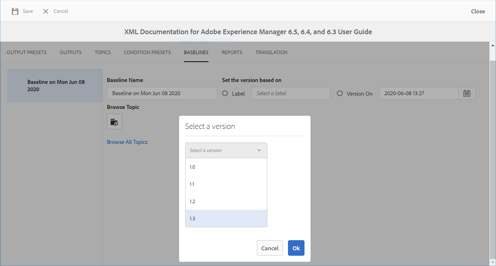

# Trabalhar com linha de base {#id1825FI0J0PF}

O recurso Linha de base permite criar uma versão dos tópicos e ativos que podem ser usados para publicação ou tradução. Por exemplo, se o seu mapa DITA tem `topicA` e `imageA`, você pode criar uma Linha de Base para usar a 3ª versão do `topicA`, mas a 4ª versão do `ImageA`. Depois de ter uma Linha de base em vigor, você pode publicar ou traduzir tópicos de diferentes versões com um único clique.

A seleção de uma Linha de base é opcional para predefinições de saída e um mapa DITA pode ter mais de uma Linha de base. No entanto, cada predefinição de saída em um mapa DITA pode ser associada a apenas uma única Linha de base. Se nenhuma Linha de base for especificada no momento da publicação, a saída será publicada usando a versão mais recente do conteúdo.

Da mesma forma, selecionar uma Linha de base para traduzir conteúdo é opcional. No entanto, se você optar por traduzir o conteúdo usando uma Linha de base, o conteúdo da Linha de base também será salvo junto com as cópias traduzidas. Em seguida, você pode usar a Linha de base traduzida para executar outras operações, como compartilhá-la com editores externos ou arquivá-la. Para obter mais informações sobre como exportar uma Linha de Base traduzida, consulte [Exportar Linha de Base traduzida](#id196SE600GHS).

>[!TIP]
>
> Consulte a seção *Linha de Base* no guia de Práticas recomendadas para obter as práticas recomendadas sobre como trabalhar com Linhas de Base.

O administrador pode configurar a guia Linha de base no painel do mapa. Para obter mais detalhes, consulte *guia Configurar Linha de Base na seção painel do mapa DITA* no Guia de Instalação e Configuração.

Você pode acessar o recurso Linha de Base executando as seguintes etapas:

1. Na interface do usuário do Assets, navegue e clique no arquivo de mapa DITA.
1. Vá para a guia **Linhas de Base**.

Na guia Linhas de Base, você pode executar as seguintes ações:

- [Criar uma Linha de Base](#id195FI0I0MUQ)
- [Exibir conteúdo de uma Linha de Base](#id195FI0I0TLN)
- [Editar, duplicar ou remover Linhas de Base](#id195FI0I0YJL)
- [Adicionar rótulos a uma Linha de Base](#id184KD0T305Z)

## Criar uma Linha de Base {#id195FI0I0MUQ}

Você pode criar uma Linha de base com uma versão específica dos tópicos e conteúdo referenciado disponível em uma data e hora específicas, ou com um rótulo definido para uma versão dos tópicos. Você pode especificar individualmente as versões dos tópicos selecionados em uma Linha de base, de modo que, sempre que você aplicar a Linha de base no fluxo de trabalho de publicação ou tradução, os tópicos selecionados e suas versões correspondentes sejam incluídos para geração de saída ou tradução.

Execute as seguintes etapas para criar uma linha de base:

1. Na página Linhas de Base, clique em **Criar**.
1. Insira um nome para a Linha de Base em **Nome da Linha de Base**.
   {width="800" align="left"}
1. Em **Definir a Versão com Base em**, selecione uma das seguintes opções:

   - **Rótulo**: selecione esta opção para escolher os tópicos de acordo com o rótulo aplicado a eles. Insira um rótulo para filtrar a lista com base na sequência de caracteres inserida. Na lista filtrada, é possível escolher um rótulo para selecionar tópicos e outros ativos com o rótulo especificado.

   Ao selecionar **Rótulo**, você também receberá uma opção adicional para usar a versão mais recente de tópicos que não têm o rótulo especificado aplicado a eles. Se você não selecionar essa opção e houver qualquer tópico ou arquivo de mídia sem o rótulo especificado, o processo de criação da linha de base falhará. Para obter mais informações sobre como adicionar rótulos, consulte [Usar rótulos](web-editor-use-label.md#).

   - **Versão em** &lt;*carimbo de data/hora*\>: escolhe a versão dos tópicos como na data e hora especificadas. Observe que a hora especificada aqui corresponde ao fuso horário do seu servidor AEM. Se o servidor estiver em um fuso horário diferente, os tópicos serão abordados de acordo com o fuso horário do servidor e não do fuso horário local.

   Depois de selecionar um rótulo ou uma versão como na data, todos os tópicos e arquivos de mídia referenciados no mapa são selecionados adequadamente. Essa seleção de tópicos não é exibida na interface do usuário, mas é salva no back-end.

   >[!NOTE]
   >
   >É recomendável não usar o link **Procurar todos os tópicos** ao criar uma linha de base.

1. Clique em **Salvar**.

## Exibir conteúdo de uma Linha de Base {#id195FI0I0TLN}

Você pode exibir o conteúdo de uma Linha de Base existente clicando na guia Linhas de Base e selecionando a versão da Linha de Base desejada na lista. A página Linhas de base é dividida em três partes: arquivo de mapa DITA, conteúdo do mapa ou tópicos e conteúdo referenciado. Se o mapa contiver submapas, os tópicos referenciados do submapa também serão exibidos na seção Conteúdo. As várias colunas da página Linha de Base estão descritas abaixo:

- **Nome**: lista o mapa DITA ou o título do tópico ou o nome do ativo, como o nome de arquivo de uma imagem.

- **Tipo**: lista o tipo ou tipo de ativo no mapa como o mapa DITA, tópico DITA ou formato de imagem.

- **Versão**: lista a versão do ativo disponível na Linha de Base.

- **Data e hora da versão**: lista a data e hora de criação do ativo para a versão selecionada.

- **Mais recente**: lista se a versão mais recente do ativo é usada na Linha de Base.

- **Mapa Pai**: se o arquivo de mapa contiver submapas, esta coluna conterá o nome do mapa no qual um tópico é referenciado.

- **Rótulo**: Lista os rótulos\(s\) aplicados à versão do tópico.

- **Referenciado por**: esta coluna está disponível somente para o conteúdo referenciado. Indica o tópico principal do ativo referenciado. Caso um ativo seja referenciado por vários tópicos, os tópicos são separados por vírgulas.

## Editar, duplicar ou remover Linhas de Base {#id195FI0I0YJL}

**Editar Linhas de Base**

Execute as seguintes etapas para editar uma linha de base existente:

1. Selecione a Linha de Base e clique em **Editar**.
1. Faça as alterações necessárias na linha de base. É possível alterar o nome e a versão do tópico ou conteúdo referenciado.
1. Se quiser usar uma versão diferente para um ou mais tópicos, selecione manualmente esses tópicos. Clique em **Procurar Tópico**, selecione o tópico para o qual deseja usar uma versão diferente. Na lista suspensa Selecionar uma Versão para o tópico selecionado, selecione uma versão do tópico que deseja usar na linha de base e clique em **OK**.

   {width="800" align="left"}

   As informações sobre o tópico e sua versão selecionada são armazenadas no back-end. Você pode repetir essa etapa para alterar a versão selecionada de vários tópicos.

1. Para carregar todos os tópicos e arquivos de mídia referenciados do mapa DITA, clique no link **Procurar Todos os Tópicos**. A UUID de tópicos e arquivos de mídia também é mostrada abaixo do título do tópico ou do nome do arquivo \(mídia\).

   >[!NOTE]
   >
   > Se você tiver um conjunto muito grande de arquivos no mapa DITA, com mapas e tópicos aninhados, clicar em Procurar todos os tópicos pode levar algum tempo para carregar todos os arquivos.

   O conteúdo do mapa é apresentado nas três seções: o arquivo de mapa, Conteúdo \(referências de tópico\) e Conteúdo referenciado \(tópicos, mapas e outros ativos aninhados\). Depois que todo o conteúdo referenciado estiver disponível, você poderá selecionar individualmente a versão do tópico que deseja usar na linha de base.

   A lista suspensa **Versão** mostra as versões disponíveis dos tópicos ou do conteúdo referenciado. Para o conteúdo referenciado, você tem a opção de escolher uma versão automaticamente.

   Se você escolher **Escolher automaticamente** para o conteúdo referenciado, o sistema escolherá automaticamente a versão do conteúdo referenciado correspondente à versão do conteúdo no qual ele é referenciado. Por exemplo, digamos que um tópico A tenha uma referência a uma imagem B. Quando a versão 1.5 do tópico A foi criada, a versão da imagem B era a 1.2 no repositório. Agora, quando uma linha de base é criada com a versão 1.5 do tópico A com a imagem B definida como **Escolher automaticamente**, o sistema escolherá automaticamente a versão 1.2 da imagem B.

   Se você criar uma linha de base usando os rótulos, **Escolher Automaticamente** será aplicado à versão de todo o conteúdo referenciado.

   Se o conteúdo ou os ativos referenciados \(tópico, submapas, imagens ou vídeos\) não tiverem versão \(como conteúdo recém-carregado\), a criação de uma linha de base criará uma versão para esses arquivos. No entanto, se a versão dos arquivos for atribuída, nenhuma versão incremental será criada para esses arquivos. Esse comportamento é controlado pela configuração de criação automática de versão, que é ativada por padrão. Isso também é necessário para traduzir conteúdo no qual o processo de tradução espera que todos os arquivos tenham uma versão.

   >[!NOTE]
   >
   > Se você quiser especificar uma versão diferente para qualquer recurso específico, escolha a versão desejada na lista suspensa **Versão**.
1. Clique em **Salvar**.

**Linhas de Base Duplicadas**

Selecione a Linha de Base e clique em **Duplicar** para criar uma cópia de uma Linha de Base existente. Especifique um nome diferente para a linha de base, escolha o número da versão para os tópicos e o conteúdo referenciado e clique em **Salvar**.

**Remover Linhas de Base**

Selecione a versão das Linhas de Base e clique em **Remover** para remover uma Linha de Base.

## Adicionar rótulos a uma Linha de Base {#id184KD0T305Z}

Adicionar rótulos a cada tópico pode ser demorado. O AEM Guides fornece um mecanismo de clique único para adicionar rótulos a vários tópicos e conteúdo referenciado em um mapa DITA.

Execute as seguintes etapas para adicionar um rótulo a vários tópicos e conteúdo referenciado em um mapa DITA:

1. Na página Linhas de Base, selecione uma linha de base que contenha os tópicos e o conteúdo de referência aos quais você deseja adicionar um rótulo.

   >[!NOTE]
   >
   > Certifique-se de que sua linha de base não tenha a versão mais recente de nenhum tópico ou ativo. Um rótulo só pode ser adicionado a um tópico ou ativo com versão.

1. Clique em **Adicionar rótulos**.

   {width="800" align="left"}

1. Na caixa de diálogo **Adicionar Rótulo**, especifique um rótulo exclusivo para associar a esta linha de base.

   Se o administrador tiver configurado rótulos predefinidos, esses rótulos serão exibidos em uma lista suspensa. Você precisa escolher um rótulo na lista.

1. Se quiser aplicar o rótulo a tópicos referenciados dos submapas, selecione a opção **Aplicar Rótulo a Mapas Secundários e Dependentes**.

   - Clique em **Adicionar**.
O rótulo especificado é adicionado ao mapa DITA e aos tópicos e conteúdo referenciados.

     {width="650" align="left"}

## Exportar Linha de Base traduzida {#id196SE600GHS}

Você pode usar a Linha de base para traduzir conteúdo. Por exemplo, você pode criar uma Linha de base para a Versão 1.1 que esteja pronta para tradução em francês. Na guia Tradução, é necessário usar a Linha de base para filtrar o conteúdo e, em seguida, selecionar a Linha de base para a versão 1.1 do conteúdo. Usar a linha de base para traduzir conteúdo facilita o gerenciamento do conteúdo.

Depois que o conteúdo for traduzido, você poderá exportar a linha de base traduzida para arquivamento ou compartilhá-la com diferentes equipes em sua organização. Você deve considerar os seguintes pontos antes de exportar uma Linha de base traduzida:

- A exportação de uma Linha de base só é possível depois que o conteúdo da Linha de base é traduzido. Se você tentar exportar uma linha de base para a qual a tradução não foi iniciada ou não está concluída, ocorrerá um erro.
- Você só pode transferir a Linha de base para uma versão que já foi traduzida. Por exemplo, se você tiver criado uma Linha de base para a versão 1.1 do seu conteúdo e a mesma for traduzida, será possível exportar essa linha de base. No entanto, se você tiver criado uma Linha de base para a versão 1.2, que não é traduzida, não será possível exportar essa Linha de base.
- Se uma Linha de Base já tiver sido exportada, você poderá substituí-la selecionando a opção *Substituir Linha de Base Existente* durante a exportação.

Execute as seguintes etapas para exportar uma Linha de Base traduzida:

1. Abra o mapa DITA que contém a Linha de base traduzida.

1. Na guia **Tradução**, expanda a opção **Linha de Base**, disponível no painel esquerdo.

   {width="800" align="left"}

1. Selecione a opção **Usar Linha de Base** e escolha a Linha de Base que deseja exportar.

1. Clique em **Exportar Linha de Base**.

   O Status de exportação é exibido. Se o processo for bem-sucedido, você verá uma mensagem mencionando o idioma para o qual a Linha de base foi exportada. No caso de uma falha, a causa da falha é exibida.

   Se você tentar exportar a Linha de base que já foi exportada, também será exibida a mensagem de falha de criação da Linha de base.

1. \(Opcional\) Para exportar uma Linha de Base que já foi exportada, selecione **Substituir Linha de Base Existente** e clique em **Exportar Linha de Base**.

**Tópico pai:**&#x200B;[ Geração de saída](generate-output.md)
