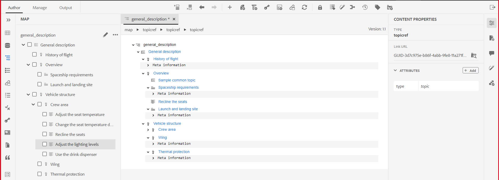
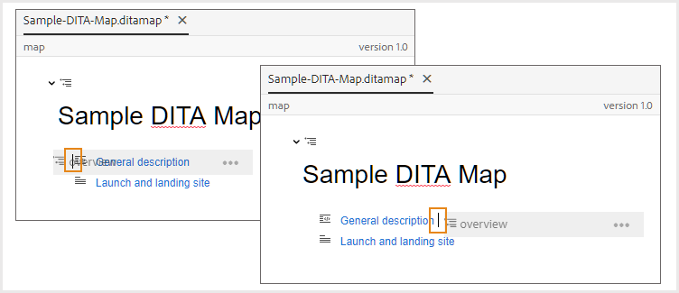
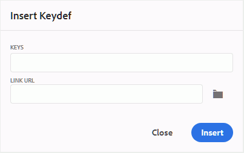

# Trabalhar com o Editor de mapa avançado {#id1942D0S0IHS}

O Editor de mapa avançado vem com interface de usuário intuitiva e é semelhante ao Editor da Web. Ao abrir um arquivo de mapa no Editor da Web, você obtém uma opção para editar o arquivo de mapa usando a interface do Editor de mapa avançado. O Editor de mapa avançado permite adicionar referências de tópico, referências de chave, estruturar o conteúdo e muito mais.

Além de editar arquivos de mapa diretamente no Editor da Web, você também pode abrir arquivos de tópico em um mapa para editar o Editor da Web. Este tópico aborda os recursos no Editor de mapa avançado e como abrir e editar arquivos em um mapa DITA no Editor da Web.

## Adicionar tópicos a um arquivo de mapa

Execute as seguintes etapas para criar seu arquivo de mapa usando o Editor de mapa avançado:

1. Na interface do usuário do Assets, navegue até o arquivo de mapa que deseja editar.

   >[!NOTE]
   >
   > Certifique-se de que você não ativou o modo de seleção de ativo.

1. Para obter um bloqueio exclusivo no arquivo de mapa, selecione o arquivo de mapa e clique em **Check-out**.

   >[!NOTE]
   >
   > Depois que você tiver um bloqueio exclusivo em um arquivo de mapa, outros usuários não poderão editar o mapa. No entanto, eles poderão trabalhar nos tópicos dentro do arquivo de mapa. Se o administrador tiver configurado o Editor da Web para fazer check-out dos arquivos antes de editar, você não poderá editar um arquivo até fazer check-out. Da mesma forma, se configurado, você será solicitado a fazer check-in de qualquer arquivo com check-out antes de fechá-lo

1. Com o arquivo de mapa selecionado, clique em **Editar tópicos**.

   {width="800" align="left"}

   Ou você também pode selecionar a opção **Editar Tópicos** no menu de ações no arquivo de mapa:

   {width="800" align="left"}

   O arquivo de mapa é aberto para edição no Editor da Web.

1. Clique no ícone **Editar**.

   {width="550" align="left"}

   O mapa é aberto na interface do Editor de mapa avançado. Se você tiver aberto um novo arquivo de mapa, então somente o título do mapa será mostrado no editor.

   {width="800" align="left"}

   - **A** - \(*Barra de ferramentas principal*\): é semelhante à barra de ferramentas principal do Editor da Web. Consulte [Barra de ferramentas principal](web-editor-features.md#id2051EA0G05Z) no Editor da Web para obter mais detalhes.

   - **B** - \(*Barra de ferramentas secundária*\) Esta é a barra de ferramentas secundária que permite trabalhar com arquivos de mapa. Para obter mais informações sobre as funcionalidades disponíveis por meio da barra de ferramentas Secundária, consulte [Recursos disponíveis na barra de ferramentas do Editor de Mapa Avançado](#id205DEC0005Z).

   - **C** - \(*Visualizações de mapa*\): permite que você alterne o Editor de mapa entre Layout, Autor, Source e Visualização. A exibição de **Layout** permite organizar os tópicos em um mapa DITA. Isso fornece a exibição em árvore ou hierárquica do mapa. O modo de exibição **Autor** permite que você edite os tópicos no Editor de Mapa. Isso também fornece a visualização WYSIWYG do arquivo de mapa. A exibição **Source** permite trabalhar com o XML subjacente do arquivo de mapa. A Visualização fornece uma exibição consolidada de todos os tópicos e submapas no arquivo de mapa. O link **Fechar** fecha o arquivo de mapa.

   - **D** - \(*Painel Esquerdo*\): Dá acesso ao painel esquerdo, que dá acesso aos Favoritos, Repositório, Mapa, Estrutura de Tópicos e outros recursos. Você pode expandi-la ou recolhê-la clicando no ícone Expandir Barra Lateral \(\). Para obter mais detalhes sobre os recursos disponíveis no painel esquerdo, consulte [Painel esquerdo](web-editor-features.md#id2051EA0M0HS) no Editor da Web.

   - **E** - \(*Área do Meio*\): Mapear área de edição de conteúdo.

   - **F** - \(*Painel Direito*\): Dá acesso ao painel Propriedades. Você pode ver as propriedades de conteúdo e as propriedades do mapa do tópico ou mapa selecionado. Para obter mais detalhes sobre as funcionalidades disponíveis neste painel, consulte [Painel direito](web-editor-features.md#id2051EB003YK) no Editor da Web.

1. No Painel Esquerdo, alterne para a **Exibição do Repositório**.

1. No repositório do AEM, navegue até a pasta que contém os tópicos ou submapas que deseja adicionar.

1. Selecione o tópico ou arquivo de mapa na **Exibição do repositório** e arraste-o e solte-o na área de edição de conteúdo do mapa \(meio\).

   O tópico é adicionado no mapa.

   {width="800" align="left"} ao editor de mapa

1. Para adicionar tópicos subsequentes ou um submapa, arraste e solte o tópico ou submapa no local necessário no mapa.

   Considere os seguintes pontos ao criar o arquivo de mapa:

   - O arquivo é adicionado em um local onde a barra horizontal aparece na área de edição de mapa. Na captura de tela a seguir, o tópico *Visão geral* será adicionado entre os tópicos *Descrição geral* e *Inicialização e site de aterrissagem*.

     {width="350" align="left"}

   - Para substituir um tópico, coloque-o na parte superior, esquerda ou direita do tópico que deseja substituir. Uma barra Vertical à esquerda ou direita de um tópico indica que ele será substituído pelo tópico solto sobre ele.

     {width="550" align="left"}

     No entanto, antes de substituir um tópico, você receberá um prompt de confirmação. O tópico é substituído somente após a confirmação.

     {width="300" align="left"}

   - Se você adicionar um submapa ao mapa DITA, o submapa será mostrado como um link no mapa DITA. Para exibir todos os tópicos do submapa, pressione Ctrl e clique no link do submapa. O conteúdo do submapa é mostrado em uma nova guia. Da mesma forma, para abrir um tópico no mapa DITA, clique com o botão Ctrl no link do tópico e ele será aberto na nova guia.

   - Você pode usar as teclas de atalho CTRL+Z e CTRL+Y ou seus respectivos ícones na barra de ferramentas para desfazer ou refazer qualquer alteração no mapa.

   - Para alterar a posição de um tópico, selecione o tópico \(clicando no ícone de tópico\) e arraste-o e solte-o no local desejado no arquivo de mapa. Certifique-se de que a barra horizontal esteja visível no local onde você deseja colocar o tópico. Na captura de tela a seguir, o tópico *Site de Inicialização e Aterrissagem* está sendo movido após o tópico *Visão geral*.

     {width="350" align="left"}

   - Para verificar as propriedades do arquivo de mapa, clique com o botão direito do mouse em qualquer lugar na área de edição de mapas e escolha **Propriedades** no menu de contexto. Com base na versão do AEM, você pode ver propriedades como metadados, programação de ativação, referências, estado do documento e muito mais.

1. Clique em **Salvar**.

## Recursos disponíveis na barra de ferramentas do Editor de mapa avançado {#id205DEC0005Z}

A barra de ferramentas no Editor de mapa avançado é semelhante ao Editor da Web de tópico. As operações básicas, como alternar o painel esquerdo, salvar o mapa, criar uma nova versão do mapa, desfazer/refazer a última operação e excluir os elementos selecionados, são comuns em ambos os editores. Para obter detalhes sobre como essas operações funcionam, consulte a seção [Conhecer os recursos do Editor da Web](web-editor-features.md#).

As seguintes operações específicas de mapa também estão disponíveis na barra de ferramentas nas exibições de Layout e Autor:

## Exibição de layout {#id205DEC0005Z_layout_view}

Quando você abre um mapa para edição, ele abre a exibição de Layout do Editor de Mapa. A exibição de Layout exibe a hierarquia do mapa em uma exibição em árvore e permite organizar os tópicos em um mapa.

>[!NOTE]
>
> A exibição de layout exibe apenas as referências presentes em um mapa. Se alguma referência for quebrada, um pequeno símbolo de cruz será exibido à esquerda da referência

Você pode executar as seguintes tarefas na exibição de layout:

**Inserir Referência de Tópico** - 

Exibe a caixa de diálogo de pesquisa de tópico. Navegue até o arquivo de tópico/mapa que deseja inserir e clique em Selecionar para adicioná-lo ao mapa.
{width="800" align="left"}

**Inserir Grupo de Tópicos** - 

Insira o elemento `topicgroup`. Para obter mais informações sobre como agrupar tópicos, consulte a documentação do [topicgroup](https://docs.oasis-open.org/dita/v1.0/langspec/topicgroup.html) na Especificação de Linguagem OASIS DITA.

**Inserir Definição de Chave** - 

Exibe a caixa de diálogo Inserir Keydef. Use esta caixa de diálogo para definir qualquer definição de chave que você deseja usar no mapa.

{width="300" align="left"}

**Inserir Antes/Inserir Depois** -  / 

Exibe a caixa de diálogo Inserir elemento. Selecione o elemento que deseja inserir no mapa. Dependendo da operação, o novo elemento é inserido antes ou depois do elemento atual no mapa.

**Inserir Front Matter** - 

Esse ícone é exibido quando você abre um bookmap para edição. Você pode inserir componentes no início do livro como um índice, um índice e uma lista de tabelas.

**Inserir retrospectiva** - 

Esse ícone é exibido quando você abre um bookmap para edição. Você pode inserir componentes para um fim de livro como um índice, um glossário e uma lista de figuras.

**Mover o Item Selecionado para a Esquerda/Direita** -  / 

Clique na seta à esquerda para mover o tópico em direção ao lado esquerdo na hierarquia. Isso basicamente promove o respectivo tópico um nível acima na hierarquia. Por exemplo, clicar na seta para a esquerda enquanto um tópico filho é selecionado torna-o irmão do tópico acima. Da mesma forma, se você clicar na seta para a direita, o tópico será empurrado para o lado direito, tornando-se o filho do tópico acima dele.

**Mover o Item Selecionado para Cima/para Baixo** - / 

Clique nos ícones de seta para cima ou para baixo para mover o tópico para cima ou para baixo na hierarquia.

>[!NOTE]
>
> Você também pode arrastar e soltar as referências para movê-las em um mapa.

**Bloquear/Desbloquear** -  / 

Obtém um bloqueio no arquivo de mapa e libera o bloqueio. Se houver alterações não salvas no arquivo de mapa, no momento do lançamento do bloqueio, será solicitado que você salve o arquivo de mapa. As alterações são salvas na versão atual do arquivo de mapa.

**Mesclar** - 

Para obter mais detalhes sobre como mesclar o conteúdo de uma versão diferente do mesmo arquivo ou de um arquivo diferente, consulte [Mesclar](web-editor-features.md#id205DF04E0HS) no Editor da Web.

**Histórico de Versões** - 

Verifique as versões e rótulos disponíveis no tópico ativo e reverta para qualquer versão do próprio editor.

**Rótulo da Versão** - 

Exibe a caixa de diálogo de gerenciamento de rótulo da versão. Selecione uma versão na lista suspensa. Escolha o rótulo que deseja aplicar à versão selecionada e clique em **Adicionar Rótulo** para adicioná-lo.

**Opções de Exibição** - 

Exibe uma lista suspensa que fornece a opção de Mostrar números de linha, Mostrar caixa de seleção e Mostrar nome de arquivo.

- **Mostrar números de linha**

Mostra ou oculta o número da linha de cada tópico. Os números de linha são mostrados dependendo do nível na hierarquia.

- **Mostrar Caixa de Seleção**

Mostra ou oculta uma caixa de seleção para cada tópico. Você pode usar a caixa de seleção para selecionar o tópico\(s\) e executar várias tarefas usando o menu Opções. Para obter mais detalhes, consulte o menu [Opções](#id228ID8006H8).

- **Mostrar nome do arquivo**

Mostra o nome do arquivo dos títulos dos tópicos.

>[!NOTE]
>
> Ao passar o ponteiro sobre o título de um tópico, é mostrado o caminho do arquivo.

**Exibir tópicos com base em filtros condicionais** Se você tiver aplicado condições em um tópico, um ícone de filtro será exibido à direita do tópico. Ao passar o ponteiro sobre um ícone de filtro, é exibida a condição aplicada e seu valor de atributo.

**Menu de opções na exibição de layout**

Além de organizar tópicos no arquivo de mapa, você também pode executar as seguintes ações usando o menu Opções disponível para um elemento na exibição de layout:

{width="650" align="left"}

- **Adicionar**: você pode optar por adicionar um novo tópico ou uma referência vazia do Editor de Mapa:
   - **Referência vazia**: essa opção permite adicionar uma referência vazia ao mapa DITA. Você pode clicar duas vezes na referência vazia inserida posteriormente e adicionar os detalhes do tópico. Para obter mais detalhes, consulte [Criar um tópico](web-editor-features.md#id228ICI0105U) no Editor da Web.
   - **Novo Tópico**: Quando você opta por criar um novo tópico do menu, a caixa de diálogo Criar Novo Tópico é exibida. Na caixa de diálogo Criar novo tópico, forneça os detalhes necessários e clique em Criar. Para obter mais detalhes, consulte [Criar um tópico](web-editor-features.md#id228ICI0105U) no Editor da Web.
- **Mover**: você pode optar por mover um tópico para cima/baixo/direita/esquerda na hierarquia.Você também pode arrastar e soltar um tópico ou um mapa do painel do repositório para o mapa aberto no Editor de Mapa.
- **Desfazer**: desfaz a última operação no modo de exibição de layout.
- **Refazer**: refaz a última operação no modo de exibição de layout.
- **Copiar**: copie a referência selecionada do arquivo de mapa.

  >[!NOTE]
  >
  > Você pode exibir e marcar as caixas de seleção para copiar várias referências.

- **Colar**: Cola as referências copiadas no local atual na hierarquia.
- **Excluir**: excluir as referências selecionadas do arquivo de mapa.

  >[!NOTE]
  >
  > Você pode exibir e marcar as caixas de seleção para excluir várias referências.

## Painel direito no Editor de mapa

O painel direito exibe as Propriedades do Conteúdo e as Propriedades do Mapa na exibição de Layout do Editor de Mapas.

**Propriedades do conteúdo**

O painel Propriedades de conteúdo contém informações sobre o tipo de tópico atualmente selecionado no mapa, o URL do link e os atributos. Para obter mais detalhes, consulte [Propriedades de Conteúdo](web-editor-features.md#id228IDB00HMM) no Editor da Web.

- **Outros atributos** Se o administrador tiver criado um perfil para atributos, você obterá esses atributos junto com seus valores configurados. Usando o painel de propriedades de conteúdo, você pode escolher esses atributos e atribuí-los ao conteúdo relevante em seu tópico. Você também pode atribuir atributos configurados pelo administrador na guia **Atributos de Exibição** das configurações do editor. Os atributos definidos para um elemento são exibidos na exibição Layout e Estrutura de Tópicos. Isso ajuda você a ter uma olhada rápida em todos os tópicos em um mapa para o qual um determinado atributo é definido. Por exemplo, todos os tópicos que têm o atributo de plataforma definido como &quot;Android&quot;.

  {width="650" align="left"}

  Para obter mais detalhes, consulte os *Atributos de Exibição* na descrição do recurso *Configurações do Editor*, na seção [Painel Esquerdo](web-editor-features.md#id2051EA0M0HS).

- **Metadados** Usando os metadados, você pode definir as informações de metadados. Você pode definir o Título de navegação, Texto do link, Descrição curta e Palavras-chave.

Para obter mais informações sobre atributos e metadados de tópico padrão, consulte a documentação [topicref](https://docs.oasis-open.org/dita/v1.2/os/spec/langref/topicref.html) na Especificação de Linguagem OASIS DITA.

**Propriedades do Mapa**

Exibe a caixa de diálogo Propriedades do Mapa, na qual você pode definir os atributos e as informações de metadados do mapa.

## Visualização do autor {#id205DEC0005Z_author_view}

O modo de exibição **Autor** permite que você edite o mapa DITA no Editor da Web. Isso mostra a visualização WYSIWYG do Editor de mapas e alguns dos ícones exibidos na visualização Autor são iguais à visualização Layout. Para obter mais detalhes, consulte [Modo de exibição de layout](#id205DEC0005Z_layout_view). Além disso, você pode ver os seguintes ícones e executar as tarefas relacionadas na visualização Autor:

**Inserir Antes/Inserir Depois** -  / 

Exibe a caixa de diálogo Inserir elemento. Selecione o elemento que deseja inserir no mapa. Dependendo da operação, o novo elemento é inserido antes ou depois do elemento atual no mapa.

**Inserir Elemento** - 

Exibe a caixa de diálogo Inserir elemento. Selecione o elemento que deseja inserir. Você pode usar o teclado para rolar pela lista de elementos e pressionar Enter para inserir o elemento necessário. Como alternativa, você pode clicar diretamente no elemento para inseri-lo no mapa.

**Inserir Tabela de Relações** - 

Insere uma tabela de relacionamento no mapa. Como o conceito de trabalhar com a tabela de relação é o mesmo explicado na seção Editor de Mapa Básico, consulte [Trabalhar com tabelas de relação no Editor de Mapa Básico](map-editor-basic-map-editor.md#id1944B0I0COB) para obter mais detalhes.

**Inserir Conteúdo Reutilizável** - 

Exibe a caixa de diálogo Reutilizar conteúdo. Use esta caixa de diálogo para inserir o conteúdo que você deseja reutilizar no mapa.

**Atualizar Atributo de Título de Navegação** - 

Sincroniza o elemento `title` de um arquivo referenciado em um mapa com o valor especificado em seu atributo `@navtitle`. É possível adicionar diferentes tipos de arquivos de referência em um mapa, por exemplo, tópico, referência, tarefa, mapas \(sub\) e assim por diante. A maioria desses arquivos oferece suporte ao atributo `@navtitle`. Se um arquivo contiver o atributo `@navtitle`, o atributo `@navtitle` para o mesmo arquivo no mapa será atualizado. Caso o atributo `@navtitle` não esteja presente, o atributo `@navtitle` é adicionado a esse arquivo de referência e seu `title` também é atualizado para exibir o `@navtitle`.

>[!NOTE]
>
> O administrador pode configurar a adição automática do atributo `@navtitle` a cada arquivo de referência adicionado a um mapa. Para obter mais detalhes sobre como configurar a adição automática do atributo `@navtitle`, consulte *Incluir atributo @navtitle por padrão* em Instalar e configurar o Adobe Experience Manager Guides as a Cloud Service.

Clique no ícone Atualizar atributo do título de navegação para sincronizar os valores do elemento `title` e do atributo `@navtitle`.

**Alternar Modo de Exibição de Marcas** - 

Mostra ou oculta as marcas de formatação XML. As tags servem como dicas visuais que indicam o limite de um elemento. Nesse modo, se você quiser inserir uma referência de tópico/mapa, arraste e solte o arquivo desejado antes ou depois da tag. A barra horizontal não é mostrada no modo de Exibição de tags.

**Habilitar/Desabilitar o Controle de Alterações** - 

Você pode acompanhar todas as atualizações feitas no arquivo de mapa habilitando o modo Controlar Alterações. Depois de ativar o controle de alterações, todas as inserções e exclusões são capturadas no documento. Para obter mais detalhes, consulte [Habilitar/Desabilitar o Controle de Alterações](web-editor-features.md#id205DF0203Y4) no Editor da Web.

**Criar Tarefa de Revisão** - 

Você pode criar uma tarefa de revisão do tópico atual ou mapear o arquivo diretamente do Editor da Web. Abra o arquivo para o qual deseja criar a tarefa de revisão e clique em Criar tarefa de revisão para iniciar o processo de criação da revisão. Siga as instruções fornecidas nos [Tópicos ou mapas de revisão](review.md#) para obter mais detalhes.

## Editar tópicos por meio do mapa DITA {#id17ACJ0F0FHS}

A edição de um tópico individual não fornece o contexto completo ao autor. Um autor não teria informações sobre onde um tópico é colocado em um mapa DITA. Sem essas informações contextuais, fica um pouco difícil para os autores criar conteúdo.

O AEM Guides permite que os autores abram um mapa DITA no Editor da Web e vejam a disposição dos tópicos no mapa. Isso ajuda os autores a saber onde exatamente o tópico é colocado no mapa e criar conteúdo mais relevante. Além disso, se houver vários autores trabalhando em um projeto, eles poderão saber quais tópicos estão disponíveis no mapa e reutilizar o conteúdo, onde for necessário.

Para editar tópicos por meio de um mapa DITA, execute as seguintes etapas:

1. Na interface do usuário do Assets, navegue até o mapa DITA que contém os tópicos que você deseja editar.
1. Clique no mapa DITA para abri-lo no console do mapa DITA.
1. Selecione a guia **Tópicos** para ver uma lista de tópicos disponíveis no mapa DITA.

   >[!TIP]
   >
   > A guia Tópicos oferece uma opção para baixar o arquivo de mapa com seus dependentes. Para obter mais detalhes, consulte [Exportar um arquivo de mapa DITA](authoring-download-assets.md#id218UBA00IXA).

1. Na barra de ferramentas principal, clique em **Editar tópicos**.

   O mapa DITA é aberto no Editor da Web.

   >[!NOTE]
   >
   > Você também pode selecionar o arquivo de mapa DITA na interface do usuário do Assets e clicar em **Editar tópicos** na barra de ferramentas principal para iniciar o Editor da Web.

   {width="350" align="left"}

1. \(*Opcional*\) Você também pode selecionar um tópico no mapa e fazer check-out do arquivo antes de editá-lo. Para fazer check-out do arquivo\(s\), selecione um ou mais arquivos no painel esquerdo e clique em **Check-out**. Você também pode liberar o bloqueio em qualquer arquivo selecionando o arquivo com check-out e clicando no ícone **Cancelar Check-out e Desbloquear** na exibição Mapa.

   >[!IMPORTANT]
   >
   > Se o administrador tiver configurado a opção **Desabilitar Edição Sem Check-out**, você deverá fazer check-out do arquivo antes de editar. Se você não fizer check-out do arquivo, o documento será aberto no editor no modo somente leitura.

   A captura de tela a seguir destaca os ícones de Check-out e Bloqueio \(A\), Cancelar Check-out e Desbloquear \(B\), Salvar como nova versão e Desbloquear \(C\), Editar \(D\), Visualizar \(E\), ícones diferentes mostrando tipos de arquivos DITA diferentes \(F\) e arquivos cujo check-out foi feito \(G\).

   {width="550" align="left"}

1. Clique em qualquer link de tópico para abri-lo no Editor da Web para edição.

   É possível abrir vários tópicos no editor e cada tópico é aberto em uma nova guia no editor. Mesmo que o mapa DITA contenha submapas, os tópicos desses submapas também serão abertos em uma nova guia para edição. Se quiser exibir os tópicos em um submapa, clique em e expanda o submapa.

   {width="800" align="left"}

   Se você clicar em um arquivo de mapa, o mapa será aberto em uma nova guia do navegador da Web.

1. Quando terminar de editar os tópicos, você poderá fazer o seguinte:

   - Você pode salvá-los individualmente. Se você clicar em **Fechar sem salvar** seus tópicos, verá uma caixa de diálogo solicitando que você salve os tópicos não salvos:

     {width="550" align="left"}

     Você pode optar por salvar todos os tópicos selecionados ou desmarcar os tópicos que não deseja salvar.

   - Você pode verificar o tópico usando o botão **Salvar como nova versão e Desbloquear**. Quando você salva uma versão do tópico, uma nova versão é criada e o bloqueio também é lançado.

     É recomendável salvar as alterações antes de fazer check-in dos arquivos.  Quando você salva as alterações, o arquivo XML é validado.

   - Você também pode selecionar e fazer check-in de vários tópicos usando o botão **Salvar como nova versão e Desbloquear**. Quando você salva uma versão dos tópicos, uma nova versão é criada para cada tópico e o bloqueio também é lançado. Você também pode exibir o progresso da verificação nos tópicos da caixa de diálogo **Salvar como nova versão e Desbloquear**. Uma mensagem de sucesso é mostrada quando os arquivos são verificados.

   - Se o administrador tiver ativado a opção de fazer check-in de arquivos ao fechar, você receberá um prompt para salvar os arquivos sempre que os arquivos com check-out forem fechados. Com essa opção ativada, ao fechar o editor com arquivos alterados, você verá a lista de arquivos com check-out que precisam ser salvos. Os arquivos com check-out são mostrados com um ícone de cadeado:

     {width="550" align="left"}

      - Clicar no botão **Fechar sem Salvar** fecha os arquivos sem salvar as alterações.

      - Clicar no botão **Salvar** salva as alterações, mas não faz check-in dos arquivos.

      - Selecionar a opção **Verificando Arquivos** e clicar no botão **Salvar** fará a verificação nos arquivos \(cria outra versão\) e também salvará os arquivos.

## Visualizar um mapa

Além de poder ver a posição de cada arquivo de tópico em um mapa, é desejável ver o conteúdo do mapa em um fluxo consecutivo. O recurso Visualizar mapa permite que você veja todo o conteúdo do arquivo de mapa em um único clique. Não é necessário gerar uma saída do arquivo de mapa para ver como será o mapa inteiro depois de publicado. Você pode simplesmente acessar a visualização do mapa e todos os tópicos e submapas são renderizados na forma de um livro.

Você pode acessar a visualização de um mapa em:

- **Interface do usuário do Assets**: na interface do usuário do Assets, navegue até o local do mapa, selecione o arquivo de mapa e escolha **Visualizar Mapa** na Barra de Ferramentas. A visualização do mapa é mostrada em uma nova guia. É possível exibir o conteúdo de todos os tópicos no modo de visualização. Nesta exibição, não é possível editar nenhum tópico.

  >[!NOTE]
  >
  > Se a opção *Visualizar Mapa* não estiver visível na barra de ferramentas principal, ela pode ter sido movida para o menu da barra de ferramentas **Mais**.

- **Editor de Mapa Avançado**: no Editor de Mapa Avançado, clique no ícone Visualizar para visualizar o mapa atual.

  {width="350" align="left"}

  Você pode executar as seguintes tarefas adicionais no modo de visualização:

   - Clique com o botão direito em um tópico e selecione **Editar** para abrir o tópico para edição em uma nova guia.

     >[!NOTE]
     >
     > Se você não tiver direitos de edição, o tópico será aberto no modo somente leitura.

   - Pule para o tópico desejado clicando no título do tópico na árvore de mapa \(no painel esquerdo\).

   - O tópico atual na visualização do mapa também é destacado na árvore do mapa.

**Tópico pai:** [Trabalhar com o Editor de Mapa](map-editor.md)
