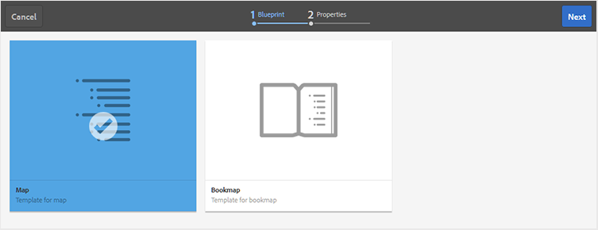

# Criar um mapa {#id176FEN0D05Z}

O AEM Guides fornece dois modelos de mapa prontos para uso - mapa DITA e mapa de livros. Você também pode criar seus próprios modelos de mapa e compartilhá-los com seus autores para criar arquivos de mapa.

Execute as seguintes etapas para criar um arquivo de mapa:

1. Na interface do usuário do Assets, navegue até o local em que deseja criar o arquivo de mapa.

1. Clique em **Criar** \> **Mapa DITA**.

1. Na página Blueprint, selecione o tipo de modelo de mapa que deseja usar e clique em **Próximo**.

   >[!NOTE]
   >
   > A forma como os tópicos são referenciados em um arquivo de mapa depende do modelo de mapa. Por exemplo, se o modelo de Mapa for selecionado, as referências de tópico \(`topicref`\) serão usadas para fazer referência a tópicos. No caso de um Bookmap, as referências de tópico são criadas usando o elemento `chapter` no DITA.

   {width="650"}

1. Na página Propriedades, especifique o mapa **Título**.

1. \(Opcional\) Especifique o arquivo **Nome**.

   Se o administrador tiver configurado o nome de arquivo automático com base na configuração UUID, você não verá a opção para especificar o nome do arquivo. Um nome de arquivo baseado em UUID é automaticamente atribuído ao arquivo.

   Se a opção de nomenclatura de arquivo estiver disponível, o nome também será sugerido automaticamente com base no Título do mapa. Se você quiser especificar manualmente o nome do arquivo de mapa, certifique-se de que o nome do arquivo não contenha nenhum espaço, apóstrofo ou chaves e termine com `.ditamap`.

1. Clique em **Criar**.

   A mensagem Mapa criado é exibida.

   Todo novo arquivo de mapa criado por você na interface do usuário do Assets **Criar** \> **Mapa DITA** ou no Editor da Web recebe uma ID de mapa exclusiva. Além disso, o novo mapa é salvo como a cópia de trabalho mais recente no DAM. Até salvar uma revisão de um mapa recém-criado, você não verá nenhum número de versão no Histórico de versões. Se você abrir o mapa para edição, as informações da versão serão mostradas no canto superior direito da guia do arquivo de mapa:

   {width="650"}

   As informações de versão para um mapa recém-criado são mostradas como *nenhuma*. Ao salvar uma nova versão, um número de versão é atribuído como 1.0. Para obter mais informações sobre como salvar uma nova versão, consulte [Salvar como nova versão](web-editor-features.md#save-as-new-version-id209ME400GXA).

   Você pode optar por abrir o mapa para edição no editor de mapa configurado ou salvar o arquivo de mapa no repositório do AEM.

   >[!NOTE]
   >
   > Para usar o Editor de Mapa Avançado, acesse o arquivo de mapa no Editor da Web. Caso o administrador tenha configurado o Editor de mapa avançado como o editor padrão nos arquivos de mapa, o arquivo de mapa será aberto diretamente no Editor de mapa avançado para edição. Consulte *Definir o Editor de Mapa Avançado como padrão* na seção Instalar e configurar o Adobe Experience Manager Guides as a Cloud Service.

**Tópico pai:**[ Trabalhar com o Editor de Mapa](map-editor.md)
