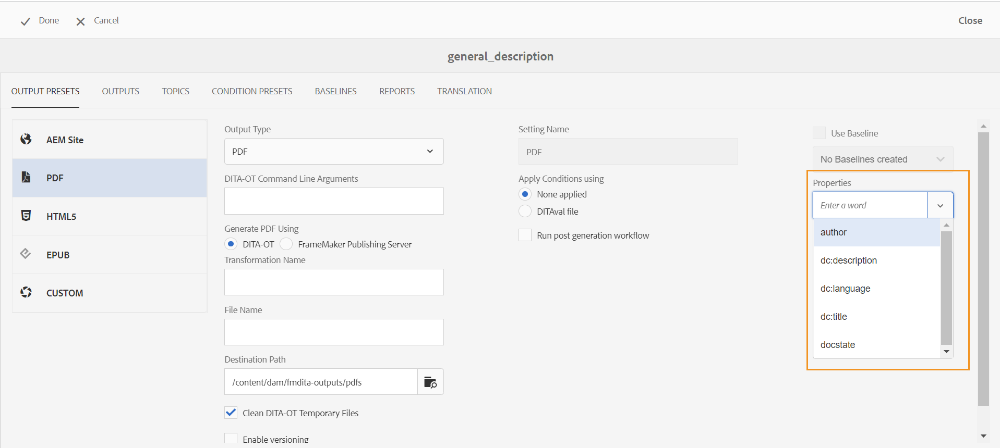

# Transmita os metadados para a saída usando DITA-OT {#id21BJ00QD0XA}

Os metadados são informações adicionais sobre a saída. No AEM Guides, é possível transmitir os metadados existentes ou criar tags de metadados personalizadas. Você pode transmitir metadados para saídas de formato AEM, PDF, HTML5, EPUB e Personalizado usando a publicação DITA-OT.

Execute as seguintes etapas para transmitir os metadados para a saída usando a publicação DITA-OT:

1. Na **Interface do usuário do Assets**, navegue e clique no arquivo de mapa DITA para o qual deseja passar os metadados para o DITA-OT.
1. Selecione e edite uma predefinição de saída para a qual deseja passar os campos de metadados. Por exemplo, selecione Predefinição de saída PDF.
1. Selecione **DITA-OT** em Gerar &lt;output\> usando na predefinição de saída selecionada.

   {width="800"}

1. Na lista suspensa Propriedades, selecione os metadados que deseja transmitir para a publicação DITA-OT.

   A lista suspensa Propriedades lista as propriedades personalizadas e padrão. Por exemplo, na captura de tela acima, o autor é a propriedade personalizada, enquanto `dc:description`, `dc:language`, `dc:title` e `docstate` são as propriedades padrão.

   >[!NOTE]
   >
   > Essas propriedades são selecionadas do arquivo metadataList disponível no seguinte local:`/libs/fmdita/config/metadataList`. Por padrão, há quatro propriedades listadas neste arquivo - `dc:description`, `dc:language`, `dc:title` e `docstate`.

   Este arquivo pode ser sobreposto em: `/apps/fmdita/config/metadataList`.

   Para transmitir uma propriedade personalizada para a qual você já definiu os valores, consulte [Usar metadados do AEM na saída do DITA-OT PDF](https://experienceleaguecommunities.adobe.com/t5/xml-documentation-discussions/use-aem-metadata-in-dita-ot-pdf-output/td-p/411880).

1. Na lista suspensa **Propriedades**, selecione as propriedades padrão e personalizadas necessárias. Por exemplo, selecione `author`, `dc:title` e `dc:description`. Estes são os `metadata/properties` padrão que são criados quando criamos um arquivo. As propriedades selecionadas são listadas abaixo da dropbox.

   {width="300"}

1. Clique em **Concluído** no canto superior esquerdo para salvar as alterações.
1. Gere a saída.

As propriedades de metadados selecionadas serão passadas para a saída gerada usando o DITA-OT.

**Tópico pai:**[ Geração de saída](generate-output.md)
