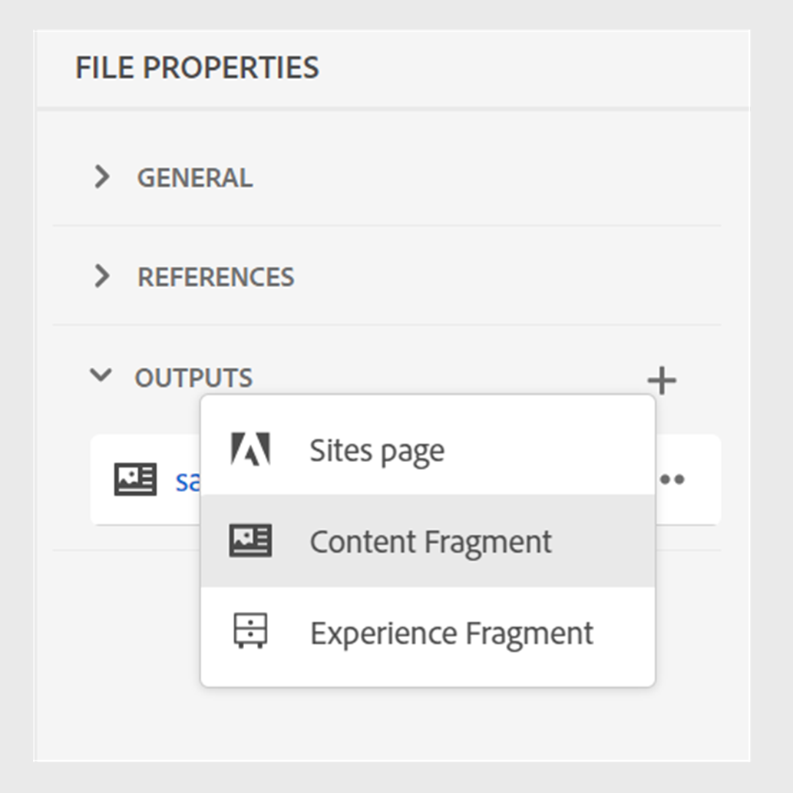

# Fragmentos de conteúdo do Publish

Fragmentos de conteúdo são partes distintas do conteúdo no Adobe Experience Manager. São conteúdos estruturados com base em um modelo de conteúdo. Fragmentos de conteúdo são conteúdo puro sem informações de design ou layout. Eles podem ser criados e gerenciados independentemente dos canais compatíveis com o Adobe Experience Manager. Os fragmentos de conteúdo são modulares, em que o conteúdo é dividido em componentes menores.

O Experience Manager Guides permite publicar um tópico ou seus elementos em um fragmento de conteúdo.

>[!NOTE]
>
>Você pode escolher apenas os elementos em um tópico que tenham um atributo id definido.

Para criar um fragmento de conteúdo, execute as seguintes etapas:

1. Crie um [modelo de Fragmento de conteúdo](https://experienceleague.adobe.com/docs/experience-manager-65/assets/content-fragments/content-fragments-models.html?lang=pt-BR) no Adobe Experience Manager Assets.
1. Crie uma pasta na qual deseja salvar os fragmentos de conteúdo criados com base no modelo de fragmento de conteúdo. Por exemplo, &quot;stock-content-fragments&quot;.
1. Edite as propriedades da pasta (por exemplo, &quot;stock-content-fragments&quot;) e adicione o caminho da pasta, que contém o modelo de Fragmento de conteúdo na configuração de nuvem.
Por exemplo, adicione `/conf/we-retail` na configuração de nuvem. Essa configuração conecta todos os modelos de fragmento de conteúdo à pasta.\
   {width="650" align="left"}
   *Adicione a configuração da nuvem nas propriedades da pasta para conectá-la aos modelos de fragmento.*

1. Para gerar um Fragmento de Conteúdo, selecione **Nova Saída**  na seção **Saídas** em **Propriedades do Arquivo** de um tópico.
1. Selecione **Fragmento do conteúdo**.\
    {width="300" align="left"}

   *Adicionar um novo Fragmento de Conteúdo das Propriedades de Arquivo de um tópico*.

1. Na caixa de diálogo **Gerar fragmento de conteúdo**, preencha os detalhes a seguir nas guias **Geral** e **Mapeamento**.

   Guia **Geral**
   
   *Adicione o caminho, o nome, o título e a filtragem de condição para publicar um tópico ou seus elementos como um Fragmento de Conteúdo.*

   * **Caminho**: procure e selecione o caminho da pasta em que deseja publicar o fragmento de conteúdo. Se você selecionar um fragmento de conteúdo existente, ele substituirá o conteúdo dos campos mapeados.
   * **Título**: digite o título do Fragmento de Conteúdo. Por padrão, o título é preenchido com o título do tópico. Você pode editá-lo. Esse título é usado para gerar o nome do fragmento de conteúdo.
   * **Nome**: digite o nome do Fragmento de Conteúdo. Por padrão, o nome é preenchido com o título do tópico e os espaços são substituídos por &quot;_&quot;. Por exemplo, *sample_content_fragment*. Você pode editá-lo.  Esse nome é usado para gerar o URL do fragmento de conteúdo.

   * Você pode selecionar condições diferentes para criar variantes de fragmento de conteúdo. Selecione uma das seguintes opções:
     >[!NOTE]
     > 
     > As condições serão ativadas somente se os atributos de condição forem definidos no tópico.

      * **Nenhum**: selecione esta opção se não quiser aplicar nenhuma condição à saída publicada.
      * **Usando DITAVAL**: selecione o arquivo DITAVAL para incluir ou excluir conteúdo específico na saída gerada. Você pode selecionar o arquivo DITAVAL usando a caixa de diálogo Procurar ou digitando o caminho do arquivo.
      * **Uso de atributos**: você pode definir atributos de condição em seus tópicos DITA. Em seguida, selecione o atributo de condição para publicar o conteúdo relevante.

   Guia **Mapeamento**

   

   *Selecione o modelo de fragmento de conteúdo e adicione os detalhes do mapeamento para publicar um tópico ou seus elementos como um Fragmento de Conteúdo.*

   * **Modelo**: selecione o modelo de Fragmento de Conteúdo que você deseja usar para criar seu Fragmento de Conteúdo. Os modelos são selecionados da pasta, que você configurou no servidor do Experience Manager Guides.
   * **Mapeamento**: você pode exibir os elementos de tópico que têm um atributo de identificação aplicado a eles. Arraste os elementos de tópico para os campos presentes no modelo de fragmento de conteúdo.
O lado direito é preenchido com o conteúdo do fragmento de conteúdo publicado no caso de um fragmento de conteúdo existente. Eles podem ser substituídos pelo conteúdo do tópico, se necessário. Você também pode selecionar **Desfazer** para reverter as alterações de mapeamento.

     >[!NOTE]
     >
     > Se estiver usando o 4.4 ou versões anteriores, selecione um mapeamento no menu suspenso. Ele escolhe os mapeamentos do arquivo *contentFragmentMapping.json*.  O administrador pode adicionar os mapeamentos no arquivo *contentFragmentMapping.json*. Saiba mais sobre como [criar um mapeamento entre um tópico e um Fragmento de conteúdo](/help/product-guide/cs-install-guide/conf-content-fragment-mapping-cs.md) no Guia de Instalação e Configuração.

1. Clique em **Gerar** para publicar o fragmento de conteúdo.

1. Você pode exibir os Fragmentos de conteúdo de um tópico na seção **Saídas** em **Propriedades do arquivo**.

   {width="300" align="left"}

   *Exiba os Fragmentos de Conteúdo presentes para um tópico e publique-os novamente.*

Depois de publicar os fragmentos de conteúdo, você também pode usá-los em qualquer site do Adobe Experience Manager.

## Menu Opções para um Fragmento de conteúdo

Você também pode executar as seguintes ações para um Fragmento de Conteúdo do menu **Opções**:

* **Gerar**: publique novamente o fragmento de conteúdo para atualizá-lo com o conteúdo mais recente do tópico DITA. Ao gerar novamente a saída, você pode alterar o caminho, o nome, o título, o modelo e o mapeamento do fragmento de conteúdo. Você também pode selecionar condições diferentes ao regenerar a saída.

* **Duplicar**: duplicar um fragmento de conteúdo. É possível alterar o caminho, o nome, o título, o modelo e o mapeamento. Você também pode selecionar condições diferentes ao duplicar um fragmento de conteúdo para criar uma variante de fragmento de conteúdo.

* **Remover**: remover um fragmento de conteúdo da lista de saídas. Um prompt de confirmação é exibido. Depois de confirmar, o fragmento de conteúdo será removido da lista **Saídas**.

  >[!NOTE]
  >
  > Nenhum conteúdo é excluído do fragmento de conteúdo por esta ação.

* **Exibir**: exibir o editor de Fragmento de Conteúdo. Você também pode fazer alterações e salvá-las.

## Melhoria na migração de conteúdo não UUID para UUID

O novo script de migração de conteúdo UUID foi significativamente otimizado, tornando a migração de conteúdo de Não UUID para UUID 30 vezes mais rápida do que o script anterior. Ele inclui recursos como a retomada a partir de pontos de verificação, insights em tempo real, tempo estimado de conclusão e relatórios detalhados, garantindo um processo de migração harmonioso. Notavelmente, o processo de migração preserva os metadados de ativos sem qualquer alteração. O script foi testado e verificado em um grande conjunto de dados de 3 milhões de ativos, confirmando sua eficiência e confiabilidade para migrações em larga escala.

Saiba mais sobre [Não UUID para migração de conteúdo UUID](/help/product-guide/install-guide/migrate-non-uuid-uuid.md).