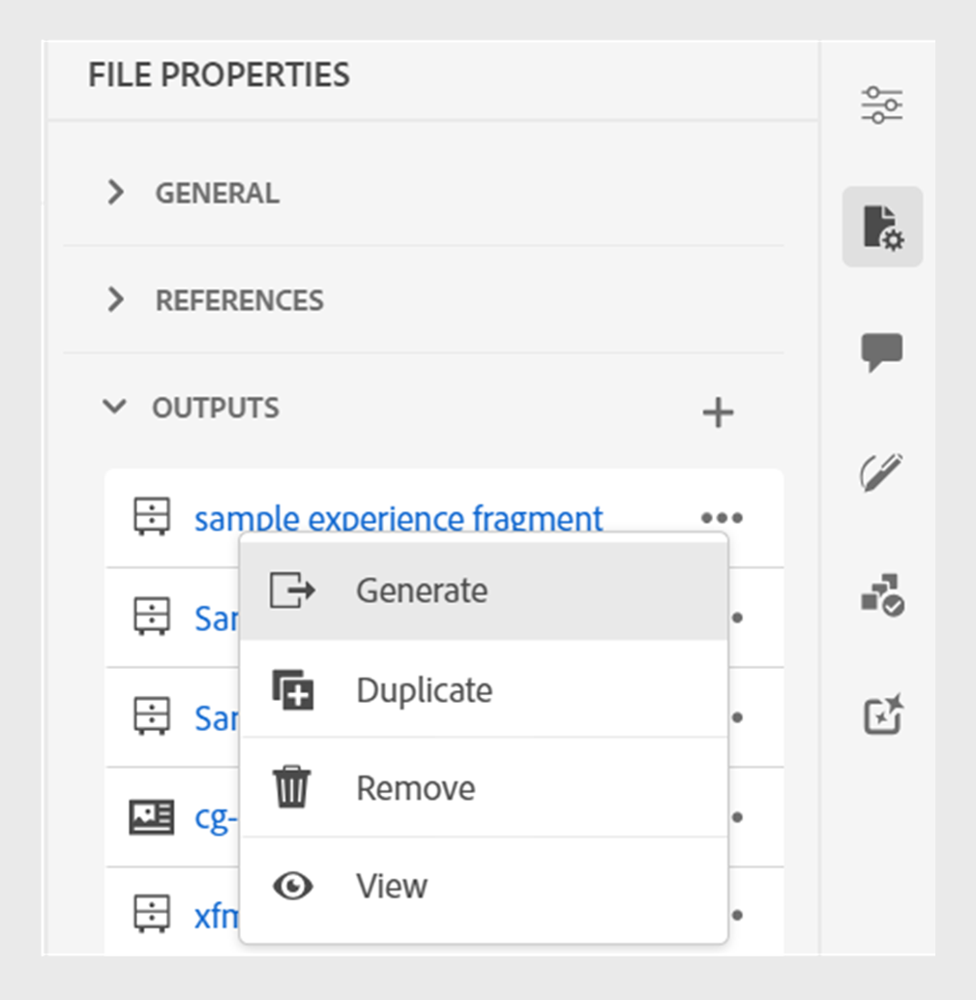

# Publicar fragmentos de experiência

Experience Fragments are pieces of modular content in Adobe Experience Manager. These content blocks are based on templates and encapsulate both the content and its layout. These reusable pieces of content allow content creators to assemble and deliver consistent, scalable experiences across multiple channels that Experience Manager supports. This feature helps you easily create consistent marketing experiences efficiently, such as newsletters, promotion banners, and customer testimonials.

Experience Manager Guides allow you to publish a topic or its elements to an Experience Fragment. You can create a JSON-based mapping between a topic and its elements in an Experience Fragment. Then, use the mapping to publish a topic or its elements to an Experience Fragment. You can then use Experience Fragments in any Experience Manager Site or extract the details via APIs supported by Experience Fragments.

To generate an Experience Fragment, perform the following steps:

1. Create a folder in the Experience Fragments. Use this folder to save the Experience Fragments that you create based on the Experience Fragment templates. For example, *sales-experience-fragments*.
1. Select the folder and then select the **Properties** icon from the top.
1. Edit the folder&#39;s properties (for example, *sales-experience-fragments*).

   * **Title**: View or edit the title of the folder.

   * **Allowed Templates**: Contains the list of templates that can be added as child pages of the experiencefragment. To add the allowed template, specify the regular expression for retrieving the required templates in the **Allowed Templates** field.
Por exemplo:
     `/libs/cq/experience-fragments/components/experiencefragment/template`

     If you do not define an allowed template for a folder, the templates are picked from the parent folder or the templates folder by default.
   * **Orderable**: Allows you to change the order of the assets inside a folder.
     {width="650" align="left"}
     *Add the cloud configuration in the folder properties to connect it with the fragment templates.*
1. To generate an Experience Fragment, select **New Output**  from the **Outputs** section in the **File Properties** of a topic.
1. Select **Experience Fragment**.\
   {width="300" align="left"}

   *Add a new Experience Fragment from the File Properties of a topic*.

   >[!NOTE]
   >
   > You can also publish an Experience  Fragment from the **Repository View**. Select the topic that you want to publish as an Experience Fragment. Then, from the **Options** menu, select **Publish As** > **Experience Fragment**.

1. In the **Generate Experience Fragment** dialog box, fill in the following details:
   {width="500" align="left"}

   *Add the path, template, and mapping details to publish a topic or its elements as an Experience Fragment. You can overwrite an existing Experience Fragment.*

   * **Path**: Browse and select the path of the folder where you want to publish the Experience Fragment. You can also select an existing Experience Fragment and republish it.
   * **Title**: Type the title of the Experience Fragment. By default, the title is populated with the title of the topic. You can edit it. This title is used to generate the name of the Experience Fragment.
   * **Name**: Type the name of the Experience Fragment. By default, the name is populated with the title of the topic, and the spaces are replaced with &#39;_&#39;. For example, *sample_expereince_fragment*. You can edit it. This name is used to generate the URL for the Experience Fragment.
   * **Template**: Select the Experience Fragment template that you want to use to create your Experience Fragment. The templates are picked from the folder that you have configured in the properties.
   * **Mapping**: It picks the mapping from the *experienceFragmentMapping.json* file and displays it.

     O administrador pode adicionar os mapeamentos no arquivo *experienceFragmentMapping.json*.  Saiba mais sobre como [criar um mapeamento entre um tópico e um Fragmento de experiência](/help/product-guide/cs-install-guide/conf-experience-fragment-mapping-cs.md) no Guia de Instalação e Configuração.

   * Você também pode selecionar condições diferentes para publicar o conteúdo.  Selecione uma das seguintes opções:

      * **Nenhum**: selecione esta opção se não quiser aplicar nenhuma condição à saída publicada.
      * **Usando DITAVAL**: selecione o arquivo DITAVAL para gerar conteúdo personalizado. Você pode selecionar o arquivo DITAVAL usando a caixa de diálogo Procurar ou digitando o caminho do arquivo.
      * **Uso de atributos**: você pode definir atributos de condição em seus tópicos DITA. Em seguida, selecione o atributo de condição para publicar o conteúdo relevante.

     >[!NOTE]
     > 
     >As condições serão ativadas somente se os atributos de condição forem definidos no tópico.

   * Marque a caixa de seleção **Substituir conteúdo existente** se o fragmento de experiência já existir e você desejar substituí-lo. O Experience Manager Guides exibe um erro se você não marcar a caixa de seleção e o Fragmento de experiência já existir.
1. Clique em **Gerar** para publicar o Fragmento de experiência.
1. Você pode exibir os Fragmentos de experiência de um tópico na seção **Saídas** em **Propriedades do arquivo**. Os Fragmentos de experiência são exibidos de acordo com a data e a hora de sua publicação, sendo que o mais recente é o primeiro.

   {width=300 align="left"}

   *Exiba os Fragmentos de Experiência presentes para um tópico e publique-os novamente.*

Depois de publicar os fragmentos de experiência, você também pode usá-los em qualquer site do Adobe Experience Manager.

## Menu Opções para um Fragmento de experiência

Você também pode executar as seguintes ações para um Fragmento de experiência no menu **Opções**:

* **Gerar**: publique novamente o fragmento de experiência para atualizá-lo com o conteúdo mais recente do tópico DITA. Ao gerar novamente a saída, não é possível alterar o caminho, o nome, o título e o modelo do Fragmento de experiência. No entanto, você pode selecionar condições diferentes ao regenerar a saída.

* **Duplicar**: duplicar um fragmento de experiência. Você pode alterar o caminho, o nome, o título e o modelo. Você também pode selecionar condições diferentes ao duplicar um Fragmento de experiência.

* **Remover**: remover um fragmento de experiência da lista de saídas. Um prompt de confirmação é exibido. Depois de confirmar, o Fragmento de experiência será removido da lista **Saídas**. Mas o Fragmento de experiência não é excluído da pasta.

* **Exibir**: exibir o editor de Fragmento de Experiência. Você também pode fazer alterações e salvá-las.
