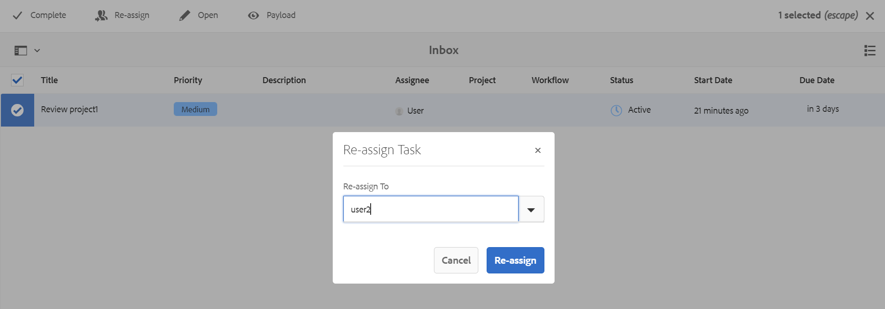

# Reatribuir tarefa de revisão usando notificação {#id21BNH03M0KS}

É possível reatribuir uma tarefa de revisão atribuída a você ou a outro usuário que tenha sido adicionado ao mesmo projeto de revisão. A reatribuição da tarefa de revisão pode ser facilmente feita a partir da notificação de revisão entregue em sua caixa de entrada. No entanto, como revisor, é possível reatribuir uma tarefa de revisão somente a usuários individuais e não a grupos de usuários usando a notificação.

Observe que a reatribuição só pode ser feita para tarefas de revisor e não tarefas de proprietário.

1. **Tarefa do revisor**: qualquer tarefa atribuída a um revisor para revisão.
1. **Tarefa do proprietário**: uma tarefa que é criada somente para o proprietário. Quando você cria e atribui uma tarefa de revisão a um revisor, o proprietário também recebe uma tarefa de proprietário com o nome Fechar &lt; nome da tarefa de revisão\> \(Por exemplo close-reviewtask1\) mas essa tarefa de proprietário não pode ser reatribuída a ninguém.

Execute as seguintes etapas para reatribuir uma tarefa de revisão a partir da notificação da Caixa de entrada:

1. Selecione a notificação da tarefa de revisão na Caixa de entrada.
1. Selecione o ícone **Reatribuir** na parte superior.
1. Selecione o nome de usuário para o qual você deseja reatribuir a tarefa.

   >[!IMPORTANT]
   >
   > O revisor deve ter as permissões para reatribuir e deve fazer parte do grupo de usuários administradores.

   {width="800" align="left"}

1. Selecione **Reatribuir**.

Quando a tarefa de revisão for reatribuída, a coluna Destinatário exibirá o nome do revisor para o qual a tarefa foi reatribuída.

O revisor atribuído recebe uma notificação na Caixa de entrada para a tarefa de revisão reatribuída.

**Tópico pai:**[ Tópicos ou mapas de revisão](review.md)
