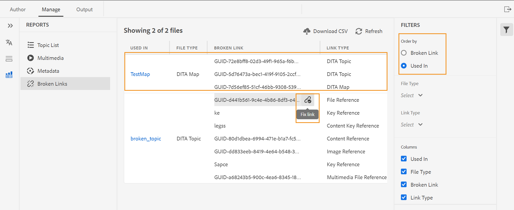

# Relatório de mapa DITA do Editor da Web {#id231HF0Z0NXA}

O AEM Guides vem com um recurso no Editor da Web que permite verificar a integridade geral de suas referências e gerar relatórios para elas.

Você pode exibir a lista de tópicos, gerenciar os metadados de todas as referências e exibir a lista multimídia do mapa atual na guia **Relatórios** do Editor da Web.

## Gerar um CSV na exibição da Lista de tópicos

A exibição **Lista de Tópicos** fornece informações detalhadas sobre seus tópicos, como tipo de referência, estado do documento e autor.

Você pode criar um relatório dos tópicos executando as seguintes etapas:

1. No painel **Repositório**, abra o arquivo de mapa DITA no Modo de Exibição de Mapa.
1. Clique na guia **Gerenciar**.
1. Clique duas vezes em **Lista de Tópicos** à esquerda. A lista de tópicos presentes no mapa DITA é exibida.

   {width="800" align="left"}

1. No painel **Filtros**, você pode filtrar seus tópicos com base no **Tipo de referência** \(direto ou indireto\), **Estado do Documento** \(o estado atual de seus tópicos. Por exemplo, se os tópicos estiverem no estado Editar, Em revisão ou Revisado, eles serão listados\) ou o **Autor** do tópico.

1. Você também pode usar as seguintes opções de filtragem de tópico para exibir as seguintes colunas na lista:

   - **Tópico** O título do tópico é especificado no mapa DITA. Você pode clicar no tópico para editá-lo.
   - **Nome do Arquivo** Nome do arquivo.
   - **UUID** O identificador exclusivo universalmente \(UUID\) do arquivo.
   - **Local do Arquivo** O caminho completo do tópico.
   - **Tipo de Referência** O tipo de referência - direta ou indireta.
   - **Estado do Documento** O estado atual do tópico.
   - **Autor** O usuário que trabalhou por último no tópico.
   - **Mapa Pai** A lista de todos os mapas nos quais o tópico é referenciado diretamente.

   >[!NOTE]
   >
   > Clique em **Atualizar** para obter uma nova lista de tópicos e exibir qualquer alteração no arquivo de mapa ou se qualquer referência no arquivo de tópico for atualizada.

1. Clique em **Baixar CSV** para baixar o instantâneo atual dos tópicos no mapa DITA. O CSV contém as colunas selecionadas e os tópicos filtrados na exibição **Lista de Tópicos**. Em seguida, você pode abrir esse arquivo CSV da lista de tópicos em qualquer editor CSV.

**Gerenciar metadados em massa a partir do relatório de Metadados**

O AEM Guides permite marcar o conteúdo DITA no editor da Web. Você pode aplicar tags a um tópico individual ou usar o recurso de marcação em massa para aplicar várias tags a vários tópicos, um mapa DITA ou um submapa. Você também pode alterar o estado do documento de todos os tópicos selecionados para o próximo estado de documento comum possível.

## Exibir metadados

Para exibir os metadados de suas referências no mapa DITA atual, execute as seguintes etapas:

1. No painel Repositório, abra o arquivo de mapa DITA na Exibição de mapa.
1. Clique na guia **Gerenciar**.
1. Clique duas vezes em **Metadata** à esquerda. A lista de metadados de todas as referências no mapa DITA é exibida. Isso também inclui as referências de mídia.

   {width="800" align="left"}

1. No painel **Filtros**, você pode filtrar seus tópicos com base no **Estado do Documento** \(o estado atual de seus tópicos. Por exemplo, se os tópicos estiverem no estado Editar, Em revisão ou Revisado, eles serão listados\), **Referências** \(direto ou indireto\), **Tipo de arquivo** \(Mapa, Tópico e Imagem\) da referência.
1. Você também pode optar por exibir somente os **Arquivos sem marcas** ou escolher marcas específicas no filtro **Marcas** para exibir os arquivos associados a eles.
   1. Você também pode usar as seguintes opções de filtragem de tópico para exibir as seguintes colunas na lista de metadados:
      - **Título** \(selecionado por padrão\) O título do arquivo referenciado é especificado no mapa DITA. Você pode clicar no arquivo para editá-lo.Você também pode clicar e reproduzir um arquivo de áudio ou vídeo no Editor da Web. Você pode alterar o volume ou a visualização do vídeo. No menu de atalho, você também tem as opções para baixar, alterar a velocidade de reprodução ou visualizar uma imagem na imagem.

        >[!NOTE]
        >
        > Um ícone de check-out também é exibido próximo ao título de um arquivo com check-out. Você pode passar o mouse sobre o ícone para visualizar o nome do usuário.

      - **Nome do Arquivo** O nome do arquivo.
      - **Local do Arquivo** O caminho completo do arquivo.
      - **Marcas** \(selecionada por padrão\) Marcas aplicadas ao arquivo.

        >[!NOTE]
        >
        > Por padrão, você pode exibir duas tags para um arquivo. Para exibir mais marcas, clique em **Mostrar Mais**. Clique em **Mostrar menos** para contrair a lista novamente.

      - **Tipo de Referência** O tipo de referência - direta ou indireta
      - **Estado do Documento** \(selecionado por padrão\) O estado atual do arquivo de referência.
      - **Tipo de Arquivo** \(selecionado por padrão\) Tipo do arquivo de origem. As opções disponíveis são Mapa, Tópico e Imagem.
      - **Retirado por** O usuário que fez check-out do arquivo.
1. Clique em **Baixar CSV** para baixar o instantâneo atual das referências no mapa DITA. O CSV contém as colunas selecionadas e as referências filtradas na exibição da Lista de tópicos. Em seguida, você pode abrir esse arquivo CSV de metadados em qualquer editor CSV.

**Atualizar metadados**

1. Para atualizar metadados, selecione os arquivos que deseja atualizar.

   >[!NOTE]
   >
   > Não é possível selecionar arquivos com check-out. Um ícone de check-out também é exibido próximo ao título de um arquivo com check-out. Você pode passar o mouse sobre o ícone para visualizar o nome do usuário.

1. Selecione **Gerenciar** de cima.

   {width="350" align="left"}

1. Se quiser adicionar novas tags, selecione novas tags na lista suspensa para aplicá-las a todos os tópicos selecionados. Também é possível excluir qualquer tag ao clicar no ícone de cruz próximo à tag.

   >[!NOTE]
   >
   > As tags comuns aplicadas em todos os tópicos selecionados são listadas.

1. Selecione um novo estado do documento se desejar alterar o estado do documento de todas as referências selecionadas. A lista suspensa exibe o estado comum possível de todos os tópicos selecionados. Por exemplo, se o estado atual dos tópicos for Em revisão, você poderá exibir o estado Rascunho, Aprovado ou Revisado.
1. Clique em **Atualizar** para atualizar os metadados. Uma mensagem de confirmação é exibida para os metadados, independentemente de ela ser atualizada com sucesso ou ter atualizações com falha. Você também pode clicar em **Baixar relatório** para baixar o CSV de metadados na caixa de diálogo de confirmação. Este CSV contém os detalhes do status de atualização das referências selecionadas.

## Gerar um relatório multimídia

O relatório **Multimídia** fornece informações detalhadas sobre a multimídia usada no mapa, como título, tipo \(áudio, vídeo e imagens\), arquivos nos quais a multimídia é usada e o tipo de referência dos arquivos nos quais eles foram usados. Você também pode visualizar a UUID e o local da multimídia no repositório. Você pode criar um relatório multimídia executando as seguintes etapas:

1. No painel **Repositório**, abra o arquivo de mapa DITA no Modo de Exibição de Mapa.
1. Clique na guia **Gerenciar**.
1. Clique duas vezes em **Multimídia** à esquerda. A lista de multimídia presente no mapa DITA é exibida.
1. No painel **Filtros**, você pode ordenar a lista por multimídia ou pelos nomes de usados nas referências.

   - Ao fazer o pedido por **Multimídia**, o&#x200B;**&#x200B;**&#x200B;nome da multimídia é exibido na primeira coluna e, em seguida, os nomes de todas as referências nas quais foram usados são exibidos em outra coluna na mesma linha. Por exemplo, a captura de tela a seguir mostra a multimídia WarmCoolForC.gif na primeira coluna e três referências nas quais ela é usada são exibidas na terceira coluna na mesma linha.

     {width="650" align="left"}

   - Se ordenar por coluna **Usado em**, você verá a exibição transposta na qual os nomes das referências nas quais o multimídia foi usado são listados na primeira coluna, enquanto os nomes de multimídia são listados em outra coluna em linhas separadas. Por exemplo, a captura de tela a seguir mostra os nomes de três referências \(Ajustar a temperatura da cadeira, Alterar a exibição da temperatura da cadeira e Área da tripulação\) na primeira coluna e a multimídia WarmCoolForC.gif é exibida na terceira coluna em três linhas separadas.

     {width="650" align="left"}

1. Você pode filtrar sua multimídia com base no **Tipo de multimídia** e no **Tipo de Referência**. A lista de arquivos multimídia é exibida com base na sua seleção na lista suspensa. Por exemplo, você pode optar por exibir somente as referências de áudio no mapa DITA, e um arquivo mostra somente as referências de áudio usadas nele.

   >[!NOTE]
   >
   > Dependendo do tipo de multimídia usado no seu mapa, Imagem, Vídeo e Áudio estão listados na lista suspensa **Tipo de Multimídia**, e Direto ou Indireto estão listados na lista suspensa **Tipo de Referência**.

1. Você também pode usar as seguintes opções de filtro para optar por exibir as seguintes colunas na lista:

   - **Multimídia** \(selecionado por padrão\) O título da multimídia é especificado no mapa DITA. Você pode clicar na multimídia para editá-la.
   - **Local da multimídia** O caminho completo da multimídia.
   - **UUID de multimídia** O identificador exclusivo universalmente \(UUID\) do arquivo.
   - **Tipo de multimídia** \(selecionado por padrão\) Tipo de multimídia. As opções disponíveis são Áudio, Vídeo ou Imagem.
   - **Usado em** \(selecionado por padrão\) As referências nas quais a multimídia foi usada. Você pode clicar na referência para editá-la.
   - **Tipo de Referência** \(selecionado por padrão\) O tipo de referência - direta ou indireta.

   >[!NOTE]
   >
   > Clique em **Atualizar** para obter uma nova lista de multimídia e exibir qualquer alteração no arquivo de mapa ou se qualquer multimídia no mapa DITA for atualizada.

1. Você também pode clicar e reproduzir um arquivo de áudio ou vídeo no Editor da Web. Você pode alterar o volume ou a visualização do vídeo. No menu de atalho, você também tem as opções para baixar, alterar a velocidade de reprodução ou visualizar uma imagem na imagem.

   {width="800" align="left"}

1. Clique em **Baixar CSV** para baixar o instantâneo atual da multimídia no mapa DITA. O CSV contém as colunas selecionadas e a multimídia filtrada na exibição **Multimídia**. Em seguida, você pode abrir esse arquivo CSV multimídia em qualquer editor CSV.

## Exibir e corrigir os links com falha{#report-broken-links}

Os **Links Desfeitos** são um relatório útil que fornece os detalhes dos links desfeitos presentes no mapa atual. Você pode visualizar os links quebrados, que podem ser para tópicos DITA, referências de arquivos multimídia, referências de chave de conteúdo e assim por diante. Você também tem a capacidade de consertá-los aqui.
O relatório fornece informações detalhadas, como o link quebrado, o tipo de link, os arquivos nos quais a referência é usada e os tipos de arquivos nos quais eles foram usados.
Você pode exibir o relatório de links desfeitos executando as seguintes etapas:
1. No painel **Repositório**, abra o arquivo de mapa DITA no Modo de Exibição de Mapa.
1. Clique na guia **Gerenciar**.
1. Clique duas vezes em **Links desfeitos** à esquerda. A lista de links ou referências corrompidos presentes no mapa DITA é exibida.
1. No painel **Filtros**, é possível ordenar a lista por links ou pelos nomes de usados nas referências.

   - Quando você ordena por **Link quebrado**, os caminhos dos links quebrados são exibidos na primeira coluna e, em seguida, os nomes de todas as referências nas quais eles foram usados são exibidos em outra coluna em linhas separadas. Se o mesmo link quebrado for usado em vários arquivos, eles serão exibidos em uma linha e serão mostrados como agrupados ou sublinhas. Por exemplo, a captura de tela a seguir mostra três links desfeitos na primeira coluna e a referência na qual eles são usados, `TestMap.ditamap`, é exibida na terceira coluna em três linhas separadas.

   {width="800" align="left"}

   - Se ordenar por **Usado em** coluna, você exibirá a exibição transposta na qual os nomes das referências nas quais os links desfeitos foram usados são listados na primeira coluna, enquanto os links desfeitos são listados em outra coluna na mesma linha. Por exemplo, a captura de tela a seguir mostra a referência (em que o link quebrado é usado) `TestMap.ditamap` na primeira coluna e os links quebrados são exibidos na terceira coluna na mesma linha.

   {width="800" align="left"}
1. Você pode filtrar os links com falha com base no **Tipo de Arquivo** e no **Tipo de Link**. A lista de links com falha é exibida com base na sua seleção na lista suspensa. Por exemplo, você pode optar por exibir somente as referências de conteúdo no mapa DITA, e um arquivo mostra somente as referências de conteúdo usadas nele.

   Dependendo do tipo de referências usado no seu mapa, a referência de Arquivo, a referência de Chave, a referência de Conteúdo, a referência de Chave de Conteúdo, a referência de Imagem e a referência de Arquivo Multimídia estão listadas na lista suspensa **Tipo de Link** e no **Tópico DITA** ou **Mapa DITA** estão listadas na lista suspensa **Tipo de Arquivo**.
1. Você também pode usar as seguintes opções de filtro para optar por exibir as seguintes colunas na lista:

   - **Link quebrado** (selecionado por padrão) O caminho do link quebrado é especificado no mapa DITA.

   - **Tipo de Link** (selecionado por padrão) O tipo dos links. As opções disponíveis são Referência de chave de conteúdo, Referência de conteúdo, Tópico DITA, Referência de arquivo, Referência de imagem, Referência de chave e Referência de arquivo multimídia.

   - **Usado em** (selecionado por padrão) As referências nas quais o link corrompido foi usado. Você pode clicar na referência para exibi-la no modo de autor.

   - **Tipo de Arquivo** (selecionado por padrão) O tipo de referência - Mapa DITA ou Tópico DITA.
Clique em **Atualizar** para obter uma nova lista de links com falha e exibir qualquer alteração no arquivo de mapa ou se algum link com falha no mapa DITA for atualizado.
1. Você pode clicar no ícone **Corrigir link** () para corrigir o link corrompido.

   >[!NOTE]
   >
   > Passe o mouse sobre o caminho do link quebrado na coluna Link quebrado para exibir o ícone Corrigir link ().

   Você pode corrigir um link em ambos os modos de exibição - quando solicitado por **Links Desfeitos** ou por **Usados em**.

   >[!NOTE]
   >
   > Ao corrigir um link quebrado enquanto ordenava por Links quebrados, o link será corrigido em todos os arquivos onde é usado (que são agrupados em uma única linha).

1. Você precisa atualizar os detalhes de referência necessários na caixa de diálogo **Atualizar Link**. Os detalhes necessários na caixa de diálogo **Atualizar Link** dependeriam do tipo de referência.\
   Depois de corrigir um link, ele não é exibido abaixo da lista de links quebrados. Em vez disso, você pode visualizá-lo na Lista de tópicos ou nos Metadados.

1. Clique em **Baixar CSV** para baixar o instantâneo atual dos links corrompidos no mapa DITA. O CSV contém as colunas selecionadas e os links quebrados filtrados na exibição Links quebrados. Em seguida, você pode abrir e visualizar esse arquivo CSV em qualquer editor CSV.

**Tópico pai:**&#x200B;[&#x200B; Relatórios](reports-intro.md)
