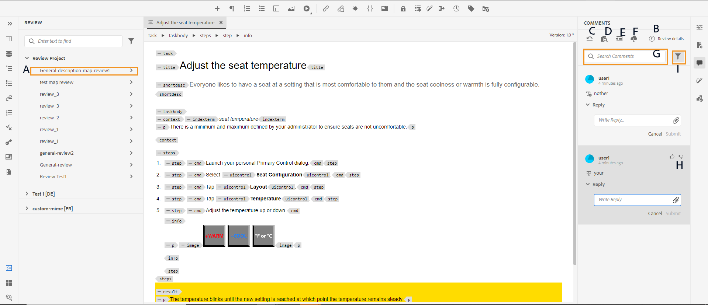
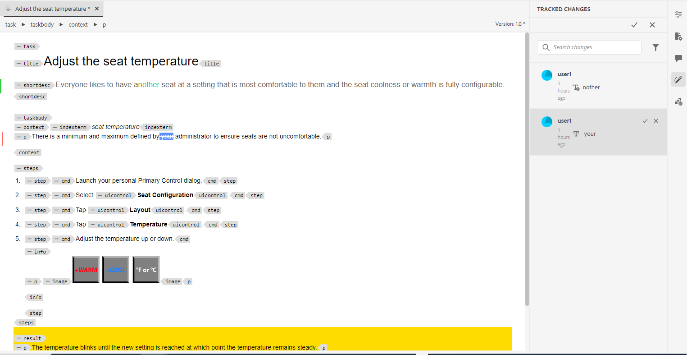

# Comentários de revisão de endereço {#id2056B0X0KBI}

Como autor, você pode endereçar comentários em um tópico usando o Editor da Web. Os comentários são carregados com base na tarefa de revisão selecionada no painel Revisão. Para obter mais detalhes, exiba a descrição do recurso **Painel de revisão**  na seção [Painel esquerdo](../user-guide/web-editor-features.md#id2051EA0M0HS).

As seções a seguir descrevem maneiras de editar comentários no Editor da Web.

Um autor pode endereçar comentários em um documento do Editor da Web. Indicadores visuais são fornecidos indicando se os comentários foram inseridos \(texto\), excluídos ou realçados. Além disso, o tipo de comentário é mencionado na parte superior de cada entrada de comentário.

>[!NOTE]
>
> Ao abordar os comentários de revisão \(para um documento de revisão ativo\), certifique-se de que você—não abra o tópico em revisão em várias guias com a exibição de tags completas ativada, não alterne entre os modos de exibição Autor e Source.

{width="800" align="left"}

No modo Editor da Web, o painel direito contém os ícones Revisar e Alterações controladas. O painel Revisão mostra todos os comentários feitos em seu documento pelos revisores. O painel **Alterações controladas** mostra o status de todos os comentários inseridos e excluídos no documento.

- **A**: selecione uma tarefa de revisão para ver comentários de revisão. Se o seu tópico tiver sido compartilhado para revisão em várias tarefas de revisão, você verá essas tarefas listadas nesse menu suspenso.

  Ao selecionar uma tarefa de revisão na lista, você pode ver os comentários feitos pelos revisores nessa tarefa. É possível endereçar os comentários de revisão independentemente nas tarefas, o que significa que qualquer atualização em um comentário fica visível somente para os revisores dessa respectiva tarefa.

- **B:** Selecione **Detalhes da revisão**  no painel **Comentários** para exibir mais informações sobre a tarefa de revisão:

   - **Nome**: nome da tarefa de revisão.
   - **Versão de Revisão**: exibe a versão associada à tarefa de revisão selecionada. Isso ajuda a rastrear a versão que você compartilhou para revisão
   - **Status**: status atual da tarefa de revisão.

  >[!NOTE]
  >
  > Se o mapa raiz da sua tarefa de revisão for diferente do mapa raiz de criação, ele exibirá as informações sobre ele para indicar que a criação e o mapa raiz de revisão não correspondem.

- **C**: se você atualizou seu tópico depois de iniciar a revisão, clicar no ícone Reverter Tópico para Versão de Revisão reverte sua cópia de trabalho para a versão que foi compartilhada para revisão. Isso facilita a incorporação do feedback de revisão diretamente na versão que foi compartilhada para revisão. Depois de incorporar o feedback, você pode salvar as alterações na versão revertida ou criar uma nova revisão do seu tópico. Se você optar por criar uma nova revisão do tópico, uma nova ramificação será criada a partir da versão do tópico que foi compartilhada para revisão. Por exemplo, se você compartilhou a versão `1.2` de um tópico para revisão enquanto a versão de criação atual é `1.3`, é possível usar esse ícone para voltar para a versão `1.2` para incorporar comentários de revisão. Se você optar por criar uma nova revisão após incorporar as alterações na versão `1.2`, uma nova ramificação com a versão `1.2.0` será criada para o tópico.

  Normalmente, depois de incorporar o feedback da revisão, você gostaria de mesclar as alterações da versão mais recente do tópico. Para fazer isso, use o recurso [Mesclar](web-editor-features.md#id205DF04E0HS) para obter todas as atualizações feitas após o tópico ter sido compartilhado para revisão.

- **D**: Abrir o modo de exibição lado a lado para exibir a versão comentada do tópico. Como visto na captura de tela acima, a seção mais à esquerda é a versão mais recente do tópico, na qual você pode fazer alterações. A próxima seção é a versão comentada do tópico. À medida que você navega entre comentários no tópico, a exibição lateral muda e exibe a versão do tópico em que o comentário foi feito. Cada comentário no painel de comentários é vinculado ao texto correspondente nesta seção. Isso ajuda a identificar o texto comentado. Os comentários são exibidos na ordem do texto comentado no documento.

  Você pode ver o número da versão na parte superior da vista lateral. Clicar nesse ícone novamente oculta a versão comentada do tópico.

- E: Importe os comentários \(ou Tachado\) inseridos e excluídos diretamente no tópico. Depois de clicar no ícone Importar, todas as inserções e exclusões de texto são mostradas na cópia de trabalho do tópico. Agora, há duas maneiras de aceitar ou rejeitar comentários.

  Se quiser incorporar a alteração sugerida \(inserção ou exclusão\) uma de cada vez, basta clicar com o botão direito do mouse no comentário no conteúdo e selecionar Aceitar alteração ou Rejeitar alteração. Dependendo da sua seleção, o comentário será aceito ou rejeitado. No caso de comentário aceito, o conteúdo é adicionado ao conteúdo; e no caso de rejeição, ele é removido do conteúdo. Além disso, o status do comentário é alterado no painel Revisão.

  {width="800" align="left"}

  Você também pode usar o recurso de revisão no painel direito para aceitar ou rejeitar comentários. Clicar em qualquer comentário realça o comentário no documento.

  {width="800" align="left"}

  >[!IMPORTANT]
  >
  > O recurso importar comentários funciona somente nos documentos que não foram alterados desde que foram compartilhados para revisão. Se você tiver feito alguma alteração após enviar o documento para revisão, receberá um alerta para **Forçar Importação** comentários no documento. No entanto, isso resultará na perda de todas as atualizações feitas em seu documento. O alerta **Forçar Importação** também será mostrado se o documento for criado fora e depois compartilhado para revisão. Você pode importar os comentários.

  Quando você aceita ou rejeita um comentário, ele é removido da lista de Alterações controladas. Isso também serve como um indicador de quantos comentários precisam ser abordados no documento.

- **F**: no menu Mais Opções, baixe todos os anexos disponíveis no tópico de revisão.
- **G**: pesquisar um texto dentro de comentários.
- **H**: Aceitar ou rejeitar um comentário.

- **I**: aplicar um filtro aos comentários. Você pode filtrar para ver comentários com base no Tipo de revisão \(todos, realçado, excluído, inserido ou nota adesiva\), Status da revisão \(todos, aceitos, rejeitados ou nenhum\), Revisores \(todos ou revisores específicos\(s\)\) ou Versões do tópico.

**Tópico pai:**&#x200B;[&#x200B; Tópicos ou mapas de revisão](review.md)
