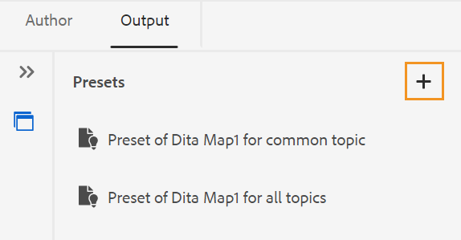

# Criar predefinições de saída no Editor da Web {#id218CL400JW3}

Execute as seguintes etapas para criar predefinições de saída para o mapa DITA:

1. Na interface do usuário do Assets, navegue até o arquivo de mapa que deseja editar.

1. Para obter um bloqueio exclusivo no arquivo de mapa, selecione o arquivo de mapa e clique em **Check-out**.

1. Selecione a opção **Editar Tópicos** no menu de ações no arquivo de mapa.

   O arquivo de mapa é aberto para edição no Editor da Web.

   >[!NOTE]
   >
   > É possível adicionar ou excluir qualquer tópico do mapa usando o Editor de mapa avançado. Para obter mais detalhes, consulte [Trabalhar com o Editor de Mapa Avançado](map-editor-advanced-map-editor.md#).

1. Na guia **Saída**, selecione o ícone + para criar uma predefinição de saída para o mapa DITA.

   {width="350" align="left"}

1. Insira o nome da predefinição na caixa de diálogo Adicionar predefinição e clique em **Adicionar**.

1. Insira os detalhes de configuração a seguir.

   1. Selecione as opções necessárias na guia **Geral**. É possível optar por criar uma predefinição de saída com ou sem condições. Você também pode usar um arquivo DITVAL. O AEM Guides também permite selecionar uma linha de base para publicar uma versão específica do mapa DITA.
   1. Insira os detalhes do site do AEM na guia **AEM**. O **Site** exibe a lista do AEM Sites disponível no repositório do AEM. **Categoria**, **Modelo de Seção** e **Modelo de Artigo** são os componentes estruturais usados para organizar a aparência da sua saída. Eles são predefinidos no modelo de site do AEM.

      >[!NOTE]
      >
      > Atualize cada lista suspensa para obter mais classificações na próxima lista suspensa.

   1. Na guia **Artigos**, selecione os tópicos para os quais deseja gerar a saída.
1. Selecione o ícone **Gerar predefinição** na parte superior para gerar a saída.

   {width="800" align="left"}

1. Você verá o status do processo de geração de saída. A coluna **Tópicos** lista os tópicos para os quais a saída está sendo gerada, enquanto a coluna **Status** exibe o status de publicação de cada tópico.

   Para exibir a saída, passe o mouse sobre o tópico e clique em Exibir saída.

   {width="800" align="left"}

>[!NOTE]
>
> Também é possível Editar, Renomear, Duplicar ou Excluir uma predefinição de saída existente no menu Opções.

{width="550" align="left"}

**Tópico pai:**[ Publicação baseada em artigo do Editor da Web](web-editor-article-publishing.md)
