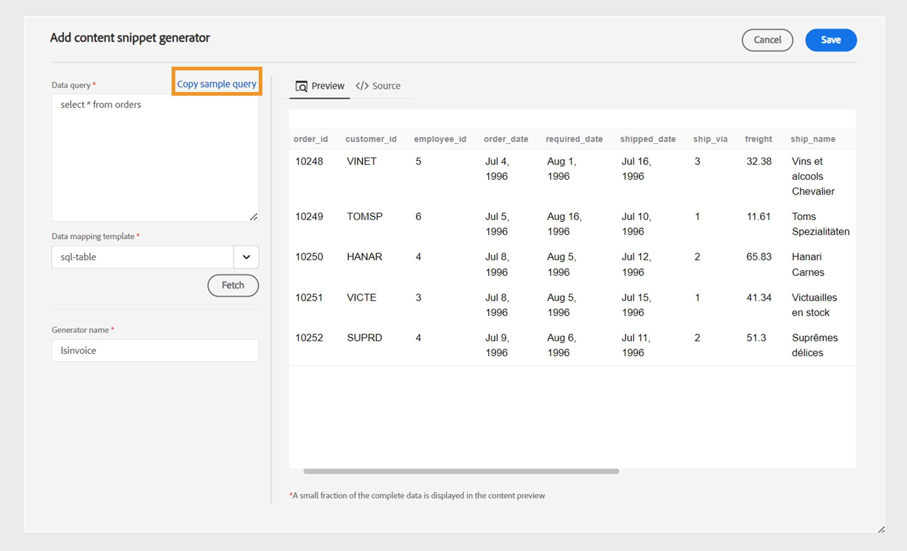

# Usar dados da sua fonte de dados

Uma **fonte de dados** é um sistema no qual você armazena e gerencia os dados da sua organização. Esses são seus sistemas de registro como JIRA, bancos de dados SQL, PIM ou PLM. O AEM Guides fornece o recurso para se conectar com sua fonte de dados e usar os dados deles.

Você também pode se conectar a arquivos de dados JSON usando um conector de arquivos. Faça upload do arquivo JSON do seu computador ou navegue pelos ativos do Adobe Experience Manager. Em seguida, crie trechos de conteúdo ou tópicos usando os geradores.

## Painel Fontes de dados

Selecione **Fontes de Dados**  no painel esquerdo para exibir as fontes de dados conectadas. O painel Fontes de dados é aberto e exibe todas as fontes de dados conectadas.

Com base na sua configuração, o administrador pode configurar um conector de fonte de dados:

 Cloud Services 

- Se estiver usando a versão de outubro de 2023 ou posterior, saiba como [configurar um conector de fonte de dados a partir da interface do usuário](/help/product-guide/cs-install-guide/conf-data-source-connector-tools.md) no Guia de Instalação e Configuração do Cloud Service.

- Se estiver usando a versão de julho de 2023 ou setembro de 2023, saiba como [configurar um conector de fonte de dados](/help/product-guide/cs-install-guide/conf-data-source-connector.md) no Guia de instalação e configuração do Cloud Service.

    

  Software local 

- Se estiver usando a versão 4.3.1 ou posterior, saiba como [configurar um conector de fonte de dados a partir da interface do usuário](/help/product-guide/cs-install-guide/conf-data-source-connector-tools.md) no Guia de Instalação e Configuração no Local.

- Se estiver usando a versão 4.3, saiba como [configurar um conector de fonte de dados](/help/product-guide/cs-install-guide/conf-data-source-connector.md) no Guia de Instalação e Configuração Local.

>[!NOTE]
>
> Você verá as fontes de dados para as quais o administrador configurou o conector.

## Mostrar Exibição de Lista ou Exibição de Bloco

Você pode alternar entre a Exibição de lista ou Exibição em bloco para exibir as várias fontes de dados no formato de uma lista ou como blocos.

Selecione uma fonte de dados para exibir os geradores de trechos de conteúdo e os geradores de tópicos disponíveis para a fonte de dados selecionada.

### Exibição de Lista 

{width="300" align="left"}

*Lista de fontes de dados conectadas.*

### Exibição lado a lado   

{width="300" align="left"}

*Exibir as fontes de dados conectadas como blocos.*

Você pode usar os dados das fontes de dados de duas maneiras:
- Inserir um trecho de conteúdo
- Criar um tópico

## Inserir um trecho de conteúdo da sua fonte de dados

O AEM Guides fornece o recurso para conexão com sua fonte de dados. Você pode buscar seus dados, inseri-los em seus tópicos e editá-los. Você pode criar facilmente um trecho de conteúdo usando o gerador de trecho de conteúdo e reutilizá-lo em seus tópicos.

Execute as seguintes etapas para criar um trecho de conteúdo usando o gerador de trecho de conteúdo e insira-o em seu tópico:

1. Selecionar **Fontes de Dados**    no painel esquerdo para exibir as fontes de dados conectadas.

1. Selecione uma fonte de dados para exibir os geradores de trecho de conteúdo disponíveis para a fonte de dados selecionada.

   {width="300" align="left"}

   *O painel Fontes de Dados lista os geradores de trecho de conteúdo disponíveis.*

1. Selecione **Adicionar** para adicionar um novo gerador de trecho de conteúdo. O painel **Adicionar gerador de trecho de conteúdo** é aberto.

1. Insira a consulta na caixa de texto **Consulta de dados**.  Selecione **Copiar exemplo de consulta** para copiar rapidamente uma consulta de dados. Em vez de criar manualmente a consulta, você pode copiar e colar a consulta de exemplo na caixa de texto **Consulta de dados**. Em seguida, basta editar a query de acordo com seus requisitos de dados.

   >[!NOTE]
   >
   >O Experience Manager fornece exemplos diferentes de consulta para todos os recursos nas várias fontes de dados. Eles são mapeados para a fonte de dados da qual você está buscando os dados.

1. Se você usar um conector de arquivo, poderá fazer upload do arquivo JSON do seu computador ou procurar um arquivo JSON nos ativos da Adobe Experience Manager.

   >[!NOTE]
   >
   > Você visualizará as opções para fazer upload ou procurar arquivos no lugar de uma consulta de dados se usar um conector de arquivos.

1. Selecione o modelo que mapeia com sua fonte de dados na lista suspensa **Modelo de mapeamento de dados**.
Os modelos prontos para uso da fonte de dados selecionada são exibidos na lista suspensa. Por exemplo, você pode exibir o modelo &quot;sql-table&quot; para a origem de dados denominada &quot;PostgreSQL&quot;.

   >[!NOTE]
   >  
   > Se o administrador tiver configurado modelos personalizados, esses modelos também serão exibidos na lista suspensa (com base nas configurações de caminho do modelo feitas pelo administrador).
   >   
   >Também é possível usar as ferramentas do Velocity nos modelos. Saiba mais sobre como [usar as ferramentas do Velocity](#use-velocity-tools).

1. A lista suspensa **Recurso** é exibida para alguns conectores, como REST Client, Salsify, Akeneo e Microsoft ADO.  Selecione qualquer recurso na lista suspensa e conecte-se a ele para criar um trecho de conteúdo ou um tópico usando o gerador para ele.

   >[!NOTE]
   >
   > O administrador pode configurar recursos padrão ou adicionar recursos para vários URLs ao configurar os conectores de origem de dados.

1. Clique em **Buscar** para buscar os dados da fonte de dados e aplicar o modelo aos dados resultantes da consulta SQL.

1. É possível exibir os dados na visualização ou na exibição da fonte DITA.

   1. A visualização mostra como os dados serão exibidos quando inseridos no conteúdo. A visualização exibe uma pequena fração dos dados no formato do modelo selecionado.
Por exemplo:
      - Se você selecionou o template sql-table, é possível exibir os dados SQL em formato tabular.
      - Se você selecionou o modelo jira-ordered-list, é possível visualizar uma lista ordenada para os problemas do Jira.

   1. A exibição fonte mostra os dados na exibição fonte DITA.
      {width="800" align="left"}
      *Adicione um gerador de trecho de conteúdo. Exibir os dados no modo de origem ou de visualização.*

1. Para salvar os resultados da consulta, digite o nome do gerador e clique em **ADICIONAR**.   Um novo gerador de trecho de conteúdo é adicionado à lista.

   >[!NOTE]
   >
   > Você precisa seguir a convenção de nomenclatura de arquivo para o nome do novo gerador de conteúdo. Você não pode ter um espaço no nome do gerador de trecho de conteúdo. Além disso, não é possível salvar um novo gerador de conteúdo com o nome de um gerador de conteúdo existente. Ocorre um erro.

### Opções para um gerador de snippet de conteúdo

Clique com o botão direito do mouse em um gerador de trecho de conteúdo para abrir as Opções. Usando as opções, você pode executar as seguintes operações:

- **Visualização**: use esta opção para abrir um painel e exibir uma pequena fração de como os dados são exibidos na saída.
- **Inserir**: use esta opção para inserir o trecho de conteúdo selecionado no tópico aberto para edição no Editor da Web. À medida que os dados são inseridos como um trecho, você também pode editar os dados dentro do tópico no Editor da Web.

  >[!NOTE]
  > 
  > A opção Inserir é exibida somente enquanto você está editando um tópico.

- **Editar**: use essa opção para fazer alterações no gerador de trechos de conteúdo e salvá-lo.
- **Excluir**: use esta opção para excluir o gerador de trecho de conteúdo selecionado.
- **Duplicar**: use esta opção para criar uma duplicata ou uma cópia do gerador de trechos de conteúdo selecionado. A duplicata é criada com um sufixo (como generator_1) por padrão.

### Inserir um trecho de consulta

Você também pode usar o **Inserir trecho da consulta**    na barra de ferramentas principal para inserir o trecho de dados nos tópicos.  Você pode selecionar um gerador na lista suspensa, editar sua query ou alterar o modelo e inserir os dados em seu tópico.

{width="800" align="left"}

*Editar e inserir um trecho de dados.*

## Criar um tópico usando o gerador de tópicos

Um gerador de tópicos ajuda a criar tópicos contendo dados de suas fontes. Você pode criar rapidamente um gerador de tópico e, em seguida, gerar os tópicos usando o gerador. Cada tópico pode conter dados em vários formatos, como tabelas, listas e parágrafos.   Por exemplo, em um tópico, você pode adicionar uma tabela que inclui os detalhes de todos os novos produtos e uma lista de todos os produtos que serão descontinuados para venda.

O gerador de tópicos pode criar os tópicos que contêm os dados e um mapa DITA para todos os tópicos. Você também pode `<conref>` esses tópicos no seu conteúdo. Isso ajuda a manter os dados sincronizados com a fonte de dados e permite atualizá-los facilmente.

### Criar um tópico

Execute as seguintes etapas para criar um tópico usando o gerador de tópicos:

1. Selecione uma fonte de dados para exibir os geradores de trechos de conteúdo e os geradores de tópicos disponíveis para a fonte de dados selecionada.

   {width="300" align="left"}

   *Adicionar um gerador de tópico para uma fonte de dados conectada.*

1. Selecione **Adicionar**  e selecione **Gerador de tópico** na lista suspensa para adicionar um novo gerador de tópico. O painel **Adicionar gerador de tópico** é aberto.

1. Insira os valores nos campos sob as três guias a seguir do painel **Adicionar gerador de tópico**:

   **Buscar configuração**

   {width="300" align="left"}

   *Adicione a Consulta de Dados, o modelo de mapeamento de dados e os detalhes do nó Raiz para o gerador de tópico e dê a ele um nome exclusivo no painel Buscar Configuração.*

   1. Insira a consulta na caixa de texto **Consulta de dados**. Selecione **Copiar exemplo de consulta** para copiar rapidamente uma consulta de dados. Em vez de criar manualmente a consulta, você pode copiar e colar a consulta de exemplo na caixa de texto **Consulta de dados**. Em seguida, basta editar a query de acordo com seus requisitos de dados.

      >[!NOTE]
      >
      >O Experience Manager fornece exemplos diferentes de consulta para todos os recursos nas várias fontes de dados. Eles são mapeados para a fonte de dados da qual você está buscando os dados.

   1. Se você usar um conector de arquivo, poderá fazer upload do arquivo JSON do seu computador ou procurar um arquivo JSON nos ativos da Adobe Experience Manager.

      >[!NOTE]
      >
      > Você visualizará as opções para fazer upload ou procurar arquivos no lugar de uma consulta de dados se usar um conector de arquivos.

   1. Selecione o modelo que mapeia com sua fonte de dados na lista suspensa **Modelo de mapeamento de dados**.

      >[!NOTE]
      >
      > Se o administrador tiver configurado modelos personalizados, esses modelos também serão exibidos na lista suspensa (com base nas configurações de caminho do modelo feitas pelo administrador). Por exemplo, você pode criar um modelo de tópico contendo uma lista ordenada, tabelas, parágrafos ou outros elementos DITA.

   1. Insira o **Nó raiz**. Esse é o nó no qual você deseja acessar seus dados. O gerador de tópicos cria cada tópico no nível definido no nó raiz. Por exemplo, você pode adicionar &quot;problemas&quot; como o nó raiz no Jira. Portanto, se um query retornar 13 problemas, você terá 13 tópicos, um tópico para cada problema.

   1. Clique em **Buscar** para buscar os dados da fonte de dados e aplicar o modelo aos dados resultantes da consulta SQL. A visualização mostra uma pequena fração de como o tópico aparece no formato do modelo selecionado. Por exemplo, você pode visualizar um único problema do Jira com todos os campos resultantes da query.
   1. Informe o nome do gerador de tópico.

      >[!NOTE]
      > 
      > Você precisa seguir a convenção de nomenclatura de arquivo para o nome do novo gerador de tópico. Você não pode ter um espaço no nome do gerador de tópico. Além disso, não é possível salvar um novo gerador de tópicos com o nome de um gerador de tópicos existente. Ocorre um erro.

   **Configuração de saída**

   {width="300" align="left"}

   *Insira os detalhes do Caminho de saída e da Convenção de nomenclatura do tópico no painel Configuração de saída. Gere um mapa DITA e nomeie-o.*

   1. Insira os detalhes do **Caminho de saída** no qual você deseja salvar seus tópicos.
   1. Na **convenção de nomenclatura de tópico**, você pode inserir um valor ou uma variável com marcas de velocidade. Os novos tópicos seguirão a convenção. Por exemplo, você pode inserir o `$key` para criar tópicos com base em chaves Jira.
   1. Habilite a opção **Gerar um mapa** se quiser criar um mapa que contenha todos os tópicos gerados.
   1. Insira o nome do novo mapa DITA.

   >[!NOTE]
   >
   > O gerador de Tópico gera o mapa DITA no mesmo caminho de saída dos tópicos.

   **Metadados**

   Selecione as propriedades de metadados no menu suspenso para transmitir aos tópicos. A lista suspensa **Nome** lista as propriedades personalizadas e padrão.

   Por exemplo, na captura de tela a seguir, `dc:description`, `dc:language`, `dc:title` e `docstate` são as propriedades padrão para as quais você pode definir os valores. Você pode criar uma propriedade personalizada como autor e definir seu valor.

   {width="300" align="left"}

   *Adicione as propriedades dos metadados no painel Metadados para passar para os tópicos.*

1. Insira o nome do gerador e clique em **Salvar** para salvar os resultados da consulta. Um novo gerador de tópico é adicionado à lista.

1. Clique em **Salvar e Gerar** para salvar o gerador de tópicos e gerar novos tópicos a partir dele.

   {width="650" align="left"}

   *Gerar novos tópicos a partir de um gerador de tópicos existente.*

   >[!NOTE]
   >
   > Se os tópicos já existirem, o gerador atualizará os dados nos tópicos existentes.

### Opções para um gerador de tópico

Clique com o botão direito do mouse em um gerador de tópicos para abrir as **Opções**. Usando as opções, você pode executar as seguintes operações:

- **Gerar**: essa opção gera os tópicos para o gerador de tópicos selecionado. Também é possível usar essa opção para atualizar os tópicos existentes. Ele se conecta à fonte de dados e busca os dados atualizados. Ao gerar o conteúdo, essa opção é desativada e você visualiza um carregador.
  >[!NOTE]
  >
  >Se o tópico já existir, você poderá substituir os dados nele contidos ou salvá-lo como uma nova versão.

  

  *Gere um tópico e, se o arquivo já existir, salve-o como uma nova versão ou substitua-o.*
- **Exibir Log**: selecione esta opção para exibir o arquivo de log de geração de conteúdo. O arquivo de log é aberto em uma nova guia. Você pode exibir os erros, avisos, mensagens de informações e exceções no arquivo de log. Essa opção estará ativada se você tiver gerado o conteúdo para o gerador de tópicos selecionado.

- **Visualização**: use esta opção para abrir um painel e exibir uma pequena fração de como os dados são exibidos na saída.

- **Editar**: use essa opção para alterar e salvar o gerador de tópicos. Essa opção é desativada enquanto você está gerando o conteúdo.
- **Excluir**: use esta opção para excluir o gerador de tópicos selecionado. Essa opção é desativada enquanto você está gerando o conteúdo.
- **Duplicar**: esta opção cria uma duplicata ou cópia do gerador de tópicos selecionado. A duplicata é criada com um sufixo (como `topic-sample_1`) por padrão.

## Usar ferramentas do Velocity nos modelos de fonte de dados {#use-velocity-tools}

Os modelos de Experience Manager também são compatíveis com as ferramentas do Velocity (versão 2.0). Essas ferramentas ajudam a aplicar várias funções aos dados obtidos nas fontes de dados. Saiba mais sobre o uso das [ferramentas do Velocity](https://velocity.apache.org/tools/2.0/generic.html) e as funções que você pode aplicar.

Execute as seguintes etapas para usar uma ferramenta Velocity em um modelo:
1. Editar um modelo do Velocity no Editor da Web.
1. Adicione uma ferramenta e sua função no formato `<tool.function>`. Por exemplo:
   - Para gerar um número aleatório usando a ferramenta matemática, use `$mathTool.random`.
   - Para gerar a soma de números usando a ferramenta matemática, use `$mathTool.add(num1, num2)`.
1. Use o modelo para criar um trecho de conteúdo ou tópico.
1. Após aplicar o modelo aos dados, é possível exibi-los na visualização ou na exibição da fonte DITA.

Você pode usar as seguintes ferramentas nos modelos do Velocity para aplicar várias funções aos dados obtidos do conector:
-`$alternatorTool`
- `$classTool`
- `$contextTool`
- `$conversionTool`
- `$dateTool`
- `$comparisonDateTool`
- `$displayTool`
- `$escapeTool`
- `$fieldTool`
- `$loopTool`
- `$linkTool`
- `$listTool`
- `$mathTool`
- `$numberTool`
- `$renderTool`
- `$resourceTool`
- `$sortTool`
