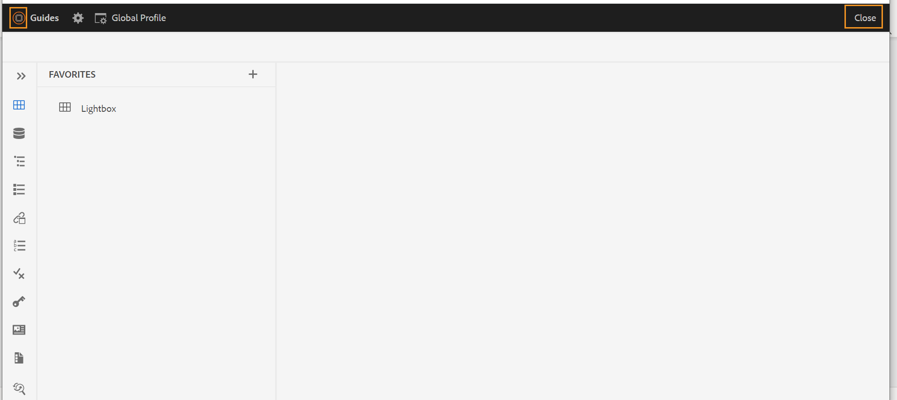

# Iniciar o Editor da Web {#id2056B0140HS}

Você pode iniciar o Editor da Web nos seguintes locais:

- [Página de navegação do AEM](#id2056BG00RZJ)
- [Interface do usuário do AEM Assets](#id2056BG0307U)
- [Console de mapa DITA](#id2056BG090BF)

As seções a seguir abordam os detalhes de como você pode acessar e iniciar o Editor da Web a partir de vários locais.

## Página de navegação do AEM {#id2056BG00RZJ}

Ao fazer logon no AEM, você verá a página Navegação:

{width="800" align="left"}

Ao clicar no link **Guias**, você será direcionado diretamente para o Editor da Web.

{width="800" align="left"}

Como você iniciou o Editor da Web sem selecionar nenhum arquivo, uma tela em branco do Editor da Web é exibida. Você pode abrir um arquivo para edição no repositório AEM ou na sua coleção Favoritos.

- Clique no ícone **Guias** ( ) para voltar à página de Navegação por AEM.

- O botão **Fechar** leva você a um destino com base em sua configuração:

  

  
 Cloud Services 

  Se você estiver usando o Cloud Service, clique no botão **Fechar** para voltar para a página Navegação por AEM.
  

  

  
 Software local

  Se você estiver usando o AEM Guides On-premise Software (4.2.1 e posterior), clique no botão **Fechar** à direita para voltar ao caminho do arquivo atual na interface do usuário do Assets.

  

## Interface do usuário do AEM Assets {#id2056BG0307U}

Outro local onde você pode iniciar o Editor da Web é na interface do usuário do AEM Assets. Você pode selecionar um ou mais tópicos e abri-los diretamente no Editor da Web. Para abrir um tópico no Editor da Web, siga estas etapas:

1. Na interface do usuário do Assets, navegue até o tópico que deseja editar.

   >[!NOTE]
   >
   > Você também pode ver a UUID do tópico.

   .

   {width="800" align="left"}

   >[!IMPORTANT]
   >
   > Certifique-se de que você tenha as permissões de leitura e gravação na pasta que contém o tópico que deseja editar.

1. Para obter um bloqueio exclusivo sobre o tópico, selecione o tópico e clique em **Fazer Check-out**.

   >[!IMPORTANT]
   >
   > Se o administrador tiver configurado a opção **Desabilitar Edição Sem Check-out**, você deverá fazer check-out do arquivo antes de editar. Se não fizer check-out do arquivo, você não poderá ver a opção de edição.

1. Feche o modo de seleção de ativos e clique no tópico que deseja editar.

   A visualização do tópico é exibida.

   Você pode abrir o Editor da Web na exibição em Lista, na exibição Cartão e no modo de Visualização.

   >[!IMPORTANT]
   >
   > Se quiser abrir vários tópicos para edição, selecione os tópicos desejados na interface do usuário do Assets e clique em Editar. Certifique-se de que o navegador não tenha o bloqueador de pop-ups ativado, caso contrário, somente o primeiro tópico na lista selecionada será aberto para edição.

   {width="800" align="left"}

   Se não quiser visualizar um tópico e quiser abri-lo diretamente no Editor da Web, clique no ícone Editar no menu de ação rápida da exibição de cartão:

   {width="800" align="left"}

1. Clique em **Editar** para abrir o tópico no Editor da Web.

   {width="800" align="left"}

## Console de mapa DITA {#id2056BG090BF}

Para abrir o Editor da Web no console de mapa DITA, siga estas etapas:

1. Na interface do usuário do Assets, navegue até o arquivo de mapa DITA que contém o tópico que deseja editar e clique nele.

   O console do mapa DITA é exibido.

1. Clique em **Tópicos**.

   Uma lista de tópicos no arquivo de mapa é exibida. A UUID dos tópicos é exibida abaixo do título do tópico.

1. Selecione o arquivo de tópico que deseja editar.

1. Clique em **Editar tópico**.

   {width="800" align="left"}

1. O tópico é aberto no Editor da Web.

   >[!IMPORTANT]
   >
   > Se o administrador tiver configurado a opção **Desabilitar Edição Sem Check-out**, você deverá fazer check-out do arquivo antes de editar. Se você não fizer check-out do arquivo, o documento será aberto no editor no modo somente leitura.

**Tópico pai:**[ Trabalhar com o Editor da Web](web-editor.md)
