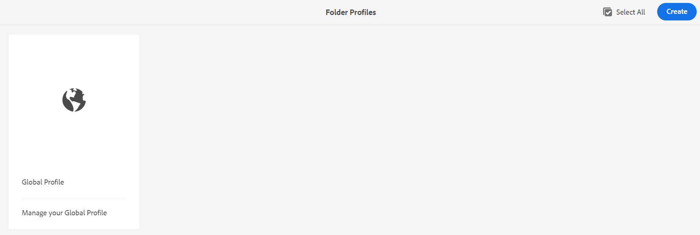
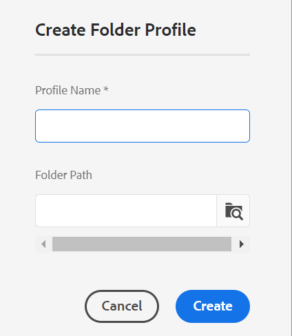

# Configurar perfis globais ou de nível de pasta {#id181AH2003PF}

Em uma empresa, diferentes grupos ou produtos podem usar diferentes modelos de criação, modelos de saída, perfis de atributo condicional \(ou esquemas de assunto\) e configurações do Editor da Web. Configurar esses apenas em nível corporativo \(ou global\) pode dificultar a experiência dos autores, pois eles verão modelos ou perfis que não são relevantes para eles.

O AEM Guides permite configurar a criação de modelos \(tópico ou mapa\), modelos de saída, atributo condicional e configurações do Editor da Web em nível corporativo \(global\), bem como em nível de pasta. Dessa forma, você pode separar as configurações de diferentes departamentos ou produtos em sua empresa.

Além disso, você pode delegar as configurações específicas da pasta a um departamento ou administradores de produtos para descentralizar a administração.

Ao usar o bloco Perfis de pasta nas configurações de Guias, você pode definir as configurações nas seguintes guias:

{width="800" align="left"}

- **Geral**: a guia geral só está disponível quando você está definindo as configurações no nível da pasta \(ou projeto/produto\). É possível definir configurações, como os caminhos de pasta aos quais as configurações serão aplicáveis e os usuários que terão direitos administrativos para criar ou atualizar configurações.

- **Atributos Condicionais**: use esta guia para configurar atributos condicionais em nível global ou de pasta. Um atributo condicional é uma combinação do nome e do valor do atributo, e você também pode definir um rótulo para ele. Você pode usar os atributos DITA padrão ou seus próprios atributos personalizados. Os atributos condicionais definidos no nível global são disponibilizados a todos os usuários nos projetos. Caso tenha definido atributos condicionais no nível da pasta, eles são mesclados com os atributos condicionais definidos globalmente.

- **Modelos**: use esta guia para configurar os modelos que os autores usarão para criar ou publicar conteúdo DITA. Os seguintes modelos de tópico estão disponíveis prontamente:

   - Glossário

   - Referência

   - Tópico

   - Conceito

   - Tarefa

   - Resolução de problemas

   - Em branco

   - DITAVAL

  >[!NOTE]
  >
  > Você pode usar qualquer um dos modelos existentes como base para criar novos modelos. O modelo DITA em branco não contém nenhuma estrutura ou elementos como os outros modelos. Você pode usar qualquer um dos modelos OOTB DITA como base, fazer modificações nele e salvá-lo com um nome diferente. Depois de fazer as alterações necessárias, adicione o modelo atualizado à configuração global ou de modelos de criação no nível da pasta e, em seguida, ele fica disponível para criação.

  Juntamente com os modelos de tópico, também é possível definir os modelos de mapa que serão disponibilizados aos autores. Os seguintes modelos de mapa estão disponíveis prontamente:

   - Mapa

   - Bookmap

- **Predefinição de Saída**: Semelhante aos Modelos, há cinco predefinições de saída pré-configuradas:

   - Site do AEM

   - PDF

   - HTML 5

   - EPUB

   - Personalizado

  Os editores podem usar essas predefinições de saída prontas para uso para publicar conteúdo. Essas predefinições podem ser configuradas por um administrador do perfil global ou de nível de pasta. Após configuradas, as predefinições de publicação ficam disponíveis para os editores para mapas DITA recém-criados. Você também pode aplicar predefinições de publicação a mapas DITA existentes. Consulte [Aplicar alterações predefinidas](#id18AGD0K0OHS) para obter mais detalhes.

- **Configurações do Editor XML**: use esta guia para personalizar a aparência e os vários recursos do Editor da Web. As seguintes configurações configuráveis estão disponíveis para o Editor da Web:

   - Configuração da interface do Editor de XML
   - Layout da página do editor XML
   - Configuração do editor XML
   - Layout do modelo CSS
   - Trechos do Editor de XML
   - Rótulos da versão do conteúdo XML
   - Roteiro \(somente no nível da pasta\)

Você pode configurar ambos — perfil global e perfil de nível de pasta. Em um perfil de nível de pasta, é possível definir as pastas nas quais as configurações serão aplicáveis. Essas configurações incluem atributos condicionais, modelos, predefinições de saída e configurações do Editor de XML. As predefinições condicionais, os modelos e as configurações do Editor XML são então disponibilizados aos autores que trabalham nas pastas configuradas. Da mesma forma, os editores terão acesso às predefinições de saída configuradas definidas nas pastas configuradas.

Um perfil de nível de pasta substitui as configurações definidas no perfil global. Em outras palavras, se uma pasta tiver um perfil no nível da pasta, ela mostrará os modelos, os modelos de saída e as configurações do Editor XML definidas em seu perfil de pasta correspondente. Ele não mostrará as configurações definidas no perfil global. No entanto, isso não se aplica aos atributos condicionais. No caso de atributos condicionais, os atributos condicionais são mesclados nos níveis global e de pasta.

As seções a seguir orientam você pelo processo de configuração de perfis globais e de nível de pasta.

## Configurar perfil global

Execute as seguintes etapas para configurar o perfil global:

1. Faça logon no Adobe Experience Manager como administrador.

1. Clique no link do Adobe Experience Manager na parte superior e escolha **Ferramentas**.

1. Selecione **Guias** na lista de ferramentas e clique em **Perfis de Pasta**.

   Pela primeira vez, a página Perfis de pasta é exibida somente com o bloco Perfil global.

   {width="800" align="left"}

1. Clique no bloco **Perfil Global**.

1. Para configurar **Atributos Condicionais**, consulte [Configurar atributos condicionais para perfis globais ou de nível de pasta](#id1889D0I305Z).

1. Para configurar **Modelos**, consulte [Configurar modelos de criação](#id1889D0IL0Y4).

1. Para configurar **Predefinições de Saída**, consulte [Configurar predefinições de saída](#id18AGD0IH0Y4).

1. Para configurar o Editor de XML, consulte [Configurar e personalizar o Editor de XML](#id2065G300O5Z).

1. Depois de fazer todas as atualizações necessárias, salve e feche o **Perfil Global**.


## Criar e configurar um perfil no nível da pasta

Execute as seguintes etapas para configurar um perfil no nível da pasta:

1. Faça logon no Adobe Experience Manager como administrador.

1. Clique no link do Adobe Experience Manager na parte superior e escolha **Ferramentas**.

1. Selecione **Guias** na lista de ferramentas e clique no bloco **Perfis de Pasta**.

   Pela primeira vez, a página Perfis de pasta é exibida somente com o bloco Perfil global padrão.

1. Clique em **Criar**.

   {width="300" align="left"}

1. Insira os seguintes detalhes na caixa de diálogo **Criar Perfil de Pasta**:
   - Nome do perfil da pasta.
   - Caminho da pasta à qual o perfil será aplicável.

     >[!NOTE]
     >
     > Não é possível aplicar vários perfis de pasta a uma pasta. Verifique se a pasta que você está selecionando aqui não tem nenhum outro perfil aplicado a ela. No caso de pastas pai-filho com perfis específicos, a pasta filho usará as configurações do próprio perfil. As configurações da pasta principal não substituem as configurações de uma pasta secundária.

1. Clique em **Criar**.

   Um novo bloco com o nome do perfil da pasta é criado na página Perfis de pasta

1. Clique no bloco do perfil da pasta para editá-lo.

   Uma guia Geral com o nome do perfil da pasta e as informações da pasta configurada é exibida.

1. Clique em **Editar** para adicionar várias pastas e usuários que terão acesso administrativo para modificar o perfil da pasta.

   >[!NOTE]
   >
   > Os usuários adicionados aqui terão os direitos administrativos para atualizar os atributos condicionais, o modelo e as predefinições de saída configurados para esse perfil de pasta.

1. Para adicionar uma pasta, clique no ícone Procurar no Caminho da pasta, navegue até uma pasta e selecione-a e clique em Adicionar para adicioná-la a esse perfil.

   >[!NOTE]
   >
   > Verifique se a pasta escolhida aqui não tem nenhum outro perfil de nível de pasta associado a ela.

1. Para adicionar um usuário, selecione um usuário no menu suspenso **Usuários Administradores** e clique em **Adicionar**.

   >[!NOTE]
   >
   > É possível adicionar vários usuários ao perfil da pasta na lista suspensa. Você também pode remover um usuário administrador existente da lista clicando no ícone excluir ao lado da ID do usuário.

1. Depois de adicionar todas as pastas e usuários necessários ao perfil da pasta, clique em **Salvar**.


Agora você está pronto para configurar os atributos condicionais, modelos, predefinições de saída e Editor XML.

>[!IMPORTANT]
>
> Ao criar um perfil de pasta, por padrão ele não contém modelos. Você deve adicionar os modelos necessários no perfil da pasta para disponibilizá-los aos autores.

## Configurar atributos condicionais para perfis globais ou de nível de pasta {#id1889D0I305Z}

Execute as seguintes etapas para configurar atributos condicionais padrão compatíveis com DITA em nível global ou de pasta:

1. Faça logon no Adobe Experience Manager como administrador ou como um usuário com direitos administrativos em um perfil de nível de pasta.

1. Clique no link do Adobe Experience Manager na parte superior e escolha **Ferramentas**.

1. Selecione **Guias** na lista de ferramentas e clique no bloco **Perfis de Pasta**.

1. Clique no bloco do perfil que você deseja configurar.

   >[!NOTE]
   >
   > Você pode optar por configurar atributos condicionais no Perfil global ou em um perfil de nível de pasta.

1. Na página do perfil, clique na guia **Atributos Condicionais**.

1. Clique em **Editar**.

1. Clique em **Adicionar**.

1. Insira o **Nome**, **Valor** e um **Rótulo** para o atributo condicional.

   Você pode salvar um perfil somente com o nome do atributo. No entanto, um atributo só pode ser usado quando tem um valor especificado. Se você especificar ambos - valor e rótulo para um atributo, o Editor da Web mostrará o rótulo do atributo condicional. Além disso, o rótulo é mostrado ao administrador de publicação no momento da criação de uma predefinição condicional.

   A captura de tela a seguir mostra a definição do atributo `platform` com valores e rótulos possíveis.

   

1. Se quiser adicionar mais valores para o mesmo atributo, clique no ícone **+** e insira o valor e rótulo adicionais.

1. Para adicionar mais atributos, clique em **Adicionar**.

1. Clique em **Salvar**.


Se você estiver usando um atributo personalizado, ele deverá ser um atributo DITA válido suportado pelo DTD. Se quiser usar qualquer atributo, que não seja um atributo DITA padrão, execute as seguintes etapas adicionais:

1. Adicione o atributo personalizado ao arquivo DTD. Por exemplo, se o arquivo DTD for commonElements.mod, será necessário localizar esse arquivo no diretório DTD. O caminho padrão do arquivo DTD do sistema é:

   /libs/fmdita/dita\_resources/DITA-1.3/dtd/base/dtd/commonElements.mod

   >[!IMPORTANT]
   >
   > O arquivo DTD especializado deve fazer parte da implantação do código personalizado. DTDs em /apps fazem parte da implantação do produto e, portanto, é substituído pela instalação de qualquer nova versão. É recomendável adicionar um DTD especializado em /var/dxml/dita\_resources na pasta do projeto e incluir o caminho do DTD/catálogo no perfil DITA. Para obter mais informações, consulte [Integrar especialização DITA](dita-ot-specialization.md#id211MB0E00XA).

1. Use o Gerenciador de pacotes para baixar o arquivo /libs/fmdita/config/condAttrList.xml:

1. Crie uma cópia do arquivo condAttrList.xml no seguinte local no repositório Git da Cloud Manager:

   `/apps/fmdfmdita/config/condAttrList.xml`

1. Salve o arquivo.

1. Adicione atributos personalizados ao perfil global ou de nível de pasta.


## Configurar modelos {#id1889D0IL0Y4}

O AEM Guides vem com 7 modelos de tópico prontos para uso, 2 modelos de mapa DITA e 3 modelos PDF. Você pode optar por ter somente alguns modelos disponíveis para seus autores e editores. Caso use um modelo personalizado, o mesmo pode ser configurado e disponibilizado para criação e publicação. Use a guia **Modelos** na configuração Perfis de pasta para adicionar ou remover modelos de tópico, mapa ou PDF de perfis globais ou em nível de pasta.

Mesmo antes de configurar os modelos de tópico, mapa ou PDF no nível global ou de pasta, você também pode definir um local para armazenar os modelos personalizados. Para configurar um local personalizado para armazenar os modelos, consulte [Configurar caminho da pasta de modelo DITA personalizado](conf-template-tags-custom-dita-topic-template.md#id191LCF0095Z).

Execute as seguintes etapas para adicionar o tópico, mapa ou modelos do PDF em um perfil de pasta:

1. Faça logon no Adobe Experience Manager como administrador ou como um usuário com direitos administrativos em um perfil de nível de pasta.

1. Clique no link do Adobe Experience Manager na parte superior e escolha **Ferramentas**.

1. Selecione **Guias** na lista de ferramentas e clique no bloco **Perfis de Pasta**.

1. Clique no bloco do perfil que você deseja configurar.

   >[!NOTE]
   >
   > Você pode optar por configurar um modelo no Perfil global ou um perfil de nível de pasta.

1. Na página do perfil, clique na guia **Modelos**.
1. Clique em **Editar**.

   Você tem as opções para adicionar modelos de Tópico, Mapa e PDF pesquisando no local padrão ou procurando por ele.

   >[!NOTE]
   >
   > Por padrão, todos os modelos são armazenados na pasta /content/dam/dita-templates. A pasta `dita-templates` contém subpastas `topics`, `maps` e `PDF` para armazenar os modelos de tópico, mapa e PDF. Você pode adicionar seus modelos personalizados \(.dita,.xml ou .ditamapfiles\) nas pastas de modelo padrão. Depois de adicionar o modelo à pasta padrão, é possível adicioná-los ao perfil global ou de pasta. Para obter mais informações sobre como criar modelos personalizados usando o Editor da Web, consulte [Criar modelo de criação personalizado](#id1917D0EG0HJ).

   {width="800" align="left"}

1. Adicione os modelos de tópico, mapa e PDF necessários ao seu perfil.

   Para adicionar um modelo, siga um destes procedimentos:

   - Escolha **Pesquisar ou Digitar** e digite ou selecione o nome de um modelo na lista suspensa. A lista suspensa consiste em todos os modelos padrão e qualquer novo modelo criado.

     {width="800" align="left"}

   - Clique em **Procurar** e selecione um modelo do DAM.

1. Clique em **Adicionar**.

   Os modelos selecionados são adicionados à lista de modelos.

   {width="800" align="left"}

   >[!NOTE]
   >
   > É possível alterar a ordem dos modelos arrastando-os e soltando-os na posição desejada na lista. A posição dos modelos controla a ordem em que são exibidos na página Blueprint no tópico ou no fluxo de trabalho de criação do mapa.

1. Para definir as regras de tradução, navegue pelo local SRX para encontrar a pasta que contém os arquivos SRX. O formato SRX \(Segmentation Rules eXchange\) é um padrão para a troca de regras de segmentação entre usuários diferentes e ambientes de tradução diferentes. Você pode criar uma pasta e adicionar seus arquivos SRX personalizados a ela.

   Depois de criar a pasta que contém os arquivos SRX, você pode adicionar o caminho da pasta na **configuração do local SRX de tradução** dentro do perfil da pasta.

   O AEM Guides escolhe as regras SRX de acordo com o idioma de origem do projeto de tradução. Ele procura um arquivo SRX personalizado para um idioma e, se você não definir um arquivo SRX personalizado, ele escolhe as regras de acordo com as regras de tradução prontas para uso.

1. Clique em **Salvar**.


Caso tenha configurado os modelos em um perfil no nível da pasta, os modelos configurados serão associados à pasta configurada. Todos os projetos criados na pasta configurada terão acesso somente aos modelos que estão configurados no perfil de nível de pasta.

## Criar modelo de criação personalizado {#id1917D0EG0HJ}

O AEM Guides oferece uma maneira fácil de criar modelos de criação. Como administrador do sistema, você pode usar o Editor da Web para criar modelos de criação do zero. Em seguida, você pode adicionar o novo modelo no perfil global ou atribuí-lo a uma pasta específica usando o perfil específico da pasta.

Execute as seguintes etapas para criar um modelo de criação personalizado:

1. Faça logon no Adobe Experience Manager como administrador.

1. Na interface do usuário do Assets, navegue até a pasta configurada para armazenar os arquivos de modelo. Por padrão, todos os modelos de tópico são armazenados na pasta /content/dam/dita-templates/topics.

   >[!NOTE]
   >
   > Para configurar um local personalizado para armazenar tópico ou modelos de mapa, consulte [Configurar caminho da pasta de modelo DITA personalizado](conf-template-tags-custom-dita-topic-template.md#id191LCF0095Z)

1. Clique em **Criar** \> **Modelo DITA**.

1. Na página Blueprint, selecione o tipo de modelo de tópico DITA que deseja criar.

   >[!NOTE]
   >
   > Você pode usar o modelo em branco para começar do zero. O modelo em branco não tem nenhuma estrutura ou elemento.

1. Clique em **Avançar**.

1. Na nova página Propriedades do modelo, insira um **Título**, **Nome** e **Descrição** para o modelo.

   >[!NOTE]
   >
   > O nome é sugerido automaticamente com base no Título do template. Se você quiser especificar manualmente o nome, certifique-se de que o Nome não contenha espaços, apóstrofo ou chaves e termine com .dita.

1. *\(Opcional\)* Clique no botão **Adicionar uma Miniatura** no navegador e selecione uma miniatura para associar ao seu modelo.

1. Clique em **Criar**.

   A mensagem Topic Created (Tópico criado) é exibida.

   Você pode optar por abrir o modelo para edição no Editor da Web ou salvar o arquivo de modelo no local de armazenamento do modelo. Depois que o modelo for criado, você poderá usar o Editor da Web para personalizar o modelo de acordo com suas necessidades de criação. Depois que um modelo estiver em vigor, certifique-se de associá-lo a um perfil global ou de nível de pasta.


## Configurar predefinições de saída {#id18AGD0IH0Y4}

Em uma configuração corporativa típica, diferentes modelos de saída podem ser usados para diferentes produtos ou guias do usuário. Além disso, pode haver alguns processos comuns de geração de saída que devem ser usados por todos os editores e um conjunto de processos específicos de geração de saída para um grupo específico de editores ou projetos.

O AEM Guides permite que o administrador crie predefinições de saída com configurações específicas que podem ser usadas por todos ou por um conjunto específico de editores para gerar a saída. Por exemplo, o administrador pode criar uma predefinição de saída para gerar um guia do usuário comum em todos os editores. E mais um para criar os manuais de usuário de programação específicos de um conjunto de editores. Ambas as predefinições podem ser configuradas para usar templates de saída diferentes. Neste exemplo, a predefinição de publicação comum para gerar o guia do usuário pode ser configurada em nível global. E a predefinição de saída para gerar o manual do usuário de programação pode ser configurada em nível de pasta.

Depois que as predefinições de saída padrão tiverem sido criadas no sistema, todos os mapas DITA criados depois disso usarão as predefinições padrão para gerar a saída. No entanto, todos os mapas DITA existentes continuariam a usar as predefinições de saída configuradas anteriormente com eles. Se você quiser aplicar a nova predefinição de saída em todos os mapas DITA existentes, será necessário executar o fluxo de trabalho Aplicar alterações predefinidas.

Além das predefinições configuradas em nível global ou corporativo, um editor ainda teria os direitos de criar mais predefinições de saída. No entanto, essas predefinições são vinculadas ao mapa DITA para o qual são criadas. Para obter mais detalhes sobre como criar predefinições de saída regulares para um mapa DITA, consulte *Criar, editar, duplicar ou remover uma predefinição de saída* no guia Uso do Adobe Experience Manager Guides as a Cloud Service.

Execute as seguintes etapas para configurar predefinições de saída globais ou específicas de pastas:

1. Faça logon no Adobe Experience Manager como administrador ou como um usuário com direitos administrativos em um perfil específico de pasta.

1. Clique no link do Adobe Experience Manager na parte superior e escolha **Ferramentas**.

1. Selecione **Guias** na lista de ferramentas e clique no bloco **Perfis de Pasta**.

1. Clique no bloco do perfil que você deseja configurar.

   >[!NOTE]
   >
   > Você pode optar por configurar predefinições de saída no Perfil global ou em um perfil específico de pasta.

1. Na página do perfil. clique na guia **Predefinições de saída**.

   Uma lista de predefinições de saída prontas para uso é exibida, incluindo AEM Site, PDF, HTML5, EPUB e CUSTOM.

1. Siga um destes procedimentos para criar ou editar uma predefinição de saída:

   - Clique em **Criar** para criar uma nova predefinição de saída do zero.
   - Clique em Duplicar para criar uma cópia da predefinição de saída selecionada. É possível fazer alterações na predefinição duplicada e salvá-la.

   - Clique em **Editar** para abrir a configuração da predefinição selecionada para edição.

     Para obter informações sobre as configurações de predefinição de saída, consulte *Noções básicas sobre as predefinições de saída* no guia Uso do Adobe Experience Manager Guides as a Cloud Service.

1. Clique em **Salvar** para salvar as configurações predefinidas.


Todos os mapas DITA criados ou carregados após essa etapa terão a predefinição de saída nova ou atualizada.

## Aplicar alterações predefinidas {#id18AGD0K0OHS}

Uma nova predefinição de saída criada em nível global será disponibilizada para todos os novos mapas DITA criados a partir de agora. Da mesma forma, se uma nova predefinição de saída for criada em nível de pasta, essa predefinição será disponibilizada para todos os mapas que serão criados na pasta configurada. Por padrão, uma nova predefinição de saída não é disponibilizada para nenhum mapa DITA existente.

Se você tiver atualizado uma predefinição de saída existente ou quiser disponibilizar uma nova predefinição de saída para mapas DITA existentes, execute as seguintes etapas:

1. Faça logon no Adobe Experience Manager como administrador ou como um usuário com direitos administrativos em um perfil específico de pasta.

1. Clique no link do Adobe Experience Manager na parte superior e escolha **Ferramentas**.

1. Selecione **Guias** na lista de ferramentas e clique no bloco **Perfis de Pasta**.

1. Clique no bloco do perfil que você deseja configurar.

   >[!NOTE]
   >
   > Você pode optar por configurar predefinições de saída no Perfil global ou em um perfil específico de pasta.

1. Na página do perfil. clique na guia **Predefinições de saída**.

   Uma lista de predefinições de saída prontas para uso é exibida, incluindo AEM Site, PDF, HTML5, EPUB e CUSTOM.

1. Selecione a predefinição de saída que deseja aplicar aos mapas DITA existentes.

1. Clique em **Aplicar alterações predefinidas** na barra de ferramentas principal.

1. Na caixa de diálogo Aplicar alterações predefinidas, escolha entre:

   - **Selecionando a opção Substituir Predefinição Existente**: se você selecionar essa opção, todas as atualizações feitas nas predefinições de saída existentes substituirão as configurações em todos os mapas DITA existentes em que essa predefinição é usada. No entanto, isso resultará na perda de qualquer predefinição condicional existente e informações de linha de base associadas ao mapa.

   - **Opção Substituir predefinição existente não selecionada**: se você não selecionar essa opção, as atualizações feitas nas predefinições de saída existentes não afetarão os mapas DITA existentes. Somente as predefinições recém-adicionadas são adicionadas aos mapas DITA existentes. Observe que o mapa DITA recém-criado obtém as predefinições de saída atualizadas e as predefinições adicionadas recentemente.

1. Clique em **OK** para aplicar as alterações das predefinições de saída selecionadas em todos os mapas DITA existentes.


## Configurar o AI Assistant para obter ajuda e criação inteligentes

Para Experience Manager Guides as a Cloud Service ().

O Assistente de IA do Adobe Experience Manager Guides é uma ferramenta avançada orientada por IA, projetada para aprimorar o conteúdo por meio de criação inteligente e experiências de reutilização de conteúdo. Ele reúne dois recursos robustos de IA — **Criação** e **Ajuda** — na interface do Experience Manager Guides, permitindo que você crie documentos e acesse informações de maneira mais rápida e eficiente.

Para obter detalhes sobre a configuração, consulte [Configuração do assistente de IA](./conf-smart-suggestions.md).

**Configurar sugestões inteligentes habilitadas por IA**

Você pode configurar as sugestões inteligentes habilitadas por IA e ajudar os autores a reutilizar o conteúdo existente e criar facilmente referências de conteúdo corretas e consistentes. A guia **Configuração de IA** permite controlar as configurações de **Sugerir conteúdo reutilizável** no painel Assistente de IA no Editor da Web.

Execute as seguintes etapas para definir a configuração de IA padrão no perfil global ou de nível de pasta:
1. Faça logon no Adobe Experience Manager como administrador ou usuário com direitos administrativos em um perfil de nível de pasta.
1. Selecione o link **Adobe Experience Manager** na parte superior e escolha **Ferramentas**.
1. Selecione **Guias** na lista de ferramentas e selecione o bloco **Perfis de Pasta**.
1. Selecione o bloco do perfil que você deseja configurar.

   >[!NOTE]
   >
   >Você pode configurar sugestões inteligentes baseadas em IA para o perfil global ou de nível de pasta.

1. Na página do perfil, selecione a guia **Configuração de IA**.

    {width="800" align="left"}

1. Selecione **Editar**.
1. Como administrador, você pode definir as seguintes configurações:

   **Mínimo de caracteres**: insira o número mínimo de caracteres que os autores precisam digitar para obter as sugestões. Por exemplo, se esse número for 7, o autor deverá adicionar pelo menos 7 caracteres para exibir uma sugestão inteligente.

   **Máximo de sugestões**: insira o número máximo de sugestões que os autores podem receber ao criar o conteúdo. Por exemplo, se esse número for 5, o autor poderá exibir cinco ou menos sugestões inteligentes.

   **Arquivos e pastas**: selecione os arquivos ou pastas a partir dos quais as sugestões inteligentes devem ser mostradas. *Para garantir a consistência do conteúdo, é recomendável que não haja duas entradas na lista com arquivos comuns entre elas*. Após selecionar os arquivos e as pastas, eles serão listados.

1. Clique em **Salvar**.

   >[!NOTE]
   >
   > Os detalhes do último status indexado são exibidos na parte superior depois de salvar o arquivo.

Saiba mais sobre como exibir e adicionar [sugestões inteligentes baseadas em IA](../user-guide/authoring-ai-based-smart-suggestions.md) para adicionar referências de conteúdo durante a criação no Editor da Web.

**Personalizar as perguntas padrão da ajuda inteligente**

Para Experience Manager Guides as a Cloud Service ().

Você pode configurar a **Ajuda** inteligente baseada em IA para ajudar os autores a fazer perguntas e localizar facilmente o conteúdo necessário da [documentação do Experience Manager Guides](https://experienceleague.adobe.com/pt-br/docs/experience-manager-guides/using/overview).

A guia **Configuração do Editor XML** permite configurar as perguntas padrão do painel **Ajuda**.

>[!NOTE]
>
>Você pode configurar até 10 perguntas padrão.

Execute as seguintes etapas para configurar as perguntas padrão:

1. Faça logon no Adobe Experience Manager como administrador ou usuário com direitos administrativos em um perfil de nível de pasta.
1. Selecione o link **Adobe Experience Manager** na parte superior e escolha **Ferramentas**.
1. Selecione **Guias** na lista de ferramentas e selecione o bloco **Perfis de Pasta**.
1. Selecione o bloco do perfil que você deseja configurar.

   >[!NOTE]
   >
   >Você pode configurar perguntas padrão para o **painel Ajuda Inteligente** para o perfil global ou de nível de pasta.

1. Selecione a guia **Configuração do editor XML**.

1. Clique no ícone **Editar** na parte superior.
1. Na seção **Configuração da interface do Editor de XML**, selecione o ícone **Baixar** para baixar o arquivo `ui_config.json` no sistema local.
1. No arquivo `ui_config.json`, adicione as perguntas de exemplo.

   **Exemplo de perguntas de exemplo**:

   ```json
   "assistantSampleQuestions": [
   "How to create a new topic",
   "How to create a new map",
   "What is a baseline" ]
   ```

1. Salve o arquivo e faça upload dele.

   >[!NOTE]
   >
   > As perguntas padrão aparecem no painel **Ajuda Inteligente** depois que você salva o arquivo.


Saiba mais sobre como usar a [Ajuda Inteligente fornecida por IA](../user-guide/ai-based-smart-help.md) para encontrar o conteúdo necessário na documentação do Experience Manager Guides.


## Configurar e personalizar o editor de XML {#id2065G300O5Z}

Por padrão, o Editor de XML vem com vários recursos para ajudar seus autores a criar documentos DITA. Se você trabalhar em um ambiente restritivo, poderá escolher quais recursos serão expostos aos autores. A guia Configuração do editor XML permite controlar facilmente os recursos e também alterar a aparência do editor. Como administrador, você pode personalizar os seguintes componentes do Editor:

**Configuração da Interface do Usuário do Editor XML**

Essa configuração permite criar extensões JSON que refletem as modificações feitas no arquivo `ui_config.json`. É possível fazer upload dessas extensões de maneira independente no nível do perfil da pasta, oferecendo mais flexibilidade e personalização. Por exemplo, quando você faz alterações na **Configuração do Editor XML**, como a atualização de um botão, o sistema identifica automaticamente as diferenças. Ao carregar essas alterações na **Configuração da Interface do Usuário do Editor de XML** e convertê-las em extensões JSON usando o botão **Converter Configuração da Interface do Usuário em JSON**, o sistema gera uma extensão que incorpora a nova funcionalidade.

Saiba mais sobre [personalização de configurações JSON e conversão de configurações de interface do usuário para o novo Editor do AEM Guides](https://experienceleague.adobe.com/pt-br/docs/experience-manager-guides-learn/videos/advanced-user-guide/conver-ui-config).

>[!NOTE]
>
> Ao personalizar o aplicativo usando a estrutura de extensão, é recomendável usar apenas os componentes essenciais compatíveis do React Spectrum, como Árvore, Tabela, Caixa de seleção, botão de opção e grupo de rádio, etc., para evitar problemas durante a implantação.

**Layout da página do Editor XML**

Este recurso permite que você carregue arquivos CSS para criar o estilo das novas extensões carregadas na **Configuração da Interface do Usuário do Editor XML**. O CSS carregado é aplicado de forma consistente em todos os aplicativos relevantes, garantindo uma aparência unificada e elegante para as personalizações da interface do usuário.

**Configuração do Editor XML**

Essa configuração controla a barra de ferramentas e os outros elementos da interface do usuário do Editor. Selecione o ícone **Baixar** para baixar o arquivo `ui\_config.json` no sistema local. Em seguida, é possível fazer alterações no arquivo e fazer o upload da mesma maneira. Dependendo de onde você estiver fazendo upload do arquivo no perfil global ou de nível de pasta, as alterações serão aplicadas adequadamente. Para obter mais detalhes sobre como personalizar o Editor de XML usando o `ui\_config.json file`, consulte [Personalizar barra de ferramentas](conf-web-editor-customize-toolbar.md#).

>[!NOTE]
>
> Para a versão do AEM Guides 2502 e versões mais recentes, é recomendável usar a extensão JSON em vez do `ui_config.json` para personalização. Para obter detalhes, consulte a seção **Configuração da Interface do Usuário do Editor XML** acima.

**Layout do modelo CSS**

Baixe o arquivo disponível nesta seção para personalizar a aparência do documento quando ele for visualizado ou aberto para edição no Editor da Web. O arquivo CSS padrão disponível para download é apenas um arquivo de teste, que não deve ser usado para personalização. Você pode criar um arquivo CSS com personalizações para o Editor da Web e fazer upload do mesmo. Por exemplo, você pode criar um arquivo .css com o seguinte código:

```
.title {    font-size: 9em;}
```

Salve este arquivo e faça upload na seção Layout de modelo CSS. Na próxima vez que você baixar o arquivo, obterá o arquivo CSS mais recente em uso no Editor da Web.

**Trechos do Editor XML**

Usando o arquivo de configuração desta seção, você pode criar alguns trechos padrão e compartilhá-los com seus autores. A estrutura padrão do arquivo é fornecida abaixo:

```
{
   "snippetID": {
      "name": "snippet Name",
      "description": "snippet Description",
      "value": "<i>this is snippet value</i>"
  }
}
```

Os seguintes detalhes são necessários para criar um trecho:

**snippetID** - Um identificador exclusivo para o trecho. Ele pode receber um valor alfanumérico.

**nome** - Um nome descritivo para identificar o trecho. Esse nome é exibido no painel Snippets.

**descrição** - Adicione uma informação descritiva para o trecho.

**value** - Forneça o código XML do trecho.

>[!NOTE]
>
> Você pode adicionar mais trechos adicionando uma vírgula \(,\) no final da definição do trecho e repetindo a mesma estrutura para o próximo trecho.

**Rótulos de Versão do Conteúdo XML**

Por padrão, os autores têm permissão para criar rótulos de sua escolha e associá-los a seus arquivos de tópico. No entanto, isso pode levar a muitas variações de um mesmo rótulo. Por exemplo, um poderia ter rótulos de &quot;Versão 1.0&quot;, &quot;Versão 1.0&quot;, &quot;Versão 1&quot; para identificar o mesmo estágio de um tópico. Para evitar essa rotulagem inconsistente no sistema, você pode criar uma lista predefinida de rótulos que os autores teriam permissão para escolher. Ter uma rotulagem consistente ajuda a gerenciar melhor os arquivos em seu sistema.

Usando a configuração de rótulo de versão, você pode fazer upload de uma lista de rótulos válidos para sua organização. Baixe o arquivo label.json padrão e modifique-o conforme mostrado abaixo:

```
{
"label1":"Draft",
"label2":"PM-Review",
"label3":"Engg-Review",
"label4":"QE-Review",
"label5":"Ready for Loc",
"label6":"Ready for Publish"
}
```

No exemplo acima, o &quot;label1&quot; é o identificador para a sequência do rótulo e é anexado pelo rótulo que é exibido aos autores sempre que um rótulo é necessário. Salve este arquivo e faça upload dele na seção Rótulos da versão do conteúdo XML.

>[!IMPORTANT]
>
> Para que as configurações no nível da pasta entrem em vigor, os usuários precisariam selecionar o perfil em suas Preferências do usuário no Editor da Web.

**Roteiro**

Se os autores trabalharem com um mapa raiz específico, você poderá navegar até esse mapa e selecioná-lo aqui. Observe que é possível definir o mapa de roteiro somente para um perfil de nível de pasta.
