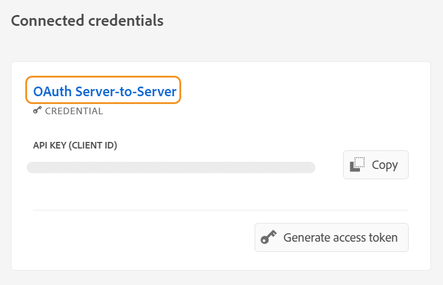

# Configure o Assistente de guias alimentado por IA para pesquisar conteúdo

Como administrador, você pode configurar o recurso Assistente de guias para os autores. O serviço do Assistente de guias é protegido pela autenticação baseada em autenticação do Adobe IMS. Integre seu ambiente com os workflows de autenticação segura baseada em token do Adobe e comece a usar o novo recurso Assistente de guias. As configurações a seguir ajudam a adicionar o **Configuração de IA** para um perfil de pasta. Depois de adicionado, você pode usar o recurso Assistente de guias no Editor da Web.

## Criar configurações do IMS no console do Adobe Developer

Execute as seguintes etapas para criar configurações do IMS no Console do Adobe Developer:

>[!NOTE]
>
>Se você já tiver criado um projeto OAuth para configurar o recurso Sugestões inteligentes ou a publicação baseada em microsserviços, ignore as etapas a seguir para criar o projeto.

1. Launch [Console do Adobe Developer](https://developer.adobe.com/console).
1. Depois de fazer logon no Console do desenvolvedor, você visualizará a **Início** tela. A variável **Início** é onde você pode encontrar facilmente informações e links rápidos, incluindo links de navegação superior para Projetos e Downloads.
1. Para criar um novo projeto vazio, selecione **Criar novo projeto** do **Início rápido** links.
    {width="550" align="left"}
   *Crie um novo projeto.*

1. Selecionar **Adicionar API** do **Projetos** tela.  A variável **Adicionar uma API** é exibida. Esta tela exibe todas as APIs, Eventos e serviços disponíveis para produtos e tecnologias Adobe com os quais você pode desenvolver aplicativos.

1. Selecione o **API de gerenciamento de E/S** para adicioná-lo ao seu projeto.
   
   *Adicione a API de gerenciamento de E/S ao projeto.*

1. Criar um novo **Credencial OAuth** e salve-o.
    {width="3000" align="left"}
   *Configure a credencial OAuth para sua API.*

1. No  **Projetos** escolha a guia **Servidor OAuth para servidor** e selecione as credenciais recém-criadas.

1. Selecione o **Servidor OAuth para servidor** link para exibir os detalhes de credencial do seu projeto.

    {width="800" align="left"}

   *Conecte-se ao projeto para visualizar os detalhes da credencial.*

1. Retorne para a **Projetos** e selecione **Visão geral do projeto** à esquerda.

   

   *Comece a usar o novo projeto.*

1. Clique em **Baixar** na parte superior para baixar o serviço JSON.

   

   *Baixe os detalhes do serviço JSON.*

Você configurou os detalhes de autenticação do OAuth e baixou os detalhes do serviço JSON. Mantenha esse arquivo em mãos conforme necessário na próxima seção.

### Adicionar a configuração IMS ao ambiente

Execute as seguintes etapas para adicionar a configuração IMS ao ambiente:

1. Abra o Experience Manager e selecione seu programa, que contém o ambiente que você deseja configurar.
1. Alterne para a **Ambientes** guia.
1. Selecione o nome do ambiente que deseja configurar. Isso deve levar você ao **Informações do ambiente** página.
1. Alterne para a **Configuração** guia.
1. Atualize o campo JSON SERVICE_ACCOUNT_DETAILS. Certifique-se de usar o mesmo nome e configuração fornecidos na captura de tela a seguir.

{width="800" align="left"}


*Adicione os detalhes de configuração do ambiente.*


Depois de adicionar a configuração IMS ao ambiente, execute as seguintes etapas para vincular essas propriedades aos Guias AEM usando OSGi:

1. Em seu código de projeto Git do Cloud Manager, adicione os dois arquivos abaixo (para conteúdo de arquivo, exibir [Apêndice](#appendix)).

   * `com.adobe.aem.guides.eventing.ImsConfiguratorService.cfg.json`

1. Verifique se os arquivos recém-adicionados estão sendo cobertos pela `filter.xml`.
1. Confirme e envie suas alterações do Git.
1. Execute o pipeline para aplicar as alterações ao ambiente.

Depois disso, você poderá usar o **Assistente de guias** recurso.


## Apêndice {#appendix}

**Arquivo**:
`com.adobe.aem.guides.eventing.ImsConfiguratorService.cfg.json`

**Conteúdo**:

```
{
 "service.account.details": "$[secret:SERVICE_ACCOUNT_DETAILS]",
}
```


Depois de configurar, a variável **Assistente de guias**  ícone é exibido no painel direito do Editor da Web. Selecione o ícone para exibir a **Assistente de guias** painel.
Para obter mais detalhes, consulte [Assistente de guias habilitado para IA para pesquisar conteúdo](../user-guide/ai-based-guides-assistant.md) no Guia do usuário do Experience Manager.
