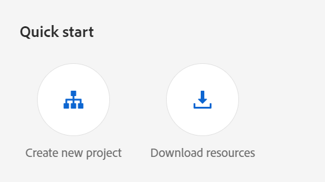
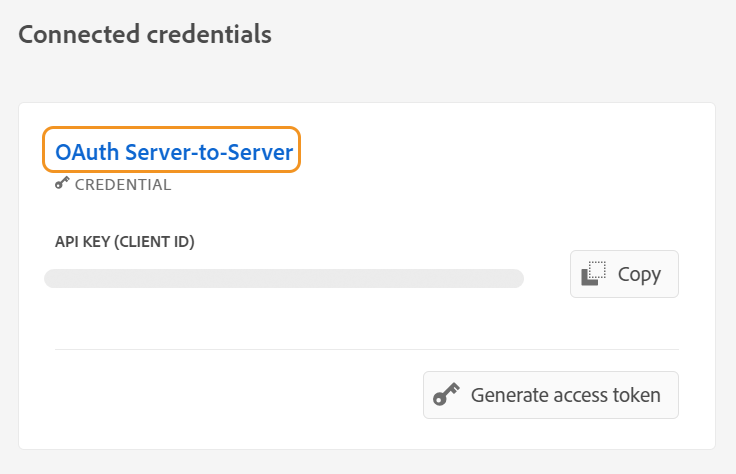
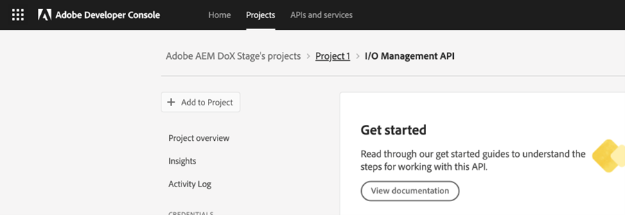

# Configurar o Assistente de IA

Como administrador, você pode configurar o recurso Assistente de IA no Experience Manager Guides. O Assistente de IA é protegido pela autenticação baseada em autenticação do Adobe IMS. Integre seu ambiente com os workflows de autenticação seguros baseados em token da Adobe e comece a usar o recurso Assistente de IA. A configuração a seguir ajuda a adicionar a guia **Configuração de IA** ao perfil da pasta. Depois de adicionado, você pode usar o recurso Assistente de IA no Experience Manager Guides.

Execute as seguintes etapas para configurar o Assistente de IA:

1. [Criar configuração IMS no Adobe Developer Console](#create-ims-configurations-in-adobe-developer-console).
2. [Adicionar configurações do IMS ao ambiente](#add-ims-configuration-to-the-environment)
3. [Habilitar o sinalizador de IA no ambiente](#enable-ai-flag-in-the-environment)
4. [Adicione a variável GUIDES_AI_SITE_ID no ambiente](#add-the-guides_ai_site_id-variable-in-the-environment)
5. [Aplicar alterações ao ambiente](#apply-changes-to-the-environment)
6. [Habilitar o assistente de IA no perfil da pasta](#enable-ai-assistant-in-folder-profile)
7. [Configurar Sugestões Inteligentes no Perfil de Pasta](./conf-folder-level.md#configure-ai-assistant-for-smart-help-and-authoring)

## Criar configurações do IMS no Adobe Developer Console

Execute as seguintes etapas para criar configurações do IMS no Adobe Developer Console:

>[!NOTE]
>
>Se você já criou um projeto OAuth para configurar a publicação baseada em microsserviços, ignore as etapas a seguir para criar o projeto.

1. Iniciar [Adobe Developer Console](https://developer.adobe.com/console).
1. Depois de fazer logon no Developer Console, você verá a tela **Página inicial**. A tela **Página Inicial** é onde você pode encontrar facilmente informações e links rápidos, incluindo links de navegação superior para Projetos e Downloads.
1. Para criar um novo projeto vazio, selecione **Criar novo projeto** nos links **Início rápido**.
    {width="550"}
   *Criar um novo projeto.*

1. Selecione **Adicionar API** na tela **Projetos**.  A tela **Adicionar uma API** é exibida. Esta tela exibe todas as APIs, Eventos e serviços disponíveis para produtos e tecnologias da Adobe com os quais você pode desenvolver aplicativos.

1. Selecione a **API de Gerenciamento de E/S** para adicioná-la ao seu projeto.
   
   *Adicionar a API de Gerenciamento de E/S ao seu projeto.*

1. Crie uma nova **credencial OAuth** e salve-a.

   

   *Configure a credencial OAuth para sua API.*

1. Na guia **Projetos**, escolha a opção **Servidor OAuth para Servidor** e selecione as credenciais recém-criadas.

1. Selecione o link **Servidor a Servidor OAuth** para exibir os detalhes de credencial do seu projeto.

    {width="800"}

   *Conecte-se ao projeto para exibir os detalhes da credencial.*

1. Retorne à guia **Projetos** e selecione **Visão geral do projeto** à esquerda.

   

   *Introdução ao novo projeto.*

1. Selecione o botão **Baixar** na parte superior para baixar o serviço JSON.

   

   *Baixar detalhes do serviço JSON.*

Você configurou os detalhes de autenticação do OAuth e baixou os detalhes do serviço JSON. Mantenha esse arquivo em mãos conforme necessário na próxima seção.

## Adicionar a configuração IMS ao ambiente

Execute as seguintes etapas para adicionar a configuração IMS ao ambiente:

1. Abra o Experience Manager e selecione seu programa que contenha o ambiente que você deseja configurar.
1. Alterne para a guia **Ambientes**.
1. Selecione o nome do ambiente que deseja configurar. Você deve ir para a página **Informações sobre o ambiente**.
1. Alterne para a guia **Configuração**.
1. Cole os detalhes do serviço JSON (baixados na seção anterior) no campo **Value** correspondente a `SERVICE_ACCOUNT_DETAILS`. Certifique-se de usar o mesmo nome e configuração fornecidos na captura de tela a seguir.

   {width="800"}

## Habilitar o sinalizador de IA no ambiente

Para habilitar o recurso Assistente de IA na interface do usuário do Experience Manager Guides, adicione o sinalizador `ENABLE_GUIDES_AI` no ambiente.

Certifique-se de que você esteja usando o mesmo nome e configuração fornecidos na captura de tela a seguir.

{width="800"}

Definir o sinalizador como **true** habilita a funcionalidade, enquanto a define como **false** a desabilita.

## Adicione a variável GUIDES_AI_SITE_ID no ambiente

Adicione a variável `GUIDES_AI_SITE_ID` em seu ambiente (Cloud Manager) e defina o valor como `id_f651abc807c84f52b425737bb93f87ba` para habilitá-la.

Certifique-se de que você esteja usando o mesmo nome e configuração fornecidos na captura de tela a seguir.

{width="800"}

## Aplicar alterações ao ambiente

Depois de adicionar a configuração do IMS e ativar o sinalizador do Assistente de IA no ambiente, execute as seguintes etapas para vincular essas propriedades ao AEM Guides usando OSGi:

1. Em seu código de projeto Git do Cloud Manager, adicione os dois arquivos abaixo (para conteúdo de arquivo, exibir [Apêndice](#appendix)).

   * `com.adobe.aem.guides.eventing.ImsConfiguratorService.cfg.json`
   * `com.adobe.guides.ai.config.service.AiConfigImpl.cfg.json`
1. Certifique-se de que os arquivos recém-adicionados estejam sendo cobertos pelo seu `filter.xml`.
1. Confirme e envie suas alterações do Git.
1. Execute o pipeline para aplicar as alterações no ambiente.

## Habilitar o assistente de IA no perfil da pasta

Depois que as alterações de configuração forem aplicadas, ative o recurso Assistente do AI para o perfil de pasta desejado.

Para obter mais detalhes, consulte [Conhecer os recursos do Editor](../user-guide/web-editor-features.md).

{width="300"}

## Configurar Sugestões Inteligentes no Perfil de Pasta

Depois de ativar o recurso Assistente de IA, configure a funcionalidade Sugestões inteligentes no Perfil da pasta.

Para obter detalhes, consulte [Configurar Sugestões Inteligentes no Perfil da Pasta](./conf-folder-level.md#configure-ai-assistant-for-smart-help-and-authoring).


## Apêndice {#appendix}

**Arquivo**:
`com.adobe.aem.guides.eventing.ImsConfiguratorService.cfg.json`

**Conteúdo**:

```
{
 "service.account.details": "$[secret:SERVICE_ACCOUNT_DETAILS]"
}
```

**Arquivo**: `com.adobe.guides.ai.config.service.AiConfigImpl.cfg.json`

**Conteúdo**:

```
{
  "conref.inline.threshold":0.6,
  "conref.block.threshold":0.7,
  "related.link.threshold":0.5,
  "emerald.url":"https://adobeioruntime.net/apis/543112-smartsuggest/emerald/v1",
  "instance.type":"prod",
  "chat.url":"https://aem-guides-ai-v2.adobe.io"
  }
```

## Detalhes de configuração do Assistente de IA

| Chave | Descrição | Valores permitidos | Valor padrão |
|---|---|---|---|
| conref.inline.threshold | Limite que controla a precisão/recuperação de sugestões buscadas para a tag que o usuário está digitando no momento. | Qualquer valor de -1,0 a 1,0. | 0,6 |
| conref.block.threshold | Limite que controla a precisão/recuperação de sugestões buscadas para tags em todo o arquivo. | Qualquer valor de -1,0 a 1,0. | 0,7 |
| esmeralda.url | Endpoint para o banco de dados de vetor de Sugestões Inteligentes | [https://adobeioruntime.net/apis/543112-smartsuggest/emerald/v1](https://adobeioruntime.net/apis/543112-smartsuggest/emerald/v1) | [https://adobeioruntime.net/apis/543112-smartsuggest/emerald/v1](https://adobeioruntime.net/apis/543112-smartsuggest/emerald/v1) |
| chat.url | Endpoint para o serviço de assistente de IA | [https://aem-guides-ai-v2.adobe.io](https://aem-guides-ai-v2.adobe.io) | [https://aem-guides-ai-v2.adobe.io](https://aem-guides-ai-v2.adobe.io) |
| instance.type | Tipo de instância do AEM. Verifique se isso é exclusivo para cada instância do AEM em que as sugestões inteligentes estão configuradas. Um caso de uso seria testar o recurso no ambiente de preparo com &quot;instance.type&quot; = &quot;stage&quot; enquanto, ao mesmo tempo, o recurso também é configurado em &quot;prod&quot;. | Qualquer chave exclusiva que identifique o ambiente. Somente valores *alfanuméricos* são permitidos. &quot;dev&quot;/&quot;stage&quot;/&quot;prod&quot;/&quot;test1&quot;/&quot;stage2&quot; | &quot;prod&quot; |

Depois de configurado, o ícone do Assistente de IA é exibido na página inicial e no Editor da Experience Manager Guides. Para obter mais detalhes, consulte a seção [Assistente de IA](../user-guide/ai-assistant.md) no Guia do Usuário do Experience Manager.
