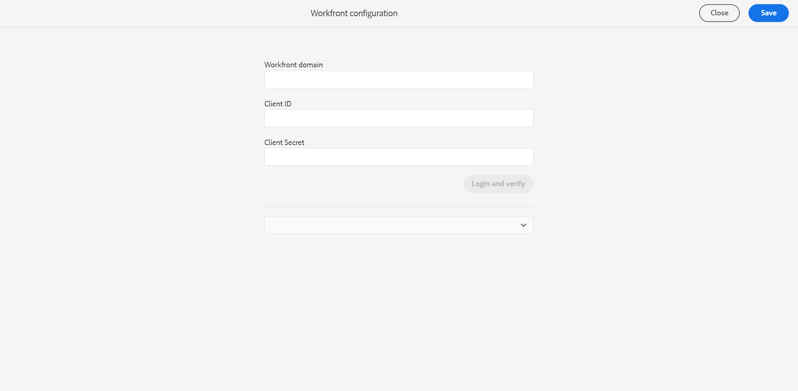

# Configurar Adobe Workfront

O Adobe Workfront é uma solução de gerenciamento de trabalho baseada em nuvem que ajuda equipes e organizações a planejar, rastrear e gerenciar seu trabalho com eficiência. A integração entre o Experience Manager Guides e o Adobe Workfront oferece acesso a recursos robustos de gerenciamento de projetos além dos principais recursos do CCMS do Experience Manager Guides, permitindo planejar, alocar e rastrear tarefas com eficiência.

Saiba mais sobre a [integração do Adobe Workfront](../user-guide/workfront-integration.md) no Experience Manager Guides.

## Pré-requisitos

Antes de começar, verifique se:

1. Você tem acesso padrão ao Adobe Workfront e acesso de administrador ao Experience Manager Guides.
2. Você [cria um novo formulário personalizado no Adobe Workfront](https://experienceleague.adobe.com/pt-br/docs/workfront/using/administration-and-setup/customize/custom-forms/design-a-form/design-a-form) necessário para o Experience Manager Guides usando especificamente os campos abaixo:

   | Tipo de campo | Rótulo | Nome | Opções (Mostrar valores ativados) |
   |------------|------|------|-------------------------------|
   | Lista suspensa de seleção única | Tipo de tarefa | tipo-tarefa | Criação (valor = AUTOR), Publicação (valor = PUBLICAR), Tradução (valor = TRADUÇÃO), Revisão (valor = REVISÃO) |
   | Lista suspensa de seleção única | Estado da tarefa | task-state | Criação (valor = AUTOR), Publicação (valor = PUBLICAR), Tradução (valor = TRADUÇÃO), Revisão (valor = REVISÃO) |
   | Texto com formatação | Lista de autores | lista de autores | - |
   | Texto com formatação | Lista de Revisores | lista de revisores | - |
   | Texto em linha única | URL da revisão | url de revisão | - |
   | Texto em linha única | URL da tarefa | url da tarefa | - |
   | Texto em linha única | Assunto do email | assunto do email | - |

>[!NOTE]
>
> * Na tabela acima, as opções representam as opções disponíveis no campo **Tipo de tarefa**. Para cada opção, você precisaria fornecer o **nome da tarefa** e o **valor da tarefa**. O nome e os valores de cada tipo de tarefa devem ser exatamente os mesmos mencionados na tabela acima. Por exemplo, para o tipo de tarefa Autor, forneça **Autoria** como nome e **AUTOR** como seu valor correspondente.
> * Ao trabalhar com serviços no local, sempre verifique se `localhost` foi substituído pelo endereço de servidor correto na configuração do **Day CQ Link Externalizer** para receber corretamente o link da tarefa resolvida nas notificações por email.
> * Ao criar uma tarefa de revisão no Workfront, os usuários (autores ou revisores) devem fazer parte do grupo **workflow-users**. Além disso, como um **Autor**, você deve fazer parte do grupo **autores-de-conteúdo** e **autores**, enquanto como um **Revisor**, você deve fazer parte do grupo **revisores**.

## Introdução

Execute as seguintes etapas para configurar o Adobe Workfront no Experience Manager Guides.

1. Abra o **painel Ferramentas** e selecione **Guias**.
2. Selecione **Configurar Workfront**.

   A página **Configuração do Workfront** é exibida.

   

3. Na página **Configuração do Workfront**, digite a URL completa do domínio do Workfront, a ID do cliente e a chave Segredo do cliente da sua organização.

   Para acessar a chave **ID do Cliente** e **Segredo do Cliente** configuradas na sua configuração do Adobe Workfront, navegue até `Setup >> Systems>> oAuth2 Applications`.

   Para obter mais detalhes sobre como configurar o domínio do Adobe Workfront, consulte a seção Fluxo do código de autorização em [Criar aplicativos OAuth2 para integrações do Workfront](https://experienceleague.adobe.com/pt-br/docs/workfront/using/administration-and-setup/configure-integrations/create-oauth-application#create-an-oauth2-application-using-user-credentials-authorization-code-flow).

4. Selecione **Fazer logon e verificar**.

   Você é redirecionado para a página de logon da Adobe Workfront.
5. Entre usando seu endereço de email do Adobe Workfront e selecione **Permitir acesso** para permitir que o aplicativo Oauth2 acesse sua respectiva conta do Adobe Workfront.

   Você é redirecionado automaticamente para a página de configuração do Workfront no Experience Manager Guides.

6. Na lista suspensa formulário personalizado, selecione o formulário personalizado Adobe Workfront que você criou para o Experience Manager Guides. Exibir [Pré-requisitos](#prerequisites).
7. Selecione **Salvar e fechar** para aplicar e salvar as alterações de configuração do Workfront.

Após a configuração, [adicione usuários ao Adobe Workfront](https://experienceleague.adobe.com/pt-br/docs/workfront/using/administration-and-setup/add-users/create-manage-users/add-users) usando os mesmos endereços de email que eles têm no Experience Manager Guides.
