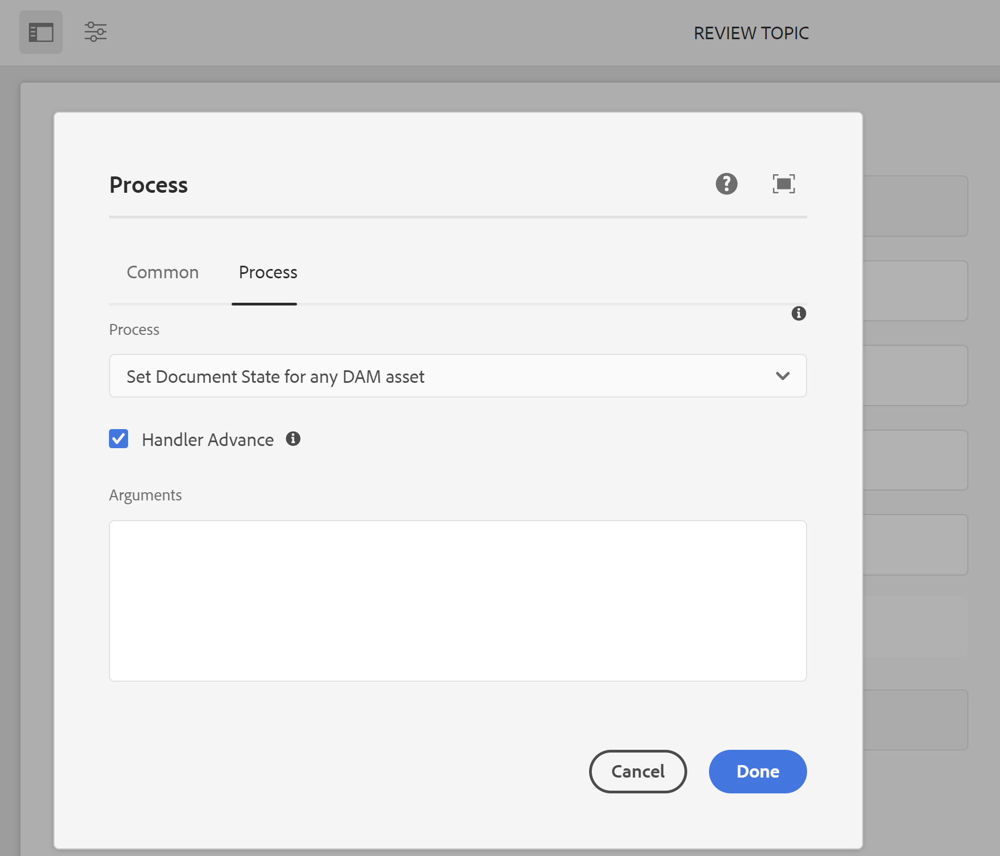

# Configurar estados dos documentos {#id181GB0400UI}

Guias do AEM permitem definir os estados dos documentos para os tópicos do DITA de acordo com os requisitos da organização. Você pode definir diferentes estados do seu documento do início ao fim. Por exemplo, o primeiro estado pode ser Rascunho e pode ser movido para Revisão, Aprovado, Traduzido e finalmente para Publicado.

Há duas maneiras pelas quais um tópico pode passar de um estado para outro: manual e automática. Os estados do documento definidos em um perfil podem ser usados para alterar manualmente o estado do documento. Isso pode ser feito a partir da página Propriedades de um arquivo de tópico. Além disso, você pode definir quem pode mover o documento de um estado para outro estado. Por exemplo, um autor pode criar um documento e o estado padrão do documento pode ser Rascunho. Quando o autor envia o documento para revisão, ele pode alterar o estado do documento para Em revisão. O revisor pode alterar o estado do documento para Aprovado ou Rascunho novamente com base no processo de revisão. Se o documento for Aprovado, o editor poderá alterar o estado do documento para Traduzido ou Publicado, dependendo do fluxo de trabalho.

>[!NOTE]
>
> Se um usuário pertencer à variável *administradores* , o usuário pode alterar o estado de um documento de qualquer estado, independentemente das transições de estado do documento definidas no sistema.

## Criar um estado de documento

Guias de AEM são fornecidos com um conjunto de estados de documento padrão. Esses estados são:

- Rascunho
- Editar
- Em revisão
- Aprovado
- Revisado
- Concluído

Esses estados padrão estão disponíveis para todos os tópicos DITA criados no DAM. Você pode criar seus próprios estados dos documentos e atribuí-los a uma pasta específica. Todos os arquivos DITA criados nessa pasta terão acesso aos estados de documento recém-criados.

Para criar estados de documento usando o Perfil de pasta, execute as seguintes etapas:

1. Clique no link Adobe Experience Manager na parte superior e escolha **Ferramentas**.
1. Selecionar **Guias** na lista de ferramentas.
1. Clique no bloco Estados do documento.

   A página Estados dos ativos é exibida. Por padrão, a página mostra um perfil padrão.

1. Clique em **Criar perfil** e insira os seguintes detalhes:
   - Insira o nome do perfil no campo Profile.
   - Especifique o caminho no qual deseja aplicar o novo perfil.
   - Especificar os estados do documento no campo **Estados permitidos** em **Estados**. Os estados padrão do documento são Rascunho, Editar, Em revisão, Aprovado e Concluído.-

     Clique em **Adicionar** botão para adicionar um estado de documento.

      - Clique no ícone Excluir para excluir um estado de documento.

     >[!NOTE]
     >
     > Não exclua um estado de documento se os documentos ainda estiverem nesse estado. Se você excluir um estado de documento, não poderá alterar o estado desses documentos, a menos que pertença à *administrador* grupo de usuários.

   - Especificar o estado inicial do documento no campo **Estado inicial**.
   - Especificar o estado final do documento no campo **Estado final**.
   - Especificar a transição de estado do documento em **De** e **Para** em **Transição de estado**.

      - Especifique os usuários e grupos de usuários que podem alterar o estado do documento no **Grupos**.

      - Clique em **Adicionar** botão para adicionar uma transição de estado.

      - Clique no ícone Excluir para excluir uma transição de estado.

     >[!NOTE]
     >
     > Não exclua uma transição de estado se os documentos ainda estiverem em `From` estado. Se você excluir uma transição de estado, não poderá alterar o estado desses documentos, a menos que pertença à *administrador* grupo de usuários.

1. Clique em **Concluído**.

## Criar uma cópia de um perfil de estado de documento

Dependendo do seu requisito, você pode criar uma cópia de um perfil de estado de documento existente. Você pode usar a cópia como base para criar outro perfil de documento.

Para criar uma cópia de um perfil de estado do documento, execute as seguintes etapas:

1. Clique no link Adobe Experience Manager na parte superior e escolha **Ferramentas**.
1. Selecionar **Guias** na lista de ferramentas.
1. Clique no bloco Estados do documento.

   A página Estados dos ativos é exibida.

1. Selecione o perfil de estado do documento que deseja duplicar e clique em **Duplicar perfil**.
1. Faça as alterações necessárias e clique em **Concluído**.

## Excluir um estado de documento ou transição de estado

>[!NOTE]
>
> Não exclua um estado de documento ou transição de estado se os documentos ainda estiverem no estado ou em transição de estado. Se você excluir um estado ou transição de estado, não poderá alterar o estado desses documentos, a menos que pertença à *administrador* grupo de usuários.

Execute as seguintes etapas para excluir um estado de documento ou uma transição de estado de um perfil de estado de documento:

1. Clique no link Adobe Experience Manager na parte superior e escolha **Ferramentas**.
1. Selecionar **Guias** na lista de ferramentas.
1. Clique no bloco Estados do documento.

   A página Estados dos ativos é exibida.

1. Selecione o perfil de estado do documento do qual deseja excluir o estado do documento e clique em **Editar perfil**.
1. Exclua o estado do documento ou a transição de estado e clique em **Concluído**.

## Excluir um perfil de estado de documento

Para excluir um perfil de estado do documento, execute as seguintes etapas:

1. Clique no link Adobe Experience Manager na parte superior e escolha **Ferramentas**.
1. Selecionar **Guias** na lista de ferramentas.
1. Clique no link **Estados do documento** bloco.

   A página Estados dos ativos é exibida.

1. Selecione o perfil de estado do documento que deseja excluir e clique em **Excluir perfil**.

## Automatizar a alteração do estado do documento

Se não quiser alterar manualmente os estados do documento, você poderá criar um fluxo de trabalho e automatizar a alteração do estado do documento.

>[!NOTE]
>
> Os workflows automatizados devem estar em conformidade com os estados e as transições do documento definidos na configuração. O sistema não executa nenhuma verificação de alterações de estado feitas por meio de workflows automatizados.

1. Clique no link Adobe Experience Manager na parte superior e escolha **Ferramentas**.
1. Selecionar **Fluxo de trabalho** na lista de ferramentas.

1. Clique no link **Modelos** bloco.

1. Selecione o fluxo de trabalho relevante, considere Revisar tópicos.

1. Clique em **Editar**.

   O workflow é aberto em uma nova guia.

1. Clique em **Editar** \(canto superior direito\).

1. Abra o **Etapas** navegador; uso **Ativar/desativar painel lateral**, na extremidade esquerda da barra de ferramentas superior

1. Arraste a etapa\(s\) apropriada para o local desejado no modelo.

1. Clique na nova etapa adicionada no modelo de fluxo de trabalho e selecione **Configurar** na barra de ferramentas do componente

1. Abra o **Processo** guia.

1. No **Processo** selecione **Definir o estado do documento para qualquer ativo DAM**.

1. Selecione o **Avanço do manipulador** opção.

   

1. No **Argumentos** , digite um estado de documento para o qual deseja fazer a transição do fluxo de trabalho selecionado.

   >[!NOTE]
   >
   > Certifique-se de inserir o estado correto do documento na caixa de texto Argumentos. Se você inserir um valor incorreto, o documento será definido para um estado incorreto.

1. Confirmar a alteração com **Salvar e fechar**.


## Ativar fluxo de trabalho de aprovação

O Guia AEM fornece fluxo de trabalho para aprovação de documentos, que ajuda a controlar o ciclo de vida do processo de desenvolvimento de documentos. Para habilitar o fluxo de trabalho de aprovação, execute as seguintes etapas:

1. Para baixar o arquivo de configuração da interface do usuário, faça logon no Adobe Experience Manager como administrador.

1. Clique no link Adobe Experience Manager na parte superior e escolha **Ferramentas**.
1. Selecionar **Guias** na lista de ferramentas e clique no botão **Perfis de pasta**.
1. Clique no link **Perfil global** bloco.
1. Selecione o **Configuração do editor XML** e clique em **Editar** ícone na parte superior
1. Clique em **Baixar** ícone para baixar o arquivo ui\_config.json no sistema local. Em seguida, você pode fazer alterações no arquivo e fazer upload do mesmo.
1. No `ui_config.json` , ative o recurso de fluxo de trabalho de aprovação alterando o *recursos* conforme mostrado abaixo:

   ```
   "features":  
   { 
      "approvalWorkflow":  true 
   }
   ```

1. Salve o arquivo e faça upload dele.
