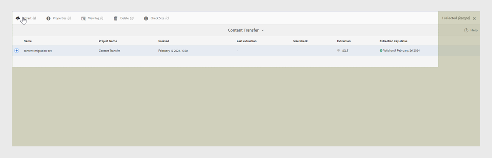
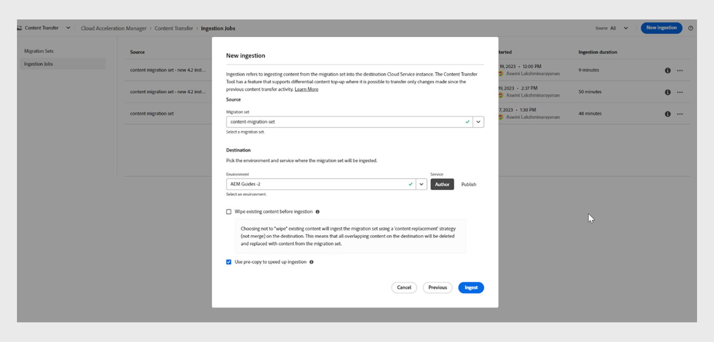

# Migrar conteúdo do local para o Cloud Service

O Experience Manager as a Cloud Service fornece uma base de tecnologia escalável, segura e ágil para Experience Manager Assets, Forms e Screens. Isso permite que profissionais de marketing e TI se concentrem em fornecer experiências impactantes em escala.
Com o Experience Manager as a Cloud Service, suas equipes podem se concentrar em inovar em vez de planejar atualizações de produtos. Os novos recursos do produto são totalmente testados e entregues às suas equipes, sem interrupção, para que elas sempre possam acessar a versão mais recente do Adobe Experience Manager.
Este artigo fornece um processo passo a passo detalhado para migrar o conteúdo do Experience Manager Guides no local ou do Managed Services para o Cloud Service, garantindo uma transição suave para a plataforma baseada em nuvem.

## Processo de migração

A **Ferramenta de transferência de conteúdo** é uma ferramenta desenvolvida pelo Adobe que você pode usar para iniciar a migração de conteúdo existente de uma instância de origem do Adobe Experience Manager no local ou do Managed Services para a instância do Experience Manager Cloud Service de destino.
Essa ferramenta também transfere entidades principais (usuários ou grupos) automaticamente.

Você pode baixar a **Ferramenta de Transferência de Conteúdo** como um arquivo ZIP no portal de **Distribuição de Software**:

1. Selecione a guia **AEM as a Cloud Service** no portal **Distribuição de Software**.
1. Pesquisar **Ferramenta de Transferência de Conteúdo**.
1. Selecione **Ferramenta de transferência de conteúdo** na lista e baixe-a.

Em seguida, instale o pacote por meio do **Gerenciador de Pacotes** na instância do Adobe Experience Manager de origem. Baixe a versão mais recente.
Para obter mais detalhes sobre a versão mais recente, consulte as [Notas de versão](https://experienceleague.adobe.com/docs/experience-manager-cloud-service/content/release-notes/release-notes/release-notes-current.html?lang=en).

>[!NOTE]
> 
> Somente a versão 2.0.0 e superior é compatível, e é recomendável usar a versão mais recente.

### Pré-requisitos

* Adobe Experience Manager 6.4 ou versões posteriores
* Suporte para até 20 TB de tamanho de repositório
* Tamanho total do índice Lucene de 25 GB
* O comprimento do nome de um nó deve ser inferior a 150 bytes

Execute as seguintes etapas para migrar seu conteúdo do Experience Manager Guides para o Experience Manager as a cloud service.

1. Faça logon em [experience.adobe.com](https://experience.adobe.com/) e selecione **Experience Manager**.

   

1. Clique em **Iniciar** no bloco **Cloud Acceleration Manager**.
   

1. Crie seu primeiro projeto.
   

1. Adicione o nome e a descrição e clique em **Criar**. Seu projeto foi criado.
1. Selecione o projeto criado e abra a tela do projeto.
1. Clique em **Revisão** no bloco **Transferência de conteúdo**.

   

1. Clique em **Criar conjunto de migração**.

1. Forneça o nome e a descrição do conjunto de migração.

   

1. Após a criação, selecione os três pontos e selecione **Copiar chave de extração**.

1. Clique em **Copiar para a área de transferência**. Crie seu primeiro projeto.
   

1. Selecione **Adobe Experience Manager** na parte superior e selecione o bloco **Distribuição de Software**.
   

1. No portal **Distribuição de Software**, selecione **Adobe Experience Manager como a guia Cloud Service**, pesquise &quot;ferramenta de transferência de conteúdo&quot; e baixe o pacote de ferramentas de transferência de conteúdo.

   >[!NOTE]
   >
   >  Certifique-se de baixar a versão mais recente.

1. Carregue e instale o pacote `content-transfer.all-3.0.10.zip` no **Gerenciador de Pacotes** da sua instância local.
   

1. Na instância local, selecione **Ferramentas** > **Operações** > **Migração de Conteúdo** > **Transferência de Conteúdo**.

1. Selecione **Transferência de conteúdo**, crie um conjunto de migração e cole a chave de extração copiada do gerenciador do Cloud Acceleration. Isso estabelece uma conexão entre a origem e o destino. Em seguida, ele verifica a chave e mostra a validade após inserir o valor.

1. Habilite a opção **Incluir versões** para incluir as versões do arquivo.
   

1. Forneça o caminho que você deseja migrar e clique em **Salvar**.
Por exemplo, `/content/we-retail`
ou
   `/content/dam/wknd-events`
   

   >[!NOTE]
   >
   > Você precisa migrar os seguintes caminhos obrigatoriamente para o conteúdo do **Experience Manager Guides**.

   * `/content/dam`
   * `/var/dxml`

   Os seguintes caminhos estão restritos ao criar um conjunto de migração:
   * `/apps`
   * `/libs`
   * `/home`
   * `/etc` Você pode selecionar alguns caminhos `/etc` na CTT.

1. Clique em **Salvar**
1. Selecione o **conjunto de migração** e selecione **Extrair** na parte superior.
   

1. Verifique os detalhes no pop-up **Extração do conjunto de migração** para os caminhos e configurações selecionados e clique em **Extrair**. A extração levará minutos, e você visualizará o status como atualizado.
   

1. Quando a extração for concluída e indicada pelo status `finished`, vá para Cloud Acceleration Manager e selecione o projeto que você criou na etapa 18.
Para obter mais informações, selecione os três pontos e, em seguida, selecione **Exibir detalhes**.

1. Na janela pop-up Detalhes do conjunto de migração, verifique a configuração do conjunto de migração e feche a janela pop-up. Você pode visualizar os caminhos e outras configurações como mostrado na seguinte captura de tela:
   

1. Clique em **Trabalhos de assimilação** > **Nova assimilação**.
1. Confirme os valores de marca de seleção necessários e clique em **Criar**.
   

1. Escolha o conjunto de migração, selecione o servidor necessário do seu ambiente e clique em **Assimilar**.

   

## Executar a ferramenta Transferência de conteúdo em uma instância do Publish

Instale a Ferramenta Transferência de conteúdo na instância do Publish de origem para mover o conteúdo para a instância do Publish de destino.
A ferramenta Transferência de conteúdo não diferencia entre conteúdo publicado e não publicado ao assimilar conteúdo em um ambiente do Publish. O conteúdo especificado no conjunto de migração é assimilado na instância de destino escolhida. O usuário pode assimilar um conjunto de migração em uma instância do Autor, instância do Publish ou em ambas.

### Abordagem recomendada

Considere as seguintes recomendações:

* Use a mesma versão da **Ferramenta de transferência de conteúdo** que foi usada na instância do Autor.
* Durante a assimilação no Publish, o nível do Publish não será reduzido (ao contrário do autor).
* Migrar apenas um único nó do Publish. Antes de iniciar a extração, remova-a do balanceador de carga.

>[!NOTE]
>
> Como precaução, verifique se não ocorrem operações de gravação nas instâncias do Publish, incluindo ações iniciadas pelo usuário como:
> * Distribuição de conteúdo do autor do AEM as a Cloud Service para o Publish nesse ambiente
> * Sincronização de usuários entre instâncias do Publish

## Resolução de problemas

Se a extração falhar devido ao seguinte erro, você poderá resolver isso importando o certificado de CA relevante:

`javax.net.ssl.SSLHandshakeException: sun.security.validator.ValidatorException: PKIX path building failed: sun.security.provider.certpath.SunCertPathBuilderException: unable to find valid certification path to requested target`

**Motivo**: o servidor Adobe Experience Manager tem restrições de firewall, então adicione o seguinte ponto de extremidade à lista de permissões.

`casstorageprod.blob.core.windows.net`

*Habilitar o log SSL.*

