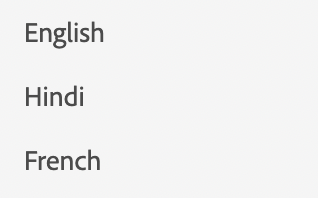

# Lista

Para exibir uma lista, usamos a lista de componentes.

```js title="list.js"
const listJSON =  {
    "component": "list", //tells the component name
    "data": "@languages", // an array of list items
},
```

Aqui, a linguagem é uma simples matriz de strings. `languages = ["English", "Hindi", "French"]`
Caso queiramos renderizar uma lista de objetos, podemos especificar a estrutura usando a configuração de item.

```js title="list.js"
const listJSON =  {
    "component": "list", //tells the component name
    "data": "@projects", // an array of list items
    "itemConfig": { // used to define the structure of the list items.
    "component": "widget",
    "id": "checkbox_label"
    }
},
```

Normalmente itemConfig é um `widget`. Para saber mais sobre widgets, acesse [Widgets](../Widgets/basic-widget.md)

A lista renderizada terá esta aparência:


