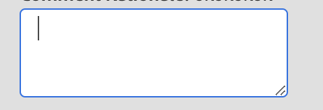

# Campo de texto e área de texto

Para usar o texto como uma entrada, usamos os componentes, o campo de texto e a área de texto.
O componente de área de texto na interface representa um html `<textarea/>`.

```js title="textArea.js"
const textAreaJSON =  {
    "component": "textarea", //tells the component name
    "id": "input_name", // can be used to give a unique identifier to a component
    "data": "@name", // the variable storing the inputted text
    "on-keyup": {
        "name": "submitName",
        "eventArgs": {
            "keys": [
            "ENTER"
            ]
        }
    },
},
```

Aqui, `on-keyup` é a sintaxe para invocar os comandos nos controladores.
Isso produzirá uma textArea onde pressionar ENTER chamará o evento `submitName`

A área de texto renderizada terá esta aparência:


