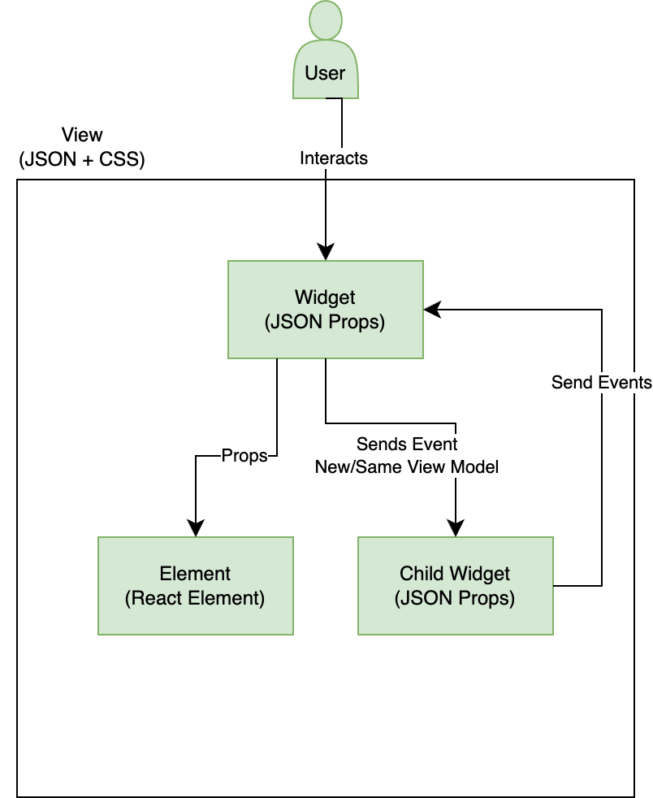

# Estrutura Jui

Antes de entrar em como escrever extensões, entenderemos a arquitetura da estrutura.
Para que possamos estendê-la efetivamente.

## Introdução

A JUI é uma estrutura MVC sobre componentes do React e do Espectro de Reação Adobe. A JUI é a interface do usuário JSON. Ele consiste em vários repositórios Git.

JUI-Core é a biblioteca principal com toda a lógica para converter a configuração JSON em componentes de reação em funcionamento e vinculá-la a uma instância de classe de controlador relevante.
JUI-React-Spectrum  A biblioteca tem widgets de wrapper de componentes do React Spectrum Adobe

## Design de núcleo JUI

### Design da interface do MVC

### Widget

- Tem um identificador exclusivo.
- Tem um arquivo JSON individual para exibição.
- Pode ter um Controlador próprio ou compartilhado.
- Pode usar modelo principal ou novo modelo.
- Pode ter elementos de interface do usuário (Componentes do React)
- Pode ter outros widgets
- O aplicativo é um widget

### Elemento

- É um componente de HTML/React.
- Não tem nenhum modelo, o usa um modelo de widget principal.

### Manipulador de eventos

- Next(eventOpts)
   - Para acionar um evento com algumas opções
- Assinar (retorno de chamada)
   - Obter notificação de que o evento é acionado com configuração

### Modelo global/aplicativo

- Next(novo valor)
   - Para publicar o novo valor
- Assinar (retorno de chamada)
   - Para obter notificação sobre a alteração de valor
   - Primeira vez que obter valor antigo
- GetValue()
   - Para obter o valor atual

### Controlador

- Ele deve ser estendido da classe Controller
- APIs
- CriarModelo
   - Para criar um modelo separado do widget filho
- InitEventHandler
   - Para criar um manipulador de eventos separado por widget filho
- RegisterCommands
   - Para registrar eventos locais, principais ou de aplicativos
- Next(eventName, eventHandler)
   - Para acionar um evento do manipulador de eventos do widget filho, do manipulador de eventos do widget pai ou do manipulador de eventos do aplicativo
- Subscribe(retorno de chamada, eventHandler)
- SubscribeAppModel(callback)

### Exemplo de design do aplicativo

