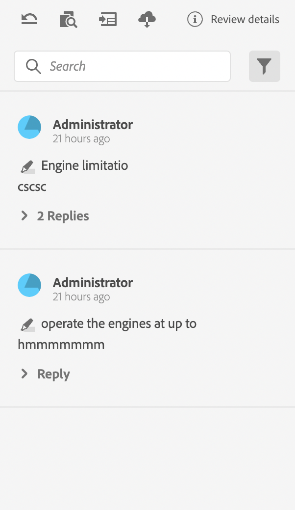
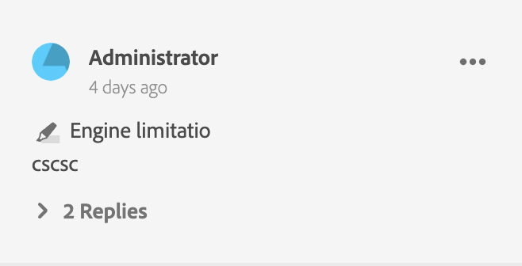
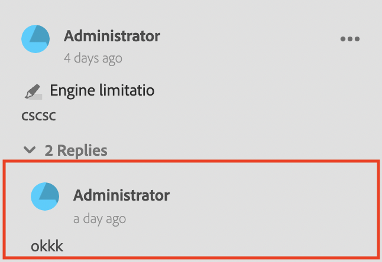
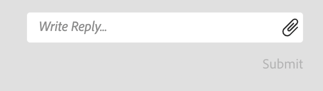

# Componentes do aplicativo de revisão

A seguir estão os principais componentes do aplicativo de análise:

- Painel de Revisão Embutido: `id: inline_review_panel`
   - O painel direito onde os comentários da revisão são renderizados no lado do Editor de XML.

- Revisões de Tópico: `id: topic_reviews`
   - O painel direito onde os comentários são renderizados no aplicativo de revisão.

- Comentário de Revisão: `id: review_comment`
   - O widget para cada comentário de revisão.

Comentário de revisão no aplicativo de revisão:

Comentário de revisão no lado do editor xml:

- Resposta ao Comentário da Revisão: `id: comment_reply`
   - O widget para cada resposta de comentário de revisão.
     

- Nova resposta de comentário de revisão: `id: comment_new_reply`
   - O widget para nova resposta de comentário de revisão.
     

- Caixa de Ferramentas de Anotação: `id: annotation_toolbox`
   - A barra de ferramentas superior direita no aplicativo de análise.
     
