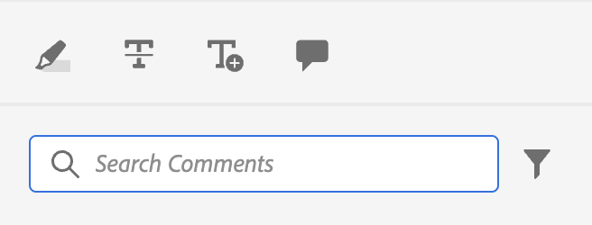

# Exemplo de personalização simples

Saiba como integrar essas personalizações no nosso aplicativo AEM Guides.

Queremos adicionar este botão em uma visualização existente do aplicativo.
Para isso, precisamos de 3 coisas básicas:

1. O `id` da visualização JSON à qual queremos adicionar nosso componente.
2. O `target`, ou seja, o local no JSON ao qual queremos adicionar o novo componente. O `target` é definido usando um `key` e `value`. O par de valor principal pode ser qualquer atributo usado para definir o componente que pode ajudar na identificação exclusiva dele.
Também podemos usar índices para fazer referência ao target.
Temos 3 viewStates: `APPEND`, `PREPEND`, `REPLACE`.
3. O JSON do componente recém-criado e os métodos correspondentes.

Digamos que queiramos adicionar um botão à caixa de ferramentas de anotação usada na revisão, que abre o arquivo no AEM.

```typescript
export default {
  id: 'annotation_toolbox', 
  view: {
    items: [
      {
        component: 'button',
        icon: 'linkOut',
        title: 'Open topic in Assets view',
        'on-click': 'openTopicInAEM',
        target: {
          key: 'value',
          value: 'addcomment',
          viewState: VIEW_STATE.APPEND

        },
      },
    ],
  },
  controller: {
    openTopicInAEM: function (args) {
        const topicIndex = tcx.model.getValue(tcx.model.KEYS.REVIEW_CURR_TOPIC)
        const {allTopics = {}} = tcx.model.getValue(tcx.model.KEYS.REVIEW_DATA) || {}
        tcx.appGet('util').openInAEM(allTopics[topicIndex])
    },
  },
}
```

No exemplo acima, temos:

1. o `id` do JSON no qual queremos inserir nosso componente, ou seja, `annotation_toolbox`
2. o destino é o botão `addcomment`. Adicionamos nosso botão após o botão `addcomment` usando viewState `append`.
3. Definimos o evento de clique do botão no controlador.

O JSON para a &quot;annotation_toolbox&quot; `.src/jsons/review_app/annotation_toolbox.json`

Antes da personalização, a caixa de ferramentas de anotação tinha esta aparência:



Após a personalização, a caixa de ferramentas de anotação fica assim:


## Adição de CSS

Para manter a consistência, fornecemos o componente já estilizado. O JSON inserido terá estilos inerentes aplicados a ele
A principal maneira de gerenciar o css é por meio da chave extraClass nas extensões.

```js
{    
    "view":{
        items:[
            {
                compoenent:"button",
                extraClass:"underline bg-red",
            }
        ]
    }
}
```

Você pode colocar estilos personalizados com classes CSS adicionando um arquivo css às clientlibs. Durante a compilação, também criamos saída [Tailwind](https://tailwindcss.com/docs/utility-first) para as classes de utilitários em tailwind. A configuração para o mesmo pode ser encontrada no `tailwind.config.js` da extensão em `./tailwind.config.js`
