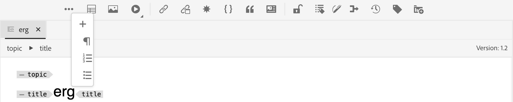

# Personalização da barra superior e da barra de ferramentas

Para personalizar o `topbar` e `toolbar`, você pode usar as ids: `topbar` ou `toolbar`, e seguir a mesma exibição, estrutura de controlador.

>[!NOTE]
>
>A partir da versão 2502 do Experience Manager Guides, a ID **barra de ferramentas** foi renomeada para **barra de ferramentas do editor**. Se você estiver usando as versões anteriores, poderá personalizar a barra de ferramentas usando a ID da **barra de ferramentas**. Agora não temos nenhuma ID como **barra superior** e temos uma **barra_guia_do_editor**.

Veja abaixo um exemplo simples de personalização da barra de ferramentas. Aqui, removemos o botão `Insert Numbered List` e substituímos o botão `Insert Paragraph` pelo nosso próprio componente usando um manipulador personalizado de cliques.

>[!TIP]
>
>Como a **barra_de_ferramentas_do_editor** foi projetada para renderizar botões, a adição de widgets a ela pode interromper o CSS e a capacidade de resposta. É recomendável incluir apenas botões ou componentes básicos, como um rótulo.

Para acessar a funcionalidade exposta sob o objeto `proxy`, você precisa acessá-la usando `this.getValue`, digamos, para buscar um valor.

Para a versão AEM Guides 2502 e posteriores, consulte o exemplo abaixo para obter a personalização da barra de ferramentas.

```js title = toolbar_customization.js
const toolbarExtend = {
    id: "editor_toolbar",
    view: {
        items: [
            {
                component: "div",
                target: {
                    key:"title",value: "Insert Numbered List",                    
                    viewState: VIEW_STATE.REPLACE
                }
            },
            {
                "component": "button",
                "icon": "textParagraph",
                "variant": "action",
                "quiet": true,
                "title": "Insert Paragraph",
                "on-click": "INSERT_P",
                target: {
                    key:"title",value: "Insert Paragraph",                    
                    viewState: VIEW_STATE.REPLACE
                }
            },
            {
                "component": "button",
                "icon": "fileHTML",
                "variant": "action",
                "quiet": true,
                "title": "URL Link Customization",
                "on-click": "openExternalLinkDialog",
                target: {
                key: "title", value: "Insert Bulleted List",
                viewState: VIEW_STATE.REPLACE
                }
            }
        ]
    },
    controller: {
        init: function() {
            console.log(this.getValue("canUndo"))
            this.subscribeAppEvent({
              key: "editor.preview_rendered",
              next: async function (e) {
                console.log(this.getValue("canUndo"))
              }.bind(this)
            })
        },
        INSERT_P(){
            this.appEventHandlerNext("AUTHOR_INSERT_ELEMENT",  "p" )
        },
        openExternalLinkDialog() {
            this.appEventHandlerNext("AUTHOR_INSERT_ELEMENT",
                {
                args: "<xref href='' scope='external' format = 'dita' ></xref>", activeTabId: "conkey_reference"
                }
            )
        }
    }
}
```


Uma vez personalizada, a saída final pode ser vista da seguinte maneira:


Consulte o exemplo abaixo se estiver personalizando a barra de ferramentas na versão 4.6.x e na versão anterior do AEM Guides.

```js title = toolbar_customization.js
const topbarExtend = {
    id: "toolbar",
    view: {
        items: [
            {
                component: "div",
                target: {
                    key:"title",value: "Insert Element",                    
                    viewState: VIEW_STATE.REPLACE
                }
            },
            {
                component: "div",
                target: {
                    key:"title",value: "Insert Paragraph",                    
                    viewState: VIEW_STATE.REPLACE
                }
            },
            {
                component: "div",
                target: {
                    key:"title",value: "Insert Numbered List",                    
                    viewState: VIEW_STATE.REPLACE
                }
            },
            {
                component: "div",
                target: {
                    key:"title",value: "Insert Bulleted List",                    
                    viewState: VIEW_STATE.REPLACE
                }
            },
            {
                "component": "button",
                "extraclass": "insert-multimedia",
                "icon": "more",
                "variant": "action",
                "quiet": true,
                "holdAffordance": true,
                "title": "More Insert Options",
                "elementID": "toolbar_insert",
                "on-click": {
                    "name": "APP_SHOW_OPTIONS_POPOVER",
                    "args":{
                        "target": "toolbar_insert",
                        "extraclass": "new_options_buttons",
                        "items": [
                            {
                                "component": "button",
                                "icon": "add",
                                "variant": "action",
                                "quiet": true,
                                "title": "Insert Element",
                                "on-click": "AUTHOR_SHOW_INSERT_ELEMENT_UI"
                            },
                            {
                                "component": "button",
                                "icon": "textParagraph",
                                "variant": "action",
                                "quiet": true,
                                "title": "Insert Paragraph",
                                "on-click": "INSERT_P"
                            },
                            {
                                "component": "button",
                                "icon": "textNumbered",
                                "variant": "action",
                                "quiet": true,
                                "title": "Insert Numbered List",
                                "on-click": "AUTHOR_INSERT_REMOVE_NUMBERED_LIST"
                            },
                            {
                                "component": "button",
                                "icon": "textBulleted",
                                "variant": "action",
                                "quiet": true,
                                "title": "Insert Bulleted List",
                                "on-click": "AUTHOR_INSERT_REMOVE_BULLETED_LIST"
                            },
                            {
                                "component": "button",
                                "icon": "table",
                                "variant": "action",
                                "quiet": true,
                                "title": "Insert Table",
                                "on-click": "AUTHOR_INSERT_ELEMENT",
                            }
                        ]
                    },
                },
                target: {
                    key:"title",value: "Insert Table",                    
                    viewState: VIEW_STATE.REPLACE
                }
            },
        ]
    },
    controller: {
        init() {
            console.log(this.proxy.getValue('canUndo'))
            this.proxy.subscribeAppEvent({
                key: "editor.preview_rendered",
                next: async function (e) {
                    console.log(this.proxy.getValue('canUndo'))
                }.bind(this)
            })
        },
        INSERT_P(){
            this.next("AUTHOR_INSERT_ELEMENT",  "p" )
        }
    }
}
```

Uma vez personalizada, a saída final pode ser vista da seguinte maneira:




Em outro exemplo, criamos um botão personalizado da barra de ferramentas que pode ir diretamente para as subopções desejadas de **Referência cruzada**, como Email, Referência de arquivo, Weblink etc.


```js title = toolbar_customisation.js
const toolbarExtend = {
    id: "editor_toolbar",
    view: {
        items: [
            
                {
                    "component": "button",
                    "icon": "fileHTML",
                    "variant": "action",
                    "quiet": true,
                    "title": "External URL Link",
                    "on-click": "openExternalLinkDialogP",
            
                target: {
                    key:"title",value: "Insert Bulleted List",                    
                    viewState: VIEW_STATE.REPLACE
                }
            }
        ]
    },
    controller: {
        openExternalLinkDialog() {
            tcx.eventHandler.next ("AUTHOR_INSERT_ELEMENT")
            t{
          args:"<xref href='' scope='external' format = 'dita' ></xref>",activeTabId:"conkey_reference"
        }
    }
  }
}
```

Aqui, `activeTabId` é a enumeração para selecionar a guia correta. Por padrão, selecionar a guia Referência cruzada abre `file_link`. Você pode alterar os valores de `activeTabId` para `content_reference`, `conkey_reference`, `key_reference`, `file_link`, `web_link` e ` email_link` com base no requisito.
