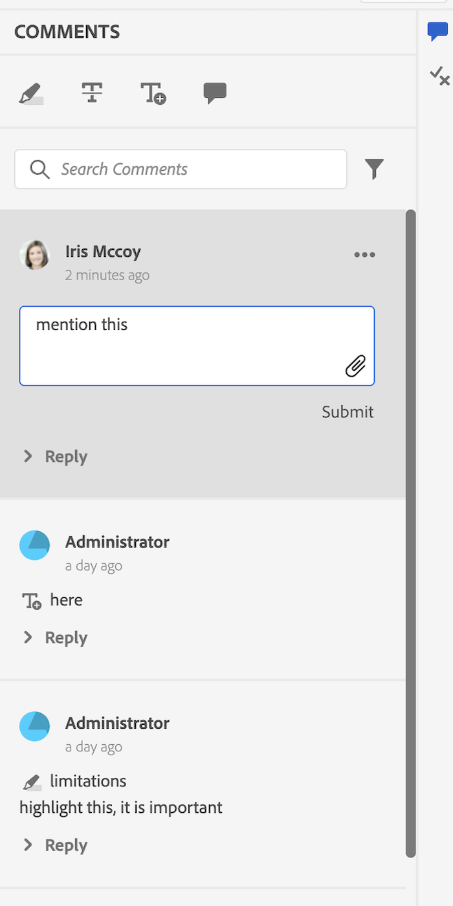

# Exemplos

Neste pacote, também fornecemos alguns exemplos de personalização (disponíveis em `guides_extension/src`). Veja abaixo uma breve descrição de cada uma delas.

1. **Menu de Contexto**: neste exemplo, personalizamos o menu de contexto `file_options` para remover as opções `Delete` e `Edit` e substituir a opção `Duplicate` por uma opção `Download`. Baixe a amostra de código para [Menu de Contexto](./examples/file_options.ts).

```typescript
enum VIEW_STATE {
  APPEND = 'append',
  PREPEND = 'prepend',
  REPLACE = 'replace',
}

const loadDitaFile = (filePath, uuid) =>{
  return $.ajax({
    type: 'POST',
    url: '/bin/referencelistener',
    data: {
        operation: 'getdita',
        path: filePath,
        type: uuid ? 'UUID' : 'PATH',
        cache: false,
    },
  })
}

const fileOptions = {
  id: "file_options",
  contextMenuWidget: "repository_panel",
  view: {
    items: [
      {
        component: "div",
        target: {
          key: "displayName", value: "Delete",
          viewState: VIEW_STATE.REPLACE
        }
      },
      {
        component: "div",
        target: {
          key: "displayName", value: "Edit",
          viewState: VIEW_STATE.REPLACE
        }
      },
      {
        "displayName": "Download",
        "data": {
          "eventid": "downloadFile"
        },
        "icon": "downloadFromCloud",
        "class": "menu-separator",
        target: {
          key: "displayName", value: "Duplicate",
          viewState: VIEW_STATE.REPLACE
        }
      },
    ]
  },

  controller: {
    downloadFile() {
      const path = this.getValue('selectedItems')[0].path
      loadDitaFile(path, true).then((file) => {
        function download_file(name, contents) {
          const mime_type = "text/plain";

          const blob = new Blob([contents], { type: mime_type });

          const dlink = document.createElement('a');
          dlink.download = name;
          dlink.href = window.URL.createObjectURL(blob);
          dlink.onclick = function () {
            // revokeObjectURL needs a delay to work properly
            const that = this;
            setTimeout(function () {
              window.URL.revokeObjectURL(that.href);
            }, 1500);
          };

          dlink.click();
          dlink.remove();
        }
        download_file(path, file.xml)

      });
    }
  }
}

export default fileOptions
```

1. **Painel esquerdo**: neste exemplo, personalizamos o `left tab panel` para ter outro`tab` denominado &quot;TEST EXTENSION&quot;, e um `tab panel` correspondente que tenha um rótulo: `Test Tab Panel`.
Baixe a amostra de código para [Painel Esquerdo](./examples/left_panel_container.ts).

```typescript
const tabLeftPanel = {
    "id": "left_panel_container",
    "tabView": {
        "id": "left_panel_container",
        "tabs": [
            {
                "component": "tab",
                "id": "new_tab_extension",
                "extraclass": "collection-panel-tab",
                "showClass": "@visibleTabs.collection_panel",
                "on-click": "tabClick",
                "icon": "collection",
                "title": "TEST EXTENSION",
                "label": "TEST EXTENSION",
                "prevTabID": "condition_panel"
            },
        ],
        "tabPanels":
            [
                {
                    "component": "tabPanel",
                    "tabId": "new_tab_extension",
                    "showClass": "@visibleTabs.citation_panel",
                    "items": [
                        {
                            "id": "annotation_toolbox"
                        }
                    ],
                },
            ]
    }
}
export default tabLeftPanel
```

1. **Painel Direito**: Neste exemplo, personalizamos o `right tab panel` para ter outro `tab` chamado &quot;TEST EXTENSION&quot;, e um `tab panel` correspondente que tenha um rótulo: `New Tab Panel`. Baixe a amostra de código para [Painel Direito](./examples/right_panel_container.ts).

```typescript
const rightPanel = {
    "id": "right_panel_container",
    "tabView": {
        "id": "right_panel_container_tab",
        "tabs": [
            {
                "component": "tab",
                "id": "new_tab_extension",
                "on-click": "tabClick",
                "icon": "collection",
                "title": "TEST EXTENSION",
            },
        ],
        "tabPanels":
            [
                {
                    "component": "tabPanel",
                    "tabId": "new_tab_extension",
                    "items": [
                        {
                            "component": "label",
                            "label": "New Tab Label",
                        }
                    ],
                },
            ]
    }
}
export default rightPanel
```

1. **Painel do repositório**: baixe a amostra de código para o [Painel do Repositório](./examples/repository_panel.ts).

```typescript
export enum VIEW_STATE2 {
  APPEND = 'append',
  PREPEND = 'prepend',
  REPLACE = 'replace',
}

export default {
  class: "flex bg-red-100 bg-green-200 bg-green-300 mr-4",
  id: 'repository_panel',
  view: {
    className: '',
    items: [
      {
        target: {
          key: "id",
          value: 'respository-'
          ,
        },
        component: 'widget',
        id: 'loading_shimmer',
        viewState: VIEW_STATE2.REPLACE,
        index: 2,
      },
      {
        component: 'button',
        label: 'Close',
        'on-click': 'cancel',
        variant: 'secondary',
        quiet: true,
        index: 20,
      },
      {
        label: "@testLabel",
        component: "label"
      }
    ],
  },
  controller: {
    init: function() {
      console.log('subject: ', this.subject)      
      this.subscribe({
        key: 'rename',
        next: () => { console.log('rename using extension') }
      })
      console.log('Logging view config ', this.viewConfig)
      this.next(this.viewConfig.items[1].searchModeChangedEvent, { searchMode: true })
      this.subscribeAppEvent({
        key: 'app.active_document_changed',
        next: () => { console.log('active doc changed subs') }
      })
      this.subscribeAppModel('app.mode',
        () => { console.log('app mode subs') }
      )
      this.subscribeParentEvent({
        key: 'tabChange',
        next: () => { console.log('tab change subs') }
      })
      this.parentEventHandlerNext('tabChange', {
        data: 'map_panel'
      })
      this.appModelNext('app.mode', 'author')
      this.appEventHandlerNext('app.active_document_changed', 'active doc changed')
    },
    cancel: function (args) {
      this.setValue('testLabel', 'testlabel2')
    },
  },
  model: {
    deps: ['testLabel'],
  },
}   
```


1. **Barra de ferramentas**: neste exemplo, substituímos os botões `Insert Element`, `Insert Paragraph`, `Insert Numbered List`, `Insert Bulleted List` por um único botão `More Insert Options` que contém todos esses. Baixe a amostra de código para [Barra de Ferramentas](./examples/toolbar.ts).

```typescript
import { VIEW_STATE } from "./review_app_examples/review_comment"

const topbarExtend = {
    id: "toolbar",
    view: {
        items: [
            {
                component: "div",
                target: {
                    key: "title", value: "Insert Element",
                    viewState: VIEW_STATE.REPLACE
                }
            },
            {
                component: "div",
                target: {
                    key: "title", value: "Insert Paragraph",
                    viewState: VIEW_STATE.REPLACE
                }
            },
            {
                component: "div",
                target: {
                    key: "title", value: "Insert Numbered List",
                    viewState: VIEW_STATE.REPLACE
                }
            },
            {
                component: "div",
                target: {
                    key: "title", value: "Insert Bulleted List",
                    viewState: VIEW_STATE.REPLACE
                }
            },
            {
                "component": "button",
                "extraclass": "insert-multimedia",
                "icon": "more",
                "variant": "action",
                "quiet": true,
                "holdAffordance": true,
                "title": "More Insert Options",
                "elementID": "toolbar_insert",
                "on-click": {
                    "name": "APP_SHOW_OPTIONS_POPOVER",
                    "args": {
                        "target": "toolbar_insert",
                        "extraclass": "new_options_buttons",
                        "items": [
                            {
                                "component": "button",
                                "icon": "add",
                                "variant": "action",
                                "quiet": true,
                                "title": "Insert Element",
                                "on-click": "AUTHOR_SHOW_INSERT_ELEMENT_UI"
                            },
                            {
                                "component": "button",
                                "icon": "textParagraph",
                                "variant": "action",
                                "quiet": true,
                                "title": "Insert Paragraph",
                                "on-click": "INSERT_P"
                            },
                            {
                                "component": "button",
                                "icon": "textNumbered",
                                "variant": "action",
                                "quiet": true,
                                "title": "Insert Numbered List",
                                "on-click": "AUTHOR_INSERT_REMOVE_NUMBERED_LIST"
                            },
                            {
                                "component": "button",
                                "icon": "textBulleted",
                                "variant": "action",
                                "quiet": true,
                                "title": "Insert Bulleted List",
                                "on-click": "AUTHOR_INSERT_REMOVE_BULLETED_LIST"
                            },
                            {
                                "component": "button",
                                "icon": "table",
                                "variant": "action",
                                "quiet": true,
                                "title": "Insert Table",
                                "on-click": "AUTHOR_INSERT_ELEMENT",
                            }
                        ]
                    },
                },
                target: {
                    key: "title", value: "Insert Table",
                    viewState: VIEW_STATE.REPLACE
                }
            },
        ]
    },
    controller: {
        init() {
            console.log(this.proxy.getValue("canUndo"))
            this.proxy.subscribeAppEvent({
              key: "editor.preview_rendered",
              next: async function (e) {
                console.log(this.proxy.getValue("canUndo"))
              }.bind(this)
            })
        },
        INSERT_P() {
            this.next("AUTHOR_INSERT_ELEMENT", "p")
        }
    }
}

export default topbarExtend
```

1. **Botão Gerenciar no painel Metadados**: neste exemplo, personalizamos o botão **Gerenciar** (localizado no painel Metadados da página Relatórios) para que ele fique desabilitado quando os arquivos selecionados estiverem no modo somente leitura. Isso ajuda a impedir edições acidentais de metadados em arquivos que não se destinam à edição. Baixe a amostra de código para o [botão Gerenciar no painel Metadados](./examples/metadata_report_manage_button.ts).

```typescript
const mapConsoleActionBar = {
  id: "map_console_action_bar",
  view: {
    items: [
      {
        "key": "manageTags",
        "component": "button",
        "title": "Manage",
        "on-click": "reports.manage_report",
        "label": "Manage",
        "icon": "s2AppGear",
        "type": "secondary",
        "variant": "action",
        "quiet": true,
        "show": "@showManageTags",
        "disabled": "$$extensionMap.overrideShowManageTags",
        target: {
          key: "title", value: "Manage",
          viewState: 'replace'
        }
      },
      {

        "key": "selectAll",
        "component": "button",
        "title": "@selectAllTitle",
        "on-click": "SELECT_ALL",
        "label": "@selectAllTitle",
        "variant": "action",
        "extraclass": "select-all-button",
        "quiet": true,
        "show": "@showSelectAllButton",
        "hide": "$$extensionMap.overrideShowManageTags",
        target: {
          key: "key", value: "selectAll",
          viewState: 'replace'
        }
      },
    ]
  }
}

function getAutoCheckoutConfigFromAppModel() {
  const config = tcx.model.getValue(tcx.model.KEYS.EDITOR_CHECKOUT_CONFIG)
  return config === true || config === 'true'
}

const bulkMetadataEditorController = {
  id: "bulkmetadata_report_view",
  controller: {
    rowSelectionChanged() {
      const selectedItems = this.getValue('selectedItems');
      let areReadOnlyFilesSelected = false;
      let autoCheckoutConfig = getAutoCheckoutConfigFromAppModel();

      for (let idx = 0; idx < selectedItems.length; idx++) {
        const item = selectedItems[idx].obj;
        const isLocked = Boolean(item.isCheckedOut);

        if (autoCheckoutConfig && !isLocked) {
          areReadOnlyFilesSelected = true;
          break;
        }
      }

      this.setExtensionAppState('overrideShowManageTags', areReadOnlyFilesSelected);
    }
  }
}

export {
  mapConsoleActionBar,
  bulkMetadataEditorController
}
```

## Revisar exemplos do aplicativo

1. **Caixa de Ferramentas de Anotação**: neste exemplo, adicionamos outro botão à caixa de ferramentas de anotação que abre o tópico de revisão atual no AEM. Baixe a amostra de código para a [Caixa de Ferramentas de Anotação](./examples/review_app_examples/annotation_extension.ts).

```typescript
import { VIEW_STATE } from './review_comment'

export default {
  id: 'annotation_toolbox',
  view: {
    items: [
      {
        component: 'button',
        icon: 'linkOut',
        title: 'openTopicInAEM',
        'on-click': 'openTopicInAEM',
        target: {
          key: 'value',
          value: 'addcomment',
          viewState: VIEW_STATE.APPEND
        },
      },
    ],
  },
  controller: {
    openTopicInAEM: function (args) {
      const topicIndex = tcx.model.getValue(tcx.model.KEYS.REVIEW_CURR_TOPIC)
      const { allTopics = {} } = tcx.model.getValue(tcx.model.KEYS.REVIEW_DATA) || {}
      tcx.appGet('util').openInAEM(allTopics[topicIndex])
    },
  },
}
```

1. **Comentário da Revisão**: neste exemplo, adicionamos substituímos o nome de usuário pelas informações do usuário (que consistem no nome completo e no título do comentarista), adicionamos uma ID de comentário exclusiva, um ícone mailTo e adicionamos campos de entrada para mencionar a severidade e o motivo do comentário.
Também adicionamos um botão `accept with modification` nos comentários no lado do XMLEditor que abre uma caixa de diálogo. Baixe a amostra de código para [Comentário da Revisão](./examples/review_app_examples/review_comment.ts).

```typescript
export enum VIEW_STATE {
  APPEND = 'append',
  PREPEND = 'prepend',
  REPLACE = 'replace',
}

const reviewComment = {
  id: 'review_comment',
  view: {
    items: [
      {
        component: 'label',
        label: '@extraProps.commentUniqId',
        extraclass: 'commentUniqId',
        target: {
          key: 'extraclass',
          value: 'user-image',
          viewState: VIEW_STATE.PREPEND,
        },
      },
      {
        component: 'div',
        extraclass: 'user-info',
        items: [
          {
            component: 'label',
            "label": "@extraProps.userInfo",
            "extraclass": "reviewer-name",
          },
          {
            component: 'button',
            icon: 'email',
            extraclass: 'mailto-icon',
            "on-click": "openMailTo"
          }
        ],
        target: {
          key: 'extraclass',
          value: 'reviewer-name',
          viewState: VIEW_STATE.REPLACE,
        },
      },
      {
        component: 'div',
        extraclass: 'comment-details',
        items:
          [
            {
              component: 'div',
              extraclass: 'comment-type-text',
              items:
                [
                  {
                    component: 'label',
                    label: 'Comment Type: ',
                    "extraclass": "severity-label",
                  },
                  {
                    component: 'label',
                    label: '@extraProps.severity'
                  }
                ],
            },
            {
              component: 'div',
              extraclass: 'comment-rationale',
              items:
                [
                  {
                    component: 'label',
                    label: 'Comment Rationale: ',
                    extraclass: 'comment-rationale-label'
                  },
                  {
                    component: 'label',
                    label: '@extraProps.commentRationale'
                  }
                ],
            },
          ],
        target: {
          key: 'id',
          value: 'attachment_tiles',
          viewState: VIEW_STATE.PREPEND,
        },
      },
      {
        component: 'div',
        items: [
          {
            component: 'div',
            extraclass: 'edit-comment-type',
            items: [
              {
                component: 'label',
                "label": "Comment Type",
              },
              {
                "component": "comboBox",
                "data": "@extraProps.labels",
                "extraclass": "severity-combobox",
                "multiple": false,
                "placeholder": "",
                'value': "@extraProps.severity",
                "on-change": "changeSeverity",
                "on-keyup": { "name": "changeSeverity", "eventArgs": { "keys": ["ENTER"] } },
              },
            ],
          },
          {
            component: "div",
            extraclass: 'edit-comment-rationale',
            items: [
              {
                component: 'label',
                label: 'Comment Rationale'
              },
              {
                component: "textarea",
                extraclass: "edit-textfield",
                "id": "edit_comment_rationale",
                "data": "@extraProps.commentRationale",
                "on-keyup": {
                  "name": "submitEditComment",
                  "eventArgs": {
                    "keys": [
                      "ENTER"
                    ]
                  }
                },
                "stopKeyPropagation": true
              },
            ],
          },
        ],
        target: {
          key: 'class',
          value: 'comment-block',
          viewState: VIEW_STATE.APPEND,
        },
      },
      {
        component: "button",
        "icon": "MultipleAdd",
        "variant": "action",
        "quiet": true,
        "extraclass": "hover-item",
        "title": "Accept with Modifications",
        "on-click": "acceptWithModification",
        target: {
          key: 'title',
          value: 'Reject comment',
          viewState: VIEW_STATE.APPEND,
        },
      }
    ],
  },

  controller: {
    init: function () {
      const reqComment = tcx.commentStore.getComment(this.getValue('commentId'))
      this.setValue('extraProps', reqComment.extraProps)
      this.setValue("labels", ['None', 'CRITICAL', 'MAJOR', 'SUBSTANTATIVE', 'ADMINISTRATIVE'])
    },

    sendAcceptWithModificationProps(args) {
      this.next('updateExtraProps', args)
    },

    changeSeverity: function (args) {
      this.setValue("severity", args.data)
      this.next('updateExtraProps',
        { 'severity': this.getValue("severity") }
      )
    },

    changeCommentRationale: function () {
      this.next('updateExtraProps',
        { 'commentRationale': this.getValue("commentRationale") }
      )
    },

    submitEditComment({ domEvent }: { domEvent?: KeyboardEvent } = {}) {
      if (domEvent?.key === 'Enter') {
        this.setValue('commentRationale', _.trim(this.getValue('commentRationale')))
      }
      if (this.getValue("originalCommentRationale") !== this.getValue("commentRationale")) {
        this.setValue("originalCommentRationale", this.getValue("commentRationale"))
        this.next('changeCommentRationale')
      }
    },

    openMailTo() {
      const mailToLink = `mailto:${this.getValue("userEmail")}`
      tcx.util.openLink(mailToLink)
    },

    acceptWithModification() {
      tcx.eventHandler.next(tcx.eventHandler.KEYS.APP_SHOW_DIALOG,
        {
          id: 'accept_with_modification_dialog',
          args: {
            onSuccess: (extraProps) => this.next('sendAcceptWithModificationProps', extraProps),
          }
        })
    }
  }
}

export default reviewComment
```

1. **Resposta ao Comentário**: neste exemplo, substituímos o nome de usuário por informações do usuário (que consistem no nome completo e no título do comentarista) e adicionamos um ícone mailTo no cabeçalho do comentário. Baixe a amostra de código para [Resposta ao Comentário](./examples/review_app_examples/comment_reply.ts).

```typescript
import { VIEW_STATE } from "./review_comment"

const commentReply = {
  id: 'comment_reply',
  view: {
    items: [
      {
        component: 'div',
        extraclass: 'user-info',
        items: [
          {
            component: 'label',
            label: "@extraProps.userInfo",
            "extraclass": "user-name",
          },
          {
            component: 'button',
            icon: 'email',
            extraclass: 'mailto-icon',
            "on-click": "openMailTo"
          }
        ],

        target: {
          key: 'extraclass',
          value: 'user-name',
          viewState: VIEW_STATE.REPLACE,
        },
      },
    ],
  },
  model: {
    deps: [],
  },
  controller: {
    init: function () {
      const reqComment = tcx.commentStore.getComment(this.getValue('commentId'))
      const reqReply = reqComment.findReply(this.getValue('replyId'))
      this.setValue('extraProps', reqReply.extraProps)
    },

    openMailTo(){
      const mailToLink = `mailto:${this.getValue("userEmail")}`
      tcx.util.openLink(mailToLink)
    }
  }
}

export default commentReply
```

1. **Painel de Revisão Embutido**: neste arquivo, calculamos e atribuímos a ID de comentário exclusiva, mencionada nos exemplos `Review Comment` e `Comment Reply`.
   - O método `setCommentId` define a ID de comentário exclusiva para cada comentário, dependendo da contagem de comentários.

   - O `setUserInfo` define o valor de userInfo, usando o nome completo e o título de cada comentário.

   - O `onNewCommentEvent` garante que o método `setUserInfo` seja chamado para cada novo comentário ou resposta.

   - A função `updatedProcessComments` é executada para cada novo Evento de comentário e garante que `setCommentId` seja chamado se recebermos um novo evento de comentário.

Baixe a amostra de código para [Painel de Revisão Embutido](./examples/review_app_examples/inline_review_panel.ts).

```typescript
export const updatedProcessComments = function (data, topicIndex) {
  const newCommentEvents = ["highlight", "strikethrough", "addcomment", "insertext"]
  _.each(data, (event: any) => {
    const identify = _.findIndex(newCommentEvents, eventType => eventType === event.eventType)
    if (identify !== -1) {
      this.next('setCommentId', { event, topicIndex })
    }
  })
}

const inline_extend = {
  id: 'inline_review_panel',
  model: {
    deps: ['commentCount'],
  },
  controller: {
    init: function () {
      this.setValue("commentCount", {})
      tcx.model.subscribeVal(tcx.model.KEYS.REVIEW_DATA, (reviewData) => {
        for (let topicId of reviewData.topicsinReview) {
          topicId = topicId.toString()
          tcx.commentStore.onProcessEvent(topicId, (events) => updatedProcessComments.call(this, events, topicId))
        }
      })
    },

    onNewCommentEvent(args) {
      const events = _.get(args, "events")
      const currTopicIndex = tcx.model.getValue(tcx.model.KEYS.REVIEW_CURR_TOPIC) || this.getValue('currTopicIndex') || "0"
      const event = _.get(_.get(events, currTopicIndex), '0')
      const newComment = _.get(args, 'newComment')
      const newReply = _.get(args, 'newReply')
      if ((newComment || newReply) && event) {
        this.next('setUserInfo', event)
      }
    },

    setUserInfo(event) {
      tcx.api?.getUserInfo(event.user).subscribe(userData => {
        const extraProps = {
          "userFirstName": userData?.givenName || '',
          "userLastName": userData?.familyName || '',
          "userTitle": userData?.title || '',
          "userJobTitle": userData?.jobTitle || '',
          'userEmail': userData?.email || '',
        }
        const name = `${extraProps.userFirstName} ${extraProps.userLastName}, ${extraProps.userJobTitle}`
        if (_.trim(name) === ',') {
          extraProps.userInfo = userData.displayName
        }
        else {
          extraProps.userInfo = name
        }
        const data = { ...event, extraProps }
        this.next(
          'sendExtraProps',
          data
        )
      })
    },

    setCommentId({ event, topicIndex }) {
      const processingComments = this.getValue('processingComments')
      const modelComment = _.find(processingComments, { commentId: event.commentId })
      const reqComment = tcx.commentStore.getComment(event.commentId)
      const commentCount = this.getValue('commentCount')
      if (_.has(this.getValue('commentCount'), topicIndex)) {
        commentCount[topicIndex] += 1
        this.setValue("commentCount", commentCount)
      }
      else {
        commentCount[topicIndex] = 1
      }
      if (reqComment) {
        this.setValue("commentCount", commentCount)
        const commentUniqId = `${Number(topicIndex) + 1}.${commentCount[topicIndex]}`
        reqComment.extraProps.set("commentUniqId", commentUniqId)
        modelComment?.extraProps?.set("commentUniqId", commentUniqId)
      }
    },
  },
}

export default inline_extend  
```


1. **Painel de revisão de tópico**: esse arquivo estende o **Painel de revisão em linha** (como ilustrado anteriormente) para que as personalizações adicionadas também funcionem no lado do Aplicativo de revisão. Baixe a amostra de código para [Painel de Revisões de Tópico](./examples/review_app_examples/topic_reviews.ts).

```typescript
import inline_extend from './inline_review_panel';
import { updatedProcessComments } from './inline_review_panel';

const topic_reviews_extend = {
  id: 'topic_reviews',
  model: {
    deps: [],
  },
  controller: {
    ...inline_extend.controller,
    init: function () {
      this.setValue("commentCount", {})
      tcx.model.subscribeVal(tcx.model.KEYS.REVIEW_DATA, (reviewData) => {
        for (let topicId of reviewData.topicsinReview) {
          topicId = topicId.toString()
          tcx.commentStore.onProcessEvent(topicId, (events) => updatedProcessComments.call(this, events, topicId))
        }
      })
    },

  },
}

export default topic_reviews_extend
```

1. **Aceitar com Caixa de Diálogo de Modificação**: este é um exemplo de adição de novos widgets ao aplicativo. Aqui criamos uma nova caixa de diálogo, que tem dois campos de texto de entrada: `Revised Text` e `Adjudicator Comment Rationale`. Baixe a amostra de código para [Aceitar com a Caixa de Diálogo de Modificação](./examples/review_app_examples/accept_with_modification_dialog.ts).

```typescript
const acceptWithModification = {
  id: 'accept_with_modification_dialog',
  view: {
    component: "dialog",
    "header": {
      "items": [
        {
          component: 'label',
          extraclass: "header",
          label: 'Accept With Modifications',
        }
      ]
    },
    content: {
      items: [
        {
          component: 'div',
          "extraclass": "revised-text",
          items: [
            {
              component: 'label',
              label: 'Revised Text (Required)',
              extraclass: 'revised-text-label'
            },
            {
              component: "textarea",
              "extraclass": "revised-text-textarea",
              "data": "@extraProps.revisedText",
              "stopKeyPropagation": true,
            }
          ]
        },
        {
          component: 'div',
          "extraclass": "adjudication-rationale",
          items: [
            {
              component: 'label',
              label: 'Adjudicator Comment Rationale (Required)',
              extraclass: 'adjudication-rationale-label'
            },
            {
              component: "textarea",
              extraclass: "adjudication-rationale-textarea",
              "data": "@extraProps.adjudicationRationale",
              "on-keyup": {
                "name": "",
                "eventArgs": {
                  "keys": [
                    "ENTER"
                  ]
                }
              },
              "stopKeyPropagation": true
            }
          ]
        },
      ],
    },
    footer: {
      "items": [
        {
          "component": "button",
          "label": "Cancel",
          "on-click": "handleClose",
          "variant": "secondary"
        },
        {
          "component": "button",
          "label": "Submit",
          "variant": "cta",
          "on-click": "submitAcceptWithModification"
        }
      ]
    }
  },
  model: {
    deps: [],
  },
  controller: {
    init: function () {
    },

    submitAcceptWithModification: function () {
      const extraProps = {
        'revisedText': this.getValue("revisedText"),
        'adjudicationRationale': this.getValue("adjudicationRationale"),
      }
      this.args.onSuccess(extraProps)
      this.next('handleClose')
    },

    handleClose() {
      tcx.eventHandler.next(tcx.eventHandler.KEYS.APP_HIDE_DIALOG, { id: 'accept_with_modification_dialog' })
    }
  }
}

export default acceptWithModification
```

1. **Salvar revisão**: este é um exemplo de como atualizar uma caixa de diálogo existente. Adicionamos um botão para publicar nisto. Permitimos modificar o conteúdo da caixa de diálogo. Consulte seu json aqui: [`save_revision`](./jsons/dialogs/save_revision.json). Baixe a amostra de código para [Salvar Revisão](./examples/save_revision.ts).

```typescript
enum VIEW_STATE {
    APPEND = 'append',
    PREPEND = 'prepend',
    REPLACE = 'replace',
}

const saveRevision = {
    id: 'save_revision',
    view: {
        items: [
            {
                component: "button",
                label: 'publish',
                target: {
                    key: 'label',
                    value: 'Save',
                    viewState: VIEW_STATE.APPEND
                }
            }
        ]
    }
}

export default saveRevision
```


Este é o painel de revisão antes e depois da personalização:



