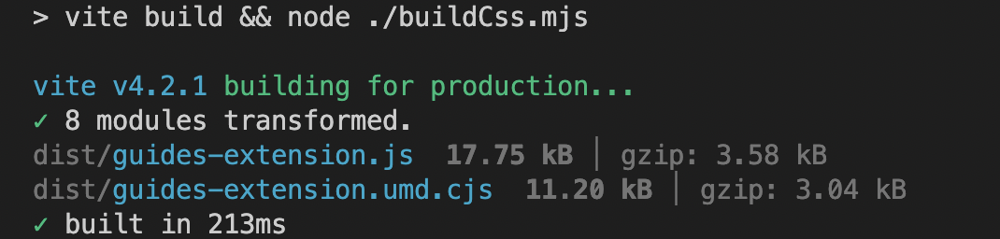
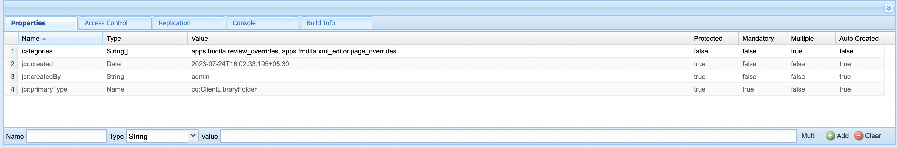

# Instalação e uso do pacote de extensão do AEM Guides

As extensões oferecem a oportunidade de personalizar seu aplicativo AEM Guides para melhor atender às suas necessidades. Essa estrutura de extensão é compatível com o AEM Guides v4.3 em diante (no local) e 2310 (nuvem).

## Requisitos

Este pacote requer [git bash](https://github.com/git-guides/install-git) e npm

## Instalação

A maneira mais fácil de inicializar a instalação do AEM Guides framework é por meio da cli

```bash
npx @adobe/create-guides-extension
```

## Adição de código de personalização

1. Adicione arquivos de código para cada componente que você deseja estender no diretório `src/`. Alguns arquivos de exemplo já foram adicionados para você.
2. Agora no arquivo `index.ts` localizado no diretório `src/`:
   - Importe os arquivos `.ts` com as personalizações que deseja adicionar à sua compilação.
   - Adicionar as importações a `window.extension`
   - Registre o `id` do componente personalizado e a importação correspondente para `tcx extensions`
   - Consulte a amostra `/src/index.ts`

## Criação do código personalizado

- Execute `npm run build` no diretório raiz. Você obterá 3 arquivos no diretório, `dist/`:
   - `build.css`
   - `guides-extension.js`
   - `guides-extension.umd.cjs`



## Adicionar a personalização ao AEM

- Ir para `CRXDE` `crx/de/index.jsp#/`
- Na pasta `apps`, crie um novo nó do tipo `cq:ClientLibraryFolder`


- No `properties` do nó, selecione `Multi` para adicionar a seguinte propriedade
Nome: `categories`
Tipo: `String []`
Valor: `apps.fmdita.review_overrides`, `apps.fmdita.xml_editor.page_overrides`

>[!NOTE]
>
> Para a penúltima interface do usuário, os valores seriam: `apps.fmdita.penultimate.xml_editor.page_overrides` e `apps.fmdita.review_overrides`




- Para adicionar o js construído, crie um novo arquivo, digamos, `tcx1.js` no nó criado acima. Aqui, adicione o código de `dist/guides-extension.umd.cjs` ou `dist/guides-extension.js`. Agora crie um novo arquivo `js.txt`, aqui adicionamos o nome do nosso arquivo js, que neste caso seria:

```t
#base=.
tcx1.js
```

- Para adicionar o css compilado, crie um novo arquivo, digamos, `tcx1.css` no nó criado acima. Adicione o código de `dist/build.css`. Agora crie um novo arquivo `css.txt`, aqui adicionamos o nome do nosso arquivo css, que nesse caso seria:

```t
#base=.
tcx1.css
```

- Faça um `shift + refresh` para carregar o aplicativo com as personalizações!

## Resolução de problemas

Verifique se todas as etapas acima foram executadas corretamente.
Depois de adicionar seu código ao tcx.js, certifique-se de fazer uma atualização rígida (shift+refresh).
Agora abra o AEM, clique com o botão direito e clique em `Inspect`
Vá para Origens e pesquise pelo seu arquivo `[node_name].js` (por exemplo: extensions.js). Faça um Control / Cmd + D para procurar o arquivo. Se o arquivo `.js` existir com o código JS que você colou de `dist/guides-extension.umd.cjs` ou `dist/guides-extension.js`, sua configuração está concluída
