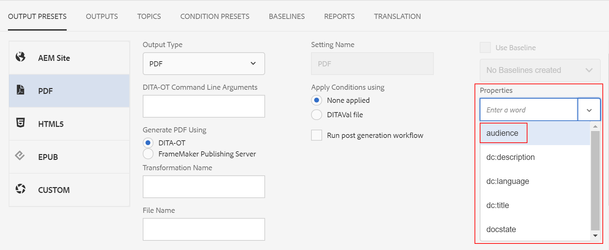

# Definir configurações de geração de saída {#id181AI0B0E30}

O AEM Guides vem com muitas opções de configuração para você personalizar o processo de geração de saída. Este tópico aborda todas as configurações e personalizações que ajudariam você a configurar o processo de geração de saída.

## Configure a guia Linha de base no painel de mapa DITA {#id223MD0D0YRM}

As guias a seguir fornecem instruções para ocultar a guia Linha de base no painel de mapa DITA com base na configuração do Experience Manager Guides: Cloud Service ou No local.

>[!BEGINTABS]

>[!TAB Cloud Service]

1. Use as instruções fornecidas em [Substituições de configuração](download-install-config-override.md#) para criar o arquivo de configuração.
1. No arquivo de configuração, forneça os seguintes detalhes \(property\) para configurar a guia de linha de base no painel de mapa.

| PID | Chave de propriedade | Valor de propriedade |
|---|------------|--------------|
| `com.adobe.fmdita.config.ConfigManager` | `hide.tabs.baseline` | Booleano\(`true/false`\).**Valor padrão**: `true` |

>[!NOTE]
>
> Essa configuração é habilitada por padrão e a guia Linha de base não está disponível no painel de mapa.

>[!TAB No local]

1. Abra a página Configuração do console da Web do Adobe Experience Manager.

   O URL padrão para acessar a página de configuração é:

   ```http
   http://<server name>:<port>/system/console/configMgr
   ```

1. Procure e clique no pacote **com.adobe.fmdita.config.ConfigManager**.

1. Selecione a opção **Ocultar Guia da Linha de Base**.

1. Clique em **Salvar**.

>[!NOTE]
>
> Essa configuração é desabilitada por padrão e a guia Linha de base está disponível no painel de mapa.

>[!ENDTABS]


## Configurar a publicação combinada em um site existente do AEM {#id1691I0V0MGR}

Se você tiver um site do AEM com conteúdo DITA, poderá configurar a saída do seu site do AEM para publicar conteúdo DITA em um local predefinido no seu site. Por exemplo, na captura de tela a seguir de uma página do site do AEM, o nó `ditacontent` é reservado para armazenar conteúdo DITA:


Os nós restantes na página são criados diretamente do editor de site do AEM. Definir a configuração de publicação para publicar conteúdo DITA em um local predefinido garante que nenhum conteúdo não DITA existente seja modificado pelo processo de publicação do AEM Guides.

É necessário executar as seguintes configurações no site existente para permitir a publicação de conteúdo DITA em um nó predefinido:

- Configurar as propriedades do modelo do site

- Adicione nós ao site para publicar conteúdo DITA


As guias a seguir fornecem instruções para configurar as propriedades de modelo do site existentes com base na configuração do Experience Manager Guides: Cloud Service ou No local.

>[!BEGINTABS]

>[!TAB Cloud Service]

1. Use o Gerenciador de pacotes para baixar o arquivo /libs/fmdita/config/templates/default.

   >[!NOTE]
   >
   > Não faça nenhuma personalização nos arquivos de configuração padrão disponíveis no nó `libs`. Você deve criar uma sobreposição do nó `libs` no nó `apps` e atualizar os arquivos necessários somente no nó `apps`.

1. Adicione as seguintes propriedades:

   | Nome da propriedade | Tipo | Valor |
   |-------------|----|-----|
   | `topicContentNode` | String | Especifique o nome do nó onde deseja publicar o conteúdo DITA. Por exemplo, o nó padrão onde o AEM Guides publica conteúdo DITA é: <br> `jcr:content/contentnode` |
   | `topicHeadNode` | String | Especifique o nome do nó em que você deseja armazenar as informações de metadados do conteúdo DITA. Por exemplo, o nó padrão onde o AEM Guides armazena informações de metadados é: <br> `jcr:content/headnode` |


Na próxima vez que você publicar qualquer conteúdo DITA usando as configurações de modelo do seu site, o conteúdo será publicado nos nós especificados nas propriedades `topicContentNode` e `topicHeadNode`.

>[!TAB No local]

1. Faça logon no AEM e abra o modo CRXDE Lite.

1. Navegue até o nó de configuração de modelo do site. Por exemplo, o AEM Guides armazena as configurações de template padrão no seguinte nó:

   `/libs/fmdita/config/templates/default`

   >[!NOTE]
   >
   > Não faça nenhuma personalização nos arquivos de configuração padrão disponíveis no nó `libs`. Você deve criar uma sobreposição do nó `libs` no nó `apps` e atualizar os arquivos necessários somente no nó `apps`.

1. Adicione as seguintes propriedades:

   | Nome da propriedade | Tipo | Valor |
   |-------------|----|-----|
   | `topicContentNode` | String | Especifique o nome do nó onde deseja publicar o conteúdo DITA. Por exemplo, o nó padrão onde o AEM Guides publica conteúdo DITA é: <br>`jcr:content/contentnode` |
   | `topicHeadNode` | String | Especifique o nome do nó em que você deseja armazenar as informações de metadados do conteúdo DITA. Por exemplo, o nó padrão onde o AEM Guides armazena informações de metadados é: <br>`jcr:content/headnode` |


A captura de tela a seguir mostra as propriedades adicionadas ao nó de modelo padrão do AEM Guides:

{width="800" align="left"}

Na próxima vez que você publicar qualquer conteúdo DITA usando as configurações de modelo do seu site, o conteúdo será publicado nos nós especificados nas propriedades `topicContentNode` e `topicHeadNode`.

No entanto, para sites existentes, você deve adicionar manualmente os nós `topicContentNode` e `topicHeadNode`.

Execute as seguintes etapas para adicionar os nós necessários ao site existente:

1. Faça logon no AEM e abra o modo CRXDE Lite.

1. Localize `jcr:content` no nó do site.

1. Adicione os nós `topicContentNode` e `topicHeadNode` com o mesmo nome que você especificou nas configurações de modelo do site.

>[!ENDTABS]

## Configurar o local de saída base para publicação

As guias a seguir fornecem instruções para configurar o local de saída base com base na configuração do Experience Manager Guides: Cloud Service ou No local.

>[!BEGINTABS]

>[!TAB Cloud Service]

1. Use as instruções fornecidas em [Substituições de configuração](download-install-config-override.md) para criar o arquivo de configuração.

1. No arquivo de configuração, forneça os seguintes detalhes (propriedade) para configurar o local de saída base:

   | PID | Chave de propriedade | Valor de propriedade |
   |---|---|---|
   | `com.adobe.fmdita.config.ConfigManager` | `base.output.path` | **Valor padrão:** &quot;/content/dam/fmdita-outputs&quot; |

>[!TAB No local]

1. Abra a página Configuração do console da Web do Adobe Experience Manager.

   O URL padrão para acessar a página de configuração é:

   ```http
   http://<server name>:<port>/system/console/configMgr
   ```

1. Procure e selecione o pacote *com.adobe.fmdita.config.ConfigManager*.

1. Atualize a propriedade **Local de Saída Base** para especificar o caminho padrão no repositório do AEM em que o PDF será salvo após a publicação. Além disso, se um caminho inválido for inserido, ele reverterá automaticamente para o caminho padrão: `/content/dam/fmdita-outputs`.

1. Clique em **Salvar**.

>[!ENDTABS]

## Usar metadados na saída de publicação por meio do DITA-OT {#id191LF0U0TY4}

O AEM Guides fornece uma maneira de transmitir metadados personalizados ao publicar saída usando DITA-OT. Como administrador e Editor, seria necessário executar as seguintes tarefas para configurar e usar metadados personalizados na saída publicada:

- Como administrador, adicione os metadados necessários no sistema para que ele fique disponível na página Propriedades do mapa DITA.

- Como administrador, adicione os metadados personalizados à lista de metadados para que sejam exibidos no console de mapa DITA.

- Como um Editor, configure e adicione os metadados personalizados com o mapa DITA e gere a saída necessária.


Para adicionar os metadados necessários no sistema, execute as seguintes etapas:

1. Faça logon no Adobe Experience Manager como administrador.

1. Clique no link do Adobe Experience Manager na parte superior e escolha **Ferramentas**.

1. Selecione **Assets** na lista de ferramentas.

1. Clique no bloco **Esquemas de metadados**.

   A página Forms do Esquema de Metadados é exibida.

1. Selecione o formulário **padrão** na lista.

   >[!NOTE]
   >
   > As propriedades exibidas na página Propriedades de um mapa DITA são obtidas desse formulário.

1. Clique em **Editar**.

1. Adicione os metadados personalizados que deseja usar nas saídas publicadas. Por exemplo, adicionaremos metadados de público-alvo usando as seguintes etapas:

   1. Na lista de componentes **Criar Formulário**, arraste e solte no formulário o componente **Texto de Linha Única**.

   2. Selecione o novo campo para abrir as **Configurações** do campo.

   3. No **Rótulo do campo**, digite o nome dos metadados— Público-alvo.

   4. Na configuração **Mapear para a Propriedade**, especifique ./jcr:content/metadata/&lt;nome dos metadados\>. Para o nosso exemplo, vamos defini-lo como ./jcr:content/metadata/audience.

   Usando essas etapas, adicione todos os parâmetros de metadados necessários.

1. Clique em **Salvar**.


O novo parâmetro agora é exibido na página Propriedades para todos os mapas DITA.


Em seguida, você precisa disponibilizar os metadados personalizados no console de mapas DITA. As guias a seguir fornecem instruções para disponibilizar os metadados personalizados no painel de mapa DITA com base na configuração do Experience Manager Guides: Cloud Service ou No local.

>[!BEGINTABS]

>[!TAB Cloud Service]

1. Use o gerenciador de pacotes para acessar o arquivo metadataList disponível no seguinte local no repositório Git da Cloud Manager:

   /libs/fmdita/config/metadataList

   >[!NOTE]
   >
   > O arquivo metadataList contém uma lista de propriedades que são mostradas na lista suspensa **Propriedades** de um mapa DITA no painel de mapa. Por padrão, há quatro propriedades listadas neste arquivo— docstate, dc:language, dc:description e dc:title.

1. Adicione os metadados personalizados adicionados na página Forms do Esquema de metadados. Para o nosso exemplo, adicione o parâmetro de público-alvo ao final da lista padrão.

>[!TAB No local]

1. Faça logon no AEM e abra o modo CRXDE Lite.

1. Acesse o arquivo metadataList disponível no seguinte local:

   /libs/fmdita/config/metadataList

   >[!NOTE]
   >
   > O arquivo metadataList contém uma lista de propriedades que são mostradas na lista suspensa **Propriedades** de um mapa DITA no painel de mapa. Por padrão, há quatro propriedades listadas neste arquivo— docstate, dc:language, dc:description e dc:title.

1. Adicione os metadados personalizados adicionados na página Forms do Esquema de metadados. Para o nosso exemplo, adicione o parâmetro de público-alvo ao final da lista padrão.

1. Clique em **Salvar tudo**.

>[!ENDTABS]

Agora, os metadados personalizados serão exibidos na lista suspensa **Propriedades** do console de mapa DITA.

Por fim, como Editor, é necessário incluir os metadados personalizados na saída publicada. Para processar os metadados personalizados ao gerar a saída, execute as seguintes etapas:

1. Na interface do usuário do Assets, navegue até o mapa DITA que deseja publicar.

1. Selecione o arquivo de mapa DITA e abra a página de propriedades.

1. Na página Propriedades, especifique o valor dos metadados personalizados. Para o nosso exemplo, especificamos um valor Externo para o parâmetro de público-alvo.

   

1. Clique em **Salvar e fechar**.

1. Clique no arquivo de mapa DITA para abrir o console de mapa DITA.

1. Na guia **Predefinições de saída**, selecione a predefinição de saída que deseja usar para gerar a saída.

1. Clique em **Editar**.

1. Na lista suspensa **Propriedades**, selecione as propriedades que deseja passar para o processo de publicação.

   


As propriedades/metadados selecionados são passados para o processo de publicação e disponibilizados na saída final.

### Validar metadados transmitidos ao DITA-OT para processamento (somente para o Cloud Service)

Para validar os valores de metadados transmitidos para o DITA-OT, é possível usar o ambiente local usando um jar pronto para nuvem. Como não é possível acessar o sistema de arquivos local na nuvem, a única maneira de validar o arquivo de metadados é por meio do jar pronto para nuvem.

- Nome do arquivo: metadata.xml
- Local do arquivo: crx-quickstart/profiles/ditamaps/&lt;ditamap-1234\>

  Para acessar metadata.xml:

   - Faça logon no local do servidor onde a instância do AEM está em execução.
   - Migre para crx-quickstart/profiles/ditamaps/&lt;newcreated-diretory-name\>/metadata.xml.
- Formato de arquivo de exemplo:

  **metadata.xml**

  ```XML
  <?xml version="1.0" encoding="UTF-8" standalone="no"?>
  <root>
     <Path id="/absolutePath/sampleMap.ditamap">
        <metadata>
           <meta isArray="false" key="dc:description">This is a file</meta>
           <meta isArray="false" key="dc:title">Myfile</meta>
           <meta isArray="true" key="multivalueText">One;Two;Three</meta>
        </metadata>
     </Path>
     <Path id="/absolutePath/sampleTopic.dita">
        <metadata>
           <meta isArray="false" key="dc:description">description for the accountability</meta>
           <meta isArray="false" key="dc:title">accountability title</meta>
           <meta isArray="true" key="multivalueText">value1</meta>
        </metadata>
     </Path>
  </root>
  ```


- isArray: um atributo booleano que define se os metadados são multivalores \(Array\) ou não. Os valores são delimitados por um ponto e vírgula.
- ID do caminho: caminho absoluto para o arquivo armazenado no diretório temporário.

>[!NOTE]
>
> Se não houver metadados específicos para o arquivo, a tag &lt;meta\> com a chave não aparecerá como a propriedade desse arquivo no arquivo metadata.xml.

## Configure o campo de argumento da linha de comando DITA-OT para aceitar os metadados do mapa raiz (somente para Cloud Service)

Para usar o campo de argumento da linha de comando DITA-OT para transmitir metadados do mapa raiz, execute as seguintes etapas:

1. Use as instruções fornecidas em [Substituições de configuração](download-install-config-override.md#) para criar o arquivo de configuração.
1. No arquivo de configuração, forneça os seguintes detalhes \(property\) para configurar o campo de argumento da linha de comando DITA-OT na Predefinição:

| PID | Chave de propriedade | Valor de propriedade |
|---|------------|--------------|
| `com.adobe.fmdita.config.ConfigManager` | `pass.metadata.args.cmd.line` | Booleano\(`true/false`\).**Valor padrão**: `true` |

- Definir o valor da propriedade como **true** habilita a funcionalidade de linha de comando DITA-OT, permitindo que você passe os metadados pela linha de comando DITA-OT.
- Definir o valor da propriedade como **false** desabilita a funcionalidade da linha de comando DITA-OT. Em seguida, use o campo Propriedade na Predefinição para transmitir os metadados.

## Personalizar o console de mapa DITA {#id188HC08M0CZ}

O AEM Guides oferece a flexibilidade de estender os recursos do console de mapas DITA. Por exemplo, se você tiver um conjunto de relatórios diferente do que está disponível no AEM Guides, poderá adicioná-los ao console de mapa. Para personalizar o console de mapa, é necessário criar uma Biblioteca do cliente AEM \(ou ClientLib\) que conterá o código para executar a funcionalidade necessária.

>[!NOTE]
>
> A modificação direta dos componentes da página não é recomendada, pois será substituída pelas novas versões do produto.

A AEM Guides fornece a categoria `apps.fmdita.dashboard-extn` para personalizar o console de mapas. Sempre que o console de mapa é carregado, a funcionalidade criada na categoria `apps.fmdita.dashboard-extn` é executada e carregada.

>[!NOTE]
>
> Para obter mais informações sobre como criar a Biblioteca de Cliente do AEM, consulte [Usando Bibliotecas do Lado do Cliente](https://experienceleague.adobe.com/docs/experience-manager-cloud-service/implementing/developing/full-stack/clientlibs.html?lang=en).

## Manipular a representação da imagem durante a geração da saída {#id177BF0G0VY4}

O AEM vem com um conjunto de workflows e manipuladores de mídia padrão para processar ativos. No AEM, há fluxos de trabalho predefinidos para lidar com o processamento de ativos para os tipos MIME mais comuns. Normalmente, para cada imagem que você carrega, o AEM cria várias representações da mesma em formato binário. Essas representações podem ser de tamanhos diferentes, com uma resolução diferente, com uma marca d&#39;água adicionada ou alguma outra característica alterada. Para obter mais informações sobre como o AEM lida com ativos, consulte [Processando o Assets usando Manipuladores e fluxos de trabalho de mídia](https://experienceleague.adobe.com/docs/experience-manager-cloud-service/assets/asset-microservices-overview.html?lang=en) na documentação do AEM.

O AEM Guides permite configurar qual representação de imagem usar no momento da geração de saída para seus documentos. Por exemplo, você pode escolher uma das representações de imagem padrão ou criar uma e usar a mesma para publicar seus documentos. O mapeamento de representação de imagem para publicação de seus documentos está armazenado no arquivo `/libs/fmdita/config/ **renditionmap.xml**`. Um trecho do arquivo `renditionmap.xml` é o seguinte:

>[!NOTE]
>
> É recomendável criar uma cópia do arquivo `renditionmap.xml` na pasta `apps` para todas as personalizações.

```XML
<renditionmap>
   <mapelement>
      <mimetype>image/png</mimetype>
      <rendition output="AEMSITE">cq5dam.web.1280.1280.jpeg</rendition>
      <rendition output="PDF">original</rendition>
      <rendition output="HTML5">cq5dam.web.1280.1280.jpeg</rendition>
      <rendition output="HTML5" outputName="ditahtml5">cq5dam.thumbnail.319.319.png</rendition>
      <rendition output="EPUB">cq5dam.web.1280.1280.jpeg</rendition>
      <rendition output="CUSTOM">cq5dam.web.1280.1280.jpeg</rendition>
   </mapelement>
...
</renditionmap>
```

O elemento `mimetype` especifica o tipo MIME do formato de arquivo. O elemento `rendition output` especifica o tipo de formato de saída e o nome da representação \(por exemplo, `cq5dam.web.1280.1280.jpeg`\) que deve ser usada para publicar a saída especificada. Você pode especificar as representações de imagem a serem usadas para todos os formatos de saída compatíveis: AEMSITE, PDF, HTML5, EPUB e CUSTOM.

Se quiser especificar representações de imagem diferentes para uma predefinição de saída, use o atributo `outputName`, com seu valor definido como o título da predefinição, para definir representações personalizadas para predefinições de saída específicas no mesmo tipo de saída. Isso é útil quando você precisa de tamanhos ou formatos de imagem diferentes para cenários de publicação diferentes.

Por exemplo:


```XML
<renditionmap>
   <mapelement>
      <mimetype>image/png</mimetype>
      
      <rendition output="HTML5">cq5dam.web.1280.1280.jpeg</rendition>
      <rendition output="HTML5" outputName="ditahtml5">cq5dam.thumbnail.319.319.png</rendition>
      
   </mapelement>
...
</renditionmap>
```

Nas representações acima, quando o atributo `outputName` é definido como `ditahtml5` (título predefinido), a predefinição `ditahtml5` usa a imagem em miniatura `cq5dam.thumbnail.319.319.png`. Se o atributo `outputName` não for especificado, todas as saídas HTML5 usarão a imagem maior `cq5dam.web.1280.1280.jpeg`.

Se a representação especificada não estiver presente, o processo de publicação do AEM Guides primeiro procurará a representação da Web da imagem fornecida. Se nem mesmo a representação da Web for encontrada, a representação original da imagem será usada.

>[!NOTE]
>
> Essas representações de imagem controlam somente a geração de saída. A representação da Web de uma imagem é usada quando você abre um documento para visualização ou revisão.

## Configurar período de limpeza automática para histórico de saída {#id19AAI070V8Q}

Quando você gera uma saída, ela é criada junto com os logs de saída. Para mapas DITA grandes, esses registros podem ocupar uma grande quantidade de espaço no repositório. Por padrão, os registros são armazenados no seguinte local do repositório:

`/var/dxml/metadata/outputHistory`

Durante um período de tempo, o tamanho coletivo de todos os arquivos de log poderia ficar em GB. O AEM Guides permite configurar um período para manter esses arquivos de log no repositório. Após o período especificado, os registros, juntamente com o histórico de geração de saída, são excluídos do repositório.

>[!NOTE]
>
> O histórico de geração de saída é a entrada de log na lista Saídas geradas na guia Saídas.

A configuração do recurso de limpeza de histórico afeta a geração de saída para todos os mapas DITA no repositório. Na guia Saídas de um mapa DITA, o histórico é removido após o número especificado de dias e na hora especificada na configuração.

>[!NOTE]
>
> A remoção dos arquivos de log e do histórico de geração de saída não afeta a saída gerada.

As guias a seguir fornecem instruções para definir um dia e hora para limpar o histórico de saída e logs com base na configuração do Experience Manager Guides: Cloud Service ou No local.

>[!BEGINTABS]

>[!TAB Cloud Service]

Use as instruções fornecidas em [Substituições de configuração](download-install-config-override.md#) para criar o arquivo de configuração. No arquivo de configuração, forneça os seguintes detalhes \(propriedade\) para definir um dia e hora para limpar o histórico e os logs de saída:

| PID | Chave de propriedade | Valor de propriedade |
|---|------------|--------------|
| `com.adobe.fmdita.config.ConfigManager\|output.history.purgeperiod` | Especifique o número de dias após os quais o histórico de saída, juntamente com os logs de saída, será removido. Se você quiser desativar esse recurso, defina essa propriedade como 0.Everyday no horário especificado em que o processo de limpeza é executado nas saídas geradas antes do número de dias especificados nessa propriedade. | **Valor padrão**: 5 |
| `output.history.purgetime` | Especifique a hora em que o processo de expurgação será iniciado. | **Valor padrão**: 0:00 \(ou meia-noite :00\) |

>[!TAB No local]

1. Abra a página Configuração do console da Web do Adobe Experience Manager.

   O URL padrão para acessar a página de configuração é:

   ```http
   http://<server name>:<port>/system/console/configMgr
   ```

1. Procure e clique no pacote **com.adobe.fmdita.config.ConfigManager**.

1. Na propriedade **Período de Limpeza do Histórico de Saída**, especifique o número de dias após o qual o histórico de saída, juntamente com os logs de saída, será limpo. Por padrão, é definido como 5 dias. Se você quiser desativar esse recurso, defina essa propriedade como 0.

1. Na propriedade **Tempo de Limpeza do Histórico de Saída**, especifique a hora em que o processo de limpeza será iniciado. Por padrão, é definido como 0:00 \(ou 12:00 meia-noite\). Todos os dias no momento, o processo de limpeza é executado em saídas geradas antes do número de dias especificado na propriedade **Período de Limpeza do Histórico de Saída**.

   >[!NOTE]
   >
   > Por padrão, o recurso de limpeza é executado a cada meia-noite em saídas com mais de 5 dias.

1. Clique em **Salvar**.

>[!ENDTABS]

## Alterar o limite da lista de saídas recém-geradas {#id1679JH0H0O2}

É possível alterar o número máximo de saídas geradas exibidas na guia Saídas de um mapa DITA.

>[!BEGINTABS]

>[!TAB Cloud Service]

Use as instruções fornecidas em [Substituições de configuração](download-install-config-override.md#) para criar o arquivo de configuração. No arquivo de configuração, forneça os seguintes detalhes \(property\) para alterar o número de saídas a serem exibidas na lista:

| PID | Chave de propriedade | Valor de propriedade |
|---|------------|--------------|
| `com.adobe.fmdita.config.ConfigManager` | `output.historylimit` | Valor inteiro.<br> **Valor padrão**: 25 |

>[!TAB No local]

Por padrão, uma lista das últimas 25 saídas é exibida. Para alterar o número de saídas a serem exibidas na lista, atualize a configuração **Limite da Lista de Saídas** no pacote `com.adobe.fmdita.config.ConfigManager`.

>[!ENDTABS]

>[!TIP]
>
> Consulte a seção *Histórico de saída* no [Guia de práticas recomendadas](https://helpx.adobe.com/content/dam/help/en/xml-documentation-solution/cs-mar-22/Adobe-Experience-Manager-Guides_Best-Practices_EN.pdf) para obter práticas recomendadas sobre como trabalhar com o histórico de saída.

## Otimização do desempenho da geração de saída (somente para No local) {#id176LB050VUI}

O AEM Guides permite configurar o tamanho do pool de processos de geração de saída que controla o número de processos de geração de saída executados simultaneamente. Por padrão, o tamanho do pool de processos é definido como o número de núcleos de processamento disponíveis no sistema mais um. Talvez você queira alterar esse valor para 1 se quiser publicação sequencial. Nesse caso, a primeira tarefa de publicação é executada e a próxima tarefa de publicação é armazenada na fila de publicação.

Para alterar o tamanho do pool de processamento da geração de saída, atualize a configuração **Tamanho do Pool de Geração** no pacote `com.adobe.fmdita.publish.manager.PublishThreadManagerImpl`.

## Configurar o FrameMaker Publishing Server (somente no local) {#id1678G0Z0TN6}

Você pode usar o FrameMaker Publishing Server \(FMPS\) para gerar saída para seu conteúdo DITA. A configuração do FMPS permitirá gerar saída em vários formatos suportados pelo FMPS.

>[!NOTE]
>
> Para gerar saída usando FMPS, você precisa ter o servidor FMPS configurado. Para obter detalhes sobre instalação e configuração, consulte o Guia do usuário do FrameMaker Publishing Server.

Para configurar o AEM Guides para usar o FMPS, atualize as seguintes propriedades do pacote `com.adobe.fmdita.config.ConfigManager` no Console da Web.

>[!NOTE]
>
> Acesse o URL http://&lt;server name\>:&lt;port\>/system/console/configMgr para abrir o Console da Web.

| Propriedade | Descrição |
|--------|-----------|
| Domínio de logon do FrameMaker Publishing Server | Especifique o nome de domínio ou o nome do grupo de trabalho no qual o FrameMaker Publishing Server está hospedado. Com base na versão FMPS, forneça o nome de domínio como :-   **FMPS 2020**: endereço IP como 192.168.1.101 <br>- **FMPS 2019 e anterior**: endereço IP ou o nome de domínio |
| URL do FrameMaker Publishing Server | Especifique o URL do FrameMaker Publishing Server. Com base na versão do FMPS, forneça a URL do FMPS como:<br>- **FMPS 2020**: `http://<fmps_ip>:<port>` \(http://192.168.1.101:7000\) <br> - **FMPS 2019 e anterior**: `http://<fmps_ip>:<port>/fmserver/v1/` |
| Versão do FMPS | Especifique o número da versão do FrameMaker Publishing Server. Com base na versão do FMPS, forneça as informações da versão como: <br>- **FMPS 2020**: 2020 <br> - **FMPS 2019 e anterior**: 2019 ou 2017 |
| Nome de usuário e senha do FrameMaker Publishing Server | Especifique o nome de usuário e a senha para acessar o FrameMaker Publishing Server. |
| Tempo Limite de FMPS | \(*Opcional*\) Especifique o tempo \(em segundos\) pelo qual o AEM Guides aguarda uma resposta do FrameMaker Publishing Server. Se nenhuma resposta for recebida no tempo especificado, o AEM Guides encerra a tarefa de publicação e a tarefa é sinalizada como com falha. <br> Valor padrão: 300 segundos \(5 minutos\) |
| URL externo do AEM | *\(Opcional\)* A URL do AEM onde o FrameMaker Publishing Server colocará os arquivos de saída gerados. Por exemplo, `http://<server-name>:<port>/`. |
| Nome de usuário e senha do administrador do AEM | *\(Opcional\)* O nome de usuário e a senha de um administrador da sua instalação do AEM. Ele será usado pelo FrameMaker Publishing Server para se comunicar com o AEM. |
| Tempo Limite de Espera de Execução de Tarefa FMPS | Esta configuração só é aplicável para o FMPS 2020. Especifique o tempo \(em segundos\) após o qual o FMPS deixará de aguardar a execução desse processo. |


