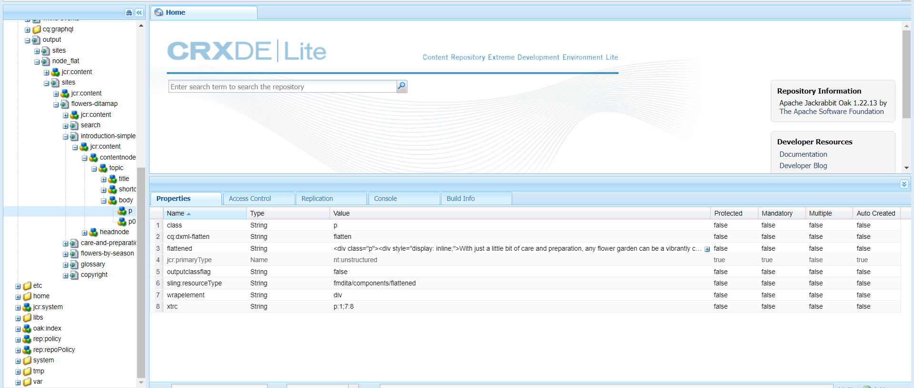

# Personalizar a saída do site do AEM {#id166TG0B30WR}

O AEM Guides oferece suporte à criação de saídas nos seguintes formatos:

- Site do AEM
- PDF
- HTML 5
- EPUB
- Saída personalizada através do DITA-OT

Para a saída do site do AEM, é possível atribuir modelos de design diferentes com tarefas de saída diferentes. Esses modelos de design podem renderizar o conteúdo DITA em diferentes layouts. Por exemplo, você pode especificar diferentes modelos de design para públicos-alvo internos e externos.

Você também pode usar os plug-ins DITA Open Toolkit \(DITA-OT\) personalizados com a AEM Guides. Você pode fazer upload desses plug-ins DITA-OT personalizados para gerar saída do PDF de uma maneira específica.

>[!TIP]
>
> Consulte a seção *Publicação de site do AEM* no [Guia de práticas recomendadas](https://helpx.adobe.com/content/dam/help/en/xml-documentation-solution/cs-mar-22/Adobe-Experience-Manager-Guides_Best-Practices_EN.pdf) para obter as práticas recomendadas sobre a criação de saída de site do AEM.


## Personalizar modelo de design para gerar saída {#customize_xml-add-on}

O AEM Guides usa um conjunto de modelos de design predefinidos para gerar a saída do AEM Site. Você pode personalizar os modelos de design do AEM Guides para gerar a saída que esteja em conformidade com a marca corporativa. Um modelo de design é uma coleção de vários estilos \(CSS\), scripts \(do lado do servidor e do lado do cliente\), recursos \(imagens, logotipos e outros ativos\) e nós JCR que unem todos esses recursos. Um modelo de design pode ser tão simples quanto um único script do lado do servidor com apenas alguns nós JCR, ou uma combinação complexa de estilos, recursos e nós JCR. Os modelos de design são usados pelo subsistema de publicação do AEM Guides ao gerar a saída do AEM Site e controlam a estrutura, a aparência e a funcionalidade da saída gerada.

Não há restrição quanto ao local onde os recursos do modelo de design devem estar localizados no servidor, mas geralmente são organizados logicamente de acordo com sua função. Por exemplo, o modelo padrão tem todos os seus arquivos JavaScript e CSS armazenados na pasta `/etc/designs/fmdita/clientlibs/siteoutput/default`. Sempre que esses arquivos estiverem localizados, eles serão vinculados por uma coleção de nós JCR. Juntos, esses nós JCR e os arquivos constituem todo o modelo de design.

O modelo de design padrão fornecido com o AEM Guides permite personalizar os componentes de página de aterrissagem, tópico e pesquisa. Você pode fazer uma cópia do design padrão e dos modelos de referência correspondentes e especificar componentes diferentes para gerar a saída desejada.

As guias a seguir fornecem instruções para especificar seu próprio modelo de design a ser usado para a geração de saída do AEM Site com base na configuração do Experience Manager Guides: Cloud Service ou No local.

>[!BEGINTABS]

>[!TAB Cloud Service]

1. Use o Gerenciador de pacotes para baixar o modelo de design padrão no seguinte local:

   /libs/fmdita/config/templates

1. Crie uma cópia dos arquivos baixados no seguinte local no repositório Git da Cloud Manager:

   /apps/fmdita/config/templates

1. Você também deve baixar e copiar os modelos referenciados do nó de modelo padrão. Os modelos referenciados são colocados em:

   /libs/fmdita/templates/default/cqtemplates

>[!TAB No local]

1. Faça logon no AEM e abra o modo CRXDE Lite.

1. Navegue até o nó do modelo de design padrão. O local do nó do modelo de design padrão é:

   `/libs/fmdita/config/templates/`

   {width="300" align="left"}

   >[!NOTE]
   >
   > Faça uma cópia dos modelos de design padrão da pasta `libs` para a pasta `apps` e faça alterações na pasta `apps`. Você também deve fazer alterações nos templates referenciados a partir do nó de template padrão. Os modelos referenciados são colocados no nó `/libs/fmdita/templates/default/cqtemplates`. Faça uma cópia dos modelos referenciados na pasta `apps` antes de fazer qualquer alteração.

1. Clique no componente *padrão* no nó *modelos* para acessar suas propriedades.

>[!ENDTABS]

As propriedades do modelo de design do AEM Guides são descritas na tabela a seguir.

| Propriedade | Descrição |
|--------|-----------|
| `landingPageTemplate`, `searchPageTemplate`, `topicPageTemplate`, `shadowPageTemplate` | Especifique o nó `cq:Template` dessas páginas correspondentes \(aterrissagem, pesquisa e tópico\). Por padrão, o nó `cq:Template` dessas páginas pode ser encontrado no nó `/libs/fmdita/templates/default/cqtemplates`. Esse nó define a estrutura e as propriedades das páginas de aterrissagem, pesquisa e tópico.<br> O `shadowPageTemplate` é usado para otimizar o conteúdo fragmentado. É necessário definir o valor dessa propriedade como: `fmdita/templates/default/cqtemplates/shadowpage` <br> **Observação:** especifique um valor para `topicPageTemplate`. `landingPageTemplate` e `searchPageTemplate` são propriedades opcionais. Se não quiser que as páginas de pesquisa e de aterrissagem sejam geradas, não especifique essas propriedades. |
| `title` | Um nome descritivo do modelo de design. |
| `topicContentNode` | O local do nó que conterá o conteúdo DITA em uma página de tópico. O caminho é relativo à página de tópico. |
| `topicHeadNode` | O local do nó que conterá os valores de cabeçalho \(ou metadados\) derivados do conteúdo DITA. O caminho é relativo à página de tópico. |
| `tocNode` | O local do nó que conterá o índice. O caminho é relativo à página inicial ou ao caminho de destino. |
| `basePathProp` | O nome da propriedade para armazenar o caminho da raiz do site publicado. |
| `indexPathProp` | O nome da propriedade para armazenar o caminho da página de aterrissagem/índice do site publicado. |
| `pdfPathProp` | O nome da propriedade para armazenar o caminho PDF do tópico, se a geração PDF do tópico estiver ativada. |
| `pdfTypeProp` | O nome da propriedade para armazenar o tipo da geração do PDF. No momento, essa propriedade sempre contém &quot;Topic&quot;. |
| `searchPathProp` | O nome da propriedade para armazenar o caminho da página de pesquisa, se o modelo incluir uma página de pesquisa. |
| `siteTitleProp` | O nome da propriedade para armazenar o título do site que está sendo publicado. Esse título é geralmente o mesmo do mapa que está sendo publicado. |
| `sourcePathProp` | O nome da propriedade para armazenar o caminho do tópico DITA de origem da página atual. |
| `tocPathProp` | O nome da propriedade para armazenar o caminho da raiz do índice para o site publicado. |


>[!NOTE]
>
> Depois de criar um nó de modelo de design personalizado, você deve atualizar a opção Design nas predefinições de saída do site do AEM para usar o nó de modelo de design personalizado.

Para obter mais informações, consulte [Criar o primeiro site do Adobe Experience Manager](https://experienceleague.adobe.com/docs/experience-manager-learn/getting-started-wknd-tutorial-develop/overview.html?lang=en) e [Noções básicas](https://experienceleague.adobe.com/docs/experience-manager-cloud-service/implementing/developing/full-stack/develop-wknd-tutorial.html?lang=en) sobre como desenvolver seu próprio site no AEM.

## Usar o título do documento para gerar a saída do site do AEM

Ao gerar a saída do site do AEM, a forma como os URLs são gerados desempenha uma função importante na descoberta do seu conteúdo. Caso esteja usando nomes de arquivo baseados em UUID, gerar URLs com base na UUID de seus arquivos não será amigável para pesquisa. Como Administrador ou Editor, você tem o controle sobre como gerar os URLs para a saída do site do AEM. O AEM Guides fornece uma configuração por meio da qual você pode optar por gerar os URLs de saída do AEM Site usando o título do arquivo, em vez dos nomes de arquivo baseados em UUID. Por padrão, para sistemas de arquivos baseados em UUID, essa opção está ativada. Isso implicava que, quando você gera a saída do site do AEM para sistemas de arquivos baseados em UUID, os títulos do arquivo são usados para gerar os URLs e não os UUIDs dos arquivos.

Para a configuração no local com sistemas de arquivos não baseados em UUID, a saída do site do AEM é gerada usando os nomes dos arquivos e não os títulos deles. Por padrão, essa opção está desativada. Isso implicava que, quando você gera a saída do site do AEM, os nomes dos arquivos são usados para gerar os URLs e não o título do arquivo. Você pode optar por gerar os URLs com base nos títulos dos arquivos ativando essa opção.

As guias a seguir fornecem instruções para configurar a geração de URLs na saída do site do AEM com base na configuração do Experience Manager Guides: Cloud Service ou No local.

>[!NOTE]
>
> Você pode configurar regras adicionais para permitir apenas um conjunto de caracteres nos URLs de uma saída de site do AEM. Para obter mais detalhes, consulte [Configurar regras de limpeza de nome de arquivo para criar tópicos e publicar a saída do site do AEM](#id2164D0KD0XA).

>[!BEGINTABS]

>[!TAB Cloud Service]

Use as instruções fornecidas em [Substituições de configuração](download-install-config-override.md#) para criar o arquivo de configuração. No arquivo de configuração, forneça os seguintes detalhes \(propriedade\) para configurar a geração de URLs na saída do AEM Site:

| PID | Chave de propriedade | Valor de propriedade |
|---|------------|--------------|
| `com.adobe.fmdita.config.ConfigManager` | `aemsite.pagetitle` | Booleano \(true/false\). Caso queira gerar a saída usando o título da página, defina essa propriedade como true. Por padrão, é definido para usar o nome do arquivo.<br> **Valor padrão**: falso |


>[!TAB No local]

1. Abra a página Configuração do console da Web do Adobe Experience Manager.

   O URL padrão para acessar a página de configuração é:

   ```http
   http://<server name>:<port>/system/console/configMgr
   ```

1. Procure e clique no pacote **com.adobe.fmdita.config.ConfigManager**.

1. Selecione a opção **Usar título para nomes de página de site do AEM**.

   >[!NOTE]
   >
   > Caso deseje gerar saída usando os nomes de arquivo, desmarque essa opção.

1. Clique em **Salvar**.

>[!ENDTABS]

## Configure o URL da saída do site do AEM para usar o título do documento (somente para o Cloud Service)

Você pode usar os títulos do documento no URL da saída do site do AEM. Se o nome de arquivo não existir ou contiver todos os caracteres especiais, você poderá configurar o sistema para substituir os caracteres especiais por um separador no URL da saída do Site do AEM. Você também pode configurá-lo para substituí-los pelo nome do primeiro tópico filho.


Para configurar os nomes de página, execute as seguintes etapas:

1. Use as instruções fornecidas em [Substituições de configuração](download-install-config-override.md#) para criar o arquivo de configuração.
1. No arquivo de configuração, forneça os seguintes detalhes (propriedade) para configurar os nomes de página para os tópicos.

| PID | Chave de propriedade | Valor de propriedade |
|---|------------|--------------|
| `com.adobe.fmdita.common.SanitizeNodeName` | `nodename.systemDefinedPageName` | Booleano (`true/false`). **Valor padrão**: `false` |

Por exemplo, se *@navtitle* em `<topichead>` tiver todos os caracteres especiais e você definir a propriedade `aemsite.pagetitle` como verdadeira, ela usará um separador por padrão. Se você definir a propriedade `nodename.systemDefinedPageName` como true, ela mostrará o nome do primeiro tópico filho.


## Configurar regras de limpeza de nome de arquivo para criar tópicos e publicar saídas no AEM Sites e em outros formatos {#id2164D0KD0XA}

Como administrador, você pode definir uma lista de caracteres especiais válidos permitidos em nomes de arquivo, que eventualmente formam o URL de uma saída de site do AEM. Em versões anteriores, os usuários podiam definir nomes de arquivo contendo caracteres especiais como `@`, `$`, `>` e muito mais. Esses caracteres especiais resultavam em URL codificado na geração de páginas do site do AEM.

A partir da versão 3.8, foram adicionadas configurações para definir uma lista de caracteres especiais permitidos nos nomes de arquivo. Por padrão, a configuração de nome de arquivo válido contém &quot;`a-z A-Z 0-9 - _`&quot;. Isto implica que, ao criar um arquivo, você pode ter qualquer caractere especial no título do arquivo, mas internamente ele será substituído por um hífen \(`-`\) no nome do arquivo. Por exemplo, você pode ter o título do arquivo como Introdução 1 ou Introduction@1, o nome do arquivo correspondente gerado para ambos os casos seria Introdução-1.

Ao definir uma lista de caracteres válidos, lembre-se de que esses caracteres &quot;`*/:[\]|#%{}?&<>"/+`&quot; e `a space` sempre serão substituídos por um hífen \(`-`\).

>[!NOTE]
>
> Se você não configurar a lista de caracteres especiais válida, o processo de criação de arquivo poderá fornecer resultados inesperados.

As guias a seguir fornecem instruções para configurar os caracteres especiais válidos em nomes de arquivo e na saída do site do AEM com base na configuração do Experience Manager Guides: Cloud Service ou No local.

>[!BEGINTABS]

>[!TAB Cloud Service]

Use as instruções fornecidas em [Substituições de configuração](download-install-config-override.md#) para criar o arquivo de configuração. No arquivo de configuração, forneça os seguintes detalhes \(propriedade\) para configurar os caracteres especiais válidos em nomes de arquivo e na saída do AEM Site:

| PID | Chave de propriedade | Valor de propriedade |
|---|------------|--------------|
| `com.adobe.fmdita.common.SanitizeNodeNameImpl` | `aemsite.DisallowedFileNameChars` | Verifique se a propriedade está definida como ``'<>`@$``. Você pode adicionar mais caracteres especiais a esta lista. |

>[!NOTE]
> 
> A configuração acima se aplica a todos os formatos de saída. Isso significa que, ao gerar uma saída PDF, HTML ou personalizada, a saída final seguirá as regras configuradas de limpeza do nome de arquivo.

Você também pode configurar as outras propriedades, como usar letras minúsculas nos nomes de arquivo, separador para lidar com caracteres inválidos e o número máximo de caracteres permitidos nos nomes de arquivo. Para configurar essas propriedades, adicione os seguintes pares de valores principais no arquivo de configuração:

| Chave de propriedade | Valor de propriedade |
|------------|--------------|
| `nodename.uselower` | Booleano \(true/false\).<br> **Valor padrão**: verdadeiro |
| `nodename.separator` | Qualquer caractere. <br> **Valor padrão**: \_ *\(sublinhado\)* |
| `nodename.maxlength` | Valor inteiro.<br> **Valor padrão**: 50 |

>[!TAB No local]

1. Abra a página Configuração do console da Web do Adobe Experience Manager.

   O URL padrão para acessar a página de configuração é:

   ```http
   http://<server name>:<port>/system/console/configMgr
   ```

1. Procure e clique no pacote *com.adobe.fmdita.common.SanitizeNodeNameImpl*.

1. Na propriedade **Conjunto de Caracteres Não Permitido para Publicação na AEM Sites**, verifique se a propriedade está definida como ```'<>`@$```. Você pode adicionar mais caracteres especiais a essa lista, no entanto, ela deve ter esses caracteres especiais necessários.

   >[!NOTE]
   >
   > Você também pode configurar outras propriedades, como **Usar minúsculas** nos nomes de arquivos, **Separador** para manipular caracteres inválidos e **Número Máximo de Caracteres** permitidos nos nomes de arquivos.

1. Clique em **Salvar**.

1. Procure e clique no pacote **com.adobe.fmdita.config.ConfigManager**.

1. Na propriedade **Regex para Caracteres Válidos**, verifique se a propriedade está definida como `[-a-zA-Z0-9_]`. Você pode adicionar mais caracteres a esta lista, no entanto, ela deve ter esses caracteres básicos e a lista deve começar com um hífen \(`-`\).

   >[!NOTE]
   >
   > Essa propriedade define a lista de caracteres válidos usados para criar um novo arquivo.

1. Clique em **Salvar**.

>[!ENDTABS]

## Configurar nivelamento da estrutura do nó do site do AEM

Ao gerar a saída do AEM Site, um nó para cada elemento nos tópicos é criado internamente. Para um mapa DITA com milhares de tópicos, essa estrutura de nó pode se tornar muito profunda. Esse tipo de estrutura de nó profundamente aninhada pode ter problemas de desempenho em sites maiores. O instantâneo a seguir exibe a estrutura de nó aninhada para uma saída do AEM Site:


No instantâneo acima, observe que há um nó criado para cada elemento `p` e seus subelementos subsequentes, e uma estrutura semelhante é criada para todos os outros elementos usados no tópico.

O AEM Guides permite configurar como a estrutura de nó da saída do AEM Site é criada internamente. É possível nivelar a estrutura do nó em elementos especificados, o que significa que você pode definir um elemento que será considerado como o elemento principal e todos os subelementos dentro dele serão mesclados com o elemento principal. Por exemplo, se você decidir nivelar o elemento `p`, qualquer elemento que apareça dentro do elemento `p` será mesclado com o elemento `p` principal. Uma nota separada não seria criada para nenhum subelemento dentro do elemento `p`. O instantâneo a seguir exibe a estrutura do nó nivelada no elemento `p`:


As guias a seguir fornecem instruções para nivelar a estrutura do nó do AEM Site com base na configuração do Experience Manager Guides: Cloud Service ou No local.

>[!BEGINTABS]

>[!TAB Cloud Service]

1. Identifique o elemento\(s\) no qual deseja nivelar a estrutura do nó:

1. Sobreposição do nó `libs` no nó `apps` e abra o arquivo elementmapping.xml.

1. Adicione a propriedade `<flatten>true</flatten>` na definição do elemento no qual você deseja nivelar a estrutura do nó. Por exemplo, se você deseja nivelar a estrutura do nó no elemento `p`, adicione o atributo nivelar na definição do elemento `p`, conforme mostrado abaixo:

   ```XML
   <ditaelement>
         <name>p</name>
         <class>- topic/p</class>
         <componentpath>fmdita/components/dita/wrapper</componentpath>
         <type>COMPOSITE</type>
         <target>para</target>
         <flatten>true</flatten>
         <wrapelement>div</wrapelement>
      </ditaelement>
   ```

   >[!NOTE]
   >
   > Por padrão, a propriedade do nó nivelado foi configurada no elemento `p`.

1. Use as instruções fornecidas em [Substituições de configuração](download-install-config-override.md#) para criar o arquivo de configuração.
1. No arquivo de configuração, forneça os seguintes detalhes \(propriedade\):

   | PID | Chave de propriedade | Valor de propriedade |
   |---|------------|--------------|
   | `com.adobe.dxml.flattening.FlatteningConfigurationService` | `flattening.enabled` | Booleano \(true/false\).<br> **Valor padrão**: `false` |


Agora, ao gerar a saída do Site do AEM, os nós dentro do elemento `p` são nivelados e armazenados dentro do próprio elemento `p`. Você pode encontrar as novas propriedades de nivelamento para o elemento `p` no CRXDE.


>[!TAB No local]

1. Especifique o elemento no qual deseja nivelar a estrutura do nó.

   1. Sobreposição do nó `libs` no nó `apps` e abra o arquivo elementmapping.xml.

   1. Adicione a propriedade `<flatten>true</flatten>` na definição do elemento no qual você deseja nivelar a estrutura do nó. Por exemplo, se você deseja nivelar a estrutura do nó no elemento `p`, adicione o atributo nivelar na definição do elemento `p`, conforme mostrado abaixo:

      ```XML
      <ditaelement>
          <name>p</name>
          <class>- topic/p</class>
          <componentpath>fmdita/components/dita/wrapper</componentpath>
          <type>COMPOSITE</type>
          <target>para</target>
          <flatten>true</flatten>
          <wrapelement>div</wrapelement>
      </ditaelement>
      ```

      >[!NOTE]
      >
      > Por padrão, a propriedade do nó nivelado foi configurada no elemento `p`.

1. Habilite a configuração de nivelamento do nó do site no configMgr.

   1. Abra a página Configuração do console da Web do Adobe Experience Manager.

      O URL padrão para acessar a página de configuração é:

      ```http
      http://<server name>:<port>/system/console/configMgr
      ```

   1. Procure e clique no pacote *com.adobe.dxml.flattening.FlatteningConfigurationService*.

   1. Selecione a opção **nivelamento de propriedade.habilitado**.

   1. Clique em **Salvar**.


>[!IMPORTANT]
>
> Se você tiver feito qualquer alteração no arquivo elementmapping.xml, abra o configMgr e salve qualquer pacote para que as alterações entrem em vigor.

Agora, ao gerar a saída do Site do AEM, os nós dentro do elemento `p` são nivelados e armazenados dentro do próprio elemento `p`. Você pode encontrar as novas propriedades de nivelamento para o elemento `p` no CRXDE.

{width="650" align="left"}

>[!ENDTABS]

**Pesquisar uma cadeia de caracteres no conteúdo na saída do Site do AEM (somente para Cloud Service)**

Por padrão, você pode pesquisar por uma string nos títulos somente na saída do site do AEM. Você pode configurar o sistema para procurar uma string nos títulos e também no conteúdo ou no corpo da saída do site do AEM.

>[!NOTE]
>
> Às vezes, a pesquisa pode funcionar para alguns elementos no conteúdo, mas você pode configurá-la para funcionar para todo o conteúdo.



Para habilitar a pesquisa, você deve configurar o nivelamento da estrutura do nó do site do AEM.

CUIDADO:

Você pode pesquisar até 1 MB de conteúdo nivelado. Por exemplo, na captura de tela anterior, você pode pesquisar se o conteúdo na tag &lt;p\> é &lt;= 1Mb.

>[!NOTE]
>
> A pesquisa funciona nos elementos somente se o atributo `<flatten>` estiver definido como verdadeiro. Por padrão, o AEM Guides tem o atributo `<flatten>` definido como true para os elementos de texto comumente usados, como &lt;p\> &lt;ul\> &lt;lI\>. No entanto, se você tiver criado alguns elementos personalizados, defina o atributo `<flatten>` como true no arquivo elementmapping.xml.

**Impedir nivelamento da estrutura do nó do site do AEM**

Semelhante à especificação do nó a ser nivelado na saída do AEM Site, você também pode especificar um elemento que deseja excluir dessa configuração. Por exemplo, se você deseja nivelar nós no elemento `body`, mas não deseja nivelar nenhum elemento `table` em `body`, é possível adicionar a propriedade exclude na definição do elemento `table`.

Para excluir o elemento `table` do nivelamento, adicione a seguinte propriedade à definição do elemento `table`:

`<preventancestorflattening>true|false</preventancestorflattening>`

## Configurar o controle de versão para páginas excluídas na saída do site do AEM

Ao gerar a saída de Site do AEM com as opções **Excluir e** Criar ****selecionadas para a configuração Páginas de Saída Existentes, uma versão é criada para a página\(s\) que está sendo excluída. Você pode configurar o sistema para interromper a criação de uma versão antes da exclusão.

As guias a seguir fornecem instruções para interromper a criação de uma versão para a página\(s\) que está sendo excluída com base na configuração do Experience Manager Guides: Cloud Service ou No local.

>[!BEGINTABS]

>[!TAB Cloud Service]

1. Use as instruções fornecidas em [Substituições de configuração](download-install-config-override.md#) para criar o arquivo de configuração.
1. No arquivo de configuração, forneça os seguintes detalhes \(propriedade\) para configurar a opção **Não criar versão para páginas excluídas**:

   | PID | Chave de propriedade | Valor de propriedade |
   |---|------------|--------------|
   | `com.adobe.fmdita.confi g.ConfigManager` | `no.version.creation.on.deletion` | Booleano \(true/false\).<br> **Valor padrão**: `true` |

   >[!NOTE]
   >
   > Com essa opção selecionada, os usuários poderão excluir diretamente qualquer página\(s\) sem criar qualquer versão para eles. Se a opção não estiver selecionada, uma versão será criada antes que a página\(s\) seja excluída.

>[!TAB No local]

1. Abra a página Configuração do console da Web do Adobe Experience Manager.

   O URL padrão para acessar a página de configuração é:

   ```http
   http://<server name>:<port>/system/console/configMgr
   ```

1. Procure e clique no pacote *com.adobe.fmdita.config.ConfigManager*.

1. Selecione a opção **Não criar versão para páginas excluídas**.

   >[!NOTE]
   >
   > Com essa opção selecionada, os usuários poderão excluir diretamente qualquer página\(s\) sem criar qualquer versão para eles. Se a opção não estiver selecionada, uma versão será criada antes que a página\(s\) seja excluída.

1. Clique em **Salvar**.

>[!ENDTABS]

## Configurar o reescritor personalizado no Experience Manager Guides (somente para o Cloud Service) {#custom-rewriter}

O Experience Manager Guides tem um módulo sling [**rewriter**](https://sling.apache.org/documentation/bundles/output-rewriting-pipelines-org-apache-sling-rewriter.html) personalizado para manipular os links gerados no caso de mapas cruzados (links entre os tópicos de dois mapas diferentes). Esta configuração de reescrita está instalada no seguinte caminho: <br> `/apps/fmdita/config/rewriter/fmdita-crossmap-link-patcher`.

Se você tiver outro reescritor sling personalizado em sua base de código, use um valor de `'order'` maior que 50, pois o reescritor Experience Manager Guides sling usa `'order'` 50.  Para substituir isso, é necessário um valor >50. Para obter mais detalhes, consulte [Pipelines de regravação de saída](https://sling.apache.org/documentation/bundles/output-rewriting-pipelines-org-apache-sling-rewriter.html).


