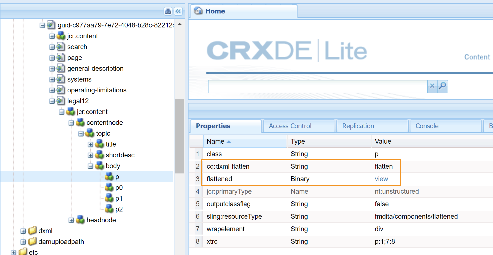

# Definir configurações de geração de saída {#id181AI0B0E30}

O AEM Guides vem com muitas opções de configuração para você personalizar o processo de geração de saída. Este tópico aborda todas as configurações e personalizações que ajudariam você a configurar o processo de geração de saída.

## Configure a guia Linha de base no painel de mapa DITA {#id223MD0D0YRM}

É possível configurar e ocultar a guia Linha de base disponível no painel do mapa.

A opção **Ocultar Guia de Linha de Base** não está habilitada por padrão e você precisa habilitá-la no configMgr. Execute as seguintes etapas para habilitar a opção por padrão no Editor da Web:

1. Abra a página Configuração do console da Web do Adobe Experience Manager.

   O URL padrão para acessar a página de configuração é:

   ```http
   http://<server name>:<port>/system/console/configMgr
   ```

1. Procure e clique no pacote **com.adobe.fmdita.config.ConfigManager**.

1. Selecione a opção **Ocultar Guia da Linha de Base**.

1. Clique em **Salvar**.

   >[!NOTE]
   >
   > Essa configuração é desabilitada por padrão e a guia Linha de base está disponível no painel de mapa.


## Configurar o FrameMaker Publishing Server {#id1678G0Z0TN6}

Você pode usar o FrameMaker Publishing Server \(FMPS\) para gerar saída para seu conteúdo DITA. A configuração do FMPS permitirá gerar saída em vários formatos suportados pelo FMPS.

>[!NOTE]
>
> Para gerar saída usando FMPS, você precisa ter o servidor FMPS configurado. Para obter detalhes sobre a instalação e a configuração, consulte o Guia do usuário do FrameMaker Publishing Server.

Para configurar o AEM Guides para usar o FMPS, atualize as seguintes propriedades do pacote `com.adobe.fmdita.config.ConfigManager` no Console da Web.

>[!NOTE]
>
> Acesse o URL http://&lt;server name\>:&lt;port\>/system/console/configMgr para abrir o Console da Web.

| Propriedade | Descrição |
|--------|-----------|
| Domínio de logon do FrameMaker Publishing Server | Especifique o nome de domínio ou o nome do grupo de trabalho no qual o FrameMaker Publishing Server está hospedado. Com base na versão FMPS, forneça o nome de domínio como:-   **FMPS 2020**: endereço IP como 192.168.1.101 <br>- **FMPS 2019 e anterior**: endereço IP ou nome de domínio |
| URL do FrameMaker Publishing Server | Especifique o URL do FrameMaker Publishing Server. Com base na versão do FMPS, forneça a URL do FMPS como:<br>- **FMPS 2020**: `http://<fmps_ip>:<port>` \(http://192.168.1.101:7000\) <br> - **FMPS 2019 e anterior**: `http://<fmps_ip>:<port>/fmserver/v1/` |
| Versão do FMPS | Especifique o número da versão do FrameMaker Publishing Server. Com base na versão do FMPS, forneça as informações da versão como: <br>- **FMPS 2020**: 2020 <br> - **FMPS 2019 e anterior**: 2019 ou 2017 |
| Nome de usuário e senha do FrameMaker Publishing Server | Especifique o nome de usuário e a senha para acessar o FrameMaker Publishing Server. |
| Tempo Limite de FMPS | \(*Opcional*\) Especifique o tempo \(em segundos\) durante o qual o AEM Guides aguarda uma resposta do FrameMaker Publishing Server. Se nenhuma resposta for recebida no tempo especificado, o AEM Guides encerra a tarefa de publicação e a tarefa é sinalizada como com falha. <br> Valor padrão: 300 segundos \(5 minutos\) |
| URL externo do AEM | *\(Opcional\)* A URL do AEM onde o FrameMaker Publishing Server colocará os arquivos de saída gerados. Por exemplo, `http://<server-name>:<port>/`. |
| Nome de usuário e senha do administrador do AEM | *\(Opcional\)* O nome de usuário e a senha de um administrador da sua instalação do AEM. Ele será usado pelo FrameMaker Publishing Server para se comunicar com AEM. |
| Tempo Limite de Espera de Execução de Tarefa FMPS | Esta configuração só é aplicável para o FMPS 2020. Especifique o tempo \(em segundos\) após o qual o FMPS deixará de aguardar a execução desse processo. |

## Configurar a publicação combinada em um site AEM existente {#id1691I0V0MGR}

Se você tiver um site AEM com conteúdo DITA, poderá configurar sua saída de site AEM para publicar conteúdo DITA em um local predefinido no seu site. Por exemplo, na captura de tela a seguir de uma página do site AEM, o nó `ditacontent` é reservado para armazenar conteúdo DITA:

{width="300" align="left"}

Os nós restantes na página são criados diretamente do editor do site AEM. Definir a configuração de publicação para publicar conteúdo DITA em um local predefinido garante que nenhum conteúdo não DITA existente seja modificado pelo processo de publicação do AEM Guides.

É necessário executar as seguintes configurações no site existente para permitir a publicação de conteúdo DITA em um nó predefinido:

- Configurar as propriedades do modelo do site

- Adicione nós ao site para publicar conteúdo DITA


Execute as seguintes etapas para configurar as propriedades do modelo do site existente:

1. Faça logon no AEM e abra o modo CRXDE Lite.

1. Navegue até o nó de configuração de modelo do site. Por exemplo, o AEM Guides armazena as configurações de template padrão no seguinte nó:

   `/libs/fmdita/config/templates/default`

   >[!NOTE]
   >
   > Não faça nenhuma personalização nos arquivos de configuração padrão disponíveis no nó `libs`. Você deve criar uma sobreposição do nó `libs` no nó `apps` e atualizar os arquivos necessários somente no nó `apps`.

1. Adicione as seguintes propriedades:

   | Nome da propriedade | Tipo | Valor |
   |-------------|----|-----|
   | `topicContentNode` | String | Especifique o nome do nó onde deseja publicar o conteúdo DITA. Por exemplo, o nó padrão onde o AEM Guides publica conteúdo DITA é: <br>`jcr:content/contentnode` |
   | `topicHeadNode` | String | Especifique o nome do nó em que você deseja armazenar as informações de metadados do conteúdo DITA. Por exemplo, o nó padrão onde o AEM Guides armazena informações de metadados é: <br>`jcr:content/headnode` |


A captura de tela a seguir mostra as propriedades adicionadas ao nó de modelo padrão do AEM Guides:

{width="800" align="left"}

Na próxima vez que você publicar qualquer conteúdo DITA usando as configurações de modelo do seu site, o conteúdo será publicado nos nós especificados nas propriedades `topicContentNode` e `topicHeadNode`.

No entanto, para sites existentes, você deve adicionar manualmente os nós `topicContentNode` e `topicHeadNode`.

Execute as seguintes etapas para adicionar os nós necessários ao site existente:

1. Faça logon no AEM e abra o modo CRXDE Lite.

1. Localize `jcr:content` no nó do site.

1. Adicione os nós `topicContentNode` e `topicHeadNode` com o mesmo nome que você especificou nas configurações de modelo do site.


## Personalizar saída do site AEM {#id166TG0B30WR}

O AEM Guides oferece suporte à criação de saídas nos seguintes formatos:

- Site AEM

- PDF

- HTML 5
- EPUB
- Saída personalizada através do DITA-OT

Para a saída do site AEM, é possível atribuir modelos de design diferentes com tarefas de saída diferentes. Esses modelos de design podem renderizar o conteúdo DITA em diferentes layouts. Por exemplo, você pode especificar diferentes modelos de design para públicos-alvo internos e externos.

Você também pode usar os plug-ins DITA Open Toolkit \(DITA-OT\) personalizados com o AEM Guides. Você pode fazer upload desses plug-ins DITA-OT personalizados para gerar saída de PDF de uma maneira específica.

>[!TIP]
>
> Consulte a seção *publicação do site AEM* no Guia de práticas recomendadas[appendix.md\#](appendix.md#) para obter as práticas recomendadas sobre a criação de saída de site AEM.

### Personalizar modelo de design para gerar saída {#customize_xml-add-on}

O AEM Guides usa um conjunto de modelos de design predefinidos para gerar a saída do site AEM. Você pode personalizar os modelos de design do AEM Guides para gerar a saída que esteja em conformidade com a marca corporativa. Um modelo de design é uma coleção de vários estilos \(CSS\), scripts \(do lado do servidor e do lado do cliente\), recursos \(imagens, logotipos e outros ativos\) e nós JCR que unem todos esses recursos. Um modelo de design pode ser tão simples quanto um único script do lado do servidor com apenas alguns nós JCR, ou uma combinação complexa de estilos, recursos e nós JCR. Os modelos de design são usados pelo subsistema de publicação do AEM Guides ao gerar a saída do site AEM e controlam a estrutura, a aparência e a funcionalidade da saída gerada.

Não há restrição quanto ao local onde os recursos do modelo de design devem estar localizados no servidor, mas geralmente são organizados logicamente de acordo com sua função. Por exemplo, o modelo padrão tem todos os seus arquivos JavaScript e CSS armazenados na pasta `/etc/designs/fmdita/clientlibs/siteoutput/default`. Sempre que esses arquivos estiverem localizados, eles serão vinculados por uma coleção de nós JCR. Juntos, esses nós JCR e os arquivos constituem todo o modelo de design.

O modelo de design padrão fornecido com o AEM Guides permite personalizar os componentes de página de aterrissagem, tópico e pesquisa. Você pode fazer uma cópia do design padrão e dos modelos de referência correspondentes e especificar componentes diferentes para gerar a saída desejada.

Execute as seguintes etapas para especificar seu próprio modelo de design a ser usado para a geração de saída do site AEM:

1. Faça logon no AEM e abra o modo CRXDE Lite.

1. Navegue até o nó do modelo de design padrão. O local do nó do modelo de design padrão é:

   `/libs/fmdita/config/templates/`

   {width="300" align="left"}

   >[!NOTE]
   >
   > Faça uma cópia dos modelos de design padrão da pasta `libs` para a pasta `apps` e faça alterações na pasta `apps`. Você também deve fazer alterações nos templates referenciados a partir do nó de template padrão. Os modelos referenciados são colocados no nó `/libs/fmdita/templates/default/cqtemplates`. Faça uma cópia dos modelos referenciados na pasta `apps` antes de fazer qualquer alteração.

1. Clique no componente *padrão* no nó *modelos* para acessar suas propriedades.

   As propriedades do template de design do AEM Guides estão descritas na tabela a seguir.

   | Propriedade | Descrição |
   |--------|-----------|
   | `landingPageTemplate`, `searchPageTemplate`, `topicPageTemplate`, `shadowPageTemplate` | Especifique o nó `cq:Template` dessas páginas correspondentes \(aterrissagem, pesquisa e tópico\). Por padrão, o nó `cq:Template` dessas páginas pode ser encontrado no nó `/libs/fmdita/templates/default/cqtemplates`. Esse nó define a estrutura e as propriedades das páginas de aterrissagem, pesquisa e tópico. <br>O `shadowPageTemplate` é usado para otimizar o conteúdo fragmentado. É necessário definir o valor dessa propriedade como: <br> `fmdita/templates/default/cqtemplates/shadowpage` <br> **Observação** Você deve especificar um valor para `topicPageTemplate`. `landingPageTemplate` e `searchPageTemplate` são propriedades opcionais. Se não quiser que as páginas de pesquisa e de aterrissagem sejam geradas, não especifique essas propriedades. |
   | `title` | Um nome descritivo do modelo de design. |
   | `topicContentNode` | O local do nó que conterá o conteúdo DITA em uma página de tópico. O caminho é relativo à página de tópico. |
   | `topicHeadNode` | O local do nó que conterá os valores de cabeçalho \(ou metadados\) derivados do conteúdo DITA. O caminho é relativo à página de tópico. |
   | `tocNode` | O local do nó que conterá o índice. O caminho é relativo à página inicial ou ao caminho de destino. |
   | `basePathProp` | O nome da propriedade para armazenar o caminho da raiz do site publicado. |
   | `indexPathProp` | O nome da propriedade para armazenar o caminho da página de aterrissagem/índice do site publicado. |
   | `pdfPathProp` | O nome da propriedade para armazenar o caminho do PDF do tópico, se a geração do PDF do tópico estiver ativada. |
   | `pdfTypeProp` | O nome da propriedade para armazenar o tipo da geração de PDF. No momento, essa propriedade sempre contém &quot;Topic&quot;. |
   | `searchPathProp` | O nome da propriedade para armazenar o caminho da página de pesquisa, se o modelo incluir uma página de pesquisa. |
   | `siteTitleProp` | O nome da propriedade para armazenar o título do site que está sendo publicado. Esse título é geralmente o mesmo do mapa que está sendo publicado. |
   | `sourcePathProp` | O nome da propriedade para armazenar o caminho do tópico DITA de origem da página atual. |
   | `tocPathProp` | O nome da propriedade para armazenar o caminho da raiz do índice para o site publicado. |


>[!NOTE]
>
> Depois de criar um nó de modelo de design personalizado, você deve atualizar a opção Design nas predefinições de saída do site AEM para usar o nó de modelo de design personalizado.

Para obter mais informações, consulte [Criar o seu primeiro site do Adobe Experience Manager 6.3](https://helpx.adobe.com/experience-manager/using/first_aem63_website.html) e [Noções básicas](https://helpx.adobe.com/br/experience-manager/6-3/sites/developing/using/the-basics.html) sobre o desenvolvimento do seu próprio site no AEM.

### Usar o título do documento para gerar a saída do site AEM

Ao gerar a saída do site AEM, a forma como os URLs são gerados desempenha um papel importante na descoberta do seu conteúdo. Caso esteja usando nomes de arquivo baseados em UUID, gerar URLs com base na UUID de seus arquivos não será amigável para pesquisa. Como Administrador ou Editor, você tem o controle sobre como gerar os URLs para a saída do AEM Site. O AEM Guides fornece uma configuração por meio da qual você pode optar por gerar os URLs de saída do site AEM usando o título do arquivo, em vez dos nomes de arquivo baseados em UUID. Por padrão, para sistemas de arquivos baseados em UUID, essa opção está ativada. Isso implicava que, quando você gera a saída do site AEM para sistemas de arquivos baseados em UUID, os títulos do arquivo são usados para gerar os URLs e não os UUIDs dos arquivos.

Ao gerar a saída do site AEM, a forma como os URLs são gerados desempenha um papel importante na descoberta do seu conteúdo. No caso de sistemas de arquivos não baseados em UUID, a saída do site AEM é gerada usando os nomes dos arquivos e não os títulos dos arquivos. Como Administrador ou Editor, você tem o controle sobre como gerar os URLs para a saída do AEM Site. O AEM Guides fornece uma configuração por meio da qual você pode optar por gerar os URLs de saída do site AEM usando o título do arquivo em vez dos nomes dos arquivos. Por padrão, essa opção está desativada. Isso implicava que, quando você gera a saída do site AEM, os nomes dos arquivos são usados para gerar os URLs e não o título do arquivo. Você pode optar por gerar os URLs com base nos títulos dos arquivos ativando essa opção.

>[!NOTE]
>
> Você pode configurar regras adicionais para permitir apenas um conjunto de caracteres nos URLs de uma saída de site AEM. Para obter mais detalhes, consulte [Configurar regras de limpeza de nome de arquivo para criar tópicos e publicar saída do site AEM](#id2164D0KD0XA).

Para configurar a geração de URLs na saída do site AEM, execute as seguintes etapas:

1. Abra a página Configuração do console da Web do Adobe Experience Manager.

   O URL padrão para acessar a página de configuração é:

   ```http
   http://<server name>:<port>/system/console/configMgr
   ```

1. Procure e clique no pacote **com.adobe.fmdita.config.ConfigManager**.

1. Selecione a opção **Usar título para nomes de página de site AEM**.

   >[!NOTE]
   >
   > Caso deseje gerar saída usando os nomes de arquivo, desmarque essa opção.

1. Clique em **Salvar**.


### Configurar regras de limpeza de nome de arquivo para criar tópicos e publicar a saída do site AEM {#id2164D0KD0XA}

Como administrador, você pode definir uma lista de caracteres especiais válidos permitidos em nomes de arquivo, que eventualmente formam o URL de uma saída de site AEM. Em versões anteriores, os usuários podiam definir nomes de arquivo contendo caracteres especiais como `@`, `$`, `>` e muito mais. Esses caracteres especiais resultavam em URL codificado na geração de páginas do site AEM.

A partir da versão 3.8, foram adicionadas configurações para definir uma lista de caracteres especiais permitidos nos nomes de arquivo. Por padrão, a configuração de nome de arquivo válido contém &quot;`a-z A-Z 0-9 - _`&quot;. Isto implica que, ao criar um arquivo, você pode ter qualquer caractere especial no título do arquivo, mas internamente ele será substituído por um hífen \(`-`\) no nome do arquivo. Por exemplo, você pode ter o título do arquivo como Introdução 1 ou Introduction@1, o nome do arquivo correspondente gerado para ambos os casos seria Introdução-1.

Ao definir uma lista de caracteres válidos, lembre-se de que esses caracteres &quot;`*/:[\]|#%{}?&<>"/+`&quot; e `a space` sempre serão substituídos por um hífen \(`-`\).

>[!NOTE]
>
> Se você não configurar a lista de caracteres especiais válida, o processo de criação de arquivo poderá fornecer resultados inesperados.

Para configurar os caracteres especiais válidos nos nomes de arquivo e na saída do site AEM, execute as seguintes etapas:

1. Abra a página Configuração do console da Web do Adobe Experience Manager.

   O URL padrão para acessar a página de configuração é:

   ```http
   http://<server name>:<port>/system/console/configMgr
   ```

1. Procure e clique no pacote *com.adobe.fmdita.common.SanitizeNodeNameImpl*.

1. Na propriedade **Conjunto de Caracteres Não Permitido para Publicação na AEM Sites**, verifique se a propriedade está definida como ```'<>`@$```. Você pode adicionar mais caracteres especiais a essa lista, no entanto, ela deve ter esses caracteres especiais necessários.

   >[!NOTE]
   >
   > Você também pode configurar outras propriedades, como **Usar minúsculas** nos nomes de arquivos, **Separador** para manipular caracteres inválidos e **Número Máximo de Caracteres** permitidos nos nomes de arquivos.

1. Clique em **Salvar**.

1. Procure e clique no pacote **com.adobe.fmdita.config.ConfigManager**.

1. Na propriedade **Regex para Caracteres Válidos**, verifique se a propriedade está definida como `[-a-zA-Z0-9_]`. Você pode adicionar mais caracteres a esta lista, no entanto, ela deve ter esses caracteres básicos e a lista deve começar com um hífen \(`-`\).

   >[!NOTE]
   >
   > Essa propriedade define a lista de caracteres válidos usados para criar um novo arquivo.

1. Clique em **Salvar**.


### Configurar nivelamento da estrutura do nó do site AEM

Quando você gera a saída do site AEM, um nó para cada elemento nos tópicos é criado internamente. Para um mapa DITA com milhares de tópicos, essa estrutura de nó pode se tornar muito profunda. Esse tipo de estrutura de nó profundamente aninhada pode ter problemas de desempenho em sites maiores. O instantâneo a seguir exibe a estrutura de nó aninhada para uma saída do site AEM:

{width="300" align="left"}

No instantâneo acima, observe que há um nó criado para cada elemento `p` e seus subelementos subsequentes, e uma estrutura semelhante é criada para todos os outros elementos usados no tópico.

O AEM Guides permite configurar como a estrutura de nó da saída do site AEM é criada internamente. É possível nivelar a estrutura do nó em elementos especificados, o que significa que você pode definir um elemento que será considerado como o elemento principal e todos os subelementos dentro dele serão mesclados com o elemento principal. Por exemplo, se você decidir nivelar o elemento `p`, qualquer elemento que apareça dentro do elemento `p` será mesclado com o elemento `p` principal. Uma nota separada não seria criada para nenhum subelemento dentro do elemento `p`. O instantâneo a seguir exibe a estrutura do nó nivelada no elemento `p`:

{width="300" align="left"}

Para nivelar a estrutura do nó do site AEM, execute as seguintes etapas:

1. Especifique o elemento no qual deseja nivelar a estrutura do nó.

   1. Sobreposição do nó `libs` no nó `apps` e abra o arquivo elementmapping.xml.

   1. Adicione a propriedade `<flatten>true</flatten>` na definição do elemento no qual você deseja nivelar a estrutura do nó. Por exemplo, se você deseja nivelar a estrutura do nó no elemento `p`, adicione o atributo nivelar na definição do elemento `p`, conforme mostrado abaixo:

      ```XML
      <ditaelement>
          <name>p</name>
          <class>- topic/p</class>
          <componentpath>fmdita/components/dita/wrapper</componentpath>
          <type>COMPOSITE</type>
          <target>para</target>
          <flatten>true</flatten>
          <wrapelement>div</wrapelement>
      </ditaelement>
      ```

      >[!NOTE]
      >
      > Por padrão, a propriedade do nó nivelado foi configurada no elemento `p`.

1. Habilite a configuração de nivelamento do nó do site no configMgr.

   1. Abra a página Configuração do console da Web do Adobe Experience Manager.

      O URL padrão para acessar a página de configuração é:

      ```http
      http://<server name>:<port>/system/console/configMgr
      ```

   1. Procure e clique no pacote *com.adobe.dxml.flattening.FlatteningConfigurationService*.

   1. Selecione a opção **nivelamento de propriedade.habilitado**.

   1. Clique em **Salvar**.


>[!IMPORTANT]
>
> Se você tiver feito qualquer alteração no arquivo elementmapping.xml, abra o configMgr e salve qualquer pacote para que as alterações entrem em vigor.

Agora, ao gerar a saída do Site AEM, os nós dentro do elemento `p` são nivelados e armazenados dentro do próprio elemento `p`. Você pode encontrar as novas propriedades de nivelamento para o elemento `p` no CRXDE.

{width="650" align="left"}

**Impedir nivelamento da estrutura de anotação do Site do AEM**

Semelhante à especificação do nó a ser nivelado na saída do site AEM, você também pode especificar um elemento que deseja excluir dessa configuração. Por exemplo, se você deseja nivelar nós no elemento `body`, mas não deseja nivelar nenhum elemento `table` em `body`, é possível adicionar a propriedade exclude na definição do elemento `table`.

Para excluir o elemento `table` do nivelamento, adicione a seguinte propriedade à definição do elemento `table`:

`<preventancestorflattening>true|false</preventancestorflattening>`

### Configurar o controle de versão para páginas excluídas na saída do site AEM

Ao gerar uma saída de Site AEM com as opções **Excluir e** Criar **&#x200B;**&#x200B;selecionadas para a configuração Páginas de Saída Existentes, uma versão é criada para a página\(s\) que está sendo excluída. Você pode configurar o sistema para interromper a criação de uma versão antes da exclusão.

Execute as seguintes etapas para interromper a criação de uma versão para a página\(s\) que está sendo excluída:

1. Abra a página Configuração do console da Web do Adobe Experience Manager.

   O URL padrão para acessar a página de configuração é:

   ```http
   http://<server name>:<port>/system/console/configMgr
   ```

1. Procure e clique no pacote *com.adobe.fmdita.config.ConfigManager*.

1. Selecione a opção **Não criar versão para páginas excluídas**.

   >[!NOTE]
   >
   > Com essa opção selecionada, os usuários poderão excluir diretamente qualquer página\(s\) sem criar qualquer versão para eles. Se a opção não estiver selecionada, uma versão será criada antes que a página\(s\) seja excluída.

1. Clique em **Salvar**.

## Usar metadados na saída de publicação por meio do DITA-OT {#id191LF0U0TY4}

O AEM Guides fornece uma maneira de transmitir metadados personalizados ao publicar saída usando DITA-OT. Como administrador e Editor, seria necessário executar as seguintes tarefas para configurar e usar metadados personalizados na saída publicada:

- Como administrador, adicione os metadados necessários no sistema para que ele fique disponível na página Propriedades do mapa DITA.

- Como administrador, adicione os metadados personalizados à lista de metadados para que sejam exibidos no console de mapa DITA.

- Como um Editor, configure e adicione os metadados personalizados com o mapa DITA e gere a saída necessária.


Para adicionar os metadados necessários no sistema, execute as seguintes etapas:

1. Faça logon no Adobe Experience Manager como administrador.

1. Clique no link do Adobe Experience Manager na parte superior e escolha **Ferramentas**.

1. Selecione **Assets** na lista de ferramentas.

1. Clique no bloco **Esquemas de metadados**.

   A página Forms do Esquema de Metadados é exibida.

1. Selecione o formulário **padrão** na lista.

   >[!NOTE]
   >
   > As propriedades exibidas na página Propriedades de um mapa DITA são obtidas desse formulário.

1. Clique em **Editar**.

1. Adicione os metadados personalizados que deseja usar nas saídas publicadas. Por exemplo, adicionaremos metadados de público-alvo usando as seguintes etapas:

   1. Na lista de componentes **Criar Formulário**, arraste e solte no formulário o componente **Texto de Linha Única**.

   1. Selecione o novo campo para abrir as **Configurações** do campo.

   1. No **Rótulo do campo**, digite o nome dos metadados— Público-alvo.

   1. Na configuração **Mapear para a Propriedade**, especifique ./jcr:content/metadata/&lt;nome dos metadados\>. Para o nosso exemplo, vamos defini-lo como ./jcr:content/metadata/audience.

   Usando essas etapas, adicione todos os parâmetros de metadados necessários.

1. Clique em **Salvar**.


O novo parâmetro agora é exibido na página Propriedades para todos os mapas DITA.

{width="650" align="left"}

Em seguida, você precisa disponibilizar os metadados personalizados no console de mapas DITA. Execute as seguintes etapas para disponibilizar os metadados personalizados no painel do mapa DITA:

1. Faça logon no AEM e abra o modo CRXDE Lite.

1. Acesse o arquivo metadataList disponível no seguinte local:

   /libs/fmdita/config/metadataList

   >[!NOTE]
   >
   > O arquivo metadataList contém uma lista de propriedades que são mostradas na lista suspensa **Propriedades** de um mapa DITA no painel de mapa. Por padrão, há quatro propriedades listadas nesse arquivo: docstate, dc:language, dc:description e dc:title.

1. Adicione os metadados personalizados adicionados na página Forms do Esquema de metadados. Para o nosso exemplo, adicione o parâmetro de público-alvo ao final da lista padrão.

1. Clique em **Salvar tudo**.


Agora, os metadados personalizados serão exibidos na lista suspensa **Propriedades** do console de mapa DITA.

Por fim, como Editor, é necessário incluir os metadados personalizados na saída publicada. Para processar os metadados personalizados ao gerar a saída, execute as seguintes etapas:

1. Na interface do usuário do Assets, navegue até o mapa DITA que deseja publicar.

1. Selecione o arquivo de mapa DITA e abra a página de propriedades.

1. Na página Propriedades, especifique o valor dos metadados personalizados. Para o nosso exemplo, especificamos um valor Externo para o parâmetro de público-alvo.

   {width="650" align="left"}

1. Clique em **Salvar e fechar**.

1. Clique no arquivo de mapa DITA para abrir o console de mapa DITA.

1. Na guia **Predefinições de saída**, selecione a predefinição de saída que deseja usar para gerar a saída.

1. Clique em **Editar**.

1. Na lista suspensa **Propriedades**, selecione as propriedades que deseja passar para o processo de publicação.

   {width="650" align="left"}


As propriedades/metadados selecionados são passados para o processo de publicação e disponibilizados na saída final.

## Personalizar o mapeamento de elemento DITA com componentes AEM {#id1679J600HEL}

Os elementos DITA no AEM Guides são mapeados para os componentes AEM correspondentes. O AEM Guides usa esse mapeamento em workflows como publicação e revisão para converter o elemento DITA em um componente AEM correspondente. O mapeamento é definido no arquivo `elementmapping.xml`, que pode ser acessado do modo CRXDE Lite. Acesse o seguinte URL no modo CRXDE Lite:

`/libs/fmdita/config/elementmapping.xml`

>[!NOTE]
>
> Não faça nenhuma personalização nos arquivos de configuração padrão disponíveis no nó ``libs``. Você deve criar uma sobreposição do nó ``libs`` no nó ``apps`` e atualizar os arquivos necessários somente no nó ``apps``.

Você pode usar os mapeamentos predefinidos de elementos DITA ou mapear elementos DITA para os componentes personalizados do AEM. Para usar os componentes personalizados do AEM, é necessário compreender a estrutura do arquivo `elementmapping.xml`.

### estrutura elementmapping.xml

Uma visão geral de alto nível da estrutura `elementmapping.xml` é explicada abaixo:

1. Cada elemento DITA é pesquisado primeiro por um mapeamento de componente correspondente com base no nome do elemento. Por exemplo:

   ```XML
   <ditaelement>     
      <name>**substeps**</name>  
      <class>- topic/ol task/substeps</class>  
      <componentpath>dita/components/ditaolist</componentpath>  
      <type>COMPOSITE</type>  
      <target>para</target>
   </ditaelement>
   ```

   No exemplo acima, todos os elementos DITA `substeps` são renderizados usando o componente `dita/components/ditaolist`.

1. Se um elemento DITA não encontrar uma correspondência com base no nome, uma correspondência com base no `class` será feita. Por exemplo:

   ```XML
   <ditaelement>  
      <name>topic</name>  
      <class>**- topic/topic**</class>  
      <componentpath>fmdita/components/dita/topic</componentpath>  
      <type>COMPOSITE</type>  
      <target>para</target>  
      <attributemap> 
         <attribute from="id" to="id" />  
      </attributemap>
   </ditaelement>
   ```

   No exemplo acima, se não houver mapeamento definido para o elemento `task`, o elemento `task` será mapeado para o componente acima porque `task` é herdado do componente `topic`.

1. Quando um elemento tem um mapeamento de componente correspondente, o processamento adicional de seus elementos filho é determinado por `type`. Por exemplo:

   ```XML
   <ditaelement>  
      <name>title</name>  
      <class>- topic/title</class>  
      <componentpath>foundation/components/title</componentpath>  
      <type>**STANDALONE**</type>  
      <target>para</target>  
      <textprop>jcr:title</textprop>
   </ditaelement>
   ```

   `type` assume os seguintes valores:

   - COMPOSITE: o mapeamento de elemento para componente *também continua para elementos filho*.

   - STANDALONE: os elementos filhos do elemento atual *não estão mais mapeados*.

   No exemplo acima, se o elemento `<title>` tiver qualquer elemento filho, ele não será mapeado para nenhum outro componente. O componente do elemento `<title>` é responsável por renderizar todos os elementos filho dentro do elemento `<title>`.

1. Se houver vários componentes mapeados para um único elemento DITA, a melhor correspondência para o elemento será selecionada. Para selecionar o componente de melhor correspondência, a especialização estrutural e de domínio de elementos DITA é considerada.

   Se houver elementos DITA com especialização de domínio e um componente for mapeado para especialização de domínio, esse componente receberá alta prioridade.

   Da mesma forma, se houver elementos DITA com especialização estrutural e um componente for mapeado para especialização estrutural, esse componente receberá alta prioridade.

1. Você pode usar `<attributemap>` no mapeamento de elementos para mapear valores de atributos às propriedades de nós correspondentes.

1. `textprop` pode ser usado para serializar o conteúdo de texto de um elemento DITA para uma propriedade de nó. Além disso, ele pode ser usado várias vezes em uma tag element para serializar o conteúdo do texto em vários locais na hierarquia publicada. Você também pode personalizar a localização e o nome da propriedade do público-alvo. Por exemplo:

   ```XML
   <ditaelement> 
       <name>title</name> 
       <class>- topic/title</class> 
       <componentpath>foundation/components/title</componentpath> 
       <type>STANDALONE</type> 
       <target>para</target> 
       <textprop>**jcr:title**</textprop>
   </ditaelement>
   ```

   O mapeamento de elemento acima especifica que o conteúdo do texto do elemento `<title>` será salvo como valor de uma propriedade chamada `jcr:title` no nó de saída.

1. `xmlprop` pode ser usado para serializar o XML inteiro de um determinado elemento para uma propriedade de nó. O componente pode ler essa propriedade do nó e fazer renderização personalizada. Por exemplo:

   ```XML
   <ditaelement> 
       <name>svg-container</name> 
       <class>+ topic/foreign svg-d/svg-container</class> 
       <componentpath>fmdita/components/dita/svg</componentpath> 
       <type>STANDALONE</type> 
       <target>para</target> 
       <xmlprop>**data**</xmlprop>
   </ditaelement>
   ```

   O mapeamento de elemento acima especifica que toda a marcação XML do elemento `<svg-container>` será salva como valor de uma propriedade chamada `data` no nó de saída.

1. Há um mapeamento de atributo especial para lidar com a resolução de caminho no processo de geração de saída. Por exemplo:

   ```XML
   <attributemap> 
       <attribute from="href" to="fileReference" ispath="true" rel="source" /> 
       <attribute from="height" to="height" /> 
       <attribute from="width" to="width" />
   </attributemap>
   ```

   Para o `attributemap` acima, o atributo `href` no elemento DITA será mapeado para uma propriedade de nó denominada `fileReference`. Agora, como `ispath` está definido como `true`, o processo de geração de saída resolve esse caminho e o define na propriedade do nó `fileReference`.

   A forma como essa resolução acontece é determinada com base no valor do atributo `rel` no mapeamento de atributos.

   - Se `rel=source`, então o valor de `href` é resolvido em relação ao arquivo de origem DITA que está sendo processado no momento. O valor de `href` é resolvido e colocado no valor da propriedade `fileReference`.

   - Se `rel=target`, então o valor de `href` é resolvido em relação ao local de publicação raiz. O valor de `href` é resolvido e colocado no valor da propriedade `fileReference`.

   Se não quiser que ocorra pré-processamento ou resolução nos atributos de caminho, não será necessário especificar o atributo `ispath`. O valor é copiado como está e o componente pode fazer a resolução necessária.


### Esquema de elemento DITA

Veja a seguir um exemplo do esquema do elemento DITA no arquivo `elementmapping.xml`:

```XML
<ditaelement>         
    <name>element_name</name>     
    <class>element_class</class>     
    <componentpath>fmdita/components/dita/component_name</componentpath>     
    <type>COMPOSITE|STANDALONE</type>      
    <attributeprop>propname_a</attributeprop>       
    <textprop>propname_t</textprop>     
    <xmlprop>propname_x</xmlprop>      
    <xpath>xpath expression string</xpath>      
    <target>head|para</target>      
    <wrapelement>div</wrapelement>      
    <wrapclass>class_name</wrapclass>      
    <attributemap>           
    <attribute from="attrname" to="propname" ispath="true|false" rel="source|target" />     
    </attributemap>     
    <skip>true|false</skip> 
</ditaelement>
```

A tabela a seguir descreve os elementos do esquema de elemento DITA:

| Elemento | Descrição |
|-------|-----------|
| `<ditaelement>` | O nó de nível superior de cada elemento de mapeamento. |
| `<class>` | O atributo de classe do elemento DITA de destino para o qual você está gravando o componente. <br>Por exemplo, o atributo de classe para o tópico DITA é: <br>`topic/topic` |
| `<componentpath>` | O caminho CRXDE do componente AEM mapeado. |
| `<type>` | Valores possíveis: <br>- **COMPOSITE**: também processa elementos filho <br>- **STANDALONE**: ignora o processamento de elementos filho |
| `<attributeprop>` | Usado para mapear atributos e valores DITA serializados para nós AEM como uma propriedade. Por exemplo, se você tiver o elemento `<note type="Caution">` e o componente mapeado para esse elemento tiver `<attributeprop>attr_t</ attributeprop>`, o atributo e o valor do nó serão serializados para a propriedade `attr_t` do nó AEM correspondente \( `attr_t->type="caution"`\). |
| `<textprop>propname_t</textprop>` | Salve a saída `getTextContent()` na propriedade definida por `propname_t.` **Observação:** Esta é uma propriedade otimizada. |
| `<xmlprop>propname_x </xmlprop>` | Salvar XML serializado deste nó na propriedade definida por `propname_x.` **Observação:** Esta é uma propriedade otimizada. |
| `<xpath>` | Se o elemento XPath for fornecido no mapeamento de elementos, juntamente com o nome e a classe do elemento, a condição XPath também deverá ser atendida para que o mapeamento do componente seja usado. |
| `<target>` | Coloque o elemento DITA no repositório crx no local especificado. <br>Valores possíveis:<br>- **cabeçalho**: sob o nó de cabeçalho <br>- **texto**: sob o nó de parágrafo |
| `<wrapelement>` | O elemento HTML para envolver o conteúdo. |
| `<wrapclass>` | O valor do elemento para a propriedade `wrapclass.` |
| `<attributemap>` | Nó de contêiner contendo um ou mais nós `<attribute>`. |
| `<attribute from="attrname" to="propname" ispath="true|false" rel="source|target" />` | Mapeia os atributos DITA para propriedades AEM:<br>- **`from`**: Nome do atributo DITA<br>- **`to`**: Nome da propriedade do componente AEM <br>- **`ispath`**: Se o atributo for um valor de caminho \(por exemplo: *image*\)<br>- **`rel`**: Se o caminho for a origem ou o destino <br>**Observação:** Se `attrname` começar com `%`, mapeie `attrname minus '%'` para prop &#39; `propname`&#39;. |

**Observações adicionais**

- Se você planeja substituir o mapeamento de elemento padrão, é recomendável não fazer as alterações no arquivo `elementmapping.xml` padrão. Você deve criar um novo arquivo XML de mapeamento e colocar o arquivo em outro local, de preferência na pasta de aplicativos personalizados que você cria.

- No arquivo `elementmapping.xml`, há muitas entradas de mapeamento que fazem referência ao componente fmdita/components/dita/wrapper. Wrapper é um componente genérico que renderiza construções DITA relativamente simples usando propriedades no nó do site para gerar HTML relevante. Ele usa a propriedade `wrapelement` para gerar tags de delimitação e delega a renderização secundária aos componentes correspondentes. Isso é útil nos casos em que você deseja apenas um componente de contêiner. Em vez de criar um novo componente que renderize uma marca de contêiner específica como `div` ou `p`, você pode usar o componente Wrapper com as propriedades `wrapelement` e `wrapclass` para obter o mesmo efeito.

- Não é recomendável salvar grandes quantidades de texto nas propriedades de JCR de string. O cálculo do tipo de propriedade otimizada na geração de saída garante que o conteúdo de texto grande não seja salvo como um tipo de sequência. Em vez disso, quando o conteúdo maior que um determinado limite precisa ser salvo, o tipo da propriedade é alterado para binário. Por padrão, esse limite está configurado para 512 bytes, mas pode ser alterado no Configuration Manager \(*com.adobe.fmdita.config.ConfigManager*\) alterando a configuração **Salvar como Limite Binário**.

- Se você estiver planejando substituir alguns \(e não todos\) dos mapeamentos de elementos, não será necessário replicar todo o arquivo `elementmapping.xml`. É necessário criar um novo arquivo de mapeamento XML e definir apenas os elementos que você está substituindo.

- Depois de criar o arquivo XML no local personalizado, atualize a configuração `Override Element Mapping` no pacote `com.adobe.fmdita.config.ConfigManager`.


## Personalizar o console de mapa DITA {#id188HC08M0CZ}

O AEM Guides oferece a flexibilidade de estender os recursos do console de mapas DITA. Por exemplo, se você tiver um conjunto de relatórios diferente do que está disponível no AEM Guides, poderá adicioná-los ao console de mapa. Para personalizar o console de mapas, é necessário criar uma Biblioteca de clientes AEM \(ou ClientLib\) que conterá o código para executar a funcionalidade necessária.

>[!NOTE]
>
> A modificação direta dos componentes da página não é recomendada, pois será substituída pelas novas versões do produto.

A AEM Guides fornece a categoria `apps.fmdita.dashboard-extn` para personalizar o console de mapas. Sempre que o console de mapa é carregado, a funcionalidade criada na categoria `apps.fmdita.dashboard-extn` é executada e carregada.

>[!NOTE]
>
> Para obter mais informações sobre como criar uma Biblioteca de Cliente AEM, consulte [Usando Bibliotecas do Lado do Cliente](https://helpx.adobe.com/br/experience-manager/6-4/sites/developing/using/clientlibs.html).

## Manipular a representação da imagem durante a geração da saída {#id177BF0G0VY4}

O AEM vem com um conjunto de workflows e manipuladores de mídia padrão para processar ativos. No AEM, há fluxos de trabalho predefinidos para lidar com o processamento de ativos para os tipos MIME mais comuns. Normalmente, para cada imagem que você carrega, o AEM cria várias representações da mesma em formato binário. Essas representações podem ser de tamanhos diferentes, com uma resolução diferente, com uma marca d&#39;água adicionada ou alguma outra característica alterada. Para obter mais informações sobre como o AEM trata ativos, consulte [Processando o Assets usando Manipuladores de mídia e fluxos de trabalho](https://helpx.adobe.com/br/experience-manager/6-5/assets/using/media-handlers.html) na documentação do AEM.

O AEM Guides permite configurar qual representação de imagem usar no momento da geração de saída para seus documentos. Por exemplo, você pode escolher uma das representações de imagem padrão ou criar uma e usar a mesma para publicar seus documentos. O mapeamento de representação de imagem para publicação de seus documentos está armazenado no arquivo `/libs/fmdita/config/ **renditionmap.xml**`. Um trecho do arquivo `renditionmap.xml` é o seguinte:

>[!NOTE]
>
> É recomendável criar uma cópia do arquivo `renditionmap.xml` na pasta `apps` para todas as personalizações.

```XML
<renditionmap>
   <mapelement>
      <mimetype>image/png</mimetype>
      <rendition output="AEMSITE">cq5dam.web.1280.1280.jpeg</rendition>
      <rendition output="PDF">original</rendition>
      <rendition output="HTML5">cq5dam.web.1280.1280.jpeg</rendition>
      <rendition output="EPUB">cq5dam.web.1280.1280.jpeg</rendition>
      <rendition output="CUSTOM">cq5dam.web.1280.1280.jpeg</rendition>
   </mapelement>
...
</renditionmap>
```

O elemento `mimetype` especifica o tipo MIME do formato de arquivo. O elemento `rendition output` especifica o tipo de formato de saída e o nome da representação \(por exemplo, `cq5dam.web.1280.1280.jpeg`\) que deve ser usada para publicar a saída especificada. Você pode especificar as representações de imagem a serem usadas para todos os formatos de saída compatíveis: AEMSITE, PDF, HTML5, EPUB e CUSTOM.

Se a representação especificada não estiver presente, o processo de publicação do AEM Guides primeiro procurará a representação da Web da imagem fornecida. Se nem mesmo a representação da Web for encontrada, a representação original da imagem será usada.

>[!NOTE]
>
> Essas representações de imagem controlam somente a geração de saída. A representação da Web de uma imagem é usada quando você abre um documento para visualização ou revisão.

## Configurar período de limpeza automática para histórico de saída {#id19AAI070V8Q}

Quando você gera uma saída, ela é criada junto com os logs de saída. Para mapas DITA grandes, esses registros podem ocupar uma grande quantidade de espaço no repositório. Por padrão, os registros são armazenados no seguinte local do repositório:

/var/dxml/metadata/outputHistory/

Durante um período de tempo, o tamanho coletivo de todos os arquivos de log poderia ficar em GB. O AEM Guides permite configurar um período para manter esses arquivos de log no repositório. Após o período especificado, os registros, juntamente com o histórico de geração de saída, são excluídos do repositório.

>[!NOTE]
>
> O histórico de geração de saída é a entrada de log na lista Saídas geradas na guia Saídas.

A configuração do recurso de limpeza de histórico afeta a geração de saída para todos os mapas DITA no repositório. Na guia Saídas de um mapa DITA, o histórico é removido após o número especificado de dias e na hora especificada na configuração.

>[!NOTE]
>
> A remoção dos arquivos de log e do histórico de geração de saída não afeta a saída gerada.

Execute as seguintes etapas para definir um dia e hora para expurgar o histórico e os logs de saída:

1. Abra a página Configuração do console da Web do Adobe Experience Manager.

   O URL padrão para acessar a página de configuração é:

   ```http
   http://<server name>:<port>/system/console/configMgr
   ```

1. Procure e clique no pacote **com.adobe.fmdita.config.ConfigManager**.

1. Na propriedade **Período de Limpeza do Histórico de Saída**, especifique o número de dias após o qual o histórico de saída, juntamente com os logs de saída, será limpo. Por padrão, é definido como 5 dias. Se você quiser desativar esse recurso, defina essa propriedade como 0.

1. Na propriedade **Tempo de Limpeza do Histórico de Saída**, especifique a hora em que o processo de limpeza será iniciado. Por padrão, é definido como 0:00 \(ou 12:00 meia-noite\). Todos os dias no momento, o processo de limpeza é executado em saídas geradas antes do número de dias especificado na propriedade **Período de Limpeza do Histórico de Saída**.

   >[!NOTE]
   >
   > Por padrão, o recurso de limpeza é executado a cada meia-noite em saídas com mais de 5 dias.

1. Clique em **Salvar**.


## Alterar o limite da lista de saídas recém-geradas {#id1679JH0H0O2}

É possível alterar o número máximo de saídas geradas exibidas na guia Saídas de um mapa DITA. Por padrão, uma lista das últimas 25 saídas é exibida. Para alterar o número de saídas a serem exibidas na lista, atualize a configuração **Limite da Lista de Saídas** no pacote `com.adobe.fmdita.config.ConfigManager`.

>[!TIP]
>
> Consulte a seção *Histórico de saída* no Guia de práticas recomendadas[appendix.md\#](appendix.md#) para obter as práticas recomendadas sobre como trabalhar com o histórico de saída.

## Otimização do desempenho da geração de saída {#id176LB050VUI}

O AEM Guides permite configurar o tamanho do pool de processos de geração de saída que controla o número de processos de geração de saída executados simultaneamente. Por padrão, o tamanho do pool de processos é definido como o número de núcleos de processamento disponíveis no sistema mais um. Talvez você queira alterar esse valor para 1 se quiser publicação sequencial. Nesse caso, a primeira tarefa de publicação é executada e a próxima tarefa de publicação é armazenada na fila de publicação.

Para alterar o tamanho do pool de processamento da geração de saída, atualize a configuração **Tamanho do Pool de Geração** no pacote `com.adobe.fmdita.publish.manager.PublishThreadManagerImpl`.
