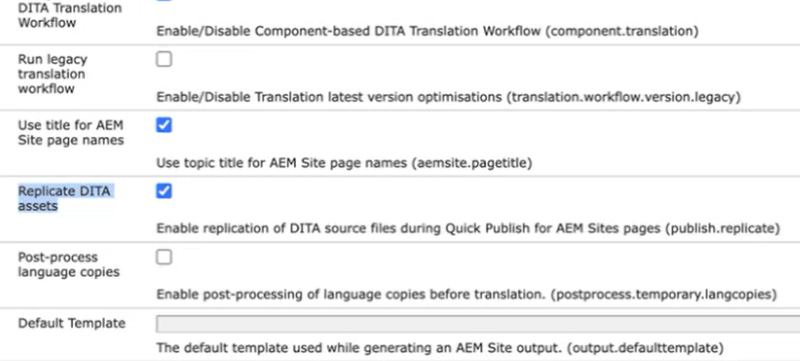

# Configurar a replicação de ativos DITA

Execute as seguintes etapas para configurar o recurso de processamento de ativos:

1. Abra a página Configuração do console da Web do Adobe Experience Manager.

   O URL padrão para acessar a página de configuração é:

   ```http
   http://<server name>:<port>/system/console/configMgr
   ```

1. Procure e selecione o pacote *com.adobe.fmdita.config.ConfigManager*.

1. Defina a configuração `Replicate DITA assets` de acordo com seu requisito. A configuração é ativada por padrão.


   {width="350" align="left"}


1. Selecione **Salvar**.
