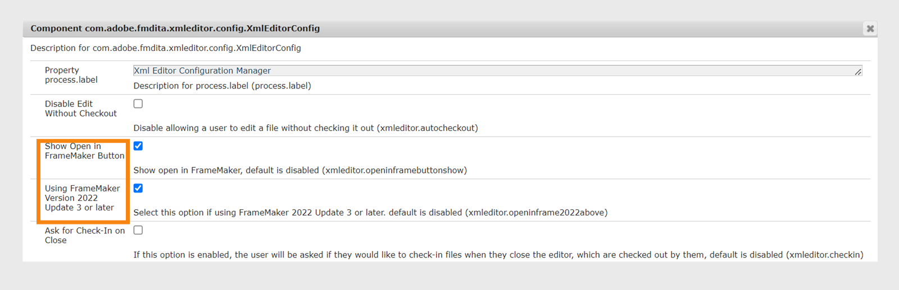

# Integrar editores de XML baseados em desktop {#id181GB01G0HS}

Há muitos editores de XML disponíveis no mercado e você já pode estar usando um. O Adobe FrameMaker é um dos editores de XML mais eficientes, que vem com o conector AEM. Usando o conector AEM no FrameMaker, você pode se conectar facilmente ao repositório AEM, aos arquivos de check-out e check-in e editar os arquivos diretamente no FrameMaker. Você também pode configurar o Experience Manager Guides para iniciar o FrameMaker no Editor da Web. Após abrir o arquivo no FrameMaker, você pode editá-lo e devolvê-lo ao repositório AEM.

## Ativar edição de arquivos no FrameMaker a partir do Editor da Web

Você pode usar o FrameMaker ou qualquer outro editor DITA para criar e atualizar conteúdo DITA. No entanto, se sua organização usar o FrameMaker como editor DITA, você poderá dar aos usuários a opção de abrir documentos DITA diretamente no FrameMaker usando o AEM.

Por padrão, seus usuários não veem o botão **Abrir no FrameMaker** na barra de ferramentas do AEM. Execute as seguintes etapas para adicionar esse botão à barra de ferramentas do AEM:

1. Abra a página Configuração do console da Web do Adobe Experience Manager.

   O URL padrão para acessar a página de configuração é:

   ```http
   http://<server name>:<port>/system/console/configMgr
   ```

1. Procure e clique no pacote **com.adobe.fmdita.xmleditor.config.XmlEditorConfig**.
   

1. Selecione a opção **Mostrar botão Abrir no FrameMaker**.

1. Se você estiver usando a versão 4.6 e a versão de setembro do FrameMaker 2022 - Atualização 3, habilite a configuração **Versão 2022 Atualização 3 ou superior do FrameMaker** para que seus usuários transmitam os detalhes do servidor Experience Manager Guides para o FrameMaker. Por padrão, está desativado.


1. Clique em **Salvar**.


Ao habilitar a opção **Mostrar Botão Abrir no FrameMaker**, o botão **Abrir no FrameMaker** é exibido ao selecionar qualquer arquivo DITA no repositório AEM. Quando esta opção está *não habilitada*, o botão **Abrir no FrameMaker** é exibido somente quando você seleciona um arquivo .fm ou .book no repositório.


