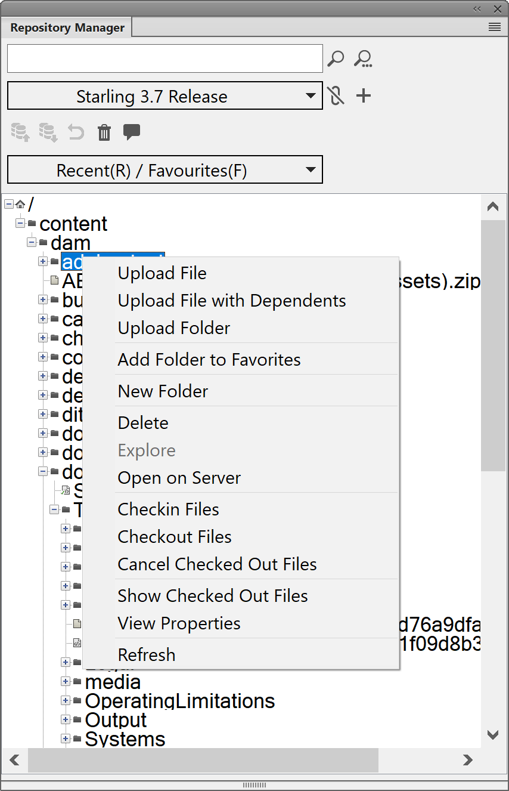

# Fazer upload de conteúdo DITA existente {#id176FF000JUI}

Provavelmente você teria um repositório de conteúdo DITA existente que gostaria de usar com o AEM Guides. Para tal conteúdo existente, você pode usar qualquer uma das seguintes abordagens para fazer upload em massa de seu conteúdo para o repositório AEM.

## Usar uma ferramenta WebDAV

Se estiver criando tópicos e mapas em qualquer outro editor DITA, você pode usar qualquer ferramenta WebDAV para fazer upload dos arquivos. O procedimento fornecido nesta seção usa o WinSCP como a ferramenta WebDAV para fazer upload de conteúdo.

Execute as seguintes etapas para usar o WinSCP para fazer upload de arquivos:

1. Baixe e instale o WinSCP em seu computador.

1. Inicie o aplicativo WinSCP.

   A caixa de diálogo Login é exibida.

1. Na caixa de diálogo Logon, especifique uma configuração Novo Site escolhendo WebDAV como o **Protocolo de Arquivo** e fornecendo outros detalhes de conexão, como:

   - o URL onde o servidor AEM está hospedado,

   - o número da porta \(o padrão é 4502\) e

   - o nome de usuário e a senha para acessar o servidor AEM.

1. Clique em **Logon**.

   Em uma conexão bem-sucedida, você verá o conteúdo do AEM Assets na interface do usuário WinSCP. Você pode navegar, criar, atualizar ou excluir conteúdo facilmente usando o explorador de arquivos WinSCP.


## Usar FrameMaker

O Adobe FrameMaker vem com um poderoso conector AEM que permite carregar facilmente seu DITA existente e outros documentos do FrameMaker AEM \(.book e .fm\) no. Você pode usar várias funcionalidades de upload de arquivos, como fazer upload de um único arquivo, fazer upload de uma pasta completa com ou sem dependências \(como referências de conteúdo, referências cruzadas e elementos gráficos\).

Execute as seguintes etapas para usar o Conector AEM do FrameMaker para fazer upload de conteúdo:

1. FrameMaker de inicialização.

1. Abra a caixa de diálogo **Gerenciador de Conexões**.

   {width="550" align="left"}

1. Insira os seguintes detalhes para se conectar ao repositório AEM:

   - **Nome**: insira um nome descritivo para identificar a conexão com o servidor AEM.
   - **Servidor**: digite a URL e o número da porta do servidor AEM.

   - **Nome de Usuário**/**Senha**: digite o nome de usuário e a senha para acessar o servidor AEM.

1. Clique em **Conectar**.

   Depois que a conexão for estabelecida, o Assets do repositório AEM será exibido na janela Gerenciador do repositório.

   {width="550" align="left"}

   Clicar com o botão direito do mouse em qualquer arquivo ou pasta permite executar operações relacionadas. Por exemplo, se você clicar com o botão direito do mouse em uma pasta, receberá opções para carregar um arquivo, carregar um arquivo com dependências, carregar uma pasta inteira e assim por diante.


## Configurar padrão de nome de arquivo UUID

Ao importar conteúdo, não é necessário que os nomes de arquivo sejam baseados na UUID. Em um sistema que usa nomes de arquivo baseados em UUID, é obrigatório que todos os arquivos sejam referenciados usando seus UUIDs em vez de seus nomes de arquivo originais. Se um arquivo importado não tiver nomes de arquivos baseados em UUID, você poderá configurar o sistema para adicionar uma UUID à propriedade do arquivo. Essa UUID é então usada para se referir a esses arquivos, nos quais a UUID não é usada para nomear os arquivos.

Execute as seguintes etapas para verificar nomes de arquivo em relação a um padrão UUID e atribuir UUID a arquivos que não tenham uma UUID atribuída:

1. Abra a página Configuração do console da Web do Adobe Experience Manager.

   O URL padrão para acessar a página de configuração é:

   ```http
   http://<server name>:<port>/system/console/configMgr
   ```

1. Procure e clique no pacote *com.adobe.fmdita.config.ConfigManager*.

1. Na propriedade **Padrões de Nome de Arquivo UUID**, especifique um padrão para verificar os nomes dos arquivos importados.

   Se um arquivo não seguir o padrão especificado, uma UUID será adicionada à propriedade do arquivo e todas as referências ao arquivo serão atualizadas com a UUID atribuída ao arquivo.

1. Clique em **Salvar**.


## Fazer upload de conteúdo com UUID usando uma ferramenta WebDav {#id201MI0I04Y4}

Você pode usar qualquer um dos métodos a seguir para fazer upload de conteúdo com UUID:

- Arraste e solte conteúdo do seu sistema local.
- Use o fluxo de trabalho **Criar** \> **Arquivos** da interface do Assets do AEM.
- Use uma ferramenta como o WinSCP.

Caso use uma ferramenta como o WinSCP, você poderá definir a ação a ser executada em um arquivo duplicado definindo a opção **Mover arquivo antigo com a mesma UUID para a nova pasta** no configMgr. Essa opção define que ação é executada em um arquivo que está disponível em algum outro local no repositório AEM. Essa configuração está disponível no pacote *com.adobe.fmdita.config.ConfigManager* no configMgr.

Por padrão, a opção **Mover arquivo antigo com Mesmo UUID para Nova Pasta** está ATIVADA. Isso implica que, quando o arquivo que está sendo carregado estiver presente em alguma outra pasta no repositório, o arquivo existente será movido para o local atual e substituído pelo arquivo que está sendo carregado. Se você não selecionar essa opção, o arquivo será substituído em seu local existente.

**Observações adicionais sobre o trabalho com arquivos baseados em UUID**:

Os seguintes pontos devem ser considerados ao mover ou copiar o conteúdo no repositório do AEM:

- Ao copiar um ou mais arquivos de um local para outro, um novo UUID é gerado para arquivos que não têm UUID. Essa UUID é adicionada aos metadados do arquivo.

- Se um arquivo tiver um conflito ou uma duplicata, um nome de arquivo exclusivo será gerado para o novo arquivo que está sendo copiado ou movido.

- Dois arquivos não podem ter a mesma UUID. Um UUID exclusivo é atribuído a todos os novos arquivos.


Os seguintes pontos devem ser considerados ao mover ou copiar o conteúdo do seu sistema local para o repositório AEM:

- Se um arquivo estiver sendo carregado por dois usuários diferentes ao mesmo tempo, o arquivo processado posteriormente substituirá o arquivo anterior. No entanto, essa prática é rara e deve ser evitada.

- Ao fazer check-out do conteúdo do repositório AEM e fazer alterações no sistema local, verifique se o nome do arquivo não foi alterado no momento do upload do arquivo.


## Usar comandos curl

Você também pode usar comandos curl para criar uma pasta no DAM, fazer upload de arquivos e adicionar metadados ao conteúdo carregado.

**Criar uma pasta**

Execute o seguinte comando para criar uma pasta no repositório AEM:

```curl
curl --user <username>:<password> --data jcr:primaryType=sling:Folder "<server folder path>"
```

Especifique os seguintes parâmetros para criar uma pasta:

- `<username>:<passowrd>`: especifique o nome de usuário e a senha para acessar o repositório AEM. Esse usuário deve ter os privilégios de criação de pasta.

- `jcr:primaryType=sling:Folder`: Especifique este parâmetro *como está* para criar um recurso do tipo pasta.

- `<server folder path>`: Caminho completo da pasta incluindo o nome da nova pasta que você deseja criar no repositório AEM. Por exemplo, se você especificar o caminho como `http://192.168.1.1:4502/content/dam/projects/AEM-Guides`, a pasta `AEM-Guides` será criada dentro da pasta `projects` no DAM.


**Carregar um arquivo**

Execute o seguinte comando para carregar um arquivo no repositório AEM:

```curl
curl --user <username>:<password> -T "<local file path>" "<server folder path>"
```

Especifique os seguintes parâmetros para fazer upload de um arquivo:

- `<username>:<passowrd>`: especifique o nome de usuário e a senha para acessar o repositório AEM. Este usuário deve ter privilégios de gravação no `server folder path`.

- ``local file path``: caminho de arquivo completo no sistema local que você deseja carregar.

- `<server folder path>`: Complete o caminho da pasta no servidor AEM onde você deseja carregar o arquivo.


**Adicionar metadados**

Execute o seguinte comando para adicionar metadados em um arquivo:

```curl
curl --user <username>:<password> -F<attribute name>=<value> <metadata node path>
```

Especifique os seguintes parâmetros para adicionar informações de metadados:

- `<username>:<passowrd>`: especifique o nome de usuário e a senha para acessar o repositório AEM. Este usuário deve ter privilégios de gravação no ``metadata node path``.

- ``-F<attribute name>=<value>``: `<attribute name>` é o nome do atributo de metadados, como `audience` e `<value>` poderia ser `internal`. Você pode especificar vários pares nome-valor do atributo separados por espaço.

- `<metadata node path>`: Caminho completo da pasta incluindo o nome do arquivo e seu nó de metadados. Por exemplo, se você especificar o caminho como `http://192.168.1.1:4502/content/dam/projects/AEM-Guides/intro.xml/jcr:content/metadata`, as informações de metadados especificadas serão definidas no arquivo `intro.xml`.


**Tópico pai:**[ Migrar conteúdo existente](migrate-content.md)
