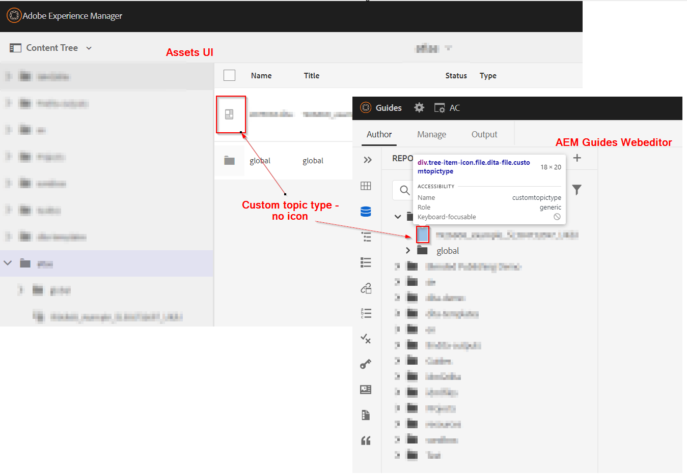
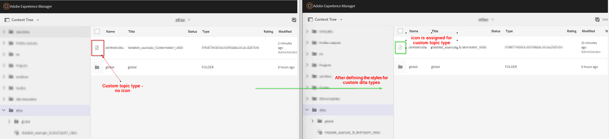

# Configuração do ícone para tipos dita personalizados/especializados (tópico ou mapa)


## Declaração do problema

Com o esquema personalizado usado no AEM Guides, é possível criar tópicos personalizados ou tipos de mapa e com isso, você pode notar que os tipos de tópico/mapa personalizados não mostram o ícone no editor da Web ou na interface do usuário do Assets. Consulte a captura de tela abaixo para referência




Portanto, para atribuir um ícone aos tipos de tópico/mapa personalizados, é necessário fazer o seguinte:
- Localizar o tipo de tópico/mapa personalizado
- Escreva estilos para adicionar o ícone desejado para o tipo personalizado


Podemos implementar as etapas acima para mostrar o ícone no editor da Web (exibição do repositório), bem como na interface do usuário do Assets. Abaixo estão as etapas para ambos


## Mostrando ícone de tópico/mapa personalizado na exibição do editor da Web

_Etapa 1:_ Determine o tipo dita para o tópico/ap dita personalizado
- Abra a visualização de repositório no editor da web > abra o console do desenvolvedor no navegador
- Inspect o espaço de ícones ao lado do tópico/mapa listado
- Verifique a classe atribuída ao tópico personalizado
- Veja a captura de tela abaixo para obter mais detalhes 
- Usaremos esta classe para atribuir ícone e escrever css para isto

_Etapa 2:_ criar css e atribuir um ícone a este tipo dita
- Crie uma biblioteca do cliente em /apps, digamos que você crie um cq:ClientLibraryFolder no caminho desejado
   - adicione categorias &quot;apps.fmdita.xml_editor.page&quot; a ela
- crie uma pasta &quot;assets&quot; neste diretório e adicione todos os ícones que deseja usar para tipos dita personalizados
- adicione um arquivo css na pasta da biblioteca do cliente, diga &quot;tree-icons.css&quot;
   - adicionar o seguinte código a ele

```
            .tree-item-icon {
                &.custommaptype {
                    background-image: url('assets/custommap.svg')
                }
                &.customtopictype {
                    background-image: url('assets/customtopic.svg')
                }
            }
```

- adicione o css.txt na pasta da biblioteca do cliente e adicione a referência a &quot;tree-icon.css&quot; recém-criada
- salvar/implantar essas alterações

Consulte a captura de tela abaixo para obter mais detalhes.


E a saída final é mostrada abaixo da captura de tela


## Exibição do ícone de tópico/mapa personalizado na interface do usuário do Assets

_Etapa 1:_ determinando o tipo dita do tópico/mapa dita personalizado
- isso é explicado na Etapa 1 dos métodos anteriores

_Etapa 2:_ Crie Javacscript para definir quais ícones serão carregados para o tipo dita personalizado para tipos de tópico/mapa personalizados
- Crie uma biblioteca do cliente em /apps, digamos que você crie um cq:ClientLibraryFolder no caminho desejado
   - adicione as seguintes propriedades a ele:
      - valor &quot;categories&quot;(cadeia de caracteres multivalor) como &quot;dam.gui.admin.coral&quot;
      - valor &quot;dependencies&quot;(multi value string) como &quot;libs.fmdita.versioncontrol&quot;
- Crie uma cópia do arquivo &quot;/libs/fmdita/clientlibs/clientlibs/xmleditor/clientlib-dam/topic_type.js&quot; neste diretório /apps
   - edite o &quot;topic_type.js&quot; copiado e altere/adicione customtopictype na variável &quot;typeImageNameMap&quot;
   - Você também pode alterar o caminho da pasta de imagens, alterando o valor da variável &quot;parentImagePath&quot; para onde os ícones personalizados são armazenados
- Crie um arquivo chamado js.txt na pasta da biblioteca do cliente e adicione a referência a &quot;topic_type.js&quot;
- salvar/implantar essas alterações
Consulte a captura de tela abaixo para obter mais detalhes.
  

E a saída final aparecerá como mostrado na captura de tela 
