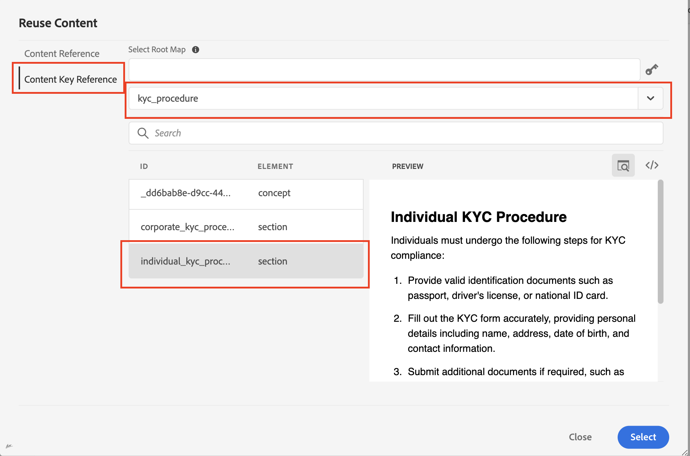

# Reutilização de conteúdo em guias AEM

Os Guias do Adobe AEM aproveitam os pontos fortes do DITA para fornecer uma interface amigável para a reutilização de conteúdo.

## Reusabilidade usando referências de tópico (topicref)


Suponhamos que você seja uma empresa de manufatura e tenha tópicos genéricos sobre precauções de segurança ou técnicas de solução de problemas.

Eles podem ser referenciados e adaptados em manuais de usuário específicos para cada modelo de máquina, reduzindo a redundância e garantindo que as informações essenciais de segurança permaneçam consistentes.

```
<map id="user_manual_model 100" title="ABC Model 100 User Manual ">


<topicref href="Safety_Information.dita" format="dita">
</topicref>
.
.
.
.
.
</map>
```


Da mesma forma para o Modelo 200

```
<map id="user_manual_model 200" title="ABC Model 200 User Manual ">

<topicref href="Safety_Information.dita" format="dita">
</topicref>
.
.
.
.
.
  
</map>
```

## Reusabilidade usando referência de conteúdo (conref e conkeyref)

O atributo de referência de conteúdo (conref) permite vincular a outras partes do conteúdo. Isso promove a reutilização e reduz a redundância.

Por exemplo:

Suponhamos que você seja uma empresa financeira e tenha um tópico genérico para KYC que contenha procedimentos KYC para indivíduos, corporações e assim por diante.

Você deseja reutilizar um fragmento KYC individual para os tópicos &quot;Salvar conta&quot; e &quot;Demat account&quot;.

```
<section id="kyc_requirements_saving_account">
  <title>Know Your Customer (KYC) Requirements</title>
  <p>To comply with regulations and ensure customer identification, all individual applicants for savings  accounts must fulfill the KYC requirements as outlined below</p>
  <p conref=kyc_procedures.dita#individual_kyc></p>
</section>
```

Aqui `conref=kyc_procedures.dita#indvidual_kyc` kyc_procedures.dita é o identificador de arquivo e #individual_kyc é o identificador de fragmento.

Kyc_procedure.dita continua a ser a única fonte de informação. Se houver alterações no processo KYC conforme exigido pelos regulamentos, basta atualizar um tópico e essas alterações serão refletidas automaticamente em todos os tópicos que se referem a ele.

Usando Guias AEM, Seus dois cliques

Etapa 1: Clique em Inserir conteúdo reutilizável


<br>

Etapa 2: selecione o arquivo e o fragmento que precisam ser reutilizados.


Semelhante ao &quot;conref&quot;, também é possível usar &quot;conkeyref&quot;, onde, em vez de fornecer um caminho de conteúdo, você pode fazer referência ao conteúdo por meio de chaves.

Exemplo de código:

```
<section conkeyref="kyc_procedure/individual_kyc_procedure" id="individual_kyc_procedure"></section>
```

A definição de chave tem esta aparência:

```
<map id="ABC_manual">
  <title>ABC_Manual</title>
  <topicref href="kyc_procedure_2020.dita" keys="kyc_procedure" processing-role="resource-only" type="concept">
  </topicref>
  <topicref href="savings_account.dita" type="concept">
  </topicref>
</map>
```

Chave - &quot;Kyc_procedure&quot; continuará sendo a única fonte de informações. Se houver alterações no processo KYC, conforme exigido pelos regulamentos, basta atualizar um caminho de tópico com um novo caminho de tópico, e essas alterações serão refletidas automaticamente em todos os tópicos que se referem a ele.

```
<map id="ABC_manual">
  <title>ABC_Manual</title>
  <topicref href="kyc_procedure_2024.dita" keys="kyc_procedure" processing-role="resource-only" type="concept">
  </topicref>
  <topicref href="savings_account.dita" type="concept">
  </topicref>
</map>
```

Aqui, o caminho do tópico é alterado de &quot;kyc_procedure_2020.dita&quot; para &quot;kyc_procedure_2024.dita&quot; devido a alterações recentes na regulamentação.

Usando Guias AEM, Seus dois cliques

Etapa 1: Clique em Inserir conteúdo reutilizável


Etapa 2: selecione o mapa raiz (opcional), a chave e o fragmento que precisam ser reutilizados.


Aqui, o mapa raiz foi selecionado automaticamente, pois já estava aberto na exibição de mapa


### Reutilizar conteúdo com um único clique em Guias AEM

O AEM Guides oferece um recurso de &quot;Conteúdo reutilizável&quot; para adicionar referências de conteúdo a um único clique.

Etapa 1: Adicionar um tópico genérico ao conteúdo Reutilizável


Etapa 2: Depois de adicionado, arraste e solte o fragmento que deseja reutilizar em qualquer um dos tópicos de destino.


## Perguntas frequentes

- ### Todo o conteúdo não é exibido após a seleção do arquivo/chave na caixa de diálogo Reutilizar conteúdo

Você precisa atribuir IDs a fragmentos (elementos Dita ) que gostaria de reutilizar em outros tópicos

- ## As chaves não são exibidas na caixa de diálogo Reutilizar conteúdo

Verifique se você abriu o mapa raiz/mapa pai na exibição de mapa que tem uma definição de chave ou adicione o caminho do mapa raiz manualmente na mesma caixa de diálogo.


<br>


Publicar na comunidade do AEM Guides [fórum](https://experienceleaguecommunities.adobe.com/t5/experience-manager-guides/ct-p/aem-xml-documentation) para qualquer consulta.

