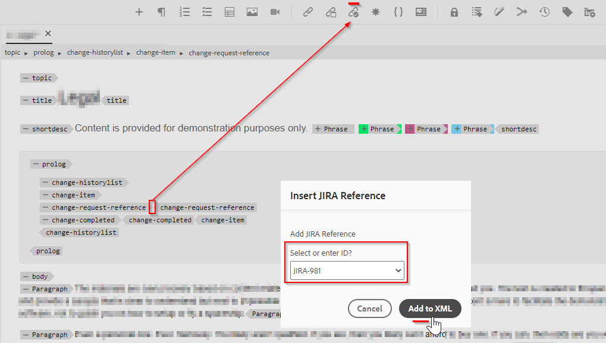

# Adicionar novo botão acionável personalizado na barra de ferramentas do editor da Web

Neste artigo, aprenderemos como adicionar um novo botão personalizado na barra de ferramentas do editor da Web e chamar javascript para executar a operação personalizada desejada.

A adição de um botão acionável ao editor da Web envolve as seguintes etapas:
- Adicionar o botão no *ui_config.json* na posição em que é necessário
- Registrar o evento de clique no botão no editor da Web para que o usuário execute uma ação ao clicar nele


## Implementar utilizando um exemplo

Vamos entender isso com um exemplo em que um autor deseja adicionar uma referência de jira a uma seção de prólogo de tópico. A seção de prólogo com id de referência jira incorporada pode ser semelhante a:


O elemento &quot;change-request-id&quot; que contém a ID de JIRA deve ser recuperado da API (digamos, com base em uma consulta de JIRA específica descrita pelo aplicativo). Quando o usuário está criando a seção de prólogo, o usuário deve ser capaz de clicar em um botão e inserir uma ID de referência jira na barra de ferramentas do editor da Web, semelhante a:


E quando o usuário clica no botão, ele deve mostrar uma caixa de diálogo que deve puxar as opções possíveis e permitir que o usuário selecione a ID JIRA desejada, algo como:



que deve então adicionar o &quot;change-request-id&quot; ao prólogo:


## A implementação desta


### Adicione o botão no editor da Web configurando-o no *ui_config.json*

Use os perfis de pasta para verificar a *ui_config.json* na guia &quot;Configuração do editor XML&quot; e adicione a configuração de botão JSON na seção desejada do grupo &quot;barra de ferramentas&quot;

```
{
    "on-click":"insertJIRARef",
    "icon":"linkCheck",
    "variant":"quiet",
    "type":"button",
    "title":"Insert JIRA Reference"
}
```

[use este link para saber mais sobre Perfil de pasta e configuração ui_config.json](https://experienceleague.adobe.com/docs/experience-manager-guides-learn/videos/advanced-user-guide/editor-configuration.html?lang=en)


### Manipular o evento ao clicar para o novo botão

    OBSERVAÇÃO: as etapas mencionadas abaixo estão disponíveis como pacote anexado a esta publicação


- Depois de salvar o perfil de pasta, crie um &quot;cq:ClientLibraryFolder&quot; em um diretório de projeto (pode estar em */apps*) e adicione propriedades conforme mostrado na captura de tela abaixo:
  

```
This example uses "coralui3" library to show a dialog as it is used in the Javascript sample we presented.
You may use different library of your choice.
```

- Nessa pasta da biblioteca do cliente, crie dois arquivos, conforme mencionado abaixo:
   - *overrides.js*: que terá o código javascript para lidar com o evento de clique para &quot;insertJIRARef&quot; (use o pacote anexado para obter o conteúdo deste javascript)
   - *js.txt*: que incluirá o &quot;overrides.js&quot; para ativar esse javascript

- Salve as alterações e você estará pronto para testar.


### Testes

- Abrir editor da Web
- Em preferências do usuário, escolha o perfil de pasta no qual você adicionou o perfil personalizado *ui_config.json*. Se você o adicionou ao Perfil global, provavelmente já está usando isso.
- Abra um tópico, você notará a barra de ferramentas com um novo botão &quot;Inserir referência Jira&quot;
- Você pode então adicionar a seção do prólogo conforme fornecido abaixo ao tópico e tentar clicar no botão &quot;Inserir referência do Jira&quot; dentro do elemento do prólogo &quot;change-request-reference&quot;

```
<prolog>
    <change-historylist>
        <change-item>
            <change-request-reference>
            </change-request-reference>
            <change-completed></change-completed>
            <change-summary></change-summary>
        </change-item>
    </change-historylist>
</prolog>
```

Consulte a captura de tela abaixo para saber como ela será:


### Anexos

- Exemplo de pacote clientlibs que instalará a biblioteca do cliente webeditor com código javascript para a ação de botão da barra de ferramentas: [baixar usando este link](../../../assets/authoring/webeditor-addbuttonontoolbar-insertjira-clientlib.zip)
- Amostra *ui_config.json* que você pode carregar em um perfil de pasta: [baixe o exemplo ui_config.json](../../../assets/authoring/sample_ui_config_Guides4.2-InsertJiraReference.json)

```
Please note this is compatible to AEM 6.5 and AEM Guides version 4.2.
If you are using a different version please add the toolbar button to the ui_config.json manually.
```
