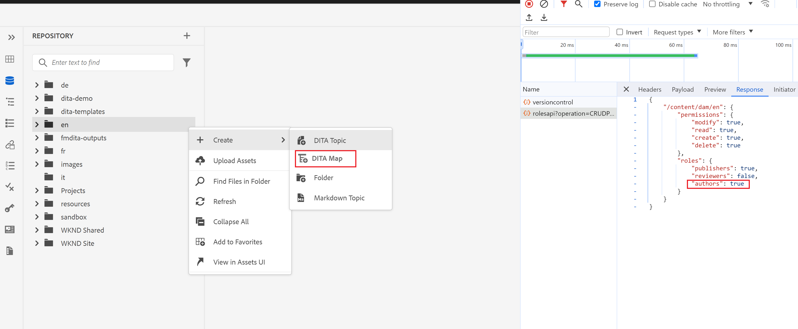
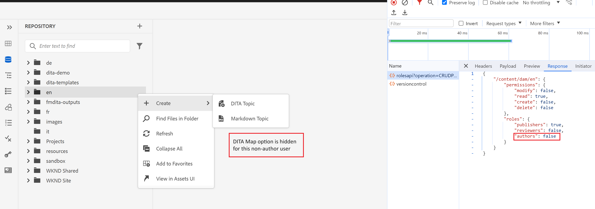

# Mostrar/Ocultar &quot;Criar DitaMAP&quot; no menu de contexto da pasta no editor da Web

Neste artigo, aprenderemos como personalizar o Editor da Web do Guides para ocultar ou mostrar a opção &quot;Criar DitaMap&quot; no menu de contexto da pasta com base nas permissões do usuário/grupo.
Nesse caso de uso, ocultaremos essa opção para todos os usuários não autores.

## Pré-requisitos

Usaremos o pacote de extensão do AEM Guides, que permite personalizar a interface do usuário do seu aplicativo de acordo com seus requisitos.
Consulte esta [documentação](https://github.com/adobe/guides-extension/tree/main) para obter mais informações sobre como a Estrutura de Extensão do Guides funciona.

Agora vamos começar e aprender a personalizar o menu de contexto de pasta para ocultar essa opção para todos os usuários não autores.

Como você pode ver abaixo do trecho, a opção &quot;criar DitaMap&quot; fica visível para um usuário autor.



Agora vamos ver como podemos ocultar essa opção usando a Estrutura de extensão de guias.

## Etapas da implementação

A implementação está dividida nas partes abaixo:

- **Alterações no controlador Folder_options**

  Cada menu de contexto tem uma ID de controlador associada a ele. Esse controlador lida com a funcionalidade no evento para as várias opções do menu de contexto.

  Neste exemplo, vamos personalizar o menu de contexto da pasta para ocultar a opção &quot;Criar DitaMap&quot; para não autores. Para isso, faremos alterações no arquivo folder_options.ts presente em /src no repositório da estrutura de extensão do guides.

  Estamos usando &quot;viewState&quot; como &quot;REPLACE&quot; para ocultar essa opção do menu de contexto.
Estamos chamando um novo widget nesta folder_options com a chave &#39;id&#39;.

```typescript
const folderOptions = {
  id: "folder_options",
  contextMenuWidget: "repository_panel",
  view: {
    items: [
      {
        component: "widget",
        id: "customditamap",
        target: {
          key: "displayName",
          value: "DITA Map",
          viewState: VIEW_STATE.REPLACE,
        },
      },
    ],
  },
};
```

- **Criação de um novo widget para lidar com a lógica**

  Uma nova criação de widget (customoptions.ts) é necessária para escrever a lógica e ocultar essa opção somente para usuários não autores. Para isso, usamos a chave &quot;show&quot;, que atua como um botão de alternância em nossa estrutura JSON.

  Você pode gravar seu próprio servlet externo para verificar os detalhes do grupo. Dessa forma, você também pode personalizar as opções de menu de pastas para seu grupo personalizado.
Neste exemplo, aproveitamos a chamada OOTB AEM &quot;rolesapi&quot; para buscar os detalhes do usuário e definir a resposta em &quot;isAuthor&quot;, como mostrado nos trechos acima.

```typescript
const folderOptions = {
  id: "customditamap",
  view: {
    component: "button",
    quiet: true,
    icon: "breakdownAdd",
    label: "DITA Map",
    "on-click": "createNewDitaMap",
    show: "@extraProps.isAuthor",
  },
};
```

Por meio disso, podemos ocultar o botão com o rótulo &quot;Mapa de dados&quot; com base no valor de &quot;show&quot;.

Adicionamos um controlador para definir o atributo &quot;isAuthor&quot; no modelo. Isso pode ser feito usando a seguinte sintaxe no controlador.

```typescript
this.model.extraProps.set("key", value);
```

Aqui, a chave é &quot;isAuthor&quot; e o valor é a resposta da chamada rolesapi.
Também definimos o evento &quot;createNewDitaMap&quot; para ativar a opção create DitaMap (para usuários autores).

```typescript
controller: {
    init: function () {
      this.model.extraProps.set("isAuthor", false);

      rolesApiResponse.then((result) => {
        console.log(result);
        this.model.extraProps.set(
          "isAuthor",
          result["/content/dam"].roles.authors
        );

        console.log("testresult" + result["/content/dam"].roles.authors);
      });
    },
    createNewDitaMap() {
      repositoryController && repositoryController.next("create_new.map");
    },
  },
```

- **Adicionando o código personalizado**

  Importe folder_options.ts e customoptions.ts para o arquivo index.ts em /src.

## Testes

- Faça logon no AEM com um usuário que não faz parte do grupo de autores. A opção Criar DitaMap estaria oculta no menu de contexto de qualquer pasta, como mostrado abaixo.
Esse caso de uso foi adicionado ao GIT. Encontre os recursos relacionados abaixo.



### Recursos relacionados

- **Repositório base da estrutura de extensão** - [GIT](https://github.com/adobe/guides-extension/tree/main)

- **Documentação** - [no Experience League](../../../../../guides-ui-extensions/aem_guides_framework/basic-customisation.md)

- **Casos de uso comuns documentados** - [no Experience League](../../../../../guides-ui-extensions/aem_guides_framework/jui-framework.md)

- **Repositório público com amostras** - [no GIT](https://github.com/adobe/guides-extension/tree/sc-expert-session). Consultar sc-expert-session de ramificação

```

```
