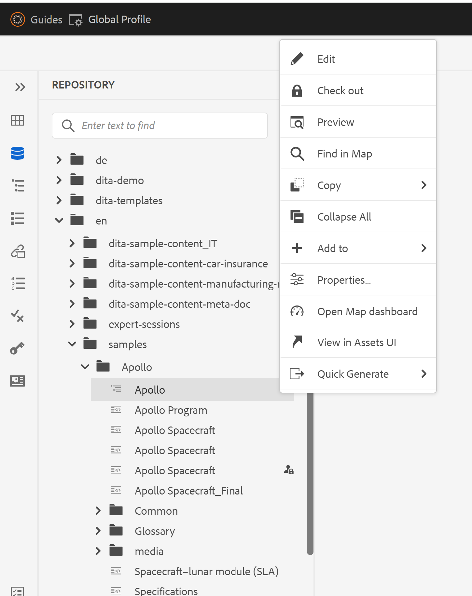

# Remover a opção &quot;Excluir&quot; do menu de contexto do arquivo no editor da Web

Neste artigo, aprenderemos como ocultar a opção &quot;Excluir&quot; do menu de contexto de arquivo no AEM Guides Web Editor para usuários ou grupos específicos. Para outras personalizações em opções de menu de contexto de arquivo, verifique a Estrutura de extensão de guias. Mais detalhes podem ser encontrados [aqui](https://github.com/adobe/guides-extension/tree/main).

Como você pode ver abaixo do trecho, o menu de contexto do arquivo tem a opção &quot;Excluir&quot; disponível para este usuário específico.


Agora, vejamos como ocultar a opção &quot;Excluir&quot; para este usuário.

## Etapas da implementação:

- Navegue até Ferramentas > Segurança > Permissões da página inicial do AEM.
- Escolha o grupo ou usuário na caixa de pesquisa.
- Clique em &quot;Adicionar ACE&quot; no canto superior direito.
- Escolha o caminho da pasta.
- Inclua os privilégios &quot;jcr:removeChildNodes&quot; e &quot;jcr:removeNode&quot;.
- Escolha &quot;Tipo de permissão&quot; como &quot;negar&quot; e clique em &quot;Adicionar&quot; conforme mostrado abaixo.


### Testes

- Faça logon no AEM como o usuário para o qual a ACE foi adicionada.
- Abra o editor da Web.
- Vá para a visualização de repositório e escolha a pasta para a qual as ACEs foram adicionadas.
- Abra o menu de contexto do arquivo.
- A opção &#39;Excluir&#39; não aparecerá no menu de contexto.

O menu de contexto do arquivo agora terá esta aparência:



```
Please note that these steps would also remove 'move' and 'rename' options from the Web Editor as they are also tied to delete process at the backend.
```
