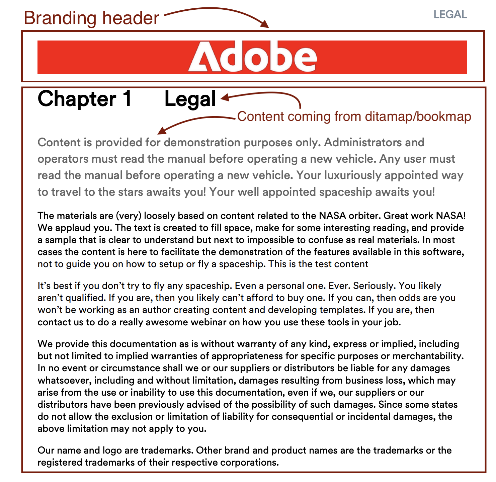
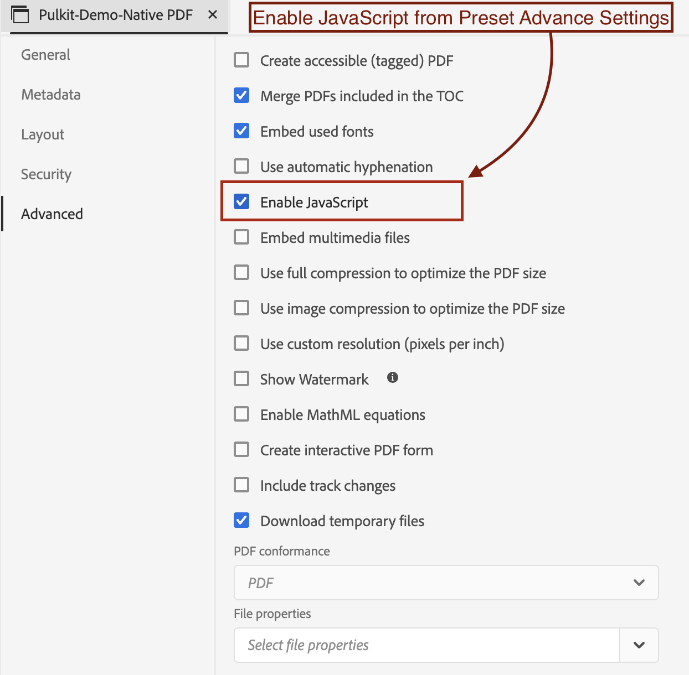

# Adicionar a marca corporativa à primeira página de um PDF DITA

## Este artigo cobrirá:

Obter a marca corporativa ao mesclar perfeitamente a página de capa com a página de capítulo, garantindo que a identidade da empresa seja exibida de forma destacada na parte superior do conteúdo.

- [Configurar seu conteúdo](#set-up-your-content)
- [Faça as alterações necessárias no modelo de PDF](#create-necessary-changes-in-pdf-template)

**Antes:**


<br>
<br>

**Depois de:**



## Configurar seu conteúdo

Para publicar conteúdo no formato PDF, você deve criar um mapa de dados ou um mapa de livros.

Exemplo de estrutura de Bookmap:

```
<bookmap>
  <title>My Bookmap Title </title>
  <frontmatter>
    <booklists>
      <toc/>
      <figurelist/>
      <tablelist/>
    </booklists>
  </frontmatter>

  <chapter href="chapter1.ditamap">
  <chapter href="chapter2.ditamap">
  </chapter>

  <backmatter>
    <booklists>
      <indexlist/>
    </booklists>
  </backmatter>
</bookmap>
```

Exemplo de estrutura Ditamap:

```
<map title="My map Title">

  <topicref href="topic1.dita" >
  </topicref>
  <topicref href="topic2.dita">
  </topicref>
  
</map>
```

O FrontCover do PDF é gerado automaticamente se o Bookmap contiver `<frontmatter>`.


## Faça as alterações necessárias no modelo de PDF

Nesta seção, definiremos nosso template. (Você pode usar ou duplicar o modelo Hi-tech para começar.)

### Configurar seu Modelo:

- Vá para o modelo de PDF nativo.
- Vá para o layout da página do FrontCover e edite-o.
- Aqui, adicione sua imagem de marca em `data-region="content"`.
- Adicione outras alterações necessárias no modelo de capítulo, se necessário.
- Agora, siga as etapas abaixo com base no seu conteúdo.


#### Se estiver usando Ditamap para geração de PDF:

Ao publicar um DITAMAP, o PDF nativo fornece a funcionalidade para gerar automaticamente uma página de capa. A opção para habilitar ou desabilitar a geração de páginas do FrontCover pode ser configurada no modelo de PDF nativo.

Para mesclar:
- Acesse as configurações do modelo de PDF nativo —> Ordem do layout da página
- Agora, mescle o FrontCover com a Próxima página, ou seja, Capítulo e tópicos.
  
- Salve o modelo, selecione esse modelo para sua predefinição e publique!


#### Se estiver usando o Bookmap para geração de PDF

No caso de um Bookmap, a sequência da Ordem de layout da página é controlada pela estrutura do Bookmap, em vez da ordem do modelo.

Para fazer isso no Bookmap , utilizaremos o recurso JavaScript do NativePDF.

- Adicione abaixo do JavaScript na pasta de recursos do modelo

```
window.addEventListener('DOMContentLoaded', function () {
    window.pdfLayout.onAfterPagination(function () {
        var frontMatterWrappers = document.querySelectorAll('.rh-front-matter-wrapper');

        frontMatterWrappers.forEach(function(wrapper) {
            var contentDiv = wrapper.querySelector('div[data-region="content"]');
            var chapterBody = document.querySelector('.chapter-body');

            if (contentDiv && chapterBody) {
                chapterBody.insertBefore(contentDiv, chapterBody.firstChild);
            }

            wrapper.remove();
        });
    });
});
```

- Inclua essa JavaScript no modelo de capítulo.
  

- Ativar o JavaScript na sua opção predefinida
  

- Publish!

## Anexos:

- [Baixe o pacote de modelo de PDF de amostra para ver as alterações aplicadas.](../assets/publishing/NativePDF_DemoTemplate.zip)
- [Baixe o pacote de amostra de predefinição de PDF para ver as alterações aplicadas.](../assets/publishing/Preset_Package.zip)


## Outros recursos:

- [Como incluir o índice do DITA Bookmap no PDF](./how-to-include-bookmap-toc-in-pdf-publishing.md)
- [Vídeo de sessão com um especialista sobre o PDF nativo](../../expert-sessions/native-pdf-publishing-eamples-part1-june2023.md)

