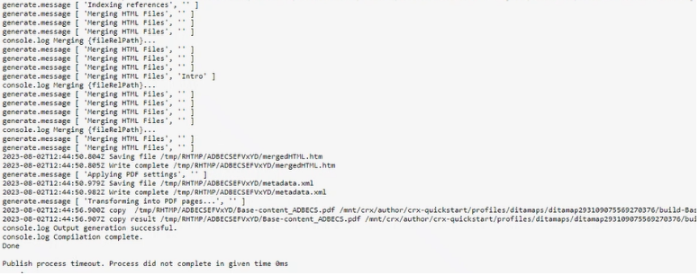

# Configuração do ambiente AEM para publicação de PDF nativo

O AEM Guides inclui um mecanismo de publicação PDF nativo que permite aos usuários projetar, desenvolver e publicar o conteúdo no formato PDF.

Ele fornece a capacidade de criar diferentes layouts de página, modelos CSS e projetar os modelos de PDF em conjunto com os layouts de página e CSS.

As etapas para configurar esse PDF nativo no AEM Guides diferem dependendo do sistema operacional. Use as etapas de configuração abaixo com base no sistema operacional no qual o AEM está instalado.

## Pré-requisitos

Requisitos mínimos para a configuração do PDF nativo:

- Plataforma Java instalada, Standard Edition 8 ou 11 JDK (Java SE Development Kit) e JRE (Java SE Runtime Environment) instalados
- AEM 6.5 SP13, SP12, SP11 ou SP10
- Guias 4.1 e versões posteriores (não UUID ou UUID)

O mecanismo de publicação PDF nativo precisa do JDK do Oracle para gerar os módulos de nó na pasta AEM crx-quickstart. Por padrão, ele é compatível com os seguintes sistemas operacionais:

- Windows 10, Windows 2019 Server e superior.
- Linux - (RHEL 8 e superior, CentOS 7 e superior, Ubuntu 18 e versões superiores)
- SO Mac (baseado na Intel)

## Etapas de configuração para Windows Server (JAVA 11/8)

1. Certifique-se de que o servidor AEM esteja desativado.
2. Na barra de tarefas do Windows, clique com o botão direito do mouse no ícone do Windows e selecione Sistema.
3. Na janela Configurações, em Configurações relacionadas, clique em Configurações avançadas do sistema.
4. Na guia Avançado, clique em Variáveis de ambiente.
5. Na seção de variáveis do sistema, clique em &quot;_Novo_&quot; para criar uma nova variável de ambiente.
6. Insira o nome da variável como JAVA_HOME.
7. No campo de valor, forneça o caminho de Instalação do Java e clique em Ok.

   Por exemplo:

   JAVA 11:

   C:\Program Files\JAVA\jdk-11.0.15.1

   JAVA 8:

   C:\Program Files\JAVA\ jdk1.8.0_144

8. Adicione, selecione Caminho nas variáveis do sistema e clique em Editar.

9. Agora, em Path variables, forneça o valor de Server path e clique em Ok.

   Por exemplo:

   JAVA 11:

   %JAVA_HOME%\bin\server\

   JAVA 8:

   %JAVA_HOME%\jre\bin\server\

10. Clique em &#39;OK&#39; novamente na caixa de diálogo Variáveis de ambiente.
11. Clique novamente em &#39;OK&#39; na caixa de diálogo Propriedades do sistema.
12. Agora, inicie o servidor AEM.
13. Gerar PDF nativo a partir de predefinições no editor da Web.

## Etapas de configuração para servidor Linux (RHEL7/centOS 7)

1. Verifique se o servidor AEM está desativado
2. Verifique a variável JAVA_HOME fazendo echo $JAVA_HOME
3. Se a variável JAVA_HOME não estiver definida, siga a etapa 4. Caso contrário, vá diretamente para a etapa 5.
4. Defina a variável JAVA_HOME usando os comandos abaixo com base na versão instalada do java

   Por exemplo:

   JAVA 11:

   1. exportar JAVA\_HOME=/usr/lib/jvm/java-11.0.15.1
   2. caminho de exportação=$PATH: $JAVA\_HOME/bin
   3. exportar LD\_LIBRARY\_PATH=/usr/lib/jvm/jdk-11.0.15.1/lib/server:/usr/java/jdk-11.0.15.1/lib/server

   JAVA 8:

   1. exportar JAVA\_HOME=/usr/lib/jvm/java-11.0.15.1
   2. caminho de exportação=$PATH: $JAVA\_HOME/bin

5. Reinicie o Servidor AEM e vá para a Etapa 12, se estiver usando o Guides versão 4.2 e superior.
6. Copie o &quot;_node_modules.zip_&quot; anexado na parte inferior deste artigo no diretório crx-quickstart/profiles/nodejs—b1aad0a7-9079-e56c-1ed8-6fcababe8166/.
7. Abra o terminal no crx-quickstart/profiles/nodejs—b1aad0a7-9079-e56c-1ed8-6fcababe8166/.
8. Exclua o diretório node_modules usando o comando abaixo

   **rm -rf node_modules**

9. Descompacte node_modules.zip usando o comando abaixo

   **descompactar node_modules.zip**

10. Se o comando unzip não estiver instalado/reconhecido, ele poderá ser instalado usando o seguinte comando

    **descompactar a instalação do yum**

11. Instale o pacote fontconfig.
Comando: yum install fontconfig
12. Gerar PDF nativo a partir de predefinições no editor da Web.

**OBSERVAÇÃO**: o pacote node_modules.zip pode ser baixado [aqui](https://acrobat.adobe.com/link/track?uri=urn:aaid:scds:US:295d8f03-41e1-429b-8465-2761ce3c2fb3).

A importação manual dos módulos de nó baixados para o sistema operacional Linux é uma solução alternativa para usuários que estão no Guides 4.1 ou em versões anteriores (Etapa 6-12)

## Etapas de configuração para a máquina do Mac (JAVA 11/8)

1. Instale o Oracle JAVA 11 ou o Oracle JAVA 8.
2. Defina a variável de ambiente JAVA_HOME para o diretório JAVA instalado.
3. Abra um shell Unix.
(O Bash é usado aqui para definir a configuração)

   Comando: nano ~/.bashrc

4. Defina a variável JAVA_HOME usando os comandos abaixo com base na versão instalada do java

   Por exemplo:

   JAVA 11:

   exportar JAVA\_HOME= /Library/Java/JavaVirtualMachines/jdk-11.0.15.1.jdk/Contents/Home

5. Recarregar bashrc

   Comando: fonte ~/.bashrc.

6. Verifique se JAVA_HOME está definido usando o comando echo $JAVA_HOME

7. Execute os três comandos abaixo a partir do caminho de instalação do AEM

   C:/{aem-installation-folder}/crx-quickstart/profiles/nodejs—b1aad0a7-9079-e56c-1ed8-6fcababe8166

   i) encontrar . -type d -exec chmod 0755 {} \;
ii) encontrar . -type f -exec chmod 0755 {} \;
iii)/node-darwin/bin/node node-darwin/lib/node_modules/npm/bin/npm-cli.js —prefix . install — unsafe-perm — scripts-prepend-node-path

8. Verifique se o Java está instalado usando o comando abaixo

   i) Execute **.comando /node-darwin/bin/node** da pasta /crx-quickstart/profiles/nodejs—b1aad0a7-9079-e56c-1ed8-6fcababe8166

   

   ii) a = require(&#39;java&#39;)

9. Instale o pacote fontconfig.
Comando: apt install fontconfig

10. Gerar PDF nativo a partir de predefinições no editor da Web.

## Resolução de problemas

Abaixo estão os erros comuns que podem ocorrer durante a Geração de PDF quando as variáveis de ambiente não estão definidas corretamente.

### Exceção de ponteiro nulo no sistema operacional Windows/Mac

Se o problema persistir mesmo após a correção das configurações do ambiente Java, revalide o seguinte:

1. Verifique se a predefinição de saída está definida corretamente ou crie uma nova predefinição de saída sem espaços.

2. Verifique o diretório de recursos do nó em /libs/fmdta/node_resources para garantir que todas as bibliotecas necessárias estejam instaladas durante a instalação.

### Bibliotecas ausentes no SO Linux RHEL 7

### Tempo limite do processo do Publish. O processo não foi concluído no tempo especificado de 0 ms

Valide o valor da propriedade timeout do nó nodejs em /var/dxml/profiles/b1aad0a7-9079-e56c-1ed8-6fcababe8166/nodejs no repositório do CRX. O valor padrão é 300.

Se você encontrar problemas ao executar qualquer uma das etapas acima, poste sua pergunta no [fórum](https://experienceleaguecommunities.adobe.com/t5/experience-manager-guides/ct-p/aem-xml-documentation?profile.language=pt) da Comunidade do AEM Guides para obter assistência.
