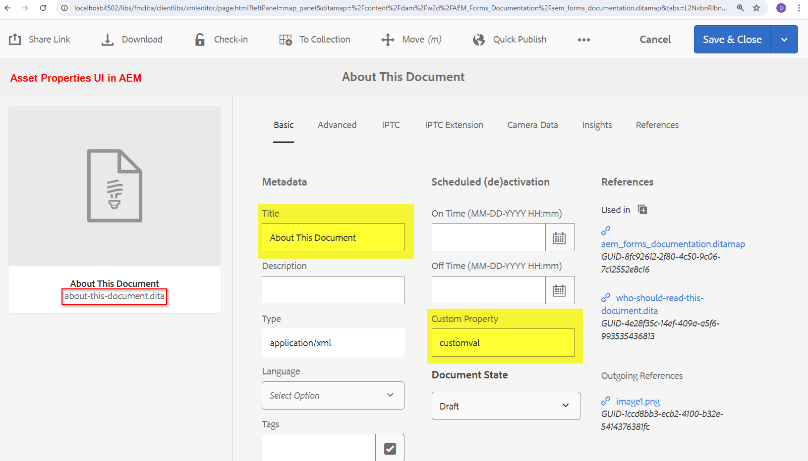

# Propagar metadados do AEM Assets para saída gerada pelo plug-in DITA-OT

Neste artigo, explicaremos como implementar alterações no plug-in DITA-OT para ler o arquivo metadata.xml _(disponível em arquivos temporários)_ e utilizar as propriedades, transmitidas pelo fluxo de trabalho de publicação do AEM Guides, em plug-ins DITA-OT e configurá-las na saída gerada.

Em um nível superior, abaixo estão as etapas que você aprenderá neste artigo:
- Definir metadados na predefinição de saída de um ditamap no AEM Guides
- Na geração da saída, acesse este arquivo metadata.xml no diretório temporário DITA-OT
- Implementação no plugin DITA-OT para ler este _metadata.xml_ e usar as propriedades disponíveis na saída gerada
- Verificar a saída gerada para ver os metadados propagados

## Fundo

Com o AEM Guides, você pode usar plug-ins DITA-OT para publicar em formatos de saída de sua escolha usando os plug-ins configurados e
você também pode passar metadados dos ativos gerenciados no DAM AEM para o processo DITA-OT para usá-los na saída gerada. consulte a documentação sobre [como configurar ditamap/tópicos para passar metadados pela predefinição de saída](https://experienceleague.adobe.com/en/docs/experience-manager-guides/using/user-guide/output-gen/pass-metadata-dita-ot)


## Suposições

Você tem uma configuração do AEM com a versão do AEM Guides 4.4.0/2024.6 ou superior
Você tem conhecimento prévio sobre como o DITA-OT funciona e sua estrutura de diretórios


## Etapas explicadas

### Configuração de metadados no ativo

Com o Esquema de metadados do AEM Assets, é possível criar campos de propriedade personalizados para o Assets no AEM, e os usuários podem atribuir metadados aos ativos. Tomando um exemplo de um ativo _tópico_ onde um metadado chamado _customprop_ pode ser definido para um exemplo - consulte a captura de tela abaixo:




### Configuração dos metadados na predefinição de saída ditamap a serem transmitidos para o DITA-OT

Configure a predefinição de saída de sua escolha no mapa para exportar metadados e passar para o DITA-OT
Digamos que estamos gerando saída de HTML5 usando um plug-in DITA-OT, diga _adobe.html_.
Consulte a captura de tela abaixo para entender como configurar a predefinição de saída de um mapa para transmitir metadados ao plug-in DITA-OT.
1. Abra um mapa e navegue até a guia _Saída_ desse mapa e abra a predefinição HTML5 e clique na guia _Avançado_. Nessa guia, defina o nome de Transformação como _adobe.html_ (esse é o plug-in que configuraremos e usaremos como exemplo, e você também pode definir seu plug-in personalizado)
2. Defina _Reter arquivos temporários_ para poder baixar os arquivos temporários e verificar como metadata.xml é formado. Você pode usar isso para desenvolvimento
3. Selecione as propriedades de metadados que você deseja transmitir para o DITA-OT via metadata.xml. Neste exemplo, digamos que queremos passar _dc:title_ e _customprop_
4. Salvar a predefinição e Gerar a saída
5. Baixar o arquivo temporário usando o botão mostrado na predefinição

Consulte a captura de tela abaixo para entender as etapas fornecidas acima:


### Implementação do plugin DITA-OT

#### Acessando o arquivo metadata.xml no diretório temporário

No pacote de arquivos temporários baixados, você notará um arquivo metadata.xml onde é possível ver a estrutura das propriedades e dos valores (veja a captura de tela abaixo)


##### Entender metadata.xml

- Esse arquivo contém uma lista de todos os ativos publicados, cada um com:
   - caminho do arquivo no diretório DITA [atributo id do elemento Path]
   - e lista de pares de valores de propriedade de metadados [em _elemento de metadados_]

```
        <Path id="topics\about-this-document.dita">
            <sourceProps>
                ...
            </sourceProps>
            <metadata>
                <meta isArray="false" key="dc:title">About This Document</meta>
                <meta isArray="false" key="customprop">customval</meta>
            </metadata>
        </Path>
```

#### Acesso aos metadados de cada ativo no plug-in DITA-OT

Para que o plug-in DITA-OT leia o _metadata.xml_ e as propriedades disponíveis nele, é necessário fazer o seguinte:
- Defina as configurações personalizadas do plug-in no _plugins.xml_. Onde definir os parâmetros e o integrador para a iniciação do plug-in, nosso arquivo de plug-in de amostra será semelhante ao mostrado abaixo:

```
<?xml version="1.0" encoding="UTF-8"?>
<plugin id="com.adobe.html">
    <require plugin="org.dita.html5"/>
    <feature extension="dita.conductor.transtype.check" value="adobe.html"/>
    <feature extension="ant.import" file="integrator.xml"/>
    <feature extension="dita.conductor.html5.param" file="params.xml"/>
    <feature extension="package.version" value="2024.1"/>
</plugin>
```

- No início do plug-in:
   - defina uma variável para apontar para o arquivo metadata.xml, ou seja, no _integrator.xml_ no plug-in defina uma propriedade para definir o caminho do arquivo de metadados e
   - defina o arquivo que executa as regras de transformação xsl personalizadas, ou seja, _args.xsl_, que no nosso caso apontará para o arquivo _xsl/adobe-html5.xsl_.
Código de referência abaixo:

```
    <property name="adobe.html.xsl.dir" value="${dita.plugin.com.adobe.html.dir}${file.separator}xsl${file.separator}"/>
    <property name="args.xsl" location="${adobe.html.xsl.dir}adobe-html5.xsl" />
    <dirname property="input.dirname" file="${args.input}"/>
    <makeurl file="${input.dirname}/metadata.xml" property="metadata.url"/>
```

- Passe o valor da variável _metadata.url_ para o XSL personalizado para utilizá-lo conforme necessário, ou seja, no _param.xml_ existente/criado, passe o parâmetro para o plug-in. Veja abaixo um exemplo de arquivo params.xml:

```
    <?xml version="1.0" encoding="UTF-8"?>
    <params xmlns:if="ant:if">
        <param name="metadata.url" expression="${metadata.url}" if:set="metadata.url"/>
    </params>
```

- No arquivo de transformação XSL personalizado _xsl/adobe-html5.xsl_, você pode ler os valores de metadados do arquivo de metadados e defini-los na saída como desejar. Neste exemplo, adicionaremos os valores de metadados ao cabeçalho html > metatags. Código de referência abaixo:

```
<xsl:import href="plugin:org.dita.html5:xsl/dita2html5.xsl"/>
    <xsl:param name="metadata.url"/>
    <xsl:template name="copyright">
        <xsl:if test="doc-available( $metadata.url )">
            <xsl:variable name="docName" select="tokenize( base-uri(), '/' )[ last() ]"/>
            <xsl:variable name="doc" select="doc( $metadata.url )"/>
            <xsl:for-each select="$doc//Path[ ends-with( @id, concat( '\', $docName ) ) ]/metadata/meta">
                <meta name="{ @key }" content="{ . }"/>
            </xsl:for-each>
        </xsl:if>
    </xsl:template>
```

Consulte a captura de tela abaixo destacando as etapas acima


### Teste da implementação do plug-in

Você pode testar o plug-in executando o seguinte comando para testá-lo com os arquivos temporários baixados do AEM (que tem conteúdo de mapa e seu metadata.xml)

```
./dita --input=docsrc/samples/HTML5/aem_forms_documentation.ditamap --format=adobe.html
```

Supondo que você tenha copiado os arquivos temporários baixados no diretório &quot;DITA-OT/docsrc/samples/HTML5&quot;.
Você também pode baixar a amostra fornecida na seção de recursos abaixo.

Quando o comando acima for executado, você poderá verificar a saída no diretório &quot;DITA-OT/bin/out&quot;, onde poderá verificar os arquivos html gerados para o tópico &quot;about-this-document.dita&quot; que terá os metadados personalizados no elemento _head_

```
<head>
    <meta http-equiv="Content-Type" content="text/html; charset=UTF-8">
    <meta charset="UTF-8">
    <meta name="copyright" content="(C) Copyright 2024">
    <meta name="DC.format" content="HTML5">
    <meta name="DC.identifier" content="GUID-f193ea85-989d-4d80-99e2-2f5dea3d5310">
    <meta name="DC.language" content="en-US">
    <meta name="dc:title" content="About This Document">
    <meta name="customprop" content="customval">
    <title>About This Document</title>
</head>
```

### Implantação

Depois de desenvolver o plug-in DITA-OT, você pode integrá-lo ao DITA-OT usando o comando _dita —install_ no diretório DITA-OT e implantá-lo no servidor AEM [consulte este artigo para obter mais detalhes](https://experienceleaguecommunities.adobe.com/t5/experience-manager-guides/steps-to-setup-a-custom-dita-ot/td-p/407659)


## Recursos

1. Arquivos temporários de exemplo baixados do ditamap de exemplo - [baixe usando este link](../../assets/publishing/sample-temp-html5-adobe.html-content.zip)
2. Plug-in DITA-OT com implementação explicada acima [baixar usando este link](../../assets/publishing/sample-custom-plugin-com.adobe.html.zip)