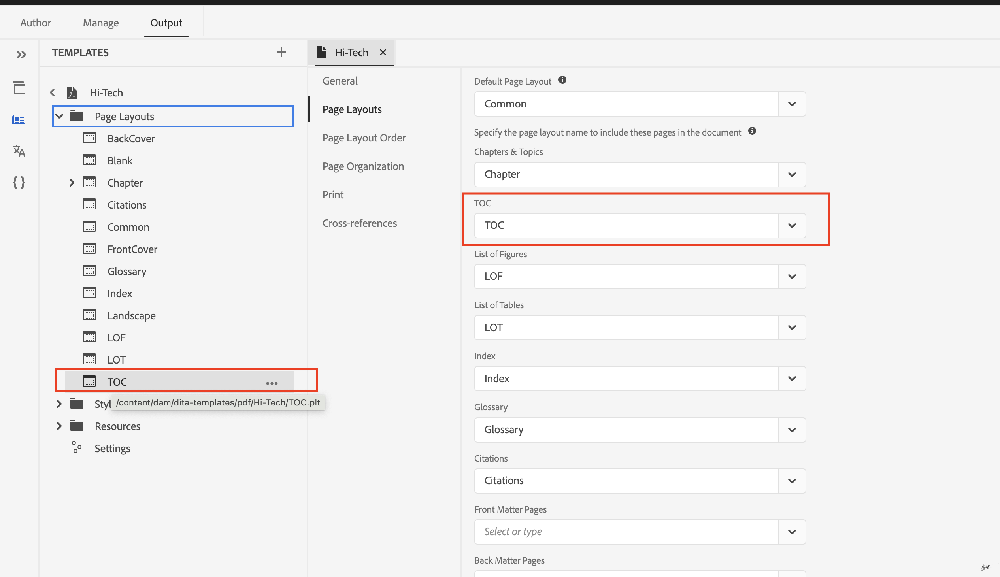

# Gerar índice do mapa de livros na publicação do PDF

## Configurar o seu mapa de livros

Incluir o elemento `<toc>`:
No elemento `<frontmatter>` do seu mapa, localize o elemento `<booklists>`.  Aninhar um elemento `<toc>` dentro de `<booklists>` desta forma:

```
<frontmatter>
  <booklists>
    <toc/>  <figurelist/>
    <tablelist/>
  </booklists>
</frontmatter>
```

A especificação DITA também permite colocar o sumário e as listas de favoritos na seção `<backmatter>`.


```
<backmatter>
    <booklists>
      <toc/>
      <figurelist/>
      <indexlist/>
    </booklists>
  </backmatter>
```

Exemplo de estrutura de mapa com índice, lista de figuras e lista de tabelas no material de frente e lista de índices no material de fundo.

```
<bookmap>
  <title>My Bookmap Title </title>
  <frontmatter>
    <booklists>
      <toc/>
      <figurelist/>
      <tablelist/>
    </booklists>
  </frontmatter>

  <chapter href="chapter1.ditamap">
  <chapter href="chapter2.ditamap">
  </chapter>

  <backmatter>
    <booklists>
      <indexlist/>
    </booklists>
  </backmatter>
</bookmap>
```

O índice e as listas de favoritos são gerados automaticamente com base na estrutura definida no seu mapa de favoritos.

Depois que o seu bookmap for configurado, use o PDF nativo para gerar a saída de PDF. Ela processa a estrutura e as referências do mapa, incluindo o índice e as listas de favoritos.

## Design do índice e sua ordem no PDF

A funcionalidade PDF nativa fornece um método conveniente para adaptar o layout e o design do índice.

Você pode controlar o design por meio de um layout de página separado para índice e estilos por meio de layout.css.

O índice e outros pedidos de listas de favoritos no PDF são baseados somente na estrutura do mapa de favoritos.




## Perguntas frequentes

- ### Como incluir o índice de um Ditamap em um PDF

Os próprios mapas de dicionário não têm um sumário diretamente (índice), como um mapa tem. No entanto, os ditamaps desempenham um papel crucial na definição da estrutura do conteúdo e contribuem indiretamente para o processo de geração de índice.

Se você estiver publicando o Ditamap, o PDF nativo fornecerá a funcionalidade para gerar o índice e a lista de favoritos automaticamente. É possível habilitar/desabilitar a geração de índice no ditamap nas configurações de PDF nativo.


## Recursos adicionais:

- [Documentação de layout da página de design do PDF nativo](https://experienceleague.adobe.com/en/docs/experience-manager-guides/using/install-guide/on-prem-ig/output-gen-config/config-native-pdf-publish/design-page-layout)
- [Sessão de especialista pré-gravada do Native PDF essentials](https://experienceleague.adobe.com/en/docs/experience-manager-guides/using/knowledge-base/expert-session/native-pdf-publishing-essentials-feb23)

<br>
<br>

Post no [fórum](https://experienceleaguecommunities.adobe.com/t5/experience-manager-guides/ct-p/aem-xml-documentation) da Comunidade AEM Guides para qualquer consulta.


