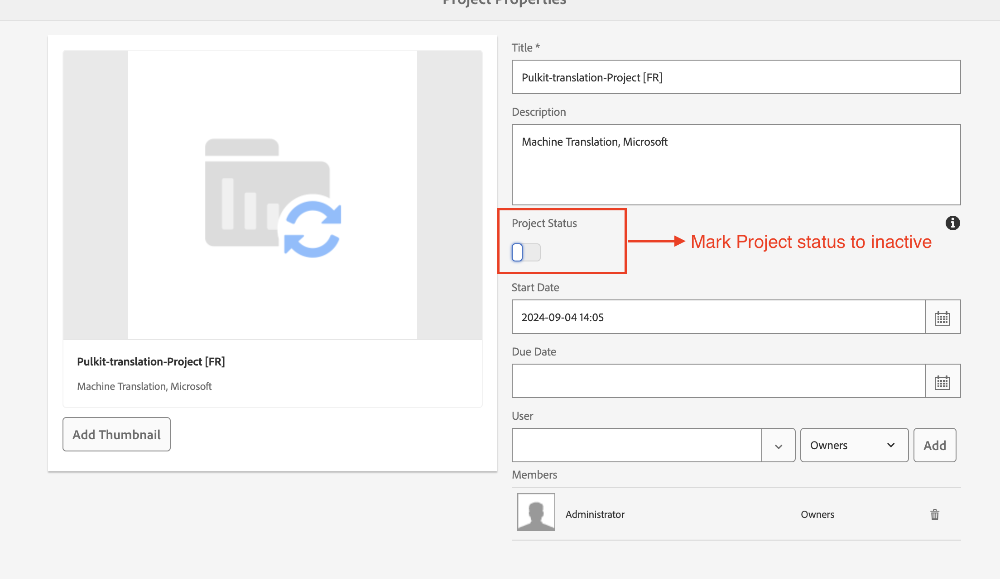

# Práticas recomendadas a serem seguidas para tradução no AEM Guides

O desempenho do seu projeto de tradução pode diminuir à medida que a atividade de tradução no sistema aumenta ao longo do tempo.

Cada projeto de tradução gera vários grupos de usuários para acesso, resultando em um aumento no número de grupos de usuários no sistema. À medida que o número de grupos de usuários se expande, ele pode retardar gradualmente as operações de CRUD relacionadas às permissões do usuário, afetando potencialmente o desempenho geral do AEM. Além disso, se os projetos de tradução permanecerem ativos após a conclusão, isso poderá afetar negativamente o desempenho da sincronização de tradução entre o AEM e o fornecedor da tradução.

**Seguir as práticas recomendadas abaixo ajudará a manter um ambiente eficiente.**

## Se você estiver em uma build com mais de 4.6 (no local) ou 2404 (nuvem):

- Marcar todos os projetos como &quot;Inativos&quot; depois que a tradução for concluída e aprovada.O projeto permanece disponível para revisão e é simplesmente marcado como inativo.
   - Seguir essas etapas ajudará a manter o desempenho geral da tradução com boa integridade.
     

- Para a pasta de projetos mais antigos, que está marcada como inativa, aprovada e revisada deve ser excluída
   - Seguir essas etapas ajudará a manter o desempenho geral da tradução com boa integridade, limpando os arquivos de tradução temporários e os grupos de usuários associados a esta pasta do projeto.
     

## Se você estiver no, build 4.6 ou 2404 ou posterior:

Você pode continuar seguindo as mesmas etapas mencionadas acima. A partir da versão 4.6/2404, o AEM Guides apresenta uma configuração de editor para que os administradores desativem a exclusão automática de projetos de tradução.

Consulte: [Excluir ou desabilitar automaticamente um projeto de tradução concluído](https://experienceleague.adobe.com/en/docs/experience-manager-guides/using/user-guide/author-content/create-preview-topics/author-content-aem-guides/work-with-web-editor/translate-documents-web-editor#automatically-delete-or-disable-a-completed-translation-project)

