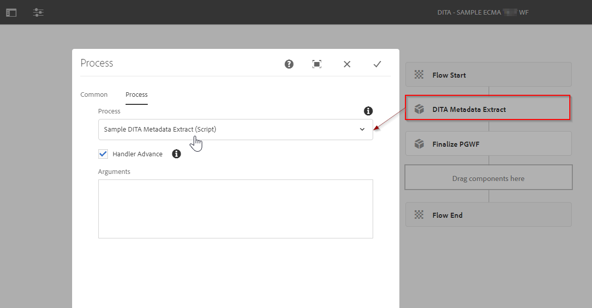

# Publicação no AEM Guides - Fluxo de trabalho de pós-geração

O AEM Guides oferece a flexibilidade de especificar um fluxo de trabalho de geração de pós-saída. Você pode executar algumas tarefas de pós-processamento na saída gerada usando o AEM Guides.
Por exemplo, você pode querer definir determinadas propriedades na saída do PDF ou enviar um email para um conjunto de usuários depois que a saída for gerada.

## Quais são as etapas envolvidas para utilizar workflows de pós-geração

### Criar um processo de fluxo de trabalho

Crie um processo de workflow baseado em Java ou ECMA que execute a operação na saída gerada. Por exemplo, copiar alguns metadados da origem para o conteúdo gerado ou manipular os metadados da saída gerada.
- Pegaremos um exemplo de criação desse processo usando o script ECMA (você pode consultar o pacote anexado)
- Para o processo de fluxo de trabalho baseado em Java, consulte a seção &quot;*Personalizar fluxo de trabalho de geração pós-saída*&quot; do [Guia de instalação e configuração](https://helpx.adobe.com/content/dam/help/en/xml-documentation-solution/4-2/Adobe-Experience-Manager-Guides_UUID_Installation-Configuration-Guide_EN.pdf#page=119)

### Criar um modelo de fluxo de trabalho

Com o processo de fluxo de trabalho personalizado criado na etapa anterior, crie um modelo de fluxo de trabalho e adicione essa etapa do processo a ele.
- Você também precisa adicionar uma etapa de processo obrigatória &quot;*Finalizar pós-geração*&quot; como a última etapa do fluxo de trabalho.

Consulte o modelo de fluxo de trabalho de amostra mostrado abaixo:

### Usar este fluxo de trabalho de pós-geração em um mapa

O fluxo de trabalho de pós geração é uma propriedade que pode ser configurada em qualquer predefinição de saída no mecanismo de publicação do AEM Guides. Exemplo:

Presumindo que o modelo selecionado já foi criado.

### Testes

Agora é possível executar a publicação usando essa predefinição e validar a saída da etapa do processo

## Amostra

Para sua referência, você pode usar o pacote abaixo e instalá-lo por meio do gerenciador de pacotes para testar o fluxo de trabalho de pós-geração de amostra (*conforme referido nas capturas de tela acima*)

[Um exemplo de modelo de fluxo de trabalho de pós-geração baseado em ECMA](../assets/workflows/sample-pgwf-ecma-test-wfmetadata.zip)
