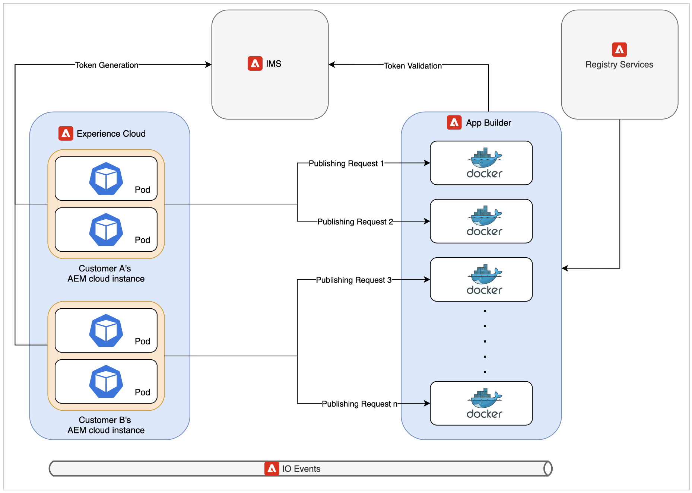

# Arquitetura do microsserviço de publicação na nuvem e análise de desempenho

Este artigo compartilha os insights sobre a arquitetura e os números de desempenho do novo microsserviço de publicação na nuvem.

>[!NOTE]
>
> A publicação com base em microsserviços no AEM Guides é compatível com o PDF (baseado em Nativo e DITA-OT), o Site do AEM (usando o mapeamento de componentes compostos), o HTML5, o JSON e os tipos PERSONALIZADOS de predefinições de saída.

## Problemas com fluxos de trabalho de publicação existentes na nuvem

A publicação DITA é um processo que consome muitos recursos e depende principalmente da memória disponível do sistema e do CPU. A necessidade desses recursos aumenta ainda mais se os editores estiverem publicando mapas grandes com muitos tópicos ou se várias solicitações de publicação paralelas forem acionadas.

Se você não estiver usando o novo serviço, toda a publicação ocorrerá no mesmo pod Kubernetes(k8) que também está executando o servidor de nuvem do AEM. Um pod k8 típico tem um limite na quantidade de memória e CPU que ele pode usar. Se os usuários do AEM Guides estiverem publicando cargas de trabalho grandes ou paralelas, esse limite poderá ser ultrapassado rapidamente. O K8 reinicia o pods que estão tentando usar mais recursos do que o limite configurado, o que pode ter um impacto sério na própria instância da nuvem do AEM.

Essa restrição de recursos foi a principal motivação para criar um serviço dedicado que pode permitir executar várias cargas de trabalho de publicação simultâneas e grandes na nuvem.

Para saber mais sobre a publicação de fluxos de trabalho na nuvem, consulte as [Perguntas frequentes sobre publicação de fluxo de trabalho e escalabilidade](/help/product-guide/user-guide/publishing-scalability-faq.md).

## Introdução à nova arquitetura

O serviço está usando as soluções de nuvem de ponta da Adobe, como App Builder, IO Eventing e IMS, para criar uma oferta sem servidor. Estes serviços são baseados nos padrões industriais amplamente aceitos como Kubernetes e docker.

Cada solicitação para o novo microsserviço de publicação é executada em um contêiner de docker isolado que executa somente uma solicitação de publicação por vez. Vários novos contêineres são criados automaticamente caso novas solicitações de publicação sejam recebidas. Essa configuração de contêiner único por solicitação permite que o microsserviço forneça o melhor desempenho aos clientes sem introduzir riscos de segurança. Esses contêineres são descartados quando a publicação termina, liberando assim os recursos não utilizados.

Todas essas comunicações são protegidas pelo Adobe IMS usando autenticação e autorização baseadas em JWT e são executadas por HTTPS.

>[!NOTE]
>
> O processo de publicação executa algumas partes da solicitação dependentes de conteúdo no próprio servidor do AEM, como a geração de listas de dependência. No entanto, as partes mais exaustivas do processo de publicação, como a execução do DITA-OT ou do mecanismo nativo, foram transferidas para o novo serviço.

## Análise de desempenho

Esta seção mostra os números de desempenho do microsserviço. Ele compara o desempenho do microsserviço com a oferta no local do AEM Guides, já que a antiga arquitetura de nuvem tinha problemas na publicação simultânea ou na publicação de mapas muito grandes.

Se você estiver publicando um mapa grande no local, talvez seja necessário ajustar os parâmetros de heap do Java ou encontrar erros de memória insuficiente. Na nuvem, o microsserviço já apresenta um perfil e tem a heap de Java ideal e outras configurações prontas para uso.

### Executar uma publicação na nuvem ou no local

* Nuvem

  Se você estiver executando uma única publicação na nuvem usando o novo serviço, a publicação poderá demorar um pouco mais em comparação com a publicação única no local. Esse pequeno tempo elevado se deve à natureza distribuída da nova arquitetura de nuvem.

  

* No local

  Os resultados de uma única publicação são melhores na antiga arquitetura em nuvem ou no local, já que a publicação completa está acontecendo no mesmo pod/computador em que o AEM está em execução.

  

### Execução de várias publicações na nuvem em vez de no local

* Nuvem

  O novo microsserviço de publicação destaca esse cenário. Como você pode ver na imagem abaixo, com o aumento dos vários trabalhos de publicação simultâneos, a nuvem pode publicá-los sem qualquer aumento significativo no tempo de publicação.

  

* No local

  A execução de publicação simultânea em um servidor no local resulta em grave degradação do desempenho. Essa queda de desempenho é mais grave se os editores publicarem ainda mais mapas simultaneamente.

  

## Benefícios adicionais

Uma parte de cada solicitação de publicação deve ser executada na instância do AEM para buscar o conteúdo de publicação correto para ser enviado ao microsserviço. A nova arquitetura de nuvem usa tarefas do AEM no lugar de workflows do AEM, como era o caso na arquitetura antiga. Essa alteração permite que os administradores do AEM Guides definam individualmente as configurações da fila de publicação na nuvem sem afetar outras tarefas do AEM ou configurações do fluxo de trabalho.

Detalhes sobre como configurar o novo microsserviço de publicação podem ser encontrados aqui: [Configurar Microsserviço](configure-microservices.md)
